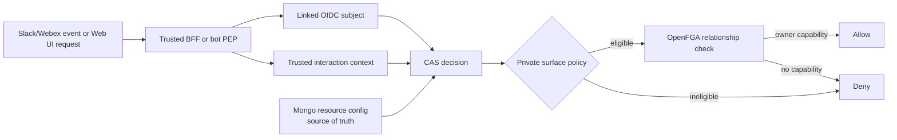

# Feature Specification: Private Resources and Personal Execution

**Feature Branch**: `2026-08-13-private-resources-dm-only`
**Created**: 2026-08-13
**Status**: Draft
**Input**: Support private dynamic agents, MCP servers, and credentials with OpenFGA tuples reconciled through CAS. Owners may manage and execute private resources in the authenticated Web UI or through user-scoped APIs. Slack and Webex execution is limited to verified direct messages, never group channels or spaces.

## Summary

Add one consistent visibility model to dynamic agents, MCP servers, and secret-backed credentials. Each resource type enables only the scopes it supports:

- `private`: one human owner; no team, channel, space, organization, wildcard, or service-account grant.
- `team`: one owner team plus optional shared teams, using the existing team policy.
- `organization`: organization membership; retained for resource types such as credentials that already support it.
- `global`: existing platform-wide behavior; only where the resource type already supports it.

OpenFGA answers **who** has a relationship with a resource. CAS also enforces **where** a private resource may be used. A private-resource allow therefore requires both:

1. a direct owner capability in OpenFGA; and
2. a trusted CAS interaction context proving authenticated personal web/API use, Slack DM, or Webex 1:1 use for data-plane actions.

The persisted resource is the source of truth. CAS projects its desired relationships into OpenFGA and fails closed while that projection is stale or incomplete.

## Current State

| Resource | Current behavior | Gap addressed here |
|---|---|---|
| Dynamic agent | Only `team` and `global`; legacy `private` values are coerced to `team` | Restore an explicit, safe personal owner mode |
| MCP server | Can receive a direct user owner tuple when no owner team is supplied | No explicit visibility/share model or complete management UX |
| Secret credential (`secret_ref`) | User ownership is private by default and team sharing already exists | Normalize visibility semantics and route all relationship mutations through CAS |
| OAuth provider connection | Caller-scoped token set | Remains private and non-shareable in this phase |
| Slack/Webex DM | Linked human identity is checked against the selected agent | The DM fact is not part of the CAS decision contract |
| Slack/Webex group | Uses channel/space and team mappings | Must never fall back to a personal owner grant |

## Scope Decisions

- A private resource has exactly one human `owner_subject`.
- “Private” means private to that owner, not individually shared with several users.
- Sharing a private resource requires converting it to `team` and selecting an owner team.
- Private control-plane actions are allowed from the authenticated owner's Web UI session.
- Private execution is allowed from:
  - the authenticated owner's Web UI session or user-scoped API request;
  - a verified Slack `im`/DM event for the linked owner;
  - a verified Webex room whose `roomType` is `direct` for the linked owner.
- Private execution is denied from:
  - unauthenticated or non-user-scoped API calls;
  - Slack channels, group DMs, and shared channels;
  - Webex group spaces;
  - service accounts, API-triggered workflows, schedules, and unattended jobs;
  - another agent acting as a delegated principal.
- Private resources are omitted, rather than merely disabled, in unauthorized discovery results.
- Existing team permission semantics are preserved. Tightening team-member management is separate work.
- Platform default agents cannot be private.

## Architecture

The surface gate is a narrowing policy. It can deny an OpenFGA grant; it cannot create a grant.

## User Scenarios and Testing

### User Story 1 - Create a Private Resource (Priority: P1)

As a user, I want to create an agent, MCP server, or credential that only I can discover, manage, and use, so that experimental or personal integrations do not become team resources.

**Independent Test**: Create each supported resource as private, then verify that the creator can discover and manage it while another user, a teammate, and an org member cannot.

**Acceptance Scenarios**:

1. **Given** the create form for an agent, MCP server, or secret credential, **When** the user selects `Private`, **Then** the form does not request an owner team or shared teams.
2. **Given** a private create request, **When** it succeeds, **Then** the stored resource records `visibility=private`, the creator's immutable provenance, and the creator's stable OIDC `sub` as `owner_subject`.
3. **Given** a newly created private resource, **When** its OpenFGA projection is inspected, **Then** it has only the direct human capability tuples required for that resource and no team, organization, channel, space, wildcard, or service-account grants.
4. **Given** a user who is not the owner, **When** they list or fetch the private resource by identifier, **Then** it is omitted or returns the standard non-disclosing not-found response.
5. **Given** a platform default agent, **When** an administrator tries to make it private, **Then** validation rejects the transition.

### User Story 2 - Use a Private Agent in a Direct Conversation (Priority: P1)

As the owner of a private agent, I want to use it in my linked Slack or Webex direct conversations, while preventing it from appearing or running in every other execution surface.

**Independent Test**: Invoke the same private agent as its owner from Web UI chat, Slack DM, Slack channel, Webex direct room, and Webex group space. Web UI and the two direct-message cases are allowed; group contexts are denied.

**Acceptance Scenarios**:

1. **Given** the linked owner sends a Slack DM, **When** the bot resolves a private agent, **Then** CAS receives trusted `surface=slack` and `conversation_kind=direct`, checks the direct owner capability, and allows execution.
2. **Given** the linked owner sends a Webex 1:1 message, **When** Webex supplied `roomType=direct`, **Then** CAS receives trusted `surface=webex` and `conversation_kind=direct` and may allow execution.
3. **Given** the owner uses the Web UI, **When** they create, edit, delete, or chat with the private resource, **Then** CAS allows the action after checking the direct owner capability.
4. **Given** the owner invokes the private agent from a Slack channel or Webex group space, **When** authorization runs, **Then** CAS denies before or regardless of any direct user owner tuple.
5. **Given** a Slack or Webex payload with missing, unknown, or contradictory conversation type, **When** a private resource is selected, **Then** authorization fails closed.
6. **Given** another linked user is in a DM with the bot, **When** they guess a private agent identifier, **Then** OpenFGA denies because the owner tuple does not match.

### User Story 3 - Compose Private Agents, MCP Servers, and Credentials Safely (Priority: P1)

As a private-agent owner, I want to attach my private MCP servers and credentials without allowing a broader resource to expose them.

**Independent Test**: Exercise every parent/child visibility combination and verify that no team, organization, or global parent can save or invoke a private dependency.

**Acceptance Scenarios**:

1. **Given** a private agent and private MCP server with the same owner, **When** the owner attaches the server, **Then** the composition is accepted.
2. **Given** different owners, **When** one private resource references the other's private resource, **Then** the request is rejected without revealing whether the dependency exists.
3. **Given** a team-, organization-, or global-scoped parent, **When** it references a private MCP server or private secret, **Then** validation rejects the configuration.
4. **Given** a private MCP server, **When** it resolves a private `secret_ref`, **Then** both resources must have the same owner and both `can_invoke`/`can_use` checks must pass at runtime.
5. **Given** a caller-scoped OAuth provider connection, **When** a personal agent invokes an MCP server, **Then** the token is resolved for the current human caller and is never copied into team ownership.
6. **Given** an invocation that passed the agent check, **When** the runtime calls an MCP server and resolves a secret, **Then** it independently checks the MCP and secret capabilities; an agent allow is not transitive authority.

### User Story 4 - Convert Visibility Without Stale Grants (Priority: P2)

As a resource manager, I want to convert a resource between private and a supported broader visibility without a window in which stale grants remain usable.

**Independent Test**: Convert private → team → private while checking as the old owner, new team members, shared teams, and unrelated users before, during, and after reconciliation.

**Acceptance Scenarios**:

1. **Given** a private resource, **When** its owner converts it to team visibility, **Then** the personal functional owner grant is removed, the creator record remains, and the selected team's grants are written in the same OpenFGA transaction.
2. **Given** a broader-scoped resource, **When** an authorized manager converts it to private, **Then** all team, organization, channel, space, wildcard, and service-account grants are removed and the chosen human owner grant is written.
3. **Given** OpenFGA reconciliation is pending or failed, **When** anyone tries to discover or use the resource, **Then** CAS denies with a retriable authorization-sync reason.
4. **Given** a newer visibility update supersedes an older reconciliation attempt, **When** the older attempt finishes, **Then** it cannot mark the newer revision ready.
5. **Given** a revocation-sensitive transition completes, **When** CAS verifies the new graph, **Then** it uses higher consistency and invalidates local decision caches before marking the resource ready.

### User Story 5 - Understand and Audit Access (Priority: P2)

As an administrator or security reviewer, I want every visibility change and denied cross-surface attempt to be explainable without exposing credential values.

**Independent Test**: Inspect audit events from creation, conversion, sharing, unsharing, allowed DM use, denied group use, and reconciliation failure.

**Acceptance Scenarios**:

1. **Given** a visibility or ownership change, **When** CAS reconciles tuples, **Then** the audit record contains actor, resource type/id, previous and next visibility, revision, tuple counts, outcome, and correlation identifier.
2. **Given** a private-resource group invocation, **When** CAS denies it, **Then** the audit event records a stable `PRIVATE_RESOURCE_CONTEXT_DENIED` reason and the trusted surface kind without storing message content.
3. **Given** a credential audit event, **When** it is persisted or logged, **Then** it contains only the opaque `secret_ref` identifier and never secret material or resolved headers.

## Functional Requirements

### Resource Model and API

- **FR-001**: Agent, MCP server, and secret-credential APIs MUST use a common semantic vocabulary: `private`, `team`, `organization`, and `global`. Each resource type MUST accept only its supported subset; adapters MAY derive this value from an existing typed owner record instead of duplicating storage.
- **FR-002**: Private resources MUST have exactly one stable human `owner_subject`; service accounts MUST NOT own private resources.
- **FR-003**: `creator_subject` MUST be immutable and audit-only. For OpenFGA types with a `creator` relation, it MUST NOT participate in any `can_*` permission.
- **FR-004**: Private resources MUST have no team or organization owner and an empty `shared_with_teams` list.
- **FR-005**: Direct sharing with another individual MUST NOT be supported in phase 1. The user converts the resource to team visibility instead.
- **FR-006**: Read-by-id endpoints MUST use non-disclosing responses for private resources not visible to the caller.
- **FR-007**: Existing user-owned secret credentials MUST migrate or normalize to `visibility=private` without re-encrypting secret values.
- **FR-008**: Existing agents remain team/global. No existing agent is automatically converted to private.
- **FR-009**: Existing MCP servers derive visibility from stored ownership: direct human owner without a team becomes private; team/organization grants remain non-private. Ambiguous records enter an admin-visible migration error state.

### Trusted Interaction Policy

- **FR-010**: CAS `TrustedAuthorizeContext` MUST add `surface`, `conversationKind`, and optional platform/workspace/conversation identifiers.
- **FR-011**: Public request bodies and advisory `context` MUST NOT populate or override trusted interaction context.
- **FR-012**: Slack DM classification MUST be derived from verified Slack event metadata (`channel_type=im`) or an equivalent server-side lookup, not solely from a caller-provided channel-id prefix.
- **FR-013**: Webex direct classification MUST be derived from verified Webex webhook metadata (`roomType=direct`) or an equivalent Webex API lookup. Missing room type is not direct.
- **FR-014**: CAS MUST allow private resource execution (`use`, `invoke`, tool call, or secret use) for authenticated owner `web/personal`, verified `slack/direct`, or verified `webex/direct` contexts only.
- **FR-015**: Slack group DMs (`mpim`), public/private channels, shared channels, and Webex group spaces MUST be treated as shared contexts and denied for private resources.
- **FR-016**: Group-channel/space PEPs MUST authorize against the channel/space and mapped team principal only; they MUST NOT fall back to the human's direct owner grant.
- **FR-017**: The DM access endpoint MUST carry a server-derived surface contract to CAS and MUST NOT remain a context-free direct OpenFGA helper.

### OpenFGA and CAS Projection

- **FR-018**: Resource config in MongoDB MUST be the ownership source of truth; OpenFGA is the enforcement projection.
- **FR-019**: Every lifecycle relationship mutation for agent, MCP server, and `secret_ref` MUST pass through CAS reconciliation for centralized audit and cache invalidation.
- **FR-020**: A private agent MUST project a direct human `owner` tuple plus audit-only `creator`; it MUST project no broader grants.
- **FR-021**: A private MCP server MUST project a direct human `owner` tuple and no broader grants. Adding audit-only `creator` to `mcp_server` is REQUIRED for provenance parity.
- **FR-022**: A private `secret_ref` MUST project audit-only `creator`, functional human `owner`, and its existing separated metadata/use/manage/audit tuples. `owner` MAY participate in those permissions, but `creator` MUST NOT.
- **FR-023**: Visibility transitions MUST submit required tuple deletes and writes in one OpenFGA write request when within the server's operation limit.
- **FR-024**: Larger reconciliations MUST remain fail closed until every chunk is applied and verified. They MUST NOT expose a partially reconciled resource.
- **FR-025**: CAS MUST invalidate decision caches after tuple mutation and MUST use a higher-consistency verification for changed allows and revocations before setting `authz_sync_state=ready`.
- **FR-026**: CAS product policy MUST read private visibility from trusted persisted resource state. User-supplied resource attributes or OpenFGA contextual tuples MUST NOT classify a resource as private/non-private.
- **FR-027**: OpenFGA conditions/contextual tuples are out of scope for phase 1. They may be reconsidered only after every PEP uses CAS and the adapter forwards trusted context to OpenFGA.

### Consistency and Failure Handling

- **FR-028**: Each resource MUST store `authz_revision`, `authz_sync_state`, and `authz_last_synced_revision`.
- **FR-029**: A visibility-changing update MUST atomically increment `authz_revision` and set `authz_sync_state=pending` in MongoDB before reconciliation.
- **FR-030**: After successful reconciliation and verification, the worker MUST conditionally set `ready` only if the stored revision still equals the reconciled revision.
- **FR-031**: On failure, the resource MUST remain `pending` or become `error`; discovery and execution fail closed while management remains available to the recorded owner and org administrators for repair.
- **FR-032**: Reconciliation MUST be idempotent and recoverable through a retry worker or admin repair action.
- **FR-033**: Deletes MUST remove all relationships for the resource, including owner, creator, team, channel/space, wildcard, and dependent tool tuples.

### Dependency Safety

- **FR-034**: A parent resource MUST NOT reference a narrower-visibility dependency. The exposure ordering is `private < team < organization < global`; effective audience checks are still required within the same scope.
- **FR-035**: A private-to-private dependency MUST have the same `owner_subject`.
- **FR-036**: Save-time validation and runtime authorization MUST both enforce dependency compatibility.
- **FR-037**: Runtime MUST check agent use, MCP invocation, tool call, and secret use independently with the same trusted interaction context.
- **FR-038**: OAuth provider connections MUST remain caller-scoped and non-shareable. Team credentials use `secret_ref`, not copied OAuth tokens.
- **FR-039**: A private resource MUST NOT be selected as a platform default, channel/space route, scheduled task target, or service-account scope.

## Key Entities

- **Private resource**: An agent, MCP server, or secret credential with one human owner and no broader grants.
- **Trusted interaction context**: Server-derived CAS input describing the authenticated surface and conversation kind.
- **Authorization projection**: The desired OpenFGA tuples derived from persisted ownership configuration.
- **Authorization revision**: Monotonic version that prevents an older reconciliation from publishing a newer configuration as ready.
- **OAuth provider connection**: A per-user token set resolved at invocation time; not a shareable secret resource.

See [data-model.md](./data-model.md) for fields, tuple examples, state transitions, and the decision matrix.

## Edge Cases

- A user leaves all teams: their private resources remain accessible to that same OIDC subject.
- The identity link changes to a different OIDC subject: access is denied until an administrator performs an audited ownership recovery; email matching is insufficient.
- Slack sends an event without `channel_type`, or Webex omits `roomType`: treat it as shared/unknown and deny private use.
- A DM-selected private agent is later converted to team visibility: the saved preference may remain, but every message is reauthorized under current visibility.
- A private agent is disabled or deleted: DM routing falls through to the next authorized candidate without revealing why it disappeared.
- A credential is shared while referenced by a private resource: team sharing does not make the private parent usable by the team.
- OpenFGA is unavailable during creation: persist `pending`, do not return the resource as usable, and retry reconciliation.
- More than 100 tuple operations are needed: apply bounded chunks behind the pending gate, then verify the final desired graph.

## Out of Scope

- Private resource execution in any group conversation.
- Private service-account ownership or unattended private execution.
- Sharing private resources directly with a list of individual users.
- Sharing or transferring OAuth refresh/access token sets.
- Replacing existing team/global role semantics.
- Using OpenFGA conditions or contextual tuples for the phase-1 DM boundary.
- Private knowledge bases or other resource types; the shared primitives should allow later adoption.

## Success Criteria

- **SC-001**: The authorization matrix has automated coverage for all supported resources, three surfaces, direct/group context, owner/non-owner, and every visibility supported by that resource type.
- **SC-002**: Zero private resources are returned to unauthorized discovery requests in integration tests.
- **SC-003**: Owner private invocations succeed from authenticated Web UI and user-scoped API requests, while zero private invocations succeed from Slack channels, Slack group DMs, Webex group spaces, schedules, service accounts, delegated agents, or unauthenticated/non-user API clients.
- **SC-004**: All private ↔ broader-scope transition tests show no stale allow after CAS reports `ready`.
- **SC-005**: Every relationship mutation emits a CAS audit event and invalidates decision caches.
- **SC-006**: Existing user-owned secrets migrate without secret re-encryption or loss of owner access.

## Rollout

1. Extend the data model and CAS trusted context behind `PRIVATE_RESOURCES_ENABLED=false`.
2. Migrate secret metadata and classify existing MCP records; do not change existing agent visibility.
3. Route agent, MCP, and secret relationship mutations through CAS and run drift reports without enforcing private mode.
4. Add save-time dependency validation and runtime per-hop checks.
5. Enable private creation for internal users; monitor sync errors and context-deny metrics.
6. Enable generally after Slack/Webex direct/group matrix tests pass in deployment.

## Open Product Questions

- Should a future phase allow private execution from unattended local CLI sessions? Recommendation: require a short-lived user-scoped proof and never treat the long-lived local agent-context header alone as authorization for a private resource.
- Should ownership recovery be org-admin-only or use a two-person approval? Recommendation: org-admin-only initially, with mandatory audit and no credential-value access.
- Should knowledge bases adopt private visibility next? Recommendation: defer until metadata/search-result leakage and ingestion-worker identity are designed together.
