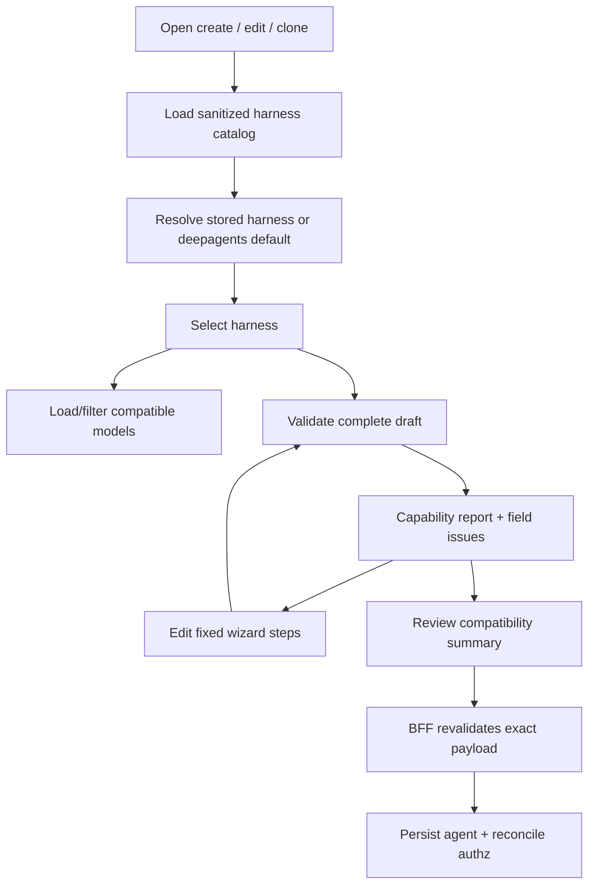
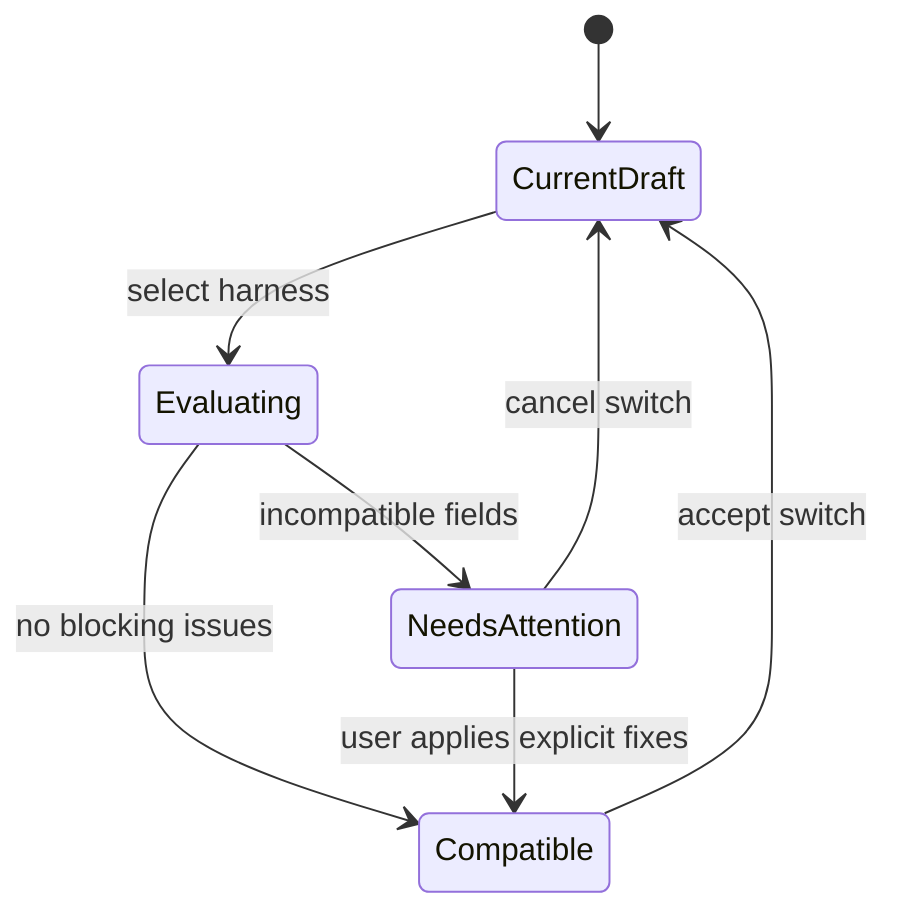

# Agent Creation UI Architecture

> **Implemented vertical slice (2026-08-18):** The existing editor now fetches
> descriptors from the independent Harness Engine, renders sanitized operator
> profiles and primitive JSON-Schema options, performs server-side draft
> validation, and saves a separate immutable blueprint. Dynamic Agents remains
> the default and its stored document/runtime is unchanged. Compatibility diffs,
> typed complex panels, memory policy controls, and pre-Dynamic-Agent atomic save
> coordination remain follow-up work.

## Goal

Evolve the existing `DynamicAgentEditor` into a Harness Engine agent builder. The selected harness controls compatibility, available models, field behavior, validation, and operator context without changing the existing five-step navigation or default Deep Agents experience.

## Current UI baseline

The current editor:

- is one client component with local React state;
- has fixed `basic`, `instructions`, `tools`, `skills`, and `advanced` steps;
- fetches one unfiltered model list on mount;
- renders tools, skills, middleware, subagents, interrupts, and workflows unconditionally;
- computes only local required-field blockers;
- writes directly through the existing Next.js BFF CRUD route;
- tracks the entire form as one dirty-state snapshot.

The Harness Engine UI preserves these behaviors for an agent with no `harness` field, resolving it to `deepagents`.

## Design principles

1. Harness first, model second.
2. Stable top-level steps; dynamic content inside them.
3. Capability reports drive UI behavior; harness IDs do not drive scattered conditionals.
4. Unsupported configuration is visible and actionable, never silently discarded.
5. Browser validation improves UX; the BFF and Harness Engine remain authoritative.
6. Harness options are first-party typed panels validated by static JSON Schema, not remote executable UI.
7. Secrets, Kubernetes settings, image names, credentials, and unrestricted provider resources never appear as editable agent fields.
8. Existing agents and deep links continue to open on the same step IDs.

## User flow



## Stable wizard with capability-aware sections

The top-level step IDs remain unchanged so URLs, browser navigation, tests, and saved deep links do not break.

### Step 1: Basic Info

Order:

1. Agent identity and theme.
2. Owner team, sharing, and visibility.
3. **Harness selection**.
4. Compatible model selection.

Harness selector cards show:

- display name and short description;
- `certified`, `experimental`, or `blocked` badge;
- `available`, `disabled`, `misconfigured`, or `unhealthy` state;
- execution placement: sandbox pod or provider-managed;
- portable capability summary;
- sanitized reason and operator action for unavailable harnesses.

Rules:

- `deepagents` is selected at read time when the stored field is absent.
- Disabled/blocked harnesses remain visible when policy permits, but cannot be selected for a new production agent.
- An existing agent on an unavailable/unknown harness is shown faithfully and is never coerced to Deep Agents.
- Sandbox profile, RuntimeClass, image digest, network policy, and credentials are read-only operator details or omitted—not form inputs.
- Model options are filtered by the selected harness and deployment capability report.
- The editor never silently resets an existing model. It marks the model incompatible and asks the user to choose a replacement.

### Step 2: Instructions

Common fields remain unchanged:

- system prompt editor and preview;
- AI suggestion and review;
- portable prompt/context template behavior.

Harness-specific guidance may show:

- model context/attachment constraints;
- unsupported template variables;
- prompt or SDK option warnings;
- provider-native extensions under an explicitly labeled section.

The system prompt remains a common portable field. It is never moved into opaque harness options.

### Step 3: Tools

Each section receives a capability projection:

| Section | UI behavior |
|---|---|
| Built-in tools | Normal, warning, or disabled based on `tool.builtin` and individual tool constraints |
| MCP tools | Normal or disabled based on transport, schema, and `tool.mcp` compatibility |
| Workflows | Normal or disabled based on `tool.builtin`/delegation support |
| Middleware | Filtered by portable outcome support and selected model |

Rules:

- Existing selected values remain visible when incompatible, with a blocking issue and removal/replacement action.
- Hidden controls cannot preserve a value that will be submitted accidentally.
- Tool credentials and connection details remain owned by existing MCP/credential configuration.
- The UI shows whether support is `native` or `emulated`; both are valid when certified.

### Step 4: Skills

- Show only skills compatible with the selected harness/model/materialization strategy by default.
- Existing incompatible selections remain visible in a separate “Needs attention” group.
- Display native versus engine-emulated skill support.
- Scan-gate and ownership behavior remain unchanged.
- Harness switching never deletes selected skill IDs until the user explicitly applies a compatibility fix.

### Step 5: Advanced

Existing collapsible sections remain, each with capability state:

- Subagents and mixed-harness delegation.
- Human input and tool approval.
- Middleware and workflows.
- Thread persistence summary.
- Long-term memory policy.
- Harness-specific options.
- Observability summary.

#### Thread persistence summary

Read-only portable status:

- durable or ephemeral mode;
- native checkpoint strategy;
- cross-pod/cross-replica restore capability;
- configured retention policy;
- warning if an option would make the agent non-resumable.

Users do not edit Mongo collection names, provider session keys, claim IDs, or lease settings.

#### Long-term memory policy

Portable controls:

- enable memory;
- read scopes allowed by policy;
- writable scope, defaulting to user;
- semantic, episodic-reference, and procedural kinds;
- retrieval mode and bounded result count;
- write/approval policy;
- operator-defined retention profile;
- optional consolidation, only when deployed and authorized.

The UI explains that conversation history, agent memory, skills, and sandbox files have different retention and deletion behavior.

#### Harness-specific options

Use a first-party component registry:

```text
HarnessOptionsPanelRegistry
├── deepagents -> DeepAgentsOptionsPanel
├── claude_agent_sdk -> ClaudeSDKOptionsPanel
├── strands -> StrandsOptionsPanel
└── agentcore -> AgentCoreOptionsPanel
```

The descriptor JSON Schema remains authoritative for values and bounds. The UI registry provides labels, help, resource selectors, and accessibility. It cannot render arbitrary server-provided HTML, JavaScript, module names, commands, environment variables, or secret inputs.

Examples of safe options:

- provider-approved reasoning/output modes;
- operator-defined remote resource alias;
- portable session behavior allowed by policy;
- bounded SDK features represented in the capability report.

Unsafe options excluded from the UI:

- image, command, package, or module path;
- Kubernetes template, pool, namespace, service account, volume, RuntimeClass, or network policy;
- raw ARN/endpoint when an operator resource alias is required;
- API key, bearer token, credential source, environment map, or filesystem path.

#### Observability summary

Read-only:

- tracing enabled/required;
- sampling profile name;
- expected span coverage;
- content-capture policy, always off for protected values;
- provider trace-link availability.

An agent author cannot disable security/audit spans or enable prompt, memory, tool-payload, or credential capture.

## Harness switch behavior

Changing the harness is a draft transition, not an immediate mutation.



### Compatibility dialog

Before accepting a switch, show:

- compatible values retained unchanged;
- fields supported through engine emulation;
- incompatible model/tools/skills/middleware/memory/options;
- active-conversation policy;
- harness-specific options that will be parked but not persisted;
- whether the target harness is experimental or unhealthy.

Actions:

- **Cancel**: restore the original draft.
- **Review issues**: accept the harness selection but keep blockers and navigate to the first affected step.
- **Apply safe fixes**: only deterministic removals/defaults listed individually; requires confirmation.

No generic “switch and discard incompatible settings” action is provided.

### Per-harness draft parking

The editor keeps transient `optionsByHarness` state so switching away and back restores unsaved options for that harness. Only the selected harness's options are included in the save payload. Parked options are cleared on successful save/unmount and never written to MongoDB.

Common fields—prompt, ownership, tools, skills, subagents, memory—are one draft and are not duplicated per harness.

### Editing agents with conversations

When changing a persisted harness:

- show that existing conversations remain pinned to their recorded harness;
- show that new conversations use the newly saved harness;
- require an explicit confirmation checkbox;
- do not offer state transfer unless the validation response names a certified transfer path;
- invalidate only new runtime construction after save; never clear existing threads from the editor.

## Capability-driven rendering

The UI consumes a field-addressable validation result rather than hard-coding `if harness === ...` throughout components.

```typescript
type FieldCapability = {
  path: string;
  capability: string;
  level: "native" | "emulated" | "unsupported" | "unavailable";
  severity: "info" | "warning" | "error";
  message: string;
  constraints?: Record<string, unknown>;
};

type HarnessDraftValidation = {
  requestId: string;
  configFingerprint: string;
  catalogRevision: string;
  valid: boolean;
  issues: FieldCapability[];
  capabilities: Record<string, CapabilityResult>;
};
```

Components receive `CapabilityView` helpers:

- `level(capability, path?)`;
- `constraints(capability, path?)`;
- `issuesFor(pathPrefix)`;
- `isAllowed(...)`;
- `whyUnavailable(...)`.

Client helpers never decide certification or broaden constraints.

## Frontend state decomposition

Refactor the monolithic editor incrementally:

```text
DynamicAgentEditor
├── useAgentDraft
│   ├── portable fields
│   ├── selected harness
│   ├── optionsByHarness
│   └── dirty snapshot
├── useHarnessCatalog
├── useHarnessValidation
│   ├── debounce + AbortController
│   ├── request sequence guard
│   └── fingerprint/report cache
├── HarnessSelector
├── HarnessCompatibilityBanner/Dialog
├── existing five step components
└── AgentReviewSummary
```

`useHarnessValidation` prevents stale responses from replacing a newer draft report by matching request sequence and config fingerprint. Validation is debounced for field edits and immediate for harness/model changes, step navigation, and save.

## API and BFF flow

Browser-facing additive routes:

| Route | Purpose |
|---|---|
| `GET /api/dynamic-agents/harnesses` | Sanitized catalog proxy |
| `POST /api/dynamic-agents/harnesses/validate` | Draft preflight; no write or provider invocation |
| `GET /api/dynamic-agents/models?harness_id=...` | Existing model list filtered/annotated for harness compatibility |

Save flow:

1. Browser runs preflight and presents all issues.
2. Browser submits the exact agent payload to existing create/update route.
3. BFF repeats Harness Engine validation server-side after authorization.
4. BFF compares the returned fingerprint with the submitted normalized payload.
5. On valid response, BFF persists and reconciles existing OpenFGA relationships.
6. On capability/configuration change during the race, return `409 HARNESS_VALIDATION_STALE` with the new report; do not write partially.

The browser's prior validation result is advisory. The BFF never trusts a browser-provided capability, catalog revision, certification state, or validation token as authority.

## Save and blocker behavior

The current blocker list expands from required fields to a unified issue index:

- local required-field blockers;
- catalog availability/certification blockers;
- server field-capability errors;
- unresolved harness-switch confirmation;
- middleware/skill scan blockers;
- active-conversation confirmation when changing harness.

Each issue maps to a stable step and optional field anchor. Step indicators show error/warning counts, and the Save button links to the first blocker. Warnings do not block unless deployment policy classifies them as errors.

Save is disabled while:

- the current draft has never been validated;
- validation is pending after a material change;
- the last report fingerprint does not match the current draft;
- any blocking issue remains;
- the harness change confirmation is required.

## Create, edit, clone, and unavailable states

| Mode | Behavior |
|---|---|
| Create | Missing harness defaults to Deep Agents; user may select another available allowed harness. |
| Edit | Stored harness and options render exactly; conversation pinning warning appears only on a change. |
| Clone | Clone stored harness/options if selectable; otherwise retain visible unavailable selection until user chooses a target. Never silently default. |
| Read-only | Catalog/capability status is visible; controls remain disabled. |
| Unknown adapter | Show `Unknown harness` with raw stable ID, preserve options, block save except an explicit migration to a known harness. |
| Catalog unavailable | Existing agent remains viewable; create/save is blocked with a retryable service message. |

## Wireframe

```text
┌ Create Agent ────────────────────────────────────────────────────────────┐
│ Step 1: Basic Info      ① Basic  ② Instructions  ③ Tools  ④ Skills  ⑤ Advanced │
├─────────────────────────────────────────────────────────────────────────┤
│ Agent identity / ownership                                              │
│                                                                         │
│ Harness                                                                 │
│ ┌ Deep Agents ─ Certified ┐ ┌ Claude SDK ─ Experimental ┐              │
│ │ Sandbox pod • Available │ │ Sandbox pod • Available    │              │
│ └─────────────────────────┘ └─────────────────────────────┘              │
│ ┌ Strands ─ Experimental ┐ ┌ AgentCore ─ Unavailable ────────────────┐ │
│ │ Sandbox pod • Available│ │ Provider-managed • Configure resource   │ │
│ └────────────────────────┘ └──────────────────────────────────────────┘ │
│                                                                         │
│ Model [compatible model selector]                                       │
│ Harness summary: 24 native • 6 emulated • 0 blockers                   │
├─────────────────────────────────────────────────────────────────────────┤
│ Compatibility banner / first blocking issue                 Cancel Save │
└─────────────────────────────────────────────────────────────────────────┘
```

## Accessibility and responsive behavior

- Harness cards are a radio group with keyboard navigation and explicit labels/status descriptions.
- Badges are never the only indication; text and icons include accessible names.
- Disabled controls reference an inline explanation through `aria-describedby`.
- Validation summary receives focus after a failed Next/Save and links to fields.
- Step counts and field errors are announced through a polite live region.
- On narrow screens, harness cards and steps stack; the compatibility summary remains above action buttons.
- Loading preserves layout and exposes retry, not an indefinite skeleton.

## Component and file plan

```text
ui/src/
├── types/dynamic-agent.ts
│   ├── HarnessConfig / HarnessDescriptor / CapabilityReport
│   └── AgentMemoryPolicy
├── hooks/
│   ├── use-harness-catalog.ts
│   ├── use-harness-validation.ts
│   └── use-agent-draft.ts
├── components/dynamic-agents/
│   ├── DynamicAgentEditor.tsx
│   ├── HarnessSelector.tsx
│   ├── HarnessCompatibilityDialog.tsx
│   ├── HarnessCapabilityBadge.tsx
│   ├── AgentMemoryPolicyEditor.tsx
│   ├── ThreadPersistenceSummary.tsx
│   ├── ObservabilitySummary.tsx
│   └── harness-options/
│       ├── registry.tsx
│       ├── DeepAgentsOptionsPanel.tsx
│       ├── ClaudeSDKOptionsPanel.tsx
│       ├── StrandsOptionsPanel.tsx
│       └── AgentCoreOptionsPanel.tsx
└── app/api/dynamic-agents/
    ├── harnesses/route.ts
    ├── harnesses/validate/route.ts
    └── models/route.ts
```

## Test architecture

### Component tests

- default Deep Agents view matches the existing wizard;
- harness catalog loading, unavailable, empty, retry, and stale-response states;
- keyboard-accessible selector and status descriptions;
- model filtering without silent reset;
- field capability native/emulated/unsupported/unavailable rendering;
- switch dialog, cancel, review, safe fixes, and parked options;
- memory/thread/tracing panels and forbidden inputs;
- unknown harness and read-only preservation;
- step badges, blocker focus, deep links, dirty tracking, and unsaved dialog.

### BFF tests

- catalog/validation proxy auth and sanitized errors;
- create/update repeats validation and rejects invalid/stale reports before Mongo write;
- `harness` and `memory` are allowlisted mutable fields with strict schemas;
- unsafe options, secret-shaped data, unknown fields, and oversized payloads are rejected;
- OpenFGA reconciliation occurs only after successful validation/write;
- legacy payload without harness/memory preserves Deep Agents/current behavior.

### End-to-end tests

- create one agent per enabled harness;
- edit and clone across harnesses;
- switch with incompatible model/tool/skill/middleware/memory settings;
- active conversation pinning confirmation;
- concurrent catalog change between preflight and save;
- optional harness outage does not block editing/saving a healthy harness;
- rollback UI reads additive fields without corrupting legacy agents.

## Rollout

1. Add types and BFF catalog/validation proxies behind a UI feature flag.
2. Render a read-only Deep Agents harness summary for all existing agents.
3. Enable harness selection for test agents and experimental adapters.
4. Add capability-aware fields and switch dialog.
5. Add memory/thread/observability panels.
6. Enable certified harnesses according to deployment policy.
7. Retain the flag to hide selection and force new agents to the Deep Agents default during rollback; never rewrite existing non-default harness documents.
