# Harness Engine Architecture

## Goal

Replace Dynamic Agents without changing its external architecture, then make the execution loop pluggable. Existing clients continue to see one runtime service and the same protocols. Internally, a selected harness is an implementation behind a common contract.

## Context

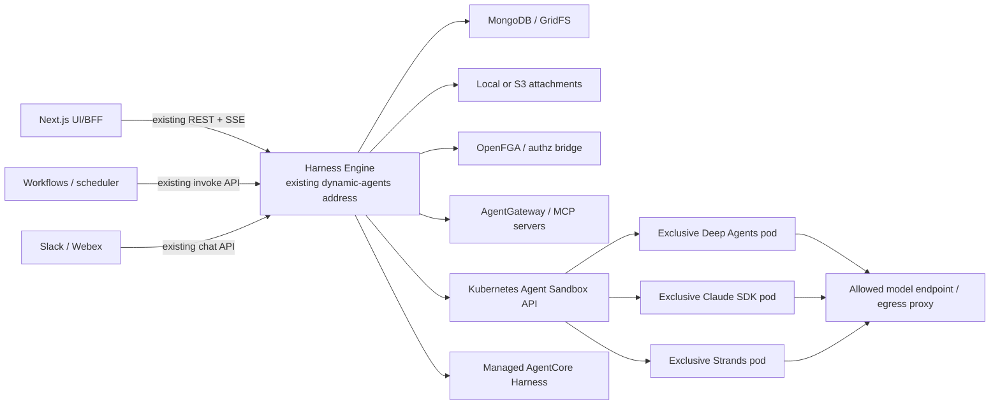

The Next.js BFF remains the configuration writer. Harness Engine remains the runtime reader and executor.

## Agent creation control flow

The existing five-step editor remains the builder shell. Harness selection is added before model selection, and every later section consumes one server-produced capability projection rather than embedding harness-specific policy in the browser. Detailed interaction and component rules are in [agent-creation-ui.md](./agent-creation-ui.md).

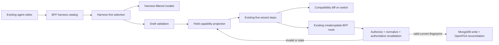

Builder trust boundary:

- The browser may cache display metadata, run preflight validation, and park unsaved options, but it is not authoritative for certification, capabilities, active conversations, or policy.
- Catalog and validation responses carry a catalog revision, normalized configuration fingerprint, request ID, stable field path, and wizard step so stale asynchronous results can be rejected.
- The BFF validates every create/update payload after authorization and before MongoDB or OpenFGA mutation, including Deep Agents/default payloads.
- Existing unknown or unavailable harness IDs are preserved for inspection and explicit migration; absence alone resolves to Deep Agents.
- JSON Schema provides value constraints. Only bundled first-party React panels provide presentation; the server never supplies executable UI.
- Harness switches are draft operations. Incompatible values remain visible until individually changed or explicitly removed, and persisted conversations remain bound to their original harness.

## Runtime decomposition

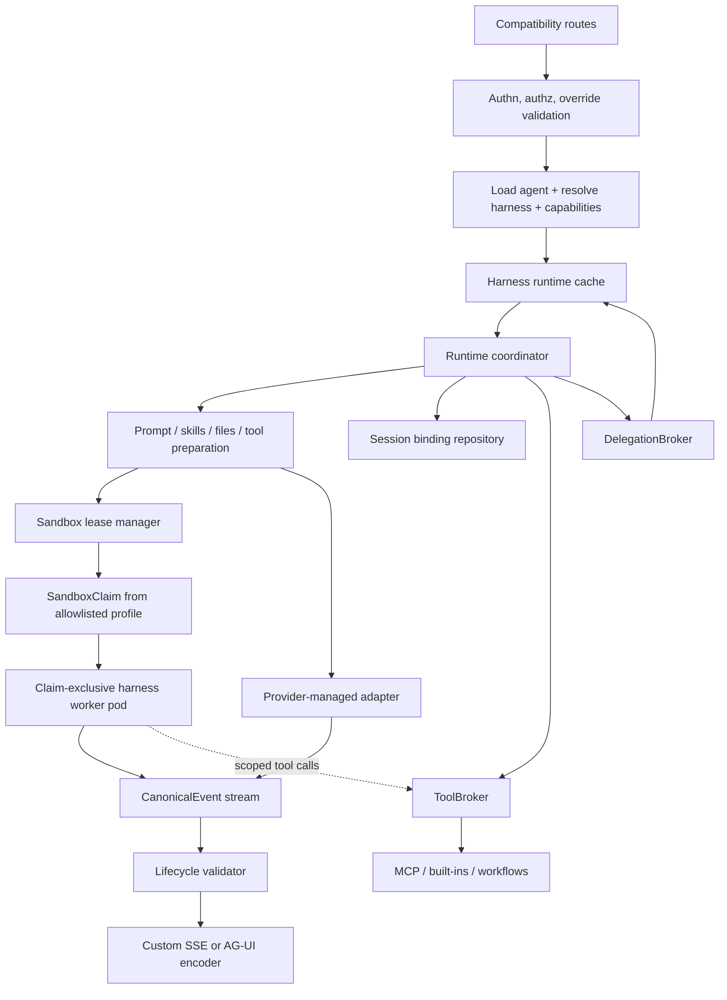

### Dependency rule

Dependencies point inward toward provider-neutral contracts:

```text
routes -> coordinator -> execution target contract <- sandbox worker / remote adapter
                         ^
encoders <- canonical events
brokers  <- normalized run context and scoped capabilities
```

Provider SDK types stop inside the worker or remote-adapter boundary. LangGraph chunks are provider types and therefore never enter the control-plane coordinator or encoders.

## Control plane and execution plane

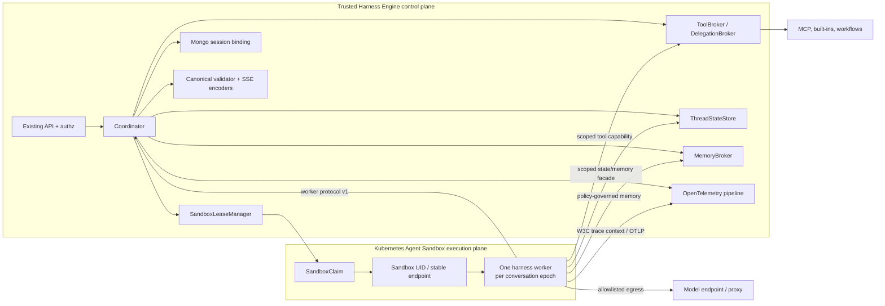

The control plane alone holds MongoDB, OpenFGA, credential-service, Kubernetes, and audit authority. Workers receive no raw bearer tokens, database connection strings, Kubernetes API tokens, or MCP/provider secrets. They receive normalized inputs plus short-lived, audience-bound capabilities.

### Sandbox scope

- Default: one exclusive sandbox lease per `(session binding, epoch)`.
- Follow-up turns reuse the stable Sandbox identity while it is healthy.
- One mutating turn or resume may run per binding; the control plane lock remains authoritative.
- Idle sandboxes hibernate or delete according to profile. Maximum lifetime forces a replacement and durable-state rehydration.
- A one-pod-per-turn profile is allowed for stateless/high-risk work but is not the compatibility default.
- Warm-pool pods are unowned until claimed; after claim they are exclusive and are destroyed on release unless reset conformance is separately proven.

### Static sandbox profiles

An operator-owned profile maps a harness and workload class to:

- `SandboxTemplate` or `SandboxWarmPool` reference;
- immutable worker image digest and adapter/contract version;
- RuntimeClass (`kata`, `gvisor`, or another certified runtime);
- CPU, memory, ephemeral-storage, PID, run, idle, and maximum-lifetime limits;
- workspace strategy (`emptyDir`, optional PVC, or object-store hydration);
- default-deny NetworkPolicy and explicit egress class;
- worker port, readiness contract, and claim deadline.

Agent documents select a harness, not a container image or Kubernetes settings.

## Core contracts

### HarnessAdapter

Application-scoped factory and descriptor:

- stable harness ID and display metadata;
- adapter and contract versions;
- execution mode and trust boundary;
- JSON configuration schema;
- static and contextual capabilities;
- health/readiness details;
- `create_runtime(context)`.

### HarnessRuntime

Conversation-scoped execution object:

- initialize provider resources;
- stream a new turn;
- resume a canonical interrupt decision;
- report pending interrupt;
- cancel the active turn;
- restart provider client resources without silently clearing history;
- clean up processes, connections, credentials, and temporary files.

### CanonicalEvent

Provider-neutral lifecycle union. The exact schema and state machine are defined in [canonical-events-v1.md](./contracts/canonical-events-v1.md).

### ToolBroker

Creates portable tool descriptors and owns execution:

- MCP endpoint normalization and discovery;
- allowlist/namespacing;
- JSON schema sanitation;
- caller-scoped credential exchange and forwarding;
- signed agent context;
- tool approval policy;
- retry classification and partial MCP availability;
- SSRF/network controls for built-ins;
- result size and error sanitation;
- tool audit/metrics.

### DelegationBroker

Represents each configured CAIPE subagent as a portable tool. A child receives its own authorization decision, runtime/cache key, credentials, model/harness validation, trace span, capacity accounting, and canonical namespace. Child events are forwarded into the parent stream with a stable namespace.

### SessionBindingRepository

Stores which harness owns a conversation and how to resume it. It does not interpret native provider state.

### ThreadStateStore

Persists conversation-scoped state outside the sandbox:

- adapter-native checkpoint records and current durable head;
- run idempotency and durable-commit markers;
- pending interrupts and resume revisions;
- opaque adapter codec/version and state references;
- compare-and-set updates scoped to binding, epoch, and lease generation.

It preserves the current LangGraph Mongo checkpointer for Deep Agents and supplies equivalent scoped facades for other adapters. It does not convert native checkpoint formats.

### MemoryBroker

Owns long-term, cross-thread memory:

- semantic memory: facts and preferences;
- episodic memory: authorized references to prior thread episodes, not automatic transcript copying;
- procedural memory: learned procedures, distinct from operator-owned read-only skills;
- explicit `user`, `agent`, or `organization` scope;
- authorization, provenance, revision conflicts, retention, approval, redaction, and audit.

Writable learned memory defaults to `(environment, subject, agent)`. Agent-shared memory requires explicit policy; organization memory is read-only by default. Workers receive a narrow facade and may cache materialized memory only for the lifetime of their lease.

### Telemetry pipeline

Creates and propagates a causal trace across control and execution planes:

- validate or replace external trace context at ingress;
- propagate W3C `traceparent` internally;
- allowlist opaque baggage only;
- create spans for authz, binding, claims, workers, providers, state, memory, tools, subagents, canonical events, and encoders;
- export worker telemetry only to an in-cluster OpenTelemetry Collector or control-plane facade;
- scrub and sample before external export.

## Request sequence

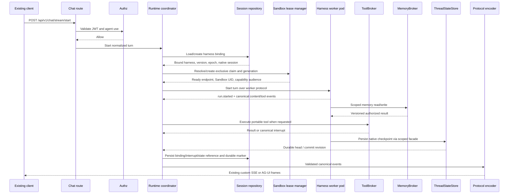

Authorization happens before harness resolution or provider calls. Tool authorization and credential resolution happen again at the tool boundary.

## Canonical lifecycle

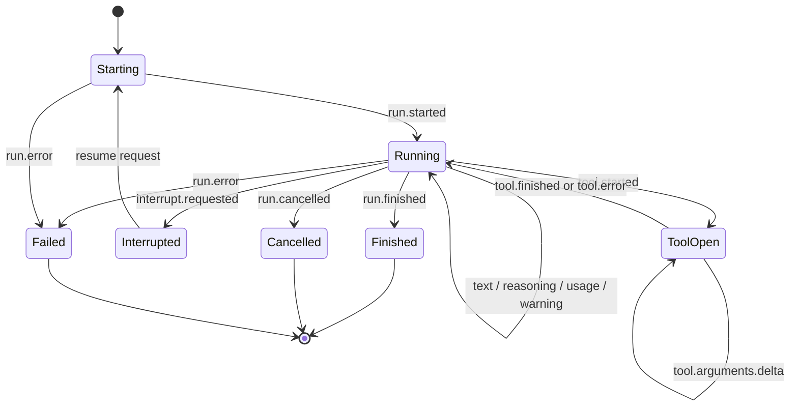

Subagent namespaces nest this state machine. Every child run has a parent tool call and cannot emit events after its terminal state.

## Session architecture

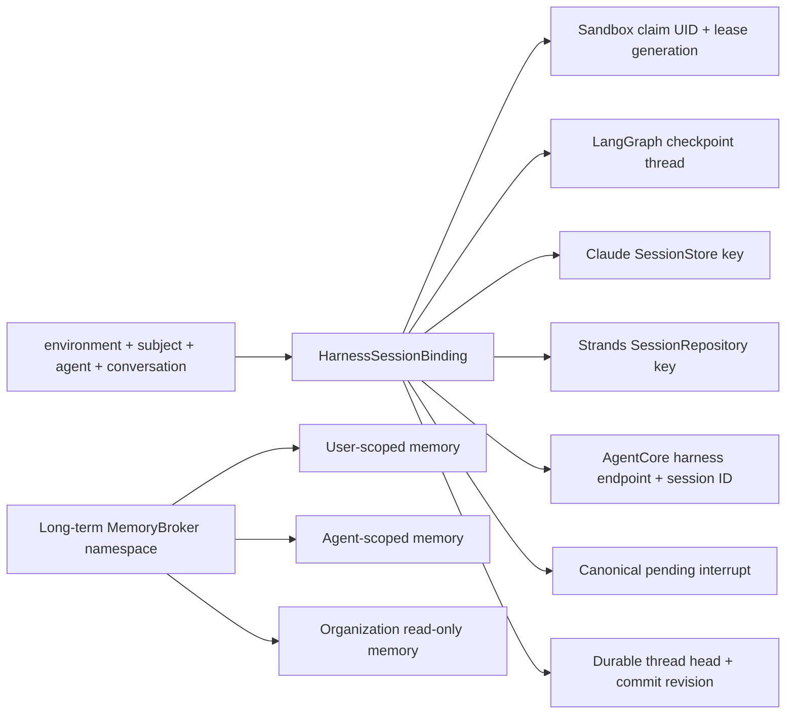

Rules:

- A binding is created atomically on the first turn.
- A later agent edit does not move the conversation.
- `restart-runtime` closes/recreates runtime resources and retains the binding.
- `clear` deletes engine-owned files/checkpoints/interrupts, calls the adapter delete operation where available, increments `epoch`, and starts a new native session.
- Cross-harness transfer requires a separately certified migrator. Without one, the user starts a new conversation.
- All adapter operations for one binding are serialized; duplicate resume requests are rejected idempotently.
- The lease generation is incremented before replacement; only events and tool calls matching the committed generation are accepted.
- Kubernetes is authoritative for live Sandbox state; MongoDB is authoritative for binding ownership, generation, provider state references, and pending interrupts.

## State taxonomy and durability

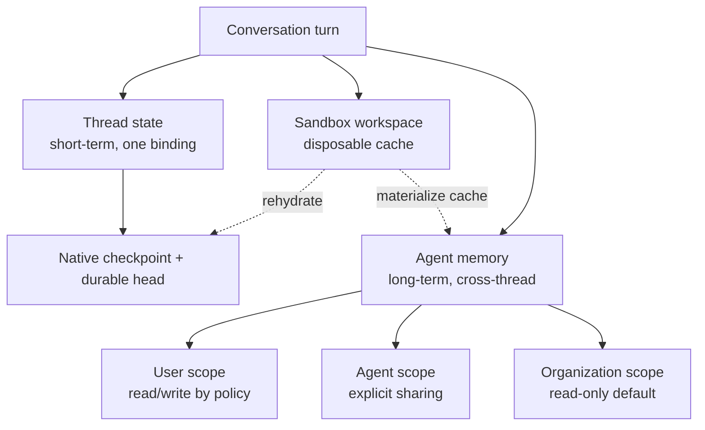

### Thread persistence

- A pod-local filesystem is never authoritative for a thread.
- Adapters persist native state through a binding-scoped facade; Deep Agents continues using the existing MongoDBSaver collections.
- The binding records an opaque native checkpoint head, adapter codec/version, run idempotency key, interrupt revision, and durable commit revision.
- A `run.finished` event can stream only after the adapter has produced its final state, and the public durable-completion marker is emitted only after the state head and binding revision commit.
- If output was visible but persistence fails, the terminal outcome is `uncertain_durability`; the coordinator fences the run and never automatically replays tools or model work.
- Restore verifies environment, owner, agent, conversation, harness, epoch, adapter version, and lease generation before exposing state to a new worker.

### Long-term agent memory

- Thread history is not memory by default. Promotion requires a governed write or a separately authorized consolidation job.
- Memory records carry kind, scope, namespace, provenance, content hash, revision, writer, approval state, created/updated/expiry timestamps, and optional source-thread reference.
- Reads return only the authorized scope and bounded content. Search is filtered before ranking, not after retrieval.
- Writes use compare-and-set revisions. Conflicts fail or use an explicitly configured merge/consolidation policy; last-write-wins is not silent.
- Shared writable memory is treated as an instruction-injection surface. Organization policies and operator skills remain read-only, and sensitive writes may require human approval.
- Deleting a conversation does not implicitly delete cross-thread memory; memory retention/deletion follows its own policy and audit trail.

### Distributed tracing

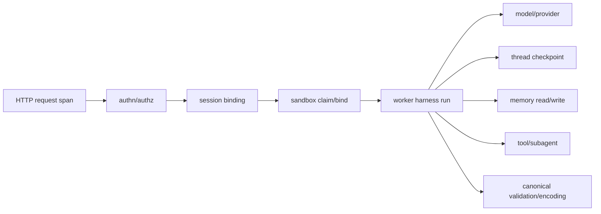

Internal calls propagate sanitized W3C Trace Context. Baggage is allowlisted to opaque environment, binding, run, harness, adapter, sandbox profile, and lease-generation identifiers; user identity and content are attributes only when a separately approved hashed/opaque form is required. Provider-bound context is suppressed unless that destination is trusted and configured. Worker OTLP egress goes only to the in-cluster collector, which applies redaction, tail sampling, and bounded buffering.

## Sandbox lifecycle

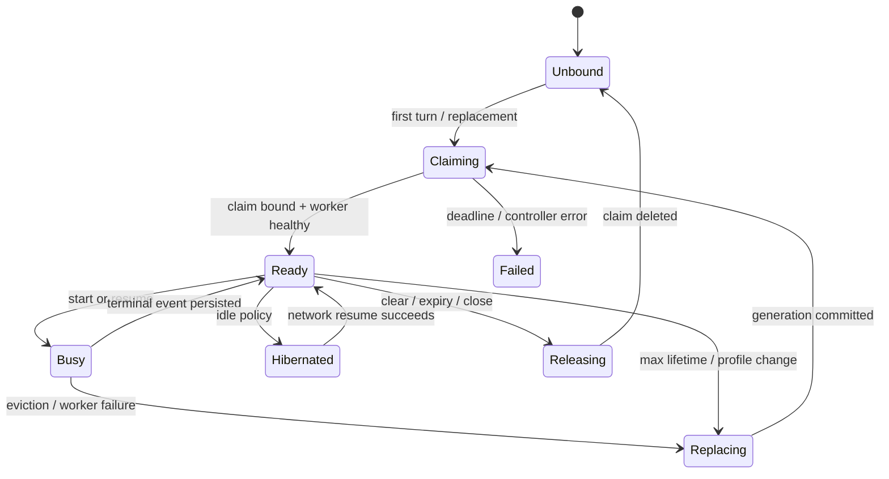

Replacement never silently replays a turn after a possible side effect. The coordinator rehydrates durable state and either resumes from a certified checkpoint or returns an explicit retryable error that requires a caller idempotency decision.

## Adapter internals

### Deep Agents compatibility

```text
HarnessRuntime
  -> Deep Agents worker image
  -> existing AgentRuntime initialization and LangGraph astream
  -> LangGraphEventTranslator in worker
  -> worker protocol CanonicalEvent
```

Initial changes are wrappers. Tool, input, checkpoint, and subagent behavior move behind common contracts only after golden tests pass.

### Claude Agent SDK

```text
ClaudeSDKClient / query in Claude worker pod
  -> SDK subprocess and pod-local temporary config directory
  -> Mongo SessionStore
  -> worker-local SDK MCP server backed by ToolBroker
  -> permission/user-input translator
  -> SDK message translator
  -> CanonicalEvent
```

No shared host `~/.claude` directory is used. File checkpointing is disabled because engine storage owns files and SDK external-session mirroring does not include those checkpoints.

### Strands

```text
Strands Agent.stream_async in Strands worker pod
  -> Mongo SessionRepository
  -> hooks for lifecycle/tool/usage
  -> portable Strands tool wrappers
  -> interrupt translator
  -> CanonicalEvent
```

A per-binding lock protects the non-thread-safe session manager. CAIPE subagents use DelegationBroker rather than a native Graph/Swarm for the baseline.

### AgentCore Harness

```text
InvokeHarness stream
  -> AWS event-stream translator
  -> inline function tool-use pause
  -> ToolBroker execution or canonical approval interrupt
  -> tool result continuation
  -> CanonicalEvent
```

The adapter pins an immutable harness version/endpoint for a binding. Direct remote MCP/Gateway execution is optional until it proves equivalent caller identity, policy, audit, and result controls.

## Capability evaluation

Capability resolution combines three layers:

1. **Static adapter capability**: supported by the adapter version.
2. **Deployment availability**: dependency installed, feature enabled, credentials and remote service healthy.
3. **Context compatibility**: selected model, agent options, tools, middleware, files, and session mode fit the capability constraints.

The result is returned before save/run:

```text
native       adapter implements and conformance proves behavior
emulated     common engine implements and conformance proves behavior
unsupported  no conforming implementation for this configuration
unavailable  normally supported, but dependency/config/health is missing
```

Only `native` and `emulated` satisfy certification.

## Failure containment

| Failure | Engine behavior |
|---|---|
| Adapter worker image/profile missing | Adapter `unavailable`; healthy harnesses remain ready |
| Provider auth/config invalid | Fail initialization with actionable sanitized error |
| Provider throttled/unavailable | Adapter-classified retryable error and `Retry-After` when known |
| Malformed/out-of-order event | Terminate affected run with protocol error; discard later events |
| Tool server unavailable | Preserve current partial-tool warning and retry classification |
| Session store write fault | Mark binding degraded; emit durability fault; never claim successful persistence |
| Client disconnect | Cancel consumer task, request provider cancellation, clean credentials/resources |
| Cancellation after side effect starts | Stop further work/events where possible, audit uncertainty, never auto-fallback |
| One adapter exhausts capacity | Reject/queue only that adapter according to configured policy |
| Sandbox claim/readiness timeout | Return retryable capacity/unavailable; never fall back in-process |
| Pod eviction or worker crash | Fence generation, reconcile claim, rehydrate durable state, and avoid unsafe replay |
| Stale worker event/tool call | Reject by binding/run/generation and record a security metric |
| Agent Sandbox controller unavailable | Existing ready leases may finish; new claims fail clearly and other remote harnesses remain healthy |
| Thread checkpoint commit fails | Emit uncertain-durability terminal fault, retain last durable head, fence run, and never auto-replay side effects |
| Memory revision conflict | Reject or invoke declared consolidation policy; preserve both provenance records for audit |
| Telemetry collector unavailable | Bound/drop telemetry by policy; do not exhaust runtime memory or change run result |

## Security boundaries

- Registry entries are compiled first-party code; no arbitrary module paths.
- Adapters get a redacted immutable `RunContext`, not raw requests or database clients.
- Credentials are short-lived, per caller and target, and delivered through narrow tool/provider factories.
- Remote session IDs are keyed hashes, not emails or raw conversation IDs.
- Filesystem paths are per binding and reject traversal/symlink escape.
- All provider output is untrusted and passes canonical schema, size, and ordering validation.
- Common trace scrubbing runs before export; adapter-native telemetry cannot bypass it.
- Harness-native tools are disabled for the portable baseline unless they pass the same policy controls.
- Harness Engine RBAC can write only SandboxClaims in the runtime namespace and read their bound Sandbox status; it cannot create or mutate arbitrary Pods, Sandboxes, Templates, pools, policies, or service accounts.
- Worker pods have no automounted Kubernetes token, run non-root with dropped capabilities and seccomp, and use a read-only root filesystem where the SDK permits it.
- Sandbox profiles use Kata or gVisor according to risk, with bounded resources and no host namespaces, hostPath, privileged mode, or container runtime socket.
- Default-deny network policy blocks cluster and internet access except the worker channel, scoped ToolBroker, DNS, selected model/proxy, and approved artifact endpoints.
- The in-cluster OpenTelemetry Collector is the only additional worker telemetry destination.
- Capability tokens are short-lived, audience-bound, binding/run/generation-scoped, and re-authorized at every tool call.

## Deployment and compatibility

The first production Harness Engine image continues to run as the `dynamic-agents` workload and answer the existing service DNS name. Additive environment variables enable adapters; existing variables retain meaning.

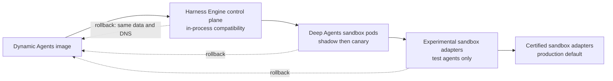

No source-package, chart, service, environment, collection, or route rename is part of this feature. That cleanup requires a later spec after the rollback window closes.

## Architecture invariants

1. Existing clients cannot tell whether the compatibility runtime is wrapped.
2. Authorization occurs before provider execution and again before tool/subagent execution.
3. Protocol encoders never import provider SDK types.
4. Adapters never write agent or MCP configuration.
5. A conversation never changes harness implicitly.
6. Unsupported behavior fails before model invocation.
7. No fallback occurs after output or side effects.
8. A failing optional adapter cannot make healthy adapters unavailable.
9. Dynamic Agents can read the shared data after rollback.
10. “Certified” is backed by conformance evidence for the exact adapter version.
11. Every production local-harness binding owns a distinct Sandbox UID and lease generation.
12. The sandbox worker never receives raw user, MCP, database, cloud, or Kubernetes credentials.
13. A stale worker cannot emit accepted events or execute accepted tool calls.
14. Agent configuration cannot choose arbitrary images, commands, service accounts, volumes, RuntimeClasses, or egress.
15. Thread state, long-term memory, and sandbox workspace have distinct namespaces and retention lifecycles.
16. A completed-durable result always names a committed external checkpoint head.
17. Writable long-term memory is user-scoped by default; shared memory requires explicit policy.
18. Trace context crosses internal boundaries, but sensitive content and identity never enter baggage.
