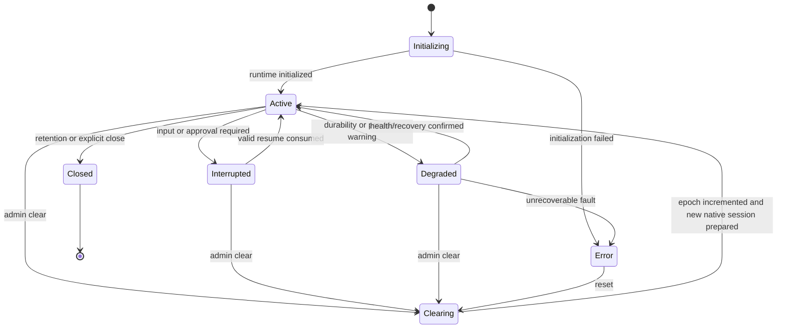

# Data Model: Harness Engine

## Principles

- Existing documents remain valid without a backfill.
- Provider-private state stays opaque and versioned.
- Conversation ownership and authorization continue to use existing records and OpenFGA.
- Secrets, bearer tokens, exchanged credentials, SDK clients, and live processes are never persisted.
- Harness changes affect new conversations unless an explicit transfer is certified.

## Persisted entities

### 1. Agent harness configuration

Add an optional `harness` subdocument to the existing `dynamic_agents` document.

```yaml
harness:
  id: strands
  contract_version: 1
  conversation_policy: pin
  options:
    model_provider_mode: configured
```

| Field | Type | Required | Validation / meaning |
|---|---|---:|---|
| `id` | string | yes when `harness` exists | Registered harness ID. Initial IDs: `deepagents`, `claude_agent_sdk`, `strands`, `agentcore`. |
| `contract_version` | integer | no | Defaults to `1`; adapter must support it. |
| `conversation_policy` | enum | no | `pin` (default), `new_conversation`, or `certified_transfer`. |
| `options` | object | no | Namespaced adapter-owned values validated by the adapter JSON schema; maximum encoded size 32 KiB. |

Read-time default when `harness` is absent:

```yaml
harness:
  id: deepagents
  contract_version: 1
  conversation_policy: pin
  options: {}
```

Rules:

- `harness` is additive; existing Dynamic Agents ignores it on rollback.
- `options` cannot contain fields named or shaped as secrets, tokens, credentials, environment dictionaries, arbitrary module paths, commands, or executable code.
- Harness-specific secrets are referenced through environment-owned configuration or the existing credential service, never agent documents.
- Request-time `config_override` cannot change `harness.id`, provider resource references, execution mode, or trust-boundary options. A future allowlist may permit safe tuning values.
- Updating `harness` increments `updated_at`, invalidates new runtime lookups, and does not alter existing session bindings.

Optional portable long-term memory policy on the same agent document:

```yaml
memory:
  enabled: true
  read_scopes: [user, agent, organization]
  write_scope: user
  write_policy: approval_for_sensitive
  kinds: [semantic, episodic_reference]
  retrieval: on_demand
  max_results: 10
  retention_policy: standard
  consolidation: disabled
```

Rules:

- Absence means no new cross-thread learned-memory behavior; existing checkpoints/files continue unchanged.
- `write_scope` defaults to `user`; enabling agent-shared writes requires an operator policy, and organization writes are not agent-configurable.
- `write_policy` is `disabled`, `automatic_scoped`, or `approval_for_sensitive`; deployment policy may only make it stricter.
- `retrieval` is `startup_bounded` or `on_demand`; both authorize/filter before retrieval.
- Retention policies are deployment-owned stable IDs, not arbitrary TTLs supplied by a request.
- Request-time overrides cannot change memory scopes, write policy, retention, consolidation, or authorization.
- Memory policy is portable common configuration and cannot be hidden in harness-specific `options`.

#### Non-persisted editor draft

The browser holds a revisioned editing projection; it is not part of the agent document:

```yaml
draft_revision: 12
selected_harness_id: strands
portable_config: {}
options_by_harness:
  deepagents: {}
  strands: {}
validation:
  request_id: validation-opaque
  config_fingerprint: sha256:...
  catalog_revision: sha256:...
  valid: false
  issues: []
```

Rules:

- `portable_config` is the one common draft for identity, prompt, model, tools, skills, middleware, subagents, interrupt policy, and memory.
- `options_by_harness` parks unsaved options only for the current browser editing session. Only the selected harness's options enter the create/update payload.
- Each material edit increments `draft_revision`. Catalog, model, and validation responses apply only when their request identity and fingerprint still match the current draft.
- Parked options, validation reports, capability declarations, health, certification, active-conversation summaries, and safe-fix previews are never persisted as agent configuration.
- The server recomputes normalized configuration and effective catalog/policy state before every write; browser state cannot authorize a save or transfer.

### 2. Harness session binding

New MongoDB collection: `harness_sessions`.

```yaml
_id: hs_opaque_key
schema_version: 1
environment_id: primary
owner_subject: user:test-user@example.com
agent_id: agent-example
conversation_id: conversation-example
harness_id: strands
adapter_version: 1.0.0
contract_version: 1
epoch: 0
config_fingerprint: sha256:...
provider_session_id: opaque-provider-safe-id
provider_resource_ref:
  kind: kubernetes_agent_sandbox
  profile_id: strands-standard-v1
  claim_namespace: harness-runtime
  claim_name: hs-example
  claim_uid: 00000000-0000-0000-0000-000000000001
  sandbox_uid: 00000000-0000-0000-0000-000000000002
  endpoint: hs-example.harness-runtime.svc
  lease_generation: 1
  worker_image_digest: sha256:...
  worker_protocol_version: 1
  lifecycle_state: ready
  claimed_at: 2026-08-17T00:00:01Z
  expires_at: 2026-08-17T01:00:01Z
state_ref:
  codec: strands-session-v1
  key: session-key
  durable_head: checkpoint-opaque
  durable_revision: 8
  last_committed_run_id: run-opaque
  last_idempotency_key_hash: sha256:...
  durability_status: committed
checkpoint_strategy: adapter_store
status: active
pending_interrupt: null
revision: 3
created_at: 2026-08-17T00:00:00Z
updated_at: 2026-08-17T00:05:00Z
last_activity_at: 2026-08-17T00:05:00Z
expires_at: null
```

| Field | Type | Required | Validation / meaning |
|---|---|---:|---|
| `_id` | opaque string | yes | Keyed digest of environment, owner subject, agent, and conversation; no raw identity in provider IDs. |
| `schema_version` | integer | yes | Binding schema; starts at `1`. |
| `environment_id` | string | yes | Prevents collision when a database is shared across environments. |
| `owner_subject` | string | yes | Canonical user or service-account subject used for binding checks. |
| `agent_id` | string | yes | Existing agent ID. |
| `conversation_id` | string | yes | Existing conversation ID. |
| `harness_id` | string | yes | Harness selected when binding was created. Immutable within an epoch. |
| `adapter_version` | string | yes | Exact adapter version that wrote the binding. |
| `contract_version` | integer | yes | Canonical adapter contract used by the binding. |
| `epoch` | non-negative integer | yes | Increments on clear or explicit new-session transition. |
| `config_fingerprint` | string | yes | Digest of execution-relevant portable config and safe harness options. |
| `provider_session_id` | string/null | no | Opaque native session ID. Must not contain email, name, or raw bearer subject. |
| `provider_resource_ref` | object/null | no | Non-secret immutable remote-harness reference or sandbox lease snapshot defined below. |
| `state_ref` | object/null | no | Opaque codec/key, durable checkpoint head/revision, last committed run/idempotency digest, and durability status; no unbounded state inline. |
| `checkpoint_strategy` | enum | yes | `langgraph`, `adapter_store`, `remote_managed`, or `ephemeral`. |
| `status` | enum | yes | `initializing`, `active`, `interrupted`, `degraded`, `clearing`, `closed`, or `error`. |
| `pending_interrupt` | object/null | no | Canonical interrupt snapshot defined below. |
| `revision` | integer | yes | Optimistic concurrency token. |
| timestamps | datetime | yes/optional | Creation, update, activity, and optional expiry. |

Uniqueness:

- One active binding per `(environment_id, owner_subject, agent_id, conversation_id, epoch)`.
- `_id` is deterministic for the tuple and epoch but derived with an environment-held key.
- A provider session ID cannot be shared by different active bindings within the same harness and provider resource.
- A claim UID and Sandbox UID cannot be referenced by different active bindings.

### 3. Sandbox lease snapshot

For `deepagents`, `claude_agent_sdk`, and `strands`, `provider_resource_ref.kind` is `kubernetes_agent_sandbox` and contains:

| Field | Meaning |
|---|---|
| `profile_id` | Static operator-owned profile resolved for the harness/workload class. |
| `claim_namespace`, `claim_name`, `claim_uid` | Exact `SandboxClaim` identity; the UID prevents name-reuse confusion. |
| `sandbox_uid` | Bound Agent Sandbox identity; unique to the active binding. |
| `endpoint` | Cluster-private stable endpoint; never returned to public clients. |
| `lease_generation` | Monotonic fencing value. Events and tool calls from older generations are rejected. |
| `worker_image_digest` | Immutable certified worker artifact. |
| `worker_protocol_version` | Negotiated internal protocol version. |
| `lifecycle_state` | `claiming`, `ready`, `busy`, `hibernated`, `replacing`, `releasing`, or `failed`. |
| `claimed_at`, `ready_at`, `last_seen_at`, `expires_at` | Lifecycle and reconciliation timestamps. |

Rules:

- Kubernetes is authoritative for live claim/Sandbox status; this snapshot is authoritative for ownership and fencing.
- Replacement uses compare-and-set on `revision` and increments `lease_generation` before a new worker can execute.
- A worker request, event, state operation, or ToolBroker call must match binding ID, epoch, run ID where applicable, and lease generation.
- Claim names and labels contain only opaque binding digests; raw subject, email, agent name, and conversation text are forbidden.
- Worker endpoints and capability tokens are never persisted in public conversation metadata.
- Release deletes the claim. Destroy-on-release is the default even when allocation came from a warm pool.

### 4. Thread persistence metadata

Stored in the binding's `state_ref` while adapter-native checkpoint bodies remain in existing or adapter-specific state storage.

| Field | Meaning |
|---|---|
| `codec` | Native state format and major schema, such as `langgraph-checkpoint-v1`, `claude-session-v1`, or `strands-session-v1`. |
| `key` | Opaque binding-scoped state-store key. |
| `durable_head` | Opaque latest committed checkpoint/snapshot/provider-state reference. |
| `durable_revision` | Monotonic commit revision used for compare-and-set restore/update. |
| `last_committed_run_id` | Run whose final state is represented by the durable head. |
| `last_idempotency_key_hash` | Keyed digest used to deduplicate a retried turn without persisting raw client keys. |
| `durability_status` | `pending`, `committed`, `uncertain`, or `failed`. |
| `committed_at` | Timestamp of the latest durable state-head commit. |

Rules:

- Checkpoint content is adapter-private; the control plane validates ownership and revisions but does not reinterpret it.
- A binding can expose `durability_status: committed` only after both native state and binding head commit.
- Restore always selects `durable_head`, never the newest uncommitted provider entry or pod-local file.
- An ambiguous crash marks the affected run `uncertain`; retry requires idempotency reconciliation and never automatic tool replay.
- Clearing increments the epoch and prevents old state heads from being attached to the new epoch.

### 5. Agent memory record

New logical collection: `harness_memories`. Small bounded records may be stored inline; larger bodies use an existing GridFS/object reference.

```yaml
_id: hm_opaque
schema_version: 1
environment_id: primary
scope: user
namespace_key: keyed-digest
agent_id: agent-example
subject_ref: keyed-digest
kind: semantic
memory_key: preferences/response-style
content_ref:
  kind: inline
  media_type: text/markdown
  body: "Prefer concise answers."
content_hash: sha256:...
provenance:
  source: approved_agent_write
  source_binding_id: hs_opaque_key
  source_run_id: run_opaque
permissions:
  read: scoped
  write: scoped_with_policy
approval_status: approved
revision: 4
created_at: 2026-08-17T00:00:00Z
updated_at: 2026-08-17T00:05:00Z
expires_at: null
```

| Field | Meaning |
|---|---|
| `scope` | `user`, `agent`, or `organization`. |
| `namespace_key` | Environment-keyed digest of the authorized namespace components. |
| `agent_id`, `subject_ref` | Opaque ownership dimensions; raw identity is not used as a provider/file path. |
| `kind` | `semantic`, `episodic_reference`, or `procedural`. |
| `memory_key` | Bounded logical key within the authorized namespace. |
| `content_ref`, `content_hash` | Inline bounded content or existing durable object reference plus integrity digest. |
| `provenance` | Source type, writer, source binding/run/thread reference, model/harness version, and optional approval record. |
| `permissions` | Read/write/delete policy projection; source policy remains authoritative. |
| `approval_status` | `not_required`, `pending`, `approved`, `rejected`, or `revoked`. |
| `revision` | Optimistic concurrency token; writes require the expected revision. |
| timestamps | Creation, update, optional last-used and expiry. |

Rules:

- Writable learned memory defaults to user scope keyed by environment, subject, and agent.
- Agent-shared writes require explicit configuration and organization-shared memory is read-only by default.
- Retrieval applies authorization and namespace filters before search/ranking.
- Memory content is scanned and treated as untrusted context; it cannot grant tools, credentials, network access, or new memory scope.
- Transcript content is not copied automatically. Episodic memory stores authorized references/summaries with provenance.
- Compare-and-set rejects conflicting revisions. Any merge/consolidation writes a new revision with all source revisions recorded.
- Conversation clear and memory delete are separate operations with separate authorization and retention.

### 6. Canonical pending interrupt

Stored inside the session binding so refresh/restart does not require reconstructing provider-private state just to render the UI.

Common fields:

| Field | Type | Meaning |
|---|---|---|
| `interrupt_id` | string | Stable, opaque, unique within binding epoch. |
| `type` | enum | `form_input` or `tool_approval`. |
| `run_id` | string | Run that created the interrupt. |
| `namespace` | string array | Parent/subagent path. |
| `agent_id` | string | Agent awaiting input. |
| `created_at` | datetime | Audit and retention timestamp. |
| `provider_ref` | object/null | Opaque resume token/state reference, encrypted or indirect if sensitive. |
| `revision` | integer | Prevents double resume. |

Form input fields:

- `prompt`
- `fields[]`: `field_name`, `field_label`, `field_description`, `field_type`, `field_values`, `required`, `default_value`, and `placeholder`

Tool approval fields:

- `tool_approvals[]`: `tool_name`, `tool_call_id`, redacted/bounded `tool_args`, and `allowed_decisions`

Rules:

- Raw credentials and secret arguments are redacted before persistence.
- Resume must match binding, interrupt ID, revision, caller, and allowed decision.
- A successful resume atomically consumes or replaces the interrupt.
- Duplicate resume with the same idempotency key returns the prior result; conflicting duplicate resume is rejected.

### 7. Claude session entries

Stored through a Mongo implementation of the Claude Agent SDK `SessionStore`. Use separate collections or a discriminator within `harness_session_state`; the implementation phase selects the simpler option after index benchmarks.

Required logical fields:

- `binding_id`
- `project_key`
- `session_id`
- optional opaque `subpath`
- ordered entry sequence
- provider entry UUID for deduplication
- opaque JSON-safe entry body
- summary sidecar
- created/updated/expiry timestamps

Rules:

- Preserve entries in order and return them deep-equal.
- Deduplicate retry deliveries by provider entry UUID.
- Serialize summary folding per session.
- Deleting the primary transcript cascades to subagent subpaths.
- Treat bodies as opaque SDK-owned values.

### 8. Strands session snapshots

Stored behind a custom Strands `SessionRepository` using the same binding identity.

Required logical records:

- session metadata;
- agent state and conversation-manager state;
- ordered session messages;
- optional immutable snapshots;
- multi-agent state only for provider-native extension mode.

Rules:

- Serialize all reads/writes for a binding because session managers are not thread-safe.
- Preserve schema versions and opaque state.
- Existing CAIPE subagents use separate Harness Engine bindings through DelegationBroker, not embedded provider multi-agent state.

### 9. AgentCore resource and session reference

Stored in `provider_resource_ref` and `provider_session_id`; no AWS credential is stored.

```yaml
provider_resource_ref:
  kind: agentcore_harness
  region: us-west-2
  harness_arn: arn:aws:bedrock-agentcore:us-west-2:000000000000:harness/example
  endpoint: stable
  harness_version: "7"
provider_session_id: hse_<opaque-at-least-33-char-id>
```

Rules:

- Resource identity is immutable within an epoch.
- The role/credential source is deployment configuration, not the document.
- Provider session IDs meet length/character rules and reveal no identity.
- Clear increments the epoch and creates a new provider session; it does not claim to rewrite a managed remote history.

## Non-persisted entities

### Harness descriptor

Built from the static registry at startup:

- `id`, display name, description;
- adapter and contract versions;
- execution mode: `sandbox_pod`, `provider_managed`, or explicit compatibility-only `in_process`;
- enabled and certification state;
- JSON configuration schema;
- trust boundary and required dependencies;
- capability declarations;
- health summary.

Descriptors are not stored in MongoDB because code and deployment configuration are authoritative.

### Sandbox profile

Built from deployment configuration and operator-owned Kubernetes resources:

- `profile_id`, harness IDs, workload/risk class, and enabled state;
- `SandboxTemplate` or `SandboxWarmPool` namespace/name/UID expectation;
- allowed worker image digest, adapter version, and worker protocol versions;
- RuntimeClass/isolation level;
- CPU, memory, ephemeral storage, PID, concurrency, and timeout limits;
- workspace and optional PVC policy;
- ingress/egress policy class;
- idle TTL, hibernation policy, maximum lifetime, and claim readiness deadline;
- release mode, fixed to `destroy` unless reset conformance evidence is recorded.

Profiles are never accepted from an agent document or request override. Harness Engine verifies that the bound worker reports the expected image digest and protocol before sending a turn.

### Capability report

Computed for a specific agent configuration:

- harness identity and health;
- required capabilities derived from config;
- result for each capability: `native`, `emulated`, `unsupported`, or `unavailable`;
- constraints and field paths;
- actionable errors/warnings;
- certification state and evidence version.

### Run context

Immutable, request-scoped value passed to an adapter:

- run, trace, agent, conversation, and binding IDs;
- authorized subject summary (no raw claims unless explicitly required);
- rendered prompt and client context;
- model selection;
- portable tool handles;
- skill/file manifests;
- interrupt and middleware policy;
- deadlines, size limits, and cancellation token;
- narrowed persistence and telemetry interfaces.

### Trace context

Request-scoped and never used as an authorization source:

- validated W3C `traceparent` and optional `tracestate` for trusted internal propagation;
- opaque run, binding, harness, adapter, sandbox-profile, and lease-generation correlation;
- sampling decision and instrumentation version;
- empty-by-default baggage allowlist.

Raw subject, email, conversation text, prompt, memory content, tool arguments/results, credentials, protected skill content, and provider-private identifiers are forbidden from baggage and high-cardinality resource attributes. Traces are observability records, not conversation or memory storage.

### Canonical event

Transient provider-neutral stream record. Events may be observed in existing telemetry/audit systems but are not added as a new source-of-truth transcript by this feature.

## State transitions



## Indexes

`harness_sessions`:

1. Unique `{ environment_id: 1, owner_subject: 1, agent_id: 1, conversation_id: 1, epoch: 1 }`.
2. Unique sparse `{ harness_id: 1, "provider_resource_ref.kind": 1, provider_session_id: 1 }`.
3. `{ conversation_id: 1, agent_id: 1, status: 1 }` for interrupt-state and clear queries.
4. `{ harness_id: 1, status: 1, last_activity_at: 1 }` for operations and cleanup.
5. TTL `{ expires_at: 1 }` with `expireAfterSeconds: 0`.

Adapter state collections:

- Compound binding/session/order indexes required by the SDK repository contract.
- TTL matches the binding retention policy.
- Unique entry UUID/index where the provider can retry writes.

`harness_memories`:

1. Unique `{ environment_id: 1, scope: 1, namespace_key: 1, agent_id: 1, kind: 1, memory_key: 1 }`.
2. `{ environment_id: 1, scope: 1, namespace_key: 1, agent_id: 1, updated_at: -1 }` for authorized listing.
3. `{ "provenance.source_binding_id": 1, "provenance.source_run_id": 1 }` for audit and revocation.
4. TTL `{ expires_at: 1 }` with `expireAfterSeconds: 0`.
5. Search/vector indexes, if added, must include enforceable namespace filters and cannot be queried without them.

## Concurrency rules

- Binding creation uses an atomic upsert and unique index.
- One turn or resume may mutate a binding at a time.
- `revision` compare-and-set protects interrupt consumption, clear, and adapter-version updates.
- Runtime cache single-flight remains keyed by agent/conversation and adds harness/binding epoch to prevent stale reuse.
- Read-only interrupt inspection may run concurrently but returns a revisioned snapshot.
- Thread-head commits compare the expected binding and durable revisions and record the committing run.
- Memory writes require an expected revision; a missing/stale revision returns a conflict unless creating a new unique key.
- Consolidation serializes per target memory key or records an explicit multi-source merge revision.

## Retention and deletion

- Existing conversation and checkpoint retention rules remain authoritative for Deep Agents.
- Adapter-native state inherits the conversation retention/clear decision and an operator-configured maximum TTL.
- Clearing a conversation deletes common file namespace, compatible checkpoints, pending interrupts, and adapter-store state, then creates a new epoch if the conversation remains.
- Remote-provider deletion is best effort and audited; the engine revokes the binding even if the provider has independent retention.
- Attachment blobs remain content-addressed and follow their existing retention lifecycle.
- Long-term memory follows its own scope-specific retention and deletion policy; conversation clear does not silently delete or retain memory.
- Revoking a source thread marks derived episodic references for policy review or deletion without mutating unrelated memory.
- Trace retention, sampling, and deletion remain in the telemetry platform and never substitute for thread or memory retention.

## Rollback compatibility

- Old Dynamic Agents ignores `dynamic_agents.harness`.
- Old Dynamic Agents does not query `harness_sessions` or adapter state.
- Deep Agents conversations retain their existing checkpoint threads and file namespaces.
- Conversations first created on another harness are not resumable by old Dynamic Agents; rollback must route those agents to a disabled/read-only state or start a new Deep Agents conversation. This limitation is surfaced before enabling non-default adapters and is why the old workload remains a compatibility rollback, not a cross-harness state converter.
