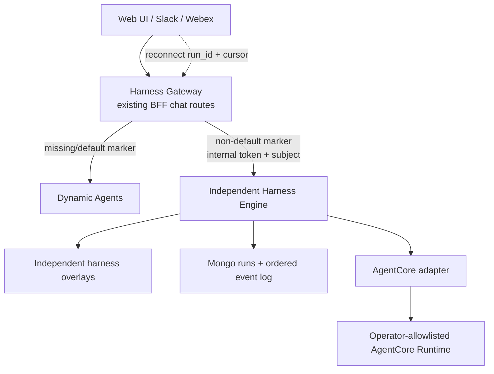

# Implementation Plan: Harness Engine

> **Independent track (2026-08-18):** The current implementation follows the
> standalone control-plane slice in [Portable abstractions](portable-abstractions.md).
> Tasks that name `ai_platform_engineering/dynamic_agents/` remain future
> replacement work and are intentionally untouched.

**Branch**: `2026-08-17-harness-engine` | **Date**: 2026-08-17 | **Spec**: [spec.md](./spec.md)
**Input**: Feature specification from `docs/docs/specs/2026-08-17-harness-engine/spec.md`

## Summary

Build Harness Engine as an independent service and adopt it beside Dynamic Agents. The first vertical slice supports an operator-allowlisted Amazon Bedrock AgentCore runtime. No source file, route, database schema, stream, or execution behavior in `ai_platform_engineering/dynamic_agents/` changes.

The Next.js BFF remains horizontally stateless. Its existing chat endpoints now
form the **Harness Gateway**: they resolve the BFF-owned
`execution_harness_id`, preserve Dynamic Agents as the legacy/default target,
and route opted-in agents to detached Harness Engine runs. The gateway converts
canonical events to the existing AG-UI or custom SSE wire format. Harness Engine
owns the provider task, AgentCore `runtimeSessionId`, run status, and sequenced
event log, so a browser or BFF disconnect cannot cancel execution. Later
harnesses use the same independent adapter/run contract; replacement of Dynamic
Agents remains a separate opt-in phase.

Common platform policy remains outside adapters: authentication and OpenFGA checks stay in the BFF; operator-owned runtime allowlists, session ownership, persistence, event ordering, and provider credentials stay in Harness Engine. Adapters own provider invocation and native stream translation only.

## Technical Context

**Language/Version**: Python 3.13 for the runtime; TypeScript/Next.js 16 and React 19 for additive builder UI fields
**Primary Dependencies**: Independent FastAPI/Pydantic service, boto3 AgentCore client, PyMongo, and the existing Next.js BFF/authz libraries
**Storage**: Independent `harness_agents`, `harness_agent_versions`,
`harness_sessions`, `harness_runs`, and `harness_events` MongoDB collections;
each adapter owns its native checkpoint/session representation
**Testing**: pytest/pytest-asyncio disconnect/replay E2E and adapter tests; BFF Jest route tests; existing Dynamic Agents tests remain unchanged
**Target Platform**: Independent Linux control-plane container calling the managed AgentCore Runtime plane; local memory repository is test/development only
**Project Type**: New backend service plus additive Next.js BFF routes and agent-editor overlay
**Performance Goals**: Compatibility control-plane overhead within 10% excluding declared sandbox startup; canonical translation under 25 ms p95 per event batch; warm worker readiness under 5 seconds p95 and cold readiness under 30 seconds p95; no more than 20% control-plane memory growth
**Constraints**: Zero Dynamic Agents implementation changes; fail closed before provider invocation; no arbitrary AgentCore ARN from browser/agent data; no user bearer propagation; no BFF affinity; no automatic fallback after side effects
**Scale/Scope**: AgentCore first; horizontally scaled BFF and Harness Engine readers over a shared Mongo event log; additional harnesses and sandbox workers follow the same boundary

## Constitution Check

*GATE: Passed before Phase 0 research. Re-checked after Phase 1 design.*

| Principle | Design response | Status |
|---|---|---|
| Worse is Better | Evolve the proven service in place; first wrap the current runtime, then move the same worker behind a narrow sandbox protocol without changing public routes or data. | PASS |
| YAGNI | Implement only the four requested adapters, one minimal internal worker protocol, static profiles, and Agent Sandbox claims. No marketplace, arbitrary plugin loader, or automatic cost router. | PASS |
| Rule of Three | A common adapter contract is justified by four concrete harnesses. Provider-specific configuration remains duplicated inside adapters until a third identical pattern appears. | PASS |
| Composition over Inheritance | Use small runtime, adapter, tool, session, and event protocols composed by a registry; no adapter inheritance tree. | PASS |
| Specs as Source of Truth | Specification, research, data model, contracts, migration plan, architecture, and quickstart are defined before code. | PASS |
| CI Gates | Preserve the existing suite unchanged and add contract, conformance, integration, security, Helm, and performance gates. | PASS |
| Security by Default | Keep authorization and secrets in the control plane; use claim-exclusive pods, allowlisted profiles, hardened RuntimeClasses, default-deny networking, scoped capabilities, redaction, and fail-closed validation. | PASS |

### Architecture decision amendment

`.specify/ARCHITECTURE.md` continues to describe the existing LangGraph-based Dynamic Agents system. Harness Engine is a separate execution plane for opt-in agents. No claim is made that all existing agents already execute through Harness Engine.

### Supply-chain gate

Before enabling an adapter, record its exact locked version, license/terms, transitive dependency diff, vulnerability scan, release cadence, runtime artifacts, network behavior, and credential requirements. A failed review leaves the adapter installed as unavailable or excludes it from the image; it does not weaken the common contract.

## Architecture



### Ownership boundary

| Common engine owns | Harness adapter owns |
|---|---|
| Public routes and errors | Provider client/process construction |
| Authentication, authorization, audit | Native option translation |
| Agent/MCP configuration reads | Model and agent-loop invocation |
| Config override allowlist | Native stream parsing |
| Prompt and context rendering | Native session create/resume/delete calls |
| Skills scan/load policy | Provider resource cleanup |
| Attachment validation/storage | Provider health diagnostics |
| Tool discovery, credentials, execution policy | Provider-specific usage metadata |
| Subagent delegation broker | Capability evidence for native behavior |
| Session binding and retention policy | Opaque adapter state codec/reference |
| Canonical event validation and wire encoders | Canonical event production |
| Cache, capacity, cancellation policy | Best-effort native cancellation |
| Metrics/tracing labels and redaction | Provider spans linked to the common trace |
| Sandbox claim, profile, lease generation, worker auth, and fencing | Harness SDK execution and provider-native translation inside its worker image |
| Kubernetes RBAC and NetworkPolicy ownership | No Kubernetes API or raw credential access |

## Project Structure

### Documentation (this feature)

```text
docs/docs/specs/2026-08-17-harness-engine/
├── spec.md
├── plan.md
├── research.md
├── architecture.md
├── agent-creation-ui.md
├── compatibility-matrix.md
├── data-model.md
├── quickstart.md
├── mongodb-migration.md
├── tasks.md
├── contracts/
│   ├── rest-api-v1.md
│   ├── harness-adapter-v1.md
│   ├── canonical-events-v1.md
│   ├── state-memory-tracing-v1.md
│   └── sandbox-worker-v1.md
└── checklists/
    └── requirements.md
```

### Source Code (repository root)

```text
ai_platform_engineering/dynamic_agents/
├── src/dynamic_agents/
│   ├── main.py                         # preserved compatibility service
│   ├── models.py                       # additive harness selection models
│   ├── routes/
│   │   ├── chat.py                     # existing routes; coordinator only
│   │   ├── conversations.py            # provider-neutral interrupt/clear
│   │   └── harnesses.py                # additive catalog/validation routes
│   └── services/
│       ├── runtime_cache.py             # cache of HarnessRuntime protocol
│       ├── runtime_coordinator.py       # common run lifecycle
│       ├── tool_broker.py               # portable tool surface and policy
│       ├── delegation_broker.py         # mixed-harness subagents
│       ├── session_store.py             # session binding repository
│       ├── thread_state_store.py        # scoped native state and durable heads
│       ├── memory_broker.py             # governed cross-thread memory
│       ├── telemetry.py                 # W3C propagation, spans, redaction
│       ├── sandbox_manager.py            # claims, readiness, fencing, reconciliation
│       ├── sandbox_profiles.py           # static template/pool policy
│       ├── worker_client.py              # internal streaming protocol client
│       ├── stream_encoders/             # consume canonical events only
│       └── harnesses/
│           ├── contract.py              # protocols and data types
│           ├── registry.py              # explicit allowlisted registry
│           ├── capability.py            # validation/certification
│           ├── deepagents_adapter.py    # wraps current AgentRuntime behavior
│           ├── deepagents_events.py     # LangGraph -> canonical translation
│           ├── claude_sdk_adapter.py
│           ├── strands_adapter.py
│           └── agentcore_adapter.py
├── worker/                               # minimal common worker host
│   ├── protocol.py
│   ├── server.py
│   └── adapters/                         # built into separate signed images
└── tests/
    ├── conformance/                     # parametrized adapter contract suite
    ├── contract/                        # REST and canonical event contracts
    ├── integration/                     # mixed-harness/failure scenarios
    └── test_*.py                        # existing suite remains unchanged

ui/src/
├── types/dynamic-agent.ts                # HarnessConfig, MemoryPolicy, UI reports
├── hooks/
│   ├── use-agent-draft.ts                # revisioned common + parked option state
│   ├── use-harness-catalog.ts            # catalog/model loading and race guards
│   └── use-harness-validation.ts         # debounced field-addressable validation
├── components/dynamic-agents/
│   ├── DynamicAgentEditor.tsx            # stable five-step composition
│   ├── HarnessSelector.tsx               # selector cards and catalog states
│   ├── HarnessCompatibilityDialog.tsx    # switch diff and explicit fixes
│   ├── CompatibilitySummary.tsx          # unified blockers and review
│   └── harness-options/                  # first-party typed option panels
└── app/api/dynamic-agents/
    ├── route.ts                          # allowlisted create/update + revalidation
    ├── models/route.ts                   # harness-filtered model proxy
    └── harnesses/                        # BFF catalog and validation proxies

charts/ai-platform-engineering/charts/dynamic-agents/
├── values.yaml                          # adapter/profile/controller config
└── templates/                           # control plane, RBAC, policies, profiles/pools
```

**Structure Decision**: Create `ai_platform_engineering/harness_engine/` as a separate package, image, API, persistence boundary, and test suite. Add only new `/api/harness-engine/*` BFF routes and a UI overlay. Do not modify `ai_platform_engineering/dynamic_agents/`; future migration is separately specified and reversible.

### Implemented vertical-slice structure

```text
ai_platform_engineering/harness_engine/
├── build/Dockerfile
├── pyproject.toml
├── src/harness_engine/
│   ├── adapters/agentcore.py
│   ├── coordinator.py
│   ├── main.py
│   ├── models.py
│   └── repository.py
└── tests/
    ├── test_agentcore_adapter.py
    └── test_disconnect_replay_e2e.py

ui/src/
├── app/api/harness-engine/             # catalog, overlay, run, replay, SSE
├── app/api/v1/chat/                    # Harness Gateway compatibility routes
├── components/chat/AgentHarnessBadge.tsx
├── lib/agent-presentation.ts           # labels + deterministic agent colors
├── lib/harness-gateway.ts              # routing + canonical wire encoders
├── lib/harness-engine-proxy.ts         # internal-credential proxy
├── lib/harness-engine-session-client.ts
└── types/harness-engine.ts
```

The dependency-ordered implementation backlog, independent story checkpoints, exact file targets, and release gates are defined in [tasks.md](./tasks.md), generated as the Spec Kit Phase 2 deliverable.

### Harness Gateway vertical slice

- `dynamic_agents.execution_harness_id` is routing metadata owned by the BFF;
  absent values preserve the legacy Dynamic Agents path.
- Web UI, Slack, and Webex keep calling `/api/v1/chat/*`; no provider SDK or
  harness-specific logic is added to those clients.
- Non-default `start` creates a detached run and streams a translation of the
  durable canonical event log. Client disconnect closes only the subscription.
- Non-default `invoke` waits on the durable event log and accumulates the same
  JSON response shape.
- Non-default `cancel` addresses the active run by caller, agent, and
  conversation while preserving its session binding.
- Human-input resume and file attachments remain capability-gated for the
  initial AgentCore/Claude adapters; the gateway returns an explicit `409`
  instead of silently switching harnesses.
- Chat renders a persistent agent/harness identity header. Sidebar history and
  new-chat choices reuse the same accessible harness badges and deterministic
  per-agent fallback themes; explicit author-selected themes still win.

## Key Technical Decisions

### 1. Versioned, provider-neutral adapter protocol

`HarnessAdapter` is a factory and capability provider. It creates a conversation-scoped `HarnessRuntime` with these required operations:

- `initialize()`
- `stream(turn) -> AsyncIterator[CanonicalEvent]`
- `resume(decision) -> AsyncIterator[CanonicalEvent]`
- `pending_interrupt()`
- `cancel()`
- `restart()`
- `cleanup()`
- `health()`

Adapters receive immutable normalized inputs and service interfaces. They do not receive FastAPI requests, SSE encoders, Mongo collections, bearer headers, or unrestricted environment access.

### 2. Canonical events before wire encoding

Replace the current LangGraph-specific encoder input with a canonical event union. The state-machine validator enforces:

- one `run.started` before output;
- balanced text/reasoning/tool spans;
- stable run, message, tool, and interrupt IDs;
- valid subagent namespace transitions;
- one terminal `run.finished`, `run.interrupted`, `run.cancelled`, or `run.error`;
- bounded tool results and provider metadata;
- no post-terminal events.

Custom SSE and AG-UI encoders retain their current bytes-on-the-wire behavior for compatibility inputs.

### 3. Common tool and delegation brokers

The common `ToolBroker` resolves MCP and built-in tools, validates schemas, obtains per-request credentials, enforces tool allowlists and approval policy, executes calls, and bounds results. Adapters receive provider-specific wrappers over these portable tool handles.

All configured subagents use a common `DelegationBroker` exposed as the established task/delegation tool. This enables parent and child agents to use different harnesses while retaining independent authorization, credentials, capacity, canonical namespaces, interrupts, and traces. Provider-native subagents remain an optional extension until they can meet the same mixed-harness contract.

### 4. Explicit capability negotiation

Each adapter publishes `native`, `emulated`, `unsupported`, or `unavailable` for required capabilities. Validation computes the agent's requirements from its model, tools, built-ins, skills, middleware, files, subagents, interrupt policy, backend, and request override. Saving and running fail before invocation if any required capability is unsupported or unavailable.

`certified` is derived from conformance evidence, never self-declared. `experimental` adapters are visible only when explicitly enabled and cannot be chosen for production agents by default.

### 5. Session binding, not universal state translation

Persist a binding from `(environment, caller subject, agent, conversation)` to harness, adapter version, provider session, epoch, checkpoint strategy, and pending interrupt. The binding prevents a configuration edit from silently moving an active conversation between harnesses.

- Deep Agents continues to use existing LangGraph Mongo checkpoints.
- Claude Agent SDK uses its external `SessionStore` backed by Mongo and an isolated temporary config directory.
- Strands uses a custom Mongo-backed session repository.
- AgentCore stores the remote harness/session identity and durable engine metadata; clear increments the epoch and starts a fresh remote session.

State stays in its native codec. Cross-harness transfer is an explicit future contract, not JSON coercion of private SDK state.

### 6. Sandbox workers for local harnesses

Register only first-party, code-reviewed harnesses and map each local harness to an operator-owned sandbox profile. Harness Engine creates a `SandboxClaim`, waits for a worker with a compatible protocol/image digest, persists the lease generation, and invokes it through a cluster-private streaming endpoint. Agent config cannot choose images, commands, volumes, service accounts, RuntimeClasses, or egress.

The worker hosts exactly one binding at a time and emits canonical events. A short-lived capability authenticates binding, run, tool set, audience, expiry, and lease generation. ToolBroker rejects calls from stale generations. Provider SDK types, processes, temporary config, and workspace remain inside the pod; MongoDB, Kubernetes, OpenFGA, credential exchange, audit, and client encoders remain outside.

Use adapter-specific signed images. Keep `in_process` only behind an explicit migration/local-development flag so Docker Compose and rollback can continue while Kubernetes sandbox conformance is established.

### 7. Agent Sandbox lifecycle and hardening

- Claim from an allowlisted `SandboxTemplate` or `SandboxWarmPool`; do not create Pods directly.
- Default to one conversation-epoch lease, same-sandbox follow-up turns, idle hibernation/deletion, maximum lifetime, and destroy-on-release.
- Fence before replacement, reconcile orphan claims, and rehydrate from Mongo/GridFS/provider-native durable state.
- Run without a service-account token, root, host namespaces, hostPath, privileges, or runtime sockets.
- Use Kata for high-risk profiles and gVisor where certified; set seccomp, dropped capabilities, read-only root, PID/resource/ephemeral-storage limits.
- Default-deny ingress and egress. Permit only control-plane worker traffic, ToolBroker, DNS, the selected model/proxy, and approved artifacts.
- Warm-pool reuse is forbidden until a reset conformance suite proves no residual files, processes, memory-backed state, credentials, or network identity.

### 8. Separate thread state, long-term memory, and traces

Thread persistence uses native adapter codecs behind a binding-scoped `ThreadStateStore`. Deep Agents retains the existing MongoDBSaver collections. Each binding records the last durable head, commit revision, run/idempotency digest, interrupt revision, and durability status. Public durable completion follows the head commit; ambiguous post-output failures become `uncertain_durability` and are never auto-replayed.

Long-term agent memory uses a common MemoryBroker, separate from checkpoints, transcripts, pod files, and operator skills. Writable memory defaults to user+agent scope. Agent-shared memory needs explicit policy; organization memory is read-only by default. Every write is authorized, scanned, revisioned, provenance-bearing, retained independently, audited, and optionally approved.

Tracing uses sanitized W3C Trace Context across the control plane, worker, model/provider, ThreadStateStore, MemoryBroker, ToolBroker, subagents, and encoders. Baggage is empty by default and never carries identity or content. Worker OTLP goes only to the in-cluster collector/control-plane facade, where common redaction and sampling apply. Telemetry outage is bounded and does not alter run results.

## Adapter Mapping

| Adapter | Execution | Session strategy | Tool strategy | HITL strategy | Initial status |
|---|---|---|---|---|---|
| `deepagents` | Exclusive sandbox pod | Existing LangGraph Mongo/in-memory checkpointers; pod workspace | Worker-side LangChain wrappers calling ToolBroker | Existing LangGraph interrupts | Compatibility oracle; sandbox certify first |
| `claude_agent_sdk` | Exclusive sandbox pod + SDK subprocess | Mongo-backed SDK `SessionStore`; pod-local `CLAUDE_CONFIG_DIR` | Worker SDK MCP facade calling ToolBroker | Permission callback and user-input messages mapped to canonical interrupts | Experimental until sandbox + adapter conformance pass |
| `strands` | Exclusive sandbox pod | Custom Mongo `SessionRepository` through scoped state API | Worker Strands wrappers calling ToolBroker | Strands interrupts and hooks mapped to canonical interrupts | Experimental until sandbox + adapter conformance pass |
| `agentcore` | Managed remote harness | Durable binding to harness ARN/endpoint/session/epoch | Inline functions routed back through ToolBroker; governed MCP only after equivalent policy proof | Inline-function tool-use pause/resume mapped to canonical interrupts | Experimental, opt-in, AWS-configured |

## Implementation Phases

### Phase 0 - Freeze the compatibility oracle

- Inventory every current route, schema, SSE event, error, metric, persistence namespace, built-in tool, middleware outcome, and deployment setting.
- Convert current behavior into black-box golden contract tests before refactoring.
- Create the compatibility matrix and baseline latency/memory benchmark.
- Record exact adapter dependency and security reviews.

**Exit**: Existing behavior is machine-verifiable and the architecture amendment is approved.

### Phase 1 - Add contracts without changing execution

- Add canonical models, validator, adapter/runtime protocols, static registry, capabilities, and catalog/validation routes.
- Add optional `harness` configuration with read-time `deepagents` default.
- Add `harness_sessions` repository and indexes, initially unused by compatibility conversations.
- Add adapter labels to existing telemetry with `deepagents` as the only value.

**Exit**: All existing tests and benchmarks pass; no user-visible behavior changes.

### Phase 2 - Wrap the current runtime

- Implement `deepagents` adapter by delegation to the current `AgentRuntime`.
- Translate LangGraph chunks to canonical events.
- Refactor custom SSE and AG-UI encoders to consume canonical events while preserving golden frames.
- Change runtime cache and chat routes to depend on `HarnessRuntime`, retaining cache keys, TTL, LRU, capacity, and error shapes.

**Exit**: The unchanged Dynamic Agents suite plus the full adapter conformance suite passes for `deepagents` within performance budgets.

### Phase 3 - Move portable policy to common services

- Introduce ToolBroker, DelegationBroker, session binding, provider-neutral interrupt records, and common attachment/skill inputs.
- Introduce ThreadStateStore durable-head commits, MemoryBroker scopes/revisions/provenance, and the common W3C tracing topology.
- Route Deep Agents through those services to prove no regression.
- Add concurrent-turn locks, canonical event bounds, credential lifetime rules, and adapter-specific capacity partitions.

**Exit**: Deep Agents remains certified; existing threads resume unchanged; memory isolation/conflicts and end-to-end trace/redaction have fault tests.

### Phase 4 - Introduce the sandbox execution plane

- Install and pin Agent Sandbox CRDs/controller in test clusters.
- Define operator-owned Deep Agents, Claude, and Strands templates, warm pools, RuntimeClasses, resource limits, and NetworkPolicies.
- Implement the worker protocol, capability issuer/verifier, SandboxLeaseManager, readiness, generation fencing, orphan reconciliation, and signed adapter images.
- Shadow Deep Agents turns against sandbox workers with no client traffic, then canary new conversations while retaining explicit in-process rollback.
- Test eviction, hibernation, max lifetime, controller outage, stale events/tool calls, pod escape, egress denial, credential canaries, and 1,000-binding isolation.

**Exit**: Deep Agents has wire-compatible output from sandbox pods, warm/cold startup meets SLOs, no sandbox contains raw credentials, and stale generations have zero accepted events or tool calls.

### Phase 5 - Add adapters one at a time

1. Claude Agent SDK worker: state facade, MCP facade, permissions/HITL, stream translator, subprocess cleanup.
2. Strands worker: session facade, hooks/stream translator, MCP/tool facade, interrupts.
3. AgentCore Harness: control-plane validation, deterministic remote session mapping, streaming translator, inline tool callback loop, explicit IAM and timeout policy.

Each adapter lands disabled and experimental, runs the same adapter and isolation conformance suites, then becomes certified independently. No adapter blocks another adapter's rollout.

**Exit**: Each advertised certified adapter passes all required tests; unresolved native gaps remain visible as experimental and cannot be called supported.

### Phase 6 - Builder and operator surfaces

- Refactor the existing local editor state into a revisioned draft hook without changing the five stable step IDs or the default Deep Agents rendering.
- Add the catalog-driven harness selector before model selection and load models through a harness-filtered BFF query.
- Project the field-addressable capability report into the existing Basic, Instructions, Tools, Skills, and Advanced sections.
- Add the harness-switch compatibility dialog, per-harness transient option parking, active-conversation confirmation, and unified error navigation.
- Add portable memory controls, read-only thread/tracing summaries, and first-party typed harness-option panels backed by static JSON Schema.
- Extend the BFF allowlist for `harness` and `memory`; revalidate the exact payload and fingerprint before MongoDB/OpenFGA mutation.
- Add harness health/capacity details to existing diagnostics and dashboards.
- Preserve unknown or unavailable stored harnesses for inspection; show policy-hidden adapters only when referenced by an existing agent.

**Exit**: Existing Deep Agents editor tests pass unchanged, builders cannot save an incompatible or stale selection, and harness switching causes zero silent field loss.

### Phase 7 - Rollout and replacement

- Shadow event translation without invoking tools, then canary the compatibility adapter.
- Route traffic to Harness Engine under the existing service alias.
- Enable selected experimental adapters only for test agents, then certify/canary per adapter.
- Keep Dynamic Agents image rollback available until compatibility SLOs and soak gates pass.
- Rename user-facing labels and deployment objects only under a later cleanup spec.

**Exit**: Compatibility traffic meets SLOs, rollback rehearsal succeeds, and Harness Engine is the production runtime.

## Testing Strategy

| Gate | Required evidence |
|---|---|
| Existing behavior | Entire current Dynamic Agents test suite passes unchanged against `deepagents` adapter |
| REST contract | Snapshot/OpenAPI and black-box tests for every existing and additive route |
| Event contract | State-machine/property tests plus byte-for-byte golden custom SSE and AG-UI frames |
| Adapter conformance | Parametrized suite for initialize, stream, invoke, resume, cancel, restart, cleanup, errors, usage, sessions, tools, files, and subagents |
| Security | Authorization before worker/remote invocation, per-user credential isolation, pod escape and credential-canary tests, default-deny egress, redaction, malformed event defense, remote session collision tests |
| Persistence | Restart/eviction/resume, pending interrupts, clear, TTL, rollback readability, adapter version changes |
| Agent memory | User/agent/organization scopes, authorization-before-search, conflicts, provenance, approval, injection, retention, deletion, cross-thread behavior |
| Tracing | W3C parentage across all boundaries, opaque correlation, forbidden baggage/attributes, provider suppression, sampling, collector outage bounds |
| Agent builder | Legacy/default Deep Agents regression; create/edit/clone for every harness and catalog state; field capability projection; filtered models; switch diff; parked options; active-conversation policy; unknown harness preservation; keyboard/screen-reader/error-focus behavior |
| UI/BFF consistency | Out-of-order catalog/model/validation responses, exact-payload fingerprint, catalog revision change before save, allowlist rejection, and proof that invalid validation performs no MongoDB/OpenFGA mutation |
| Fault isolation | Provider unavailable, claim/controller failure, pod eviction/OOM/lifetime, stale worker, slow/hung stream, malformed output, tool failure, client disconnect, cancellation races |
| Performance | Current-vs-compatibility p50/p95/p99 latency, warm/cold claim readiness, control-plane memory, event translation/transit overhead, mixed-harness and pool capacity |
| Deployment | Docker Compose compatibility smoke; Helm/CRD/RBAC/NetworkPolicy/Profile render tests; gVisor/Kata readiness; rolling upgrade and rollback rehearsal |

## Database Migrations

**Deliverable**: [mongodb-migration.md](./mongodb-migration.md)

- Add optional `harness` subdocument to `dynamic_agents`; no backfill because absence resolves to `deepagents`.
- Add `harness_sessions` for provider session bindings, canonical pending interrupts, Sandbox leases, and durable thread heads.
- Add `harness_memories` for scoped memory metadata/revisions/provenance, reusing existing GridFS/object storage for large content.
- Create unique ownership/binding and TTL query indexes idempotently.
- Do not alter or rewrite existing LangGraph checkpoint, GridFS, attachment, conversation, skill, or audit data.
- Rollback leaves additive fields and the new collection in place; Dynamic Agents ignores them.

## Rollout Gates

- No implementation phase begins with unresolved spec markers.
- No adapter is called supported before certification.
- No adapter receives production traffic before dependency/security review.
- No protocol cutover occurs before byte-compatible golden tests pass.
- No service rename or legacy object deletion occurs in this feature.
- No automatic fallback is enabled by default.
- No production local harness runs in-process after sandbox certification.
- No sandbox profile accepts an agent-selected image, command, identity, volume, RuntimeClass, or egress rule.
- No warm-pool sandbox is reassigned after release unless reset conformance is separately proven.
- No harness is certified without crash-safe thread restore, governed cross-thread memory, and end-to-end trace/redaction evidence.
- Production cutover requires a successful rollback rehearsal and a soak period meeting SC-005 through SC-008.

## Complexity Tracking

| Complexity | Why needed | Simpler alternative rejected because |
|---|---|---|
| Provider-neutral canonical event layer | Four harnesses emit incompatible lifecycle objects while two stable client protocols must remain unchanged. | Teaching each wire encoder every provider multiplies coupling and makes compatibility untestable. |
| Additive session-binding collection | Remote and SDK-native session identifiers/codecs must survive restarts and remain bound to the originating harness. | Storing provider IDs only in memory breaks resume; coercing private state into LangGraph checkpoints is unsafe. |
| Common ToolBroker and DelegationBroker | Security, caller credentials, approvals, and mixed-harness subagents must remain identical across local and remote harnesses. | Letting each provider invoke tools directly creates four policy implementations and bypass risks. |
| Claim-exclusive sandbox execution plane | The requested boundary must isolate each local harness loop, SDK, workspace, and generated process from the control plane and other conversations. | Sandboxing only shell tools leaves the model-directed harness and SDK inside the trusted API container. |
| Worker protocol and lease fencing | Pods are disposable and can emit late events or tool calls after eviction/replacement. | Direct public routing to pods would bypass canonical validation, stable APIs, authorization, and stale-worker rejection. |
| Separate state and memory contracts | Conversation continuity and cross-thread learning have different ownership, authorization, codecs, deletion, and retention. | Treating checkpoints, transcripts, memory, and pod files as one store causes leaks and makes eviction unsafe. |
| Distributed trace propagation | A run crosses API, policy, Kubernetes, worker, provider, state, memory, tools, and subagents. | Unrelated per-process traces cannot explain latency, persistence ambiguity, or authorization/tool causality. |

## Post-Design Constitution Re-check

PASS. The design adds abstractions only where four concrete adapters and the requested pod boundary require them, preserves the existing implementation as the first compatibility worker, keeps adapters and sandbox profiles statically registered, documents the architecture change, defines test gates, and centralizes credentials and security outside provider execution.
