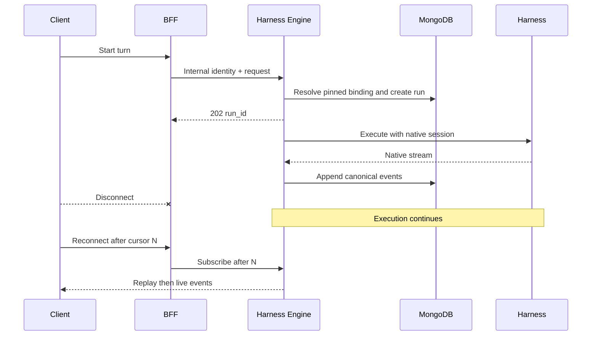
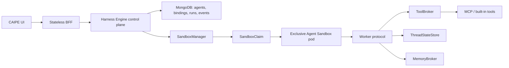

# Portable Harness Engine Abstractions

## Decision

Harness Engine is an independent control plane beside Dynamic Agents.

- It does not import or change `ai_platform_engineering/dynamic_agents/`.
- It owns complete portable agent blueprints and immutable versions.
- AgentCore and Claude Agent SDK implement one adapter contract.
- The Next.js BFF stays horizontally stateless.
- Harness Engine owns provider runs and durable session bindings.
- Local SDK harnesses must move from in-process execution to one exclusive
  sandbox pod per binding before production certification.

## Separate lifecycle concepts

Do not overload “session.” The engine uses five distinct resources:

| Resource | Lifetime | Purpose |
|---|---|---|
| `AgentRecord` | Until deleted | Mutable pointer to the current immutable version |
| `AgentVersion` | Immutable | Exact portable blueprint and validated catalog fingerprint |
| `SessionBinding` | Conversation epoch | Pins owner, conversation, agent version, harness profile, and native session |
| `RunRecord` | One turn | Disconnect-independent execution and status |
| `SandboxLease` | Active/idle binding | Exclusive isolated worker and workspace; target design |

This prevents an agent edit from changing an active thread. A new conversation
uses the current version; an existing binding continues with the version it
captured when it was created.

## Portable agent blueprint

`AgentBlueprint` is user-owned intent. It contains no provider resource ARN,
Kubernetes object, credential, command, image, environment map, or SDK client.

```yaml
id: agent-example
name: Example agent
description: Neutral example
harness:
  id: claude_agent_sdk
  profile_id: safe
  options:
    max_turns: 20
prompt:
  system: Be helpful to {{audience}}.
  variables:
    audience: users
  context_sources: []
model:
  policy: harness_default
tools:
  bindings: []
  approval_policy: sensitive_only
thread:
  persistence: durable
  retention_profile: standard
memory:
  enabled: false
workspace:
  persistence: none
streaming:
  protocol: canonical
  replay: required
delegation:
  agents: []
  max_depth: 1
  max_parallel: 1
limits:
  max_run_seconds: 900
  max_tool_calls: 50
```

Portable policy belongs here even when a provider offers a native version. The
adapter may implement a policy natively or the engine may emulate it, but the
meaning presented to the user remains stable.

## Harness descriptor and operator profiles

Every adapter returns a sanitized `HarnessDescriptor`:

- stable harness, adapter, and contract versions;
- `provider_managed`, `sandbox_pod`, or `in_process` execution placement;
- availability and experimental/certified/blocked status;
- operator-owned profile aliases;
- a bounded JSON Schema and presentation hints for safe options;
- a capability map.

Capability levels have precise meanings:

| Level | Meaning |
|---|---|
| `native` | The harness supplies the portable behavior directly |
| `emulated` | Harness Engine supplies equivalent behavior outside the harness |
| `unsupported` | The harness fundamentally cannot provide the behavior |
| `unavailable` | The contract permits it, but this deployment/adapter has not connected it |

Profiles separate operator policy from agent-author intent. For example, the
AgentCore profile resolves to an ARN/qualifier/region, while the Claude profile
resolves to an approved model, workspace root, and permission mode. The API and
browser receive the alias and description only.

## Adapter contract

An adapter has four responsibilities:

```python
class HarnessAdapter(Protocol):
    @property
    def descriptor(self) -> HarnessDescriptor: ...

    def evaluate(self, blueprint: AgentBlueprint) -> AdapterEvaluation: ...

    def initial_provider_session_id(self, binding_id: str) -> str | None: ...

    def stream(self, context: RunContext) -> AsyncIterator[CanonicalEventDraft]: ...
```

- `evaluate` validates and normalizes only safe harness options and declares the
  checkpoint strategy.
- `initial_provider_session_id` supports providers such as AgentCore that need a
  client-defined stable ID. It returns `None` for providers such as Claude that
  issue the native ID in their result.
- `stream` receives the validated blueprint, pinned binding, compiled prompt,
  message, and trace context. It emits canonical events only.
- Provider errors are translated to sanitized terminal events by the coordinator.

The AgentCore adapter sends the stable binding-derived `runtimeSessionId`. The
Claude SDK adapter stores `ResultMessage.session_id`, supplies it with `resume`
on the next turn, maps `TextBlock` to `content.delta`, and maps usage to
`usage.updated`. The SDK profile, not the draft, controls model, working
directory, and permission mode.

## Platform broker boundaries

SDK code must not directly own authorization, secrets, shared memory, or
Kubernetes lifecycle. These narrow interfaces make policy reusable:

| Interface | Responsibility |
|---|---|
| `ThreadStateStore` | Harness-native checkpoint blobs, compare-and-set heads, restore |
| `MemoryBroker` | Authorized long-term retrieval/write with scope and provenance |
| `SessionManager` | Binding identity, epochs, native session IDs, version pinning |
| `ToolBroker` | Authorization, approval, credential injection, invocation, audit |
| `SandboxManager` | Exclusive claim/lease, fencing, health, replacement, release |
| `PromptCompiler` | Portable variables/context into a rendered system prompt |
| `CanonicalEventSink` | Ordered durable events and replay cursors |
| `DelegationBroker` | Subagent invocation through the same authorization/run path |
| `TelemetrySink` | Low-cardinality spans/metrics without protected content |

Only `PromptCompiler`, session/event persistence, and the canonical run
coordinator are connected in the current slice. Descriptor capabilities mark
memory, portable tools, workspace leasing, and delegation as `unavailable` and
server validation blocks agents that request them. This is deliberate: an
experimental adapter must not claim a feature merely because its SDK has an API.

## Thread persistence, memory, and sessions

### Thread persistence

Short-term conversation state is binding-scoped and harness-native:

- AgentCore uses a stable `runtimeSessionId`.
- Claude uses the persisted SDK session ID through `resume`.
- Future local adapters write native checkpoint blobs through
  `ThreadStateStore`; pod files are only a cache.
- Clear creates a new binding epoch; old workers and state heads cannot attach
  to the new epoch.

### Long-term memory

Long-term memory is not conversation history. `MemoryPolicy` controls:

- user, agent, and organization read scopes;
- user or agent write scope;
- semantic, episodic-reference, and procedural kinds;
- bounded startup or on-demand retrieval;
- automatic/approval/disabled writes;
- operator-owned retention profiles.

`MemoryBroker` must authorize before retrieval/ranking and store provenance,
revision, content hash, source binding/run, and approval state. Memory cannot
grant tools, credentials, egress, sandbox policy, or broader memory scope.

### BFF versus Harness Engine state

The BFF remains stateless and replaceable. It authenticates/authorizes, exchanges
the request for an internal service call, starts a run, and proxies replay/live
events. Harness Engine stores sessions and owns provider tasks. A browser or BFF
disconnect removes only a subscriber; the run continues.



The current design survives client/BFF disconnects and supports cross-replica
event replay/session lookup with MongoDB. It does not yet take over an in-flight
SDK/provider call after the Harness Engine process itself dies.

## Canonical streaming and tracing

Adapters emit the canonical vocabulary:

- run start/completion/failure/cancellation;
- session update;
- content and reasoning deltas;
- tool start/completion and interrupts;
- subagent start/event;
- usage update.

The repository assigns a monotonic sequence. Clients reconnect with `after=N`
or `Last-Event-ID`; event storage, not an HTTP socket, is the source of truth.

The BFF accepts W3C `traceparent`; Harness Engine validates its exact shape,
stores it with the run, and passes it through the run context. The target
`TelemetrySink` spans auth, binding, sandbox acquisition, worker, provider,
state, memory, tool, subagent, event persistence, and stream delivery. Prompts,
messages, memory bodies, tool payloads, credentials, raw subjects, and provider
secrets must not be span attributes.

## Sandbox pod target architecture

Provider-managed AgentCore remains remote. Local harnesses—Claude SDK, Strands,
Deep Agents—should use `sandbox_pod`, not the API container.



Lease rules:

- one binding owns one claim-exclusive pod at a time;
- opaque binding labels contain no user/conversation text;
- reuse is allowed only for the same binding and healthy generation;
- each replacement increments a fencing generation;
- stale worker events, state writes, and tool requests are rejected;
- the worker receives scoped capabilities, never the user bearer token or raw
  provider/tool credentials;
- workspace persistence is explicit (`none`, `run`, or `thread`) and durable
  thread state remains outside the pod;
- warm-pool pods become exclusive when claimed and are destroyed or verifiably
  reset before any reassignment;
- RuntimeClass, image digest, service account, network policy, volumes, limits,
  TTL, and pool are operator profile settings—not agent form fields.

This follows the Kubernetes Agent Sandbox resource model: templates define
operator policy, claims allocate sandboxes, and warm pools reduce cold start.
Deep Agents' backend abstraction similarly separates ephemeral state from a
persistent store and supports composite routing by path.

## Agent creation UI contract

The browser never contains a provider switch statement for every field. The
flow is descriptor-driven:

1. `GET /api/v1/harnesses` returns descriptors and `catalog_revision`.
2. The editor shows Dynamic Agents unchanged plus available Harness Engine
   descriptors.
3. Selection exposes sanitized profiles.
4. Primitive safe options render from JSON Schema; complex resource pickers use
   first-party typed panels whose values remain schema-validated.
5. Common prompt/model/tool/thread/memory/workspace/stream/delegation values form
   one portable blueprint.
6. `POST /api/v1/agent-drafts/validate` normalizes the exact blueprint and returns
   field-addressable issues, effective capabilities, fingerprint, and catalog
   revision.
7. Save supplies the normalized blueprint and fingerprint. The server validates
   again against its current catalog and creates a new immutable version.

Server descriptors may supply data and JSON Schema only—never HTML, JavaScript,
module paths, commands, environment maps, images, secrets, or raw Kubernetes/
cloud resource identifiers.

The current UI implements catalog selection, profile selection, primitive schema
fields, server validation, and version save. Follow-up UI work must move
validation before the legacy Dynamic Agents write to prevent a partial dual-save,
add capability badges/diffs, memory controls, per-harness draft parking, and
typed complex panels.

## Persistence collections

| Collection | Content |
|---|---|
| `harness_agents` | Mutable current-version pointer and optimistic revision |
| `harness_agent_versions` | Immutable normalized blueprint, fingerprint, catalog revision |
| `harness_sessions` | Owner/conversation identity, pinned version, profile, provider session |
| `harness_runs` | Turn status, binding, trace correlation, event cursor |
| `harness_events` | Ordered canonical event log with TTL |

The initial Mongo save uses separate writes and is not transactionally atomic.
Production hardening should use a transaction or a recoverable publish protocol
so an immutable version and current pointer cannot diverge after a crash.

## Implemented and deferred

Implemented:

- independent service and collections;
- portable blueprint, descriptor, capability, validation, and adapter contracts;
- AgentCore and Claude Agent SDK adapters;
- immutable versions and session pinning;
- provider-native thread IDs and Claude resume;
- disconnect-independent execution, replay, ownership checks, sanitized errors;
- descriptor-driven UI options and BFF validation/save routes;
- Python adapter/API/E2E tests and UI component/BFF tests.

Deferred and reported as unavailable:

- sandbox pod worker protocol and `SandboxManager` implementation;
- portable ToolBroker, MemoryBroker, and DelegationBroker implementations;
- process-failure takeover of an in-flight call;
- clear/new-epoch API, interrupts, reasoning/tool translation breadth;
- full OpenTelemetry sink and provider trace links;
- atomic coordination with the existing Dynamic Agents authoring write;
- Strands/Deep Agents adapters and conformance certification.

## Research references

- [AgentCore runtime sessions](https://docs.aws.amazon.com/bedrock-agentcore/latest/devguide/runtime-sessions.html)
- [AgentCore Memory](https://docs.aws.amazon.com/bedrock-agentcore/latest/devguide/memory.html)
- [AgentCore harness memory](https://docs.aws.amazon.com/bedrock-agentcore/latest/devguide/harness-memory.html)
- [Claude Agent SDK Python](https://github.com/anthropics/claude-agent-sdk-python)
- [Claude tool use](https://platform.claude.com/docs/en/agents-and-tools/tool-use/how-tool-use-works)
- [Claude managed-agent concepts](https://platform.claude.com/docs/en/managed-agents/overview)
- [Deep Agents backends](https://docs.langchain.com/oss/python/deepagents/backends)
- [Deep Agents memory](https://docs.langchain.com/oss/python/deepagents/memory)
- [Kubernetes Agent Sandbox getting started](https://agent-sandbox.sigs.k8s.io/docs/getting_started/)
- [Kubernetes Agent Sandbox templates, claims, and warm pools](https://agent-sandbox.sigs.k8s.io/docs/)
