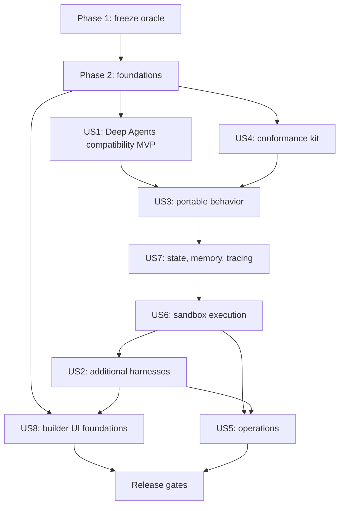

# Tasks: Harness Engine

**Input**: Design documents in `docs/docs/specs/2026-08-17-harness-engine/`
**Prerequisites**: [spec.md](./spec.md), [plan.md](./plan.md), [research.md](./research.md), [data-model.md](./data-model.md), [mongodb-migration.md](./mongodb-migration.md), [quickstart.md](./quickstart.md), and the contracts beginning with [rest-api-v1.md](./contracts/rest-api-v1.md)

**Tests**: Required. The specification makes unchanged compatibility tests, contract tests, conformance tests, isolation tests, and UI tests release gates. Test tasks precede the implementation they verify.

**Task format**: `[ID] [P?] [USn] Action in exact path — requirement(s); verifiable done condition`

- `[P]` means the task can run in parallel with adjacent `[P]` tasks because it changes different files and has no incomplete dependency.
- `[USn]` maps directly to User Story `n` in [spec.md](./spec.md).
- A task is complete only when its stated test or observable condition passes. Do not mark implementation tasks complete from code review alone.

## 2026-08-18 Implementation Amendment: Independent AgentCore Slice

This amendment supersedes any task below that edits `ai_platform_engineering/dynamic_agents/` for the first implementation slice. Those tasks remain future migration backlog only. The current release gate is zero changed paths under that package.

- [x] T117 Create the independent Python package, locked dependencies, and non-root container in `ai_platform_engineering/harness_engine/` — done when the service imports and its image has an isolated entrypoint.
- [x] T118 Add operator-owned AgentCore runtime aliases and reject arbitrary runtime identifiers in `src/harness_engine/config.py`, `models.py`, and `adapters/agentcore.py` — done when adapter tests prove the exact AWS request and bearer-token non-propagation.
- [x] T119 Add independent harness overlays, owned runs, ordered events, optimistic revisions, indexes, and TTL in `src/harness_engine/repository.py` — done for memory and Mongo repositories.
- [x] T120 Implement detached provider tasks and stable AgentCore `runtimeSessionId` ownership in `src/harness_engine/coordinator.py` — done when provider work is not scoped to an SSE request.
- [x] T121 Implement catalog, overlay, run, cancel, cursor replay, and SSE endpoints in `src/harness_engine/main.py` — done when internal credential and owner isolation tests pass.
- [x] T122 Add disconnect/replay E2E in `tests/test_disconnect_replay_e2e.py` — done when a run completes with no event subscriber and later replays from a cursor.
- [x] T123 Add stateless BFF proxies under `ui/src/app/api/harness-engine/` with internal-service authentication and existing OpenFGA/conversation checks — done when Jest proves the user bearer is not forwarded and `Last-Event-ID` resumes a subscription.
- [x] T124 Add browser run/replay/subscribe helpers in `ui/src/lib/harness-engine-session-client.ts` — done when the public client contract separates start from subscription.
- [x] T125 Add harness-first Agent Creation UI selection and AgentCore runtime alias fields in `DynamicAgentEditor.tsx`, persisting only an independent overlay — done when existing editor tests and the AgentCore conditional-field test pass.
- [x] T126 Document service boundaries, configuration, and disconnect semantics in `ai_platform_engineering/harness_engine/README.md` and update this plan — done when limitations distinguish client disconnect survival from engine-process failover.
- [x] T127 Add deployment manifests and production secret wiring for the independent service without placing it in the default first-install profile — `docker-compose.caipe-oss.yaml` adds the service only to the explicit preview overlay, keeps Dynamic Agents untouched, builds the additive UI from the branch, and validates against the upstream Compose file.
- [ ] T128 Add engine-process takeover/reconciliation for in-flight provider invocations — future reliability phase; browser/BFF disconnect survival is complete without it.
- [x] T129 Add stable provider thread identity plus validated W3C tracing storage/propagation for AgentCore runs — done when repeated conversation turns share a `runtimeSessionId` and the trace reaches the allowlisted runtime payload.
- [ ] T130 Add the provider-neutral long-term MemoryBroker with explicit user/agent/organization scopes — future phase after the AgentCore session slice.

## 2026-08-18 Harness Gateway Vertical Slice

- [x] T136 [US1] Persist an allowlisted `execution_harness_id` in the BFF-owned
  `dynamic_agents` record and default missing legacy records to Dynamic Agents —
  done when create/edit payloads retain the selected runtime without changing
  Dynamic Agents source.
- [x] T137 [US1] Implement deterministic target resolution in
  `ui/src/lib/harness-gateway.ts` — done when the selected marker routes to
  Harness Engine and missing/default markers preserve the existing DA proxy.
- [x] T138 [US3] Implement canonical-to-AG-UI and canonical-to-custom SSE
  translation in `ui/src/lib/harness-gateway.ts` — done when lifecycle and text
  frames are consumed unchanged by existing clients.
- [x] T139 [US1] Route the existing BFF start, invoke, cancel, and resume paths
  through Harness Gateway while preserving existing authentication, OpenFGA,
  and conversation checks — done without changes under
  `ai_platform_engineering/dynamic_agents/`.
- [x] T140 [US7] Add caller/agent/conversation-scoped active-run cancellation
  to Harness Engine without clearing the durable session binding — done when a
  follow-up run reuses the binding after cancellation.
- [x] T141 [US3] Add BFF compatibility coverage proving browser, Slack, and
  Webex AG-UI traffic routes through AgentCore and add Harness Engine cancel
  coverage — done when targeted Jest and pytest pass.
- [x] T142 Document the Harness Gateway boundary, routing marker, disconnect
  behavior, and current capability gates in the spec, plan, tasks,
  architecture, and Harness Engine README.
- [ ] T143 [US3] Add provider-neutral interrupt resume to the adapter contract
  and Harness Gateway — blocked as a capability for the initial adapters, not
  silently delegated to Dynamic Agents.
- [ ] T144 [US3] Add attachment normalization/storage references to Harness
  Engine — blocked as a capability for the initial adapters with explicit
  `HARNESS_CAPABILITY_UNSUPPORTED` responses.

**Current gate**: `git diff main...HEAD --name-only | rg '^ai_platform_engineering/dynamic_agents/'` produces no output; Harness Engine pytest/ruff, BFF Jest, editor Jest, ESLint, and TypeScript checks pass.

## Phase 1: Setup and Compatibility Freeze

**Purpose**: Establish a measurable Dynamic Agents oracle before changing runtime behavior.

- [ ] T001 [P] Capture the current generated OpenAPI document and route/status/header fixtures in `ai_platform_engineering/dynamic_agents/tests/contract/fixtures/` and add the snapshot test in `ai_platform_engineering/dynamic_agents/tests/contract/test_openapi_compatibility.py` — FR-001, FR-006; done when the unmodified service matches the committed baseline.
- [ ] T002 [P] Capture deterministic custom SSE and AG-UI golden frames for text, reasoning, tools, warnings, subagents, interrupts, resume, cancel, error, and finish in `ai_platform_engineering/dynamic_agents/tests/contract/fixtures/streams/` with replay tests in `ai_platform_engineering/dynamic_agents/tests/contract/test_stream_compatibility.py` — FR-002; done when current output passes byte-for-byte.
- [ ] T003 [P] Inventory current configuration fields, Mongo collections/indexes, cache keys, metrics, environment aliases, middleware outcomes, built-in tools, and error categories in `docs/docs/specs/2026-08-17-harness-engine/compatibility-matrix.md` — FR-001–FR-007; done when every row names a source path and baseline test ID.
- [ ] T004 [P] Add deterministic fake-model/tool benchmark scenarios and a baseline runner in `ai_platform_engineering/dynamic_agents/tests/performance/benchmark_compatibility.py` — NFR-001, NFR-002, NFR-005; done when it records first-response, total-turn, event, memory, and cleanup baselines.
- [ ] T005 Create `contract/`, `conformance/`, `integration/`, `performance/`, and `security/` test packages under `ai_platform_engineering/dynamic_agents/tests/` with shared neutral fixtures in `ai_platform_engineering/dynamic_agents/tests/fixtures/` — FR-007, NFR-004; done when pytest collects each package without collection errors.
- [ ] T006 [P] Record locked versions, licenses, transitive dependency diffs, network behavior, credential needs, and vulnerability review status for all four adapters in `docs/docs/specs/2026-08-17-harness-engine/research.md` — FR-011, FR-035; done when every adapter has an explicit enable/block decision.
- [ ] T007 Amend `.specify/ARCHITECTURE.md` to state that all agents execute through Harness Engine and Deep Agents/LangGraph is the default compatibility harness — plan architecture gate; done when no living-architecture statement requires every agent to be LangGraph-native.

**Checkpoint**: The current implementation is frozen as a black-box oracle; no runtime behavior has changed.

---

## Phase 2: Foundational Contracts and Persistence

**Purpose**: Add provider-neutral types, validation, persistence, and routes that block every execution story.

**Critical**: All remaining user-story phases depend on this phase.

- [ ] T008 [P] Add failing Pydantic compatibility tests for absent, valid, unknown, oversized, and unsafe `harness`/`memory` fields in `ai_platform_engineering/dynamic_agents/tests/contract/test_harness_models.py` — FR-005, FR-012–FR-015, FR-055–FR-057.
- [ ] T009 Implement `HarnessConfig`, `MemoryPolicy`, descriptor, capability, validation-report, session-binding, lease, and canonical-interrupt models in `ai_platform_engineering/dynamic_agents/src/dynamic_agents/models.py` — FR-005, FR-009–FR-015, FR-044, FR-051–FR-057; done when T008 passes and legacy documents serialize unchanged.
- [ ] T010 [P] Add canonical-event schema and lifecycle state-machine tests in `ai_platform_engineering/dynamic_agents/tests/contract/test_canonical_events.py` — FR-002, FR-016, FR-026, FR-029.
- [ ] T011 Implement the canonical event union and validator in `ai_platform_engineering/dynamic_agents/src/dynamic_agents/services/harnesses/events.py` — FR-026–FR-029; done when T010 rejects duplicate, late, malformed, oversized, out-of-order, and post-terminal events.
- [ ] T012 [P] Add adapter/runtime protocol contract tests in `ai_platform_engineering/dynamic_agents/tests/contract/test_harness_contract.py` — FR-016–FR-025, FR-030.
- [ ] T013 Implement immutable normalized inputs plus `HarnessAdapter` and `HarnessRuntime` protocols in `ai_platform_engineering/dynamic_agents/src/dynamic_agents/services/harnesses/contract.py` — FR-016–FR-025, FR-030; done when no protocol exposes FastAPI, Mongo collections, bearer headers, or wire encoders.
- [ ] T014 [P] Add registry, manifest-version, capability-level, certification, and partial-readiness tests in `ai_platform_engineering/dynamic_agents/tests/contract/test_harness_registry.py` — FR-008–FR-013, FR-035.
- [ ] T015 Implement the static allowlisted registry and capability validator in `ai_platform_engineering/dynamic_agents/src/dynamic_agents/services/harnesses/registry.py` and `ai_platform_engineering/dynamic_agents/src/dynamic_agents/services/harnesses/capability.py` — FR-008–FR-015; done when unsupported requirements fail before adapter construction and optional failures do not fail global readiness.
- [ ] T016 [P] Add repository/index/idempotency/rollback tests for `harness_sessions` and `harness_memories` in `ai_platform_engineering/dynamic_agents/tests/contract/test_harness_persistence.py` — FR-004, FR-017, FR-052–FR-057.
- [ ] T017 Implement Mongo collection handles, indexes, optimistic revisions, TTL behavior, and lazy creation in `ai_platform_engineering/dynamic_agents/src/dynamic_agents/services/mongo.py` and `ai_platform_engineering/dynamic_agents/src/dynamic_agents/services/session_store.py` — FR-004, FR-017, FR-044, FR-052–FR-057; done when T016 and the rollback-readability cases pass without backfill.
- [ ] T018 [P] Add catalog and validation REST contract tests in `ai_platform_engineering/dynamic_agents/tests/contract/test_harness_routes.py` — FR-009–FR-014, FR-069–FR-073.
- [ ] T019 Implement `GET /api/v1/harnesses`, `POST /api/v1/harnesses/validate`, and sanitized per-harness health in `ai_platform_engineering/dynamic_agents/src/dynamic_agents/routes/harnesses.py` — FR-009–FR-014, FR-069–FR-073; done when reports include request ID, catalog revision, payload fingerprint, stable field path, step ID, constraints, and data-only fixes.
- [ ] T020 Register additive harness routes and partial readiness in `ai_platform_engineering/dynamic_agents/src/dynamic_agents/main.py` and `ai_platform_engineering/dynamic_agents/src/dynamic_agents/routes/health.py` — FR-006, FR-035; done when existing route snapshots remain unchanged.
- [ ] T021 [P] Add harness feature flags, default resolution, adapter capacity, and compatibility aliases to `ai_platform_engineering/dynamic_agents/src/dynamic_agents/config.py` and `ai_platform_engineering/dynamic_agents/src/dynamic_agents/services/config.yaml` with tests in `ai_platform_engineering/dynamic_agents/tests/test_harness_config.py` — FR-005, FR-034–FR-037.
- [ ] T022 [P] Add stable harness/adapter/execution-mode labels and redaction guards to `ai_platform_engineering/dynamic_agents/src/dynamic_agents/metrics/agent_metrics.py` with tests in `ai_platform_engineering/dynamic_agents/tests/test_metrics_observability.py` — FR-033, FR-058–FR-060, NFR-007.
- [ ] T023 Run `.specify/scripts/bash/check-prerequisites.sh --json --require-tasks --include-tasks`, `uv run ruff check`, and the Phase 1–2 pytest targets from `ai_platform_engineering/dynamic_agents/` — all foundational requirements; done when the new contracts pass and the existing suite has no regression.

**Checkpoint**: Provider-neutral contracts and additive data/routes exist, but execution still uses the current runtime.

---

## Phase 3: User Story 1 — Replace Dynamic Agents Without Disruption (P1 MVP)

**Goal**: Execute existing agents through a `deepagents` compatibility adapter without changing clients, stored documents, streams, cache behavior, or rollback.

**Independent Test**: Run the entire unchanged Dynamic Agents suite and frozen black-box fixtures against the compatibility adapter with existing data and no harness backfill.

- [ ] T024 [P] [US1] Add failing legacy-agent, cache, restart, and rollback tests in `ai_platform_engineering/dynamic_agents/tests/conformance/test_deepagents_compatibility.py` — FR-004–FR-007.
- [ ] T025 [P] [US1] Add LangGraph-chunk-to-canonical-event golden tests in `ai_platform_engineering/dynamic_agents/tests/contract/test_deepagents_events.py` — FR-002, FR-026–FR-029.
- [ ] T026 [US1] Implement the compatibility adapter by delegating to the current `AgentRuntime` in `ai_platform_engineering/dynamic_agents/src/dynamic_agents/services/harnesses/deepagents_adapter.py` — FR-005, FR-007, FR-016–FR-025; done when it does not fork current behavior.
- [ ] T027 [US1] Implement LangGraph lifecycle translation in `ai_platform_engineering/dynamic_agents/src/dynamic_agents/services/harnesses/deepagents_events.py` — FR-002, FR-026–FR-029; done when T025 matches all frozen frames.
- [ ] T028 [US1] Add the common run/resume/cancel/restart lifecycle in `ai_platform_engineering/dynamic_agents/src/dynamic_agents/services/runtime_coordinator.py` — FR-001, FR-016–FR-018, FR-031–FR-032.
- [ ] T029 [US1] Refactor `ai_platform_engineering/dynamic_agents/src/dynamic_agents/services/runtime_cache.py` to cache `HarnessRuntime` objects while preserving keys, LRU, TTL, capacity, pending initialization, and shutdown behavior — FR-006, FR-034, NFR-005.
- [ ] T030 [US1] Extract canonical-to-custom-SSE and canonical-to-AG-UI encoders under `ai_platform_engineering/dynamic_agents/src/dynamic_agents/services/stream_encoders/` — FR-002, FR-026–FR-029; done when T002 remains byte-compatible.
- [ ] T031 [US1] Route start/invoke/resume/cancel/restart through the coordinator in `ai_platform_engineering/dynamic_agents/src/dynamic_agents/routes/chat.py` and provider-neutral interrupt operations in `ai_platform_engineering/dynamic_agents/src/dynamic_agents/routes/conversations.py` — FR-001–FR-003, FR-017–FR-018.
- [ ] T032 [US1] Preserve absent-harness read behavior in `ai_platform_engineering/dynamic_agents/src/dynamic_agents/services/mongo.py` without writing a backfill — FR-004–FR-005; done when reads resolve `deepagents` and stored BSON remains unchanged.
- [ ] T033 [US1] Add an explicit `in_process` compatibility/rollback switch in `ai_platform_engineering/dynamic_agents/src/dynamic_agents/config.py` and `charts/ai-platform-engineering/charts/dynamic-agents/values.yaml` — FR-006, FR-041; done when rollback changes execution mode without data migration.
- [ ] T034 [US1] Run the unchanged Dynamic Agents pytest suite plus contract and conformance suites from `ai_platform_engineering/dynamic_agents/` — SC-001, SC-002, SC-004; done with zero removed or weakened assertions.
- [ ] T035 [US1] Run `ai_platform_engineering/dynamic_agents/tests/performance/benchmark_compatibility.py` against baseline and adapter — NFR-001, NFR-002, NFR-005; done when p95 and memory gates pass.

**Checkpoint**: This is the first releasable MVP. Only Deep Agents is enabled, and external behavior is unchanged.

---

## Phase 4: User Story 4 — Add a Harness Without Rebuilding the Platform (P2)

**Goal**: Make adapter certification repeatable without changing common routes, persistence, security, or encoders.

**Independent Test**: Register a neutral fake adapter, run the conformance kit, then remove it without editing shared request routing or client code.

- [ ] T036 [P] [US4] Create neutral fake adapter/provider fixtures in `ai_platform_engineering/dynamic_agents/tests/fixtures/fake_harness.py` — FR-030–FR-032.
- [ ] T037 [P] [US4] Add parametrized lifecycle conformance tests in `ai_platform_engineering/dynamic_agents/tests/conformance/test_runtime_lifecycle.py` — FR-016–FR-018, FR-026–FR-032.
- [ ] T038 [P] [US4] Add capability, manifest, schema, version-skew, health, and cleanup conformance tests in `ai_platform_engineering/dynamic_agents/tests/conformance/test_adapter_manifest.py` — FR-009–FR-015, FR-030, FR-035.
- [ ] T039 [P] [US4] Add tool, file, skill, subagent, interrupt, cancellation, and error conformance fixtures in `ai_platform_engineering/dynamic_agents/tests/conformance/` — FR-018–FR-025, FR-031–FR-032.
- [ ] T040 [US4] Add a registry-only fake adapter in `ai_platform_engineering/dynamic_agents/src/dynamic_agents/services/harnesses/testing_adapter.py` gated to tests — FR-030; done when add/remove requires registry configuration only.
- [ ] T041 [US4] Implement evidence-derived certification calculation in `ai_platform_engineering/dynamic_agents/src/dynamic_agents/services/harnesses/capability.py` — FR-010–FR-011; done when adapters cannot self-declare `certified`.
- [ ] T042 [US4] Add adapter-specific pytest markers and protected live-provider certification jobs in `.github/workflows/ci-harness-conformance.yml` — FR-011, NFR-004; done when ordinary CI uses fakes and certification CI records live evidence.
- [ ] T043 [US4] Document the adapter authoring and certification workflow in `ai_platform_engineering/dynamic_agents/README.md` — FR-030–FR-032; done when a developer can add the fake adapter using only the published contract.

**Checkpoint**: A new adapter is bounded by contracts and evidence, not changes throughout the platform.

---

## Phase 5: User Story 3 — Same Chat Experience Across Harnesses (P1)

**Goal**: Centralize tools, delegation, approvals, skills, files, and policy so every adapter produces the existing client experience.

**Independent Test**: Replay the portable baseline with the fake and Deep Agents adapters and compare normalized events, authorization decisions, side effects, and interrupts.

- [ ] T044 [P] [US3] Add ToolBroker policy, credential isolation, retry, partial MCP, schema, approval, and result-bound tests in `ai_platform_engineering/dynamic_agents/tests/conformance/test_tool_broker.py` — FR-019–FR-020, FR-032.
- [ ] T045 [P] [US3] Add mixed-harness delegation, cycle, namespace, authorization, and nested-interrupt tests in `ai_platform_engineering/dynamic_agents/tests/conformance/test_delegation_broker.py` — FR-022, FR-027.
- [ ] T046 [P] [US3] Add portable attachment, skills, prompt context, middleware, and unsupported-content tests in `ai_platform_engineering/dynamic_agents/tests/conformance/test_portable_inputs.py` — FR-021, FR-023–FR-025.
- [ ] T047 [US3] Implement policy-preserving MCP and built-in execution in `ai_platform_engineering/dynamic_agents/src/dynamic_agents/services/tool_broker.py` by composing existing `mcp_client.py`, `builtin_tools.py`, and credential exchange — FR-019–FR-020, FR-032.
- [ ] T048 [US3] Implement mixed-harness subagent dispatch in `ai_platform_engineering/dynamic_agents/src/dynamic_agents/services/delegation_broker.py` — FR-022, FR-027; done when each child receives independent authz, credentials, capacity, namespace, and trace context.
- [ ] T049 [US3] Implement normalized prompt, skill, attachment, file, middleware, client-context, and user-context preparation in `ai_platform_engineering/dynamic_agents/src/dynamic_agents/services/runtime_coordinator.py` — FR-021, FR-023–FR-025.
- [ ] T050 [US3] Implement provider-neutral pending interrupt persistence and approve/edit/reject/form resume mapping in `ai_platform_engineering/dynamic_agents/src/dynamic_agents/services/session_store.py` — FR-017–FR-018.
- [ ] T051 [US3] Route Deep Agents tools and delegation through the common brokers in `ai_platform_engineering/dynamic_agents/src/dynamic_agents/services/harnesses/deepagents_adapter.py` — FR-019–FR-022; done when existing credential and workflow delegation tests remain unchanged.
- [ ] T052 [US3] Apply canonical size/order/sanitization bounds before wire encoding in `ai_platform_engineering/dynamic_agents/src/dynamic_agents/services/harnesses/events.py` — FR-028–FR-029, NFR-007.
- [ ] T053 [US3] Add client disconnect, cancellation-at-boundary, duplicate resume, and side-effect-race integration tests in `ai_platform_engineering/dynamic_agents/tests/integration/test_run_races.py` — FR-017–FR-018, FR-031–FR-032.
- [ ] T054 [US3] Run all portable conformance cases against `deepagents` and the fake adapter — SC-003, SC-005; done when normalized lifecycle and policy outcomes match.
- [ ] T055 [US3] Update `ai_platform_engineering/dynamic_agents/SSE_EVENTS.md` with canonical-to-existing-wire ownership while preserving the documented client contract — FR-002, FR-026–FR-029.

**Checkpoint**: Portable behavior is enforced by the engine and proven on two implementations.

---

## Phase 6: User Story 7 — Preserve Threads, Memory, and Traces (P1)

**Goal**: Make pods disposable without losing thread continuity, governed cross-thread memory, or causal observability.

**Independent Test**: Persist thread and user memory, replace worker/control-plane replicas, resume exactly, and verify one sanitized trace across every boundary.

- [ ] T056 [P] [US7] Add native-codec, durable-head, idempotency, interrupt-revision, restore-ownership, and uncertain-durability tests in `ai_platform_engineering/dynamic_agents/tests/conformance/test_thread_state.py` — FR-051–FR-054, NFR-011.
- [ ] T057 [P] [US7] Add user/agent/organization scope, authorization-before-search, provenance, approval, retention, conflict, injection, and deletion tests in `ai_platform_engineering/dynamic_agents/tests/conformance/test_memory.py` — FR-055–FR-057, NFR-012.
- [ ] T058 [P] [US7] Add W3C parentage, forged-context, baggage, redaction, provider-suppression, sampling, and collector-outage tests in `ai_platform_engineering/dynamic_agents/tests/conformance/test_tracing.py` — FR-058–FR-060, NFR-013–NFR-014.
- [ ] T059 [US7] Implement binding-scoped native state codecs, compare-and-set durable heads, and generation checks in `ai_platform_engineering/dynamic_agents/src/dynamic_agents/services/thread_state_store.py` — FR-052–FR-054.
- [ ] T060 [US7] Adapt existing LangGraph Mongo checkpoints to `ThreadStateStore` in `ai_platform_engineering/dynamic_agents/src/dynamic_agents/services/harnesses/deepagents_adapter.py` — FR-004, FR-052–FR-054; done when existing checkpoints resume without rewrite.
- [ ] T061 [US7] Implement commit ordering and explicit `uncertain_durability` handling in `ai_platform_engineering/dynamic_agents/src/dynamic_agents/services/runtime_coordinator.py` — FR-053, NFR-011; done when output-before-commit failures never auto-replay side effects.
- [ ] T062 [US7] Implement authorized scoped memory CRUD/search, optimistic revisions, provenance, retention, and approval in `ai_platform_engineering/dynamic_agents/src/dynamic_agents/services/memory_broker.py` — FR-055–FR-057.
- [ ] T063 [US7] Add narrow worker-facing state and memory facades in `ai_platform_engineering/dynamic_agents/src/dynamic_agents/routes/internal_state.py` and `ai_platform_engineering/dynamic_agents/src/dynamic_agents/routes/internal_memory.py` — FR-052–FR-057; done when binding/epoch/generation/authz are checked before storage access.
- [ ] T064 [US7] Implement ingress trace-context sanitation, internal propagation, span topology, baggage allowlist, redaction, sampling, and bounded export in `ai_platform_engineering/dynamic_agents/src/dynamic_agents/services/telemetry.py` — FR-058–FR-060.
- [ ] T065 [US7] Instrument authz, binding, coordinator, provider, state, memory, tools, subagents, validation, and encoding in `ai_platform_engineering/dynamic_agents/src/dynamic_agents/routes/chat.py` and common services — FR-058.
- [ ] T066 [US7] Add randomized worker/control-plane crash-point recovery tests in `ai_platform_engineering/dynamic_agents/tests/integration/test_state_recovery.py` — SC-014; done after at least 1,000 deterministic failure points with zero acknowledged state loss.
- [ ] T067 [US7] Add concurrent cross-scope memory isolation/conflict tests in `ai_platform_engineering/dynamic_agents/tests/integration/test_memory_isolation.py` — SC-015; done after at least 1,000 operations with zero unauthorized access or lost update.
- [ ] T068 [US7] Add full-topology trace and leak-canary tests in `ai_platform_engineering/dynamic_agents/tests/integration/test_trace_propagation.py` — SC-016–SC-017.
- [ ] T069 [US7] Implement the idempotent MongoDB index/collection migration and rollback verification described by `mongodb-migration.md` in `ai_platform_engineering/dynamic_agents/src/dynamic_agents/services/mongo.py` — FR-004, FR-052, FR-055.
- [ ] T070 [US7] Run thread, memory, trace, migration, and existing Deep Agents persistence suites from `ai_platform_engineering/dynamic_agents/tests/` — SC-014–SC-017; done when pod-local state is not required for any acknowledged durable outcome.

**Checkpoint**: External durable state, governed memory, and sanitized causal traces are ready for disposable workers.

---

## Phase 7: User Story 6 — Unique Sandbox Pods for Local Harness Sessions (P1)

**Goal**: Run each local harness conversation epoch in its own claim-exclusive Agent Sandbox pod with no raw credentials and generation fencing.

**Independent Test**: Run 1,000 concurrent bindings and prove unique claim/Sandbox/pod UIDs, isolation, recovery, credential absence, egress policy, and stale-worker rejection.

- [ ] T071 [P] [US6] Add worker protocol serialization, authentication, lifecycle, event, state, memory, tool, and cancellation tests in `ai_platform_engineering/dynamic_agents/tests/contract/test_sandbox_worker_protocol.py` — FR-043–FR-046.
- [ ] T072 [P] [US6] Add claim lifecycle, readiness, reuse, hibernation, eviction, expiry, reconciliation, and fencing tests in `ai_platform_engineering/dynamic_agents/tests/contract/test_sandbox_manager.py` — FR-042–FR-045, FR-048–FR-049.
- [ ] T073 [US6] Implement normalized run/resume/cancel and canonical streaming types in `ai_platform_engineering/dynamic_agents/worker/protocol.py` and the control-plane client in `ai_platform_engineering/dynamic_agents/src/dynamic_agents/services/worker_client.py` — FR-045.
- [ ] T074 [US6] Implement the single-binding worker host, health, cancellation, cleanup, and adapter loader in `ai_platform_engineering/dynamic_agents/worker/server.py` — FR-043, FR-045, FR-048.
- [ ] T075 [US6] Implement short-lived audience/binding/run/epoch/generation-scoped worker capabilities in `ai_platform_engineering/dynamic_agents/src/dynamic_agents/services/worker_auth.py` and worker verification in `ai_platform_engineering/dynamic_agents/worker/auth.py` — FR-044–FR-046.
- [ ] T076 [US6] Implement allowlisted static profile resolution in `ai_platform_engineering/dynamic_agents/src/dynamic_agents/services/sandbox_profiles.py` — FR-042, FR-047; done when agent/request data cannot choose Kubernetes objects or images.
- [ ] T077 [US6] Implement `SandboxClaim` creation, readiness, lease persistence, generation fencing, replacement, release, and orphan reconciliation in `ai_platform_engineering/dynamic_agents/src/dynamic_agents/services/sandbox_manager.py` — FR-042–FR-049.
- [ ] T078 [P] [US6] Add pinned Agent Sandbox dependency/configuration and profile values to `charts/ai-platform-engineering/Chart.yaml` and `charts/ai-platform-engineering/charts/dynamic-agents/values.yaml` — FR-041–FR-049.
- [ ] T079 [P] [US6] Add operator-owned SandboxTemplate/WarmPool manifests in `charts/ai-platform-engineering/charts/dynamic-agents/templates/sandbox-profiles.yaml` — FR-042, FR-047, FR-049.
- [ ] T080 [P] [US6] Add worker RBAC, service, default-deny NetworkPolicy, explicit ingress/egress, security context, resource/PID/ephemeral limits, and no-token settings in `charts/ai-platform-engineering/charts/dynamic-agents/templates/sandbox-security.yaml` — FR-046–FR-047.
- [ ] T081 [P] [US6] Add separately pinned Deep Agents, Claude SDK, and Strands worker images under `ai_platform_engineering/dynamic_agents/worker/images/` — FR-041–FR-042; done when each image contains one adapter and uses an immutable non-root runtime.
- [ ] T082 [US6] Route `deepagents` through the worker client and lease manager in `ai_platform_engineering/dynamic_agents/src/dynamic_agents/services/harnesses/deepagents_adapter.py`, retaining explicit in-process fallback — FR-041–FR-045, FR-048.
- [ ] T083 [US6] Add Kubernetes isolation, escape, egress, credential-canary, eviction, controller-outage, warm/cold readiness, and stale-generation tests in `ai_platform_engineering/dynamic_agents/tests/integration/sandbox/` — FR-043–FR-050, NFR-008–NFR-010.
- [ ] T084 [US6] Run `ai_platform_engineering/dynamic_agents/tests/integration/sandbox/` across 1,000 bindings and render `charts/ai-platform-engineering/charts/dynamic-agents/` — SC-010–SC-013; done when every local binding has distinct UIDs and old generations have zero accepted events, tools, or state writes.

**Checkpoint**: Deep Agents production execution is isolated per conversation epoch; the control plane contains no harness loop.

---

## Phase 8: User Story 2 — Select and Run Certified Harnesses Per Agent (P1)

**Goal**: Add Claude Agent SDK, Strands Agents, and AgentCore behind the same contracts and certify each independently.

**Independent Test**: Create equivalent agents for every enabled harness, validate capabilities, and execute the common conformance suite through unchanged clients.

- [ ] T085 [P] [US2] Add Claude SDK session-store, stream, tool, permissions/HITL, cancellation, and subprocess-cleanup conformance cases in `ai_platform_engineering/dynamic_agents/tests/conformance/test_claude_sdk_adapter.py` — FR-008, FR-016–FR-025.
- [ ] T086 [P] [US2] Add Strands session-repository, hooks, stream, tool, interrupts, cancellation, and cleanup cases in `ai_platform_engineering/dynamic_agents/tests/conformance/test_strands_adapter.py` — FR-008, FR-016–FR-025.
- [ ] T087 [P] [US2] Add AgentCore binding, deterministic remote-session, stream, inline-tool callback, IAM, timeout, cancel, clear, and collision cases in `ai_platform_engineering/dynamic_agents/tests/conformance/test_agentcore_adapter.py` — FR-008, FR-016–FR-025, FR-050.
- [ ] T088 [US2] Implement the Mongo-backed Claude SDK session codec/store and worker adapter in `ai_platform_engineering/dynamic_agents/worker/adapters/claude_sdk.py` — FR-017–FR-025, FR-052–FR-054.
- [ ] T089 [US2] Implement Claude SDK canonical translation, common ToolBroker facade, permission interrupts, scoped config directory, and cleanup in `ai_platform_engineering/dynamic_agents/worker/adapters/claude_sdk.py` — FR-018–FR-021, FR-026–FR-032.
- [ ] T090 [US2] Implement the Mongo-backed Strands session repository and worker adapter in `ai_platform_engineering/dynamic_agents/worker/adapters/strands.py` — FR-017–FR-025, FR-052–FR-054.
- [ ] T091 [US2] Implement Strands hooks/canonical translation, common tool facade, interrupts, cancellation, and cleanup in `ai_platform_engineering/dynamic_agents/worker/adapters/strands.py` — FR-018–FR-021, FR-026–FR-032.
- [ ] T092 [US2] Implement the provider-managed AgentCore adapter, deterministic opaque session binding, stream translation, inline ToolBroker callbacks, IAM boundary, timeout, cancel, and clear in `ai_platform_engineering/dynamic_agents/src/dynamic_agents/services/harnesses/agentcore_adapter.py` — FR-016–FR-032, FR-050.
- [ ] T093 [US2] Register all adapters disabled/experimental with bounded JSON Schemas and contextual capability declarations in `ai_platform_engineering/dynamic_agents/src/dynamic_agents/services/harnesses/registry.py` — FR-008–FR-015.
- [ ] T094 [US2] Partition pending initialization and active capacity by harness in `ai_platform_engineering/dynamic_agents/src/dynamic_agents/services/runtime_cache.py` — FR-034, FR-036–FR-037.
- [ ] T095 [US2] Add provider dependency/credential/model/region diagnostics with sanitized errors in `ai_platform_engineering/dynamic_agents/src/dynamic_agents/services/harnesses/registry.py` — FR-009, FR-012, FR-035.
- [ ] T096 [US2] Run the full conformance suite per adapter and record evidence/status in `docs/docs/specs/2026-08-17-harness-engine/compatibility-matrix.md` — FR-011, SC-003; unresolved rows must leave the adapter experimental or blocked.
- [ ] T097 [US2] Verify disabled/unhealthy adapter behavior and explicit no-silent-fallback policy in `ai_platform_engineering/dynamic_agents/tests/integration/test_harness_availability.py` — FR-035–FR-037, SC-005.

**Checkpoint**: Each non-default harness is independently available, experimental, blocked, or certified based on evidence.

---

## Phase 9: User Story 8 — Harness-Aware Agent Creation UI (P1)

**Goal**: Preserve the five-step editor while adapting models and fields to the selected harness without silent loss or unsafe browser authority.

**Independent Test**: Create, edit, and clone across every harness/catalog state; switch incompatible drafts; race catalog changes; and verify accessible blockers plus no partial writes.

- [ ] T098 [P] [US8] Add strict `HarnessConfig`, `HarnessDescriptor`, `FieldCapabilityReport`, `HarnessValidation`, and `AgentMemoryPolicy` types in `ui/src/types/dynamic-agent.ts` with serialization tests in `ui/src/types/__tests__/dynamic-agent-harness.test.ts` — FR-061–FR-073.
- [ ] T099 [P] [US8] Add BFF catalog/validation proxy tests in `ui/src/app/api/dynamic-agents/harnesses/__tests__/route.test.ts` and `ui/src/app/api/dynamic-agents/harnesses/validate/__tests__/route.test.ts` — FR-062, FR-064, FR-069–FR-073.
- [ ] T100 [P] [US8] Add exact-payload, unsafe-field, stale-revision, no-Mongo-write, and no-OpenFGA-mutation tests in `ui/src/app/api/dynamic-agents/__tests__/route-harness-validation.test.ts` — FR-067, FR-069–FR-070.
- [ ] T101 [US8] Implement sanitized catalog and draft-validation BFF proxies in `ui/src/app/api/dynamic-agents/harnesses/route.ts` and `ui/src/app/api/dynamic-agents/harnesses/validate/route.ts` — FR-062, FR-064, FR-069–FR-073.
- [ ] T102 [US8] Filter/annotate model results by `harness_id` while preserving an incompatible stored model in `ui/src/app/api/dynamic-agents/models/route.ts` — FR-063.
- [ ] T103 [US8] Extend the create/update mutable allowlist and strict validation for `harness` and `memory` in `ui/src/app/api/dynamic-agents/route.ts` and `ui/src/app/api/dynamic-agents/agents/[id]/route.ts` — FR-067–FR-070.
- [ ] T104 [US8] Implement authorize-normalize-revalidate-fingerprint-write-OpenFGA ordering in `ui/src/app/api/dynamic-agents/route.ts` and `ui/src/app/api/dynamic-agents/agents/[id]/route.ts` — FR-069–FR-070; done when T100 proves all invalid/stale paths perform zero partial mutation.
- [ ] T105 [P] [US8] Implement revisioned common draft state, per-harness transient option parking, and dirty snapshots in `ui/src/hooks/use-agent-draft.ts` with tests in `ui/src/hooks/__tests__/use-agent-draft.test.ts` — FR-065–FR-066, FR-071.
- [ ] T106 [P] [US8] Implement catalog/model loading with AbortController and request-sequence guards in `ui/src/hooks/use-harness-catalog.ts` with tests in `ui/src/hooks/__tests__/use-harness-catalog.test.ts` — FR-062–FR-063, FR-071.
- [ ] T107 [P] [US8] Implement debounced/immediate validation and fingerprint/report guards in `ui/src/hooks/use-harness-validation.ts` with tests in `ui/src/hooks/__tests__/use-harness-validation.test.ts` — FR-064, FR-069–FR-071.
- [ ] T108 [P] [US8] Implement accessible harness radio cards and catalog states in `ui/src/components/dynamic-agents/HarnessSelector.tsx` with tests in `ui/src/components/dynamic-agents/__tests__/HarnessSelector.test.tsx` — FR-062, FR-073–FR-074, NFR-015–NFR-016.
- [ ] T109 [P] [US8] Implement compatibility diff, explicit safe fixes, cancel/review behavior, and active-conversation confirmation in `ui/src/components/dynamic-agents/HarnessCompatibilityDialog.tsx` with tests in `ui/src/components/dynamic-agents/__tests__/HarnessCompatibilityDialog.test.tsx` — FR-065–FR-066, FR-072.
- [ ] T110 [P] [US8] Implement native/emulated/unsupported/unavailable badges and unified step/field issue navigation in `ui/src/components/dynamic-agents/HarnessCapabilityBadge.tsx` and `ui/src/components/dynamic-agents/CompatibilitySummary.tsx` — FR-064, FR-074.
- [ ] T111 [P] [US8] Implement portable memory controls in `ui/src/components/dynamic-agents/AgentMemoryPolicyEditor.tsx` — FR-068; done when only deployment-allowed scopes/policies/retention IDs can be selected.
- [ ] T112 [P] [US8] Implement read-only persistence and tracing summaries in `ui/src/components/dynamic-agents/ThreadPersistenceSummary.tsx` and `ui/src/components/dynamic-agents/ObservabilitySummary.tsx` — FR-068; done when no storage, sandbox, secret, or protected-content capture control exists.
- [ ] T113 [P] [US8] Implement first-party typed option panels and a static registry under `ui/src/components/dynamic-agents/harness-options/` — FR-067; done when JSON Schema bounds values and no server-provided executable UI is rendered.
- [ ] T114 [US8] Integrate harness-first selection and capability views into the existing five stable steps in `ui/src/components/dynamic-agents/DynamicAgentEditor.tsx` and preserve `ui/src/components/dynamic-agents/deep-linking.ts` IDs — FR-061–FR-068, FR-073–FR-074.
- [ ] T115 [US8] Extend editor component tests under `ui/src/components/dynamic-agents/__tests__/` for legacy default, filtered models, field states, blockers, unknown/unavailable harness, parked options, accessibility, and no silent reset — SC-018–SC-021.
- [ ] T116 [US8] Add create/edit/clone, active-conversation, switch-losslessness, optional-outage, and stale-catalog Playwright coverage in `ui/e2e/rbac/harness-agent-editor.spec.ts` — SC-019–SC-021; done when browser and BFF race scenarios pass.

**Checkpoint**: Builders can safely select a harness without changing the familiar editor or trusting client-side compatibility decisions.

---

## Phase 10: User Story 5 — Operate, Compare, and Roll Back Harnesses (P2)

**Goal**: Expose harness-aware health, telemetry, capacity, rollout, and containment without leaking sensitive data.

**Independent Test**: Run mixed traffic, inject one adapter/provider/controller/collector failure, and verify healthy harnesses continue while dashboards and errors identify the affected boundary.

- [ ] T117 [P] [US5] Add harness/adapter/version/execution/result/latency/token/tool/interrupt/capacity metrics tests in `ai_platform_engineering/dynamic_agents/tests/test_metrics_observability.py` — FR-033–FR-037.
- [ ] T118 [P] [US5] Add mixed-harness capacity, optional readiness, explicit fallback, timeout, and cleanup tests in `ai_platform_engineering/dynamic_agents/tests/integration/test_harness_operations.py` — FR-034–FR-037.
- [ ] T119 [US5] Implement bounded low-cardinality metrics and health/capacity projections in `ai_platform_engineering/dynamic_agents/src/dynamic_agents/metrics/agent_metrics.py` and `ai_platform_engineering/dynamic_agents/src/dynamic_agents/routes/health.py` — FR-033–FR-036.
- [ ] T120 [US5] Implement operator disable, per-harness admission, retryable capacity response, and fail-closed/explicit-fallback policy in `ai_platform_engineering/dynamic_agents/src/dynamic_agents/services/runtime_coordinator.py` — FR-034–FR-037.
- [ ] T121 [P] [US5] Add sanitized harness diagnostics to `ui/src/app/api/dynamic-agents/health/route.ts` and the existing admin runtime-health surface — FR-033–FR-036.
- [ ] T122 [P] [US5] Add Harness Engine operational values and alerts to `charts/ai-platform-engineering/charts/dynamic-agents/values.yaml` and `charts/ai-platform-engineering/charts/dynamic-agents/templates/` — FR-033–FR-037, NFR-008–NFR-014.
- [ ] T123 [US5] Document health, capacity, traces, sandbox lifecycle, adapter disable, rollback, and uncertain-durability response in `ai_platform_engineering/dynamic_agents/README.md` — FR-033–FR-037, FR-048, FR-053.
- [ ] T124 [US5] Run mixed-harness fault injection in `ai_platform_engineering/dynamic_agents/tests/integration/test_harness_operations.py` and verify one adapter failure causes zero failed runs or state leakage on healthy adapters — SC-005, SC-007.

**Checkpoint**: Operators can distinguish and contain every harness without inspecting sensitive content.

---

## Phase 11: Rollout, Hardening, and Release Gates

**Purpose**: Prove the complete design, rehearse rollback, and update living documentation before production cutover.

- [ ] T125 [P] Run `uv run ruff check` and the entire unchanged plus new pytest suite from `ai_platform_engineering/dynamic_agents/` — FR-007, NFR-004; done with no weakened tests and at least 80% new-code coverage/100% contract-state and security-decision coverage.
- [ ] T126 [P] Run `nvm use`, `npm run lint`, targeted Jest, Playwright harness-editor coverage, and `npm run build` from `ui/` — FR-061–FR-074, SC-018–SC-021.
- [ ] T127 [P] Render and validate `charts/ai-platform-engineering/charts/dynamic-agents/` CRDs/RBAC/NetworkPolicy/profiles/pools and run `docker-compose.yaml` compatibility smoke tests — FR-006, FR-041–FR-050.
- [ ] T128 Run `ai_platform_engineering/dynamic_agents/tests/performance/benchmark_compatibility.py` for compatibility latency, event translation, tracing overhead, warm/cold readiness, memory, and mixed-harness capacity — NFR-001–NFR-002, NFR-005, NFR-008, NFR-013.
- [ ] T129 Run `ai_platform_engineering/dynamic_agents/tests/security/` for authorization-before-provider, sandbox escape, credential canaries, cross-binding access, malformed events/context, SSRF, and telemetry leakage — NFR-003, NFR-007, NFR-009–NFR-010, SC-010–SC-017.
- [ ] T130 Rehearse migration/index creation, rolling upgrade, in-process rollback, Dynamic Agents image rollback, and additive-data readability using `docs/docs/specs/2026-08-17-harness-engine/mongodb-migration.md` and `quickstart.md` — SC-002, SC-008.
- [ ] T131 Implement and run shadow/canary controls in `ai_platform_engineering/dynamic_agents/src/dynamic_agents/config.py` and `charts/ai-platform-engineering/charts/dynamic-agents/values.yaml`, halting rollout on any compatibility/SLO gate — FR-036–FR-037, SC-001, SC-006.
- [ ] T132 [P] Update evidence links and every adapter status in `docs/docs/specs/2026-08-17-harness-engine/compatibility-matrix.md` — FR-011; no `planned` row may be called certified.
- [ ] T133 [P] Update `ai_platform_engineering/dynamic_agents/ARCHITECTURE.md`, `ui/src/components/dynamic-agents/ARCHITECTURE.md`, root `AGENTS.md`, and `.specify/CHANGELOG.md` to reflect the implemented boundaries — documentation constitution gate.
- [ ] T134 Execute every scenario in `docs/docs/specs/2026-08-17-harness-engine/quickstart.md` and record commands/results in the release PR — all success criteria.
- [ ] T135 Audit `docs/docs/specs/2026-08-17-harness-engine/compatibility-matrix.md` and confirm no service alias, public route, wire contract, existing collection, legacy field, or rollback artifact is removed; defer renaming/deletion to a separate spec — FR-001–FR-007, SC-004, SC-008.

**Final checkpoint**: Harness Engine can replace Dynamic Agents under the existing address, with Deep Agents compatibility proven, local sessions isolated, state/memory/traces durable and governed, optional adapters independently certified, UI creation safe, and rollback rehearsed.

---

## Dependencies and Execution Order

### Phase dependencies

- Phase 1 has no implementation dependency and must finish before runtime refactoring.
- Phase 2 blocks all user stories.
- US1 and US4 may begin in parallel after Phase 2, but portable-policy extraction requires both.
- US7 precedes US6 because disposable pods require external durable state and trace boundaries.
- US2 requires the worker/conformance paths from US4, US6, and US7.
- US8 type/catalog/BFF tasks can start after Phase 2; final per-harness UI/E2E certification waits for US2.
- US5 requires real worker and adapter signals from US6/US2.
- Phase 11 waits for every story selected for the release.

### Critical path

`T001–T023 → T024–T035 → T044–T055 → T056–T070 → T071–T084 → T085–T097 → T114–T116 → T125–T135`

### Safe parallel workstreams

- Contract snapshots, performance baseline, and supply-chain research: T001, T002, T004, T006.
- Canonical events, adapter protocols, registry tests, and persistence tests: T008, T010, T012, T014, T016, T018, T021, T022.
- Thread state, memory, and tracing test-first work: T056, T057, T058.
- Chart profiles/security and worker images: T078, T079, T080, T081 after protocol/profile contracts are stable.
- Adapter tests: T085, T086, T087; adapter implementations remain isolated by file.
- UI hooks/components: T105–T113 after shared types and BFF response contracts are stable.
- Final Python, UI, and deployment validation: T125, T126, T127.

## Implementation Strategy

### MVP: compatibility adapter only

1. Complete Phases 1 and 2.
2. Complete US1 through T035.
3. Ship behind the existing service alias with `deepagents` only and `in_process` rollback retained.
4. Stop and verify SC-001, SC-002, SC-004, and SC-006 before adding execution-plane risk.

### Incremental delivery

1. **Compatibility**: Deep Agents adapter and canonical events with no wire/data change.
2. **Portable policy**: Common tools, subagents, interrupts, inputs, state, memory, and tracing.
3. **Isolation**: Deep Agents in claim-exclusive sandbox pods.
4. **Harness expansion**: Claude SDK, Strands, and AgentCore land disabled/experimental and certify independently.
5. **Builder and operations**: Harness-aware editor, health, capacity, dashboards, and rollout controls.
6. **Replacement**: Canary, soak, rollback rehearsal, then production cutover under the existing alias.

## Completion Rules

- Write and observe each listed test fail before implementing its behavior.
- Do not mark an adapter `certified` until every applicable compatibility-matrix row links to passing evidence.
- Do not enable automatic fallback after a run may have produced output or side effects.
- Do not run a production local harness in-process after its sandbox profile is certified.
- Do not expose credentials, raw identities, arbitrary images/Kubernetes resources, or protected content to workers, agent configuration, UI, telemetry, or provider session IDs.
- Do not acknowledge durable completion before native state and the binding head are committed.
- Do not persist parked UI options, browser capability claims, or stale validation results.
- Preserve the original Dynamic Agents rollback path until Phase 11 completes.

---

## Phase 12: Independent Portable Abstraction Slice (Implemented)

This phase supersedes the earlier AgentCore-only overlay. It intentionally does
not complete or modify tasks targeting `ai_platform_engineering/dynamic_agents/`.

- [x] T136 Define provider-neutral `AgentBlueprint`, `HarnessDescriptor`, capability levels, validation results, sessions, runs, and canonical events in `ai_platform_engineering/harness_engine/src/harness_engine/models.py`.
- [x] T137 Define broker boundaries for thread state, memory, tools, sandboxes, prompts, delegation, and telemetry in `ai_platform_engineering/harness_engine/src/harness_engine/brokers.py`.
- [x] T138 Implement the registry, catalog revision, normalized fingerprint, profile validation, and required-capability rejection in `ai_platform_engineering/harness_engine/src/harness_engine/registry.py`.
- [x] T139 Refactor AgentCore to the portable adapter contract with operator profiles, native session persistence, sanitized descriptor, and canonical events.
- [x] T140 Add a Claude Agent SDK adapter with operator profiles, safe option schema, native SDK session resume, text/usage translation, and injected-query tests.
- [x] T141 Replace overlay persistence with independent immutable agent versions, durable session bindings, runs, and replay events in memory and Mongo repositories.
- [x] T142 Refactor run coordination to pin sessions to agent versions, compile prompts, own provider tasks after disconnect, update native session IDs, and sanitize failures.
- [x] T143 Add catalog, draft validation, full agent save/get, detached run, replay, and cancellation APIs without importing or editing Dynamic Agents.
- [x] T144 Refactor the CAIPE editor and BFF to consume descriptors, render primitive JSON-Schema options, validate drafts server-side, and save independent blueprints.
- [x] T145 Add AgentCore, Claude SDK, immutable-version/session, ownership, disconnect/replay, schema-driven UI, and BFF tests.
- [x] T146 Document the portable contracts, session/thread/memory model, sandbox-pod target, UI contract, current limitations, and research in `portable-abstractions.md` and the component README.
- [ ] T147 Move Harness Engine validation before the legacy Dynamic Agents write and provide atomic/recoverable dual-save coordination.
- [ ] T148 Implement claim-exclusive Agent Sandbox pods, worker fencing, external checkpoint state, and tool/memory broker capability tokens for local SDK harnesses.
- [x] T149 Implement `CAIPEAgentSessionManager` for binding identity, ownership, immutable version pinning, durable lookup, provider event persistence, clear, and epoch rotation.
- [x] T150 Implement the provider-specific `ProviderSessionManager` contract and AgentCore deterministic plus Claude event-assigned strategies.
- [x] T151 Add authorized session-clear API/BFF routes and tests proving active-run cancellation, owner isolation, provider close, new binding identity, and adoption of the current agent version after clear.
