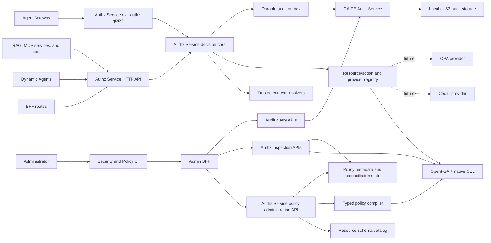
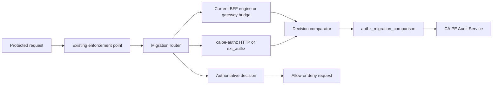
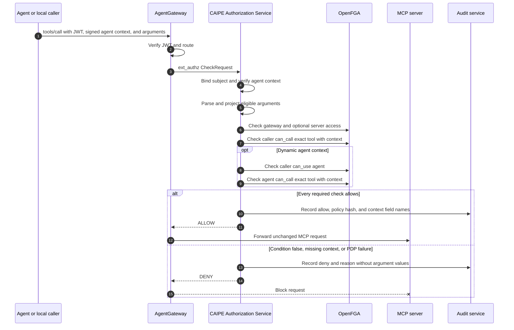

# CAIPE Authorization Service and Expression Policies

- **Status:** Draft for review
- **Date:** 2026-08-17
- **Scope:** One authorization service for CAIPE application and gateway
  enforcement, with exact MCP tool expressions as the first delivery slice.
- **Decision:** Extract authorization decisions from the BFF into the standalone
  `caipe-authz` service. Expose HTTP, batch HTTP, and Envoy `ext_authz` gRPC
  transports over one decision core. Use OpenFGA-native CEL in v1 and retain
  provider interfaces for future Cedar and OPA adapters.

## Executive Decision

CAIPE will use one logical CAIPE Authorization Service (`caipe-authz`, or Authz
Service) for every authorization enforcement point. `ext_authz` is a gateway
transport into the Authz Service; it is not a separate authorization service.

| Layer | Choice |
|---|---|
| Universal entry point | One standalone Authz Service |
| Application transport | HTTP and batch HTTP |
| Gateway transport | Envoy `ext_authz` gRPC |
| Relationship authorization | OpenFGA |
| Conditional expressions | OpenFGA-native CEL |
| Context construction | Authz Service |
| Policy authoring | Typed, versioned templates |
| Cedar | Future optional provider, not v1 |
| OPA | Future optional provider, not v1 |

The first expression policy supports cases such as:

> Members of `team:primary` may call `issue_tracker/create_item` only when
> `arguments.project_key` is one of `PRIMARY` or `SECONDARY`.

Administrators will build the expression from typed fields, operators, and
values. They will not submit executable CEL text.

At runtime:

1. An application calls the Authz Service over HTTP, or AgentGateway calls the
   same service over Envoy `ext_authz` gRPC.
2. The transport adapter produces the same canonical decision request.
3. The Authz Service binds the verified subject and constructs trusted identity,
   request, and resource context.
4. The `openfga-cel` provider asks OpenFGA to evaluate relationships and native
   CEL conditions in one Check request.
5. The Authz Service returns one normalized decision and audit record.
6. Missing, invalid, stale, or unavailable required input denies the request.

The design does **not** add `$expression` to the OpenFGA model, add a
`/condition-schema` endpoint to OpenFGA, or evaluate arbitrary policy text in
the Authz Service. Those would create a second policy language or require
maintaining an OpenFGA fork.

## Goals

- Authorize an exact MCP tool using selected request arguments.
- Use one Authz Service decision core for BFF, Dynamic Agents, RAG, bots, and
  AgentGateway.
- Run beside the current BFF engine and gateway bridge, then transfer authority
  one approved surface/resource/action cohort at a time.
- Remove policy decisions and direct OpenFGA access from the BFF and gateway
  bridge after migration.
- Keep transport-specific parsing outside provider evaluation.
- Preserve user, service-account, team, channel, and agent relationships.
- Keep OpenFGA as the Policy Decision Point (PDP).
- Define a provider contract that can add Cedar or OPA without changing Authz
  Service clients.
- Validate policy fields and values against the MCP tool input schema.
- Support a safe UI without exposing raw CEL authoring.
- Fail closed on missing context, schema drift, invalid types, and PDP errors.
- Audit policy changes and call-time decisions without logging tool secrets.
- Roll out without changing existing grants until an administrator explicitly
  replaces them with conditional grants.

## Non-Goals

- General-purpose scripting in authorization policies.
- Deny rules or negative relationship tuples.
- Argument mutation or output filtering.
- Business validation that belongs inside an MCP server.
- Replacing provider-side permissions, such as project-scoped credentials.
- Conditional wildcard policies in the first release.
- Conditional authorization for the separate RAG custom-tool `mcp_tool` type.
- Implementing Cedar, OPA, or a standalone CEL evaluator in v1.
- Allowing clients to choose a policy provider per request.
- Combining provider results with permissive `OR` semantics.

## Current State and Gap

The current bridge checks four possible gates:

- `user:<subject> can_call mcp_gateway:list`
- `user:<subject> can_use agent:<agent_id>`
- `agent:<agent_id> can_call tool:<server>/<tool>`
- Optionally, `user:<subject> can_call tool:<server>/<tool>`

The bridge parses the MCP body to obtain `params.name`, but it does not pass
`params.arguments` to OpenFGA. Check requests contain only `tuple_key`.
Per-tool checks are also currently gated by the agent-context HMAC configuration,
and the direct caller-to-tool check is controlled by a default-off rollout flag.

The deployed model has no conditions. The runtime resource is
`tool:<server>/<tool>`. The `mcp_tool` type has a different lifecycle and is
used for RAG custom-tool management.

Expression policies close this gap by adding request context to the exact tool
checks. They do not replace the coarse gateway, agent-use, or server gates.

## Policy Semantics

### Allow-only and monotonic

OpenFGA is allow-only. A conditional tuple adds an allow path when its condition
is true. It does not override another allow path.

For a tool call, the effective decision is:

```text
gateway_allow
AND optional_server_allow
AND agent_use_allow
AND agent_tool_allow(request_context)
AND caller_tool_allow(request_context)
```

The agent terms are omitted for a verified local context. Caller tool checking
is mandatory once expression enforcement is enabled.

### Broader grants still win

An unconditional exact grant, wildcard grant, or computed grant can make a
conditional policy ineffective. For example:

```text
team:primary#member caller tool:issue_tracker/*
```

already permits every issue-tracker tool. Adding a conditional exact grant for
`tool:issue_tracker/create_item` does not restrict the wildcard.

The policy API must therefore:

- Show every broader allow path that shadows a proposed expression.
- Reject `enforcement_mode: exclusive` while a conflicting direct wildcard or
  unconditional exact grant exists.
- Require the administrator to remove the broader grant before claiming that
  the expression is an exclusive restriction.
- Label a policy `ADDITIVE` when other valid allow paths remain.

OpenFGA graph evaluation can reveal transitive paths that a direct tuple read
cannot enumerate cheaply. The UI must call the effective-access simulator for
representative subjects and clearly state that group membership changes can
introduce new allow paths later.

### Management is not invocation

The target `tool` model separates operational control from runtime invocation:

```fga
type tool
  relations
    define caller: [user, service_account, team#member, team#admin, external_group#member, slack_channel, webex_space, agent]
    define conditional_caller: [
      user with string_argument_in_v1,
      service_account with string_argument_in_v1,
      team#member with string_argument_in_v1,
      team#admin with string_argument_in_v1,
      external_group#member with string_argument_in_v1,
      agent with string_argument_in_v1
    ]
    define manager: [user, service_account, team#admin]
    define can_call: caller or conditional_caller
    define can_manage: manager
```

Removing `can_manage` from `can_call` is deliberate. A principal may administer
a tool without being allowed to invoke it. Before this model change, existing
manager-derived invocation must be measured and replaced with explicit
`caller` tuples where compatibility is required.

## Expression Model

### Public representation

The UI and API use a versioned, declarative expression document:

```json
{
  "version": "1",
  "template": "string_argument_in",
  "field": "/project_key",
  "values": ["PRIMARY", "SECONDARY"]
}
```

Properties:

- `field` is an RFC 6901 JSON Pointer relative to `params.arguments`.
- `template` selects a reviewed policy shape.
- Literal values are data, never source code.
- The server canonicalizes ordering, Unicode, numbers, and JSON Pointers.
- A SHA-256 digest of the canonical expression identifies the policy revision.

### Initial template registry

| Template | Schema types | Meaning |
|---|---|---|
| `string_argument_equals` | `string` | Argument equals one configured value. |
| `string_argument_in` | `string` | Argument is in a configured allowlist. |
| `integer_argument_between` | `integer` | Argument is inside an inclusive range. |
| `boolean_argument_equals` | `boolean` | Argument equals the configured value. |
| `all_string_arguments_equal` | object with string properties | Every configured field equals its configured value. |
| `request_time_window` | server-derived timestamp | Current server time falls inside an absolute window. |

Each template owns:

- Its OpenFGA condition name and CEL expression.
- Accepted MCP JSON Schema types.
- Maximum field count and value count.
- Context projection rules.
- UI editor metadata.
- Test vectors for allow, deny, missing, and wrong-type inputs.

New operators require a reviewed source change and authorization-model release.
They are not created dynamically from UI input.

### Illustrative OpenFGA condition

```fga
condition string_argument_in_v1(
  field: string,
  allowed_values: list<string>,
  expected_schema_hash: string,
  schema_hash: string,
  string_arguments: map<string>
) {
  schema_hash == expected_schema_hash &&
  field in string_arguments &&
  string_arguments[field] in allowed_values
}
```

The exact CEL must be validated with the pinned OpenFGA version and committed
as both DSL and generated JSON. OpenFGA supports typed conditions and merges
tuple-persisted context with request-time context. Tuple-persisted values take
precedence, so the caller cannot replace `field` or `allowed_values`.

### Conditional tuple

```json
{
  "user": "team:primary#member",
  "relation": "conditional_caller",
  "object": "tool:issue_tracker/create_item",
  "condition": {
    "name": "string_argument_in_v1",
    "context": {
      "field": "/project_key",
      "allowed_values": ["PRIMARY", "SECONDARY"],
      "expected_schema_hash": "sha256:example"
    }
  }
}
```

The tuple contains administrator-controlled constants. The Check request
contains request-derived values:

```json
{
  "tuple_key": {
    "user": "user:example-user",
    "relation": "can_call",
    "object": "tool:issue_tracker/create_item"
  },
  "context": {
    "schema_hash": "sha256:example",
    "string_arguments": {
      "/project_key": "PRIMARY"
    }
  }
}
```

## Architecture



## Parallel Migration Architecture

`caipe-authz` is introduced beside today's BFF in-process engine and direct
OpenFGA gateway bridge. Deployment does not transfer decision authority. Each
existing enforcement point adds a deployment-controlled migration router that
can evaluate legacy and Authz Service paths and choose exactly one authoritative
result.



The migration router exists only at current enforcement boundaries:

- BFF authorization wrapper: current in-process engine plus Authz HTTP client.
- Dynamic Agents and other current BFF API consumers: existing endpoint remains
  stable while its BFF implementation runs the router.
- AgentGateway: current Python bridge adds an Authz shadow client before gateway
  traffic is routed directly to the Authz `ext_authz` listener.

### Migration modes

| Mode | Authoritative path | Comparison path | Purpose |
|---|---|---|---|
| `LEGACY` | Current implementation | None | Initial deployment and emergency rollback target |
| `SHADOW` | Current implementation | Authz Service | Measure semantic and latency parity without changing access |
| `CANARY` | Authz Service for selected cohort; legacy elsewhere | Non-authoritative path | Move bounded resource/action cohorts |
| `AUTHZ` | Authz Service | Legacy implementation | Confirm production behavior while rollback remains available |
| `AUTHZ_ONLY` | Authz Service | None | Remove legacy evaluator after exit criteria |

Routing configuration is versioned, deployment-owned, and keyed by enforcement
surface, resource type, action, optional exact resource allowlist, and a
deterministic cohort. A caller cannot select a mode, provider, or cohort through
headers, body, token claims, or request context.

### Comparison semantics

The router normalizes both results into the same decision contract and records:

- `ALLOW_DENY`: legacy allows and Authz denies.
- `DENY_ALLOW`: legacy denies and Authz allows.
- `ERROR_RESULT`: one path errors while the other returns a decision.
- `REASON_ONLY`: outcome matches but stable reason differs.
- `LATENCY`: outcome matches but latency exceeds the rollout threshold.

Shadow evaluation never changes the authoritative result. It also never writes
relationships, invokes a protected resource, or enables an expression policy.
Exactly one authoritative `authz_decision` event and at most one
`authz_migration_comparison` event are emitted for a request.

### Authority and fallback rules

- `LEGACY` and `SHADOW` preserve current production behavior exactly.
- In `CANARY`, cohort selection is deterministic for the same normalized
  subject, resource, action, and rollout revision.
- When Authz Service is authoritative, a legacy allow cannot override an Authz
  deny, error, timeout, or missing context.
- There is no per-request fallback. Rollback is an explicit, audited routing
  revision from `CANARY` or `AUTHZ` back to `SHADOW` or `LEGACY`.
- Routing rollback does not restore deleted tuples or broaden grants. Policy and
  routing changes are separate operations.
- Legacy code remains deployable until the cohort reaches `AUTHZ_ONLY` and its
  rollback retention window expires.

### Promotion gates

A cohort advances only when all gates pass:

- Contract and replay suites have zero unexplained allow/deny mismatches.
- Production shadowing has zero unexplained `ALLOW_DENY` or `DENY_ALLOW`
  mismatches for the approved observation window.
- Authz error, timeout, and latency objectives meet the surface-specific SLO.
- Audit comparison delivery, dashboards, and rollback have been exercised.
- OpenFGA store/model descriptors and context schemas match both paths.
- The cohort has an owner and an approved routing revision.

Promotion proceeds by enforcement surface and resource/action cohort, not by a
single global switch. Exact tool-expression enforcement starts only after that
tool's caller and agent checks are Authz-authoritative.

### Component ownership

| Component | Owns | Does not own |
|---|---|---|
| Security and Policy UI | Typed policy authoring, preview, effective-access warnings | CEL execution or authorization decisions |
| Authz Service transports | HTTP, batch HTTP, and `ext_authz` protocol adaptation | Provider-specific policy semantics |
| Authz Service decision core | Subject binding, canonical requests, context construction, provider selection, composition, reasons, audit | Business validation or provider credentials |
| Authz Service policy administration API | Authorization, schema validation, canonicalization, compilation, and reconciliation | Accepting arbitrary policy source |
| Audit outbox | Bounded durable buffering, batching, retry, and delivery status | Audit retention or authorization decisions |
| CAIPE Audit Service | Event ingestion, retention, local/S3 storage, querying, and export | Current authorization state or policy evaluation |
| Authz inspection API | Bounded model, relationship, policy, simulation, and graph projections | Rendering the graph or mutating through read APIs |
| Admin BFF and UI | Authorization visualization, audit timeline, filters, and investigation workflows | Direct OpenFGA access after migration |
| Migration router | Versioned mode/cohort selection, dual evaluation, authoritative result selection, and comparison event | Policy evaluation or caller-controlled routing |
| Decision comparator | Normalized mismatch classification and rollout telemetry | Changing the authoritative result |
| Resource Schema Catalog | Sanitized schemas, schema hashes, resource attributes, last-seen state | Access decisions |
| Typed Policy Compiler | Expression-to-template mapping and tuple construction | Arbitrary code execution |
| `openfga-cel` provider | OpenFGA relationship checks, conditional tuples, native CEL context | Standalone CEL execution |
| Cedar/OPA providers | Future policy evaluation behind the Authz Service provider contract | v1 production decisions |
| MCP server | Business validation and provider call | Trusting the gateway as its only security layer |

## CAIPE Authorization Service

### Extraction boundary

The current BFF-hosted authorization implementation becomes a client of
`caipe-authz`. The new service owns the reusable decision behavior currently
split between the BFF authorization library and the direct OpenFGA gateway
bridge:

- Canonical subject, action, resource, and context contracts.
- Subject binding and trusted-context construction.
- Action-to-relation and resource-to-object mapping.
- Active OpenFGA store and authorization-model descriptors.
- Check and BatchCheck execution.
- Policy-provider routing and restrictive composition.
- Stable reason codes, audit, metrics, timeouts, and bounded caches.

After migration, BFF routes do not import an in-process OpenFGA decision engine.
They call Authz Service HTTP or batch HTTP. The existing bridge is refactored
into the Authz Service `ext_authz` transport adapter and no longer contains an
independent decision implementation.

`caipe-authz` may run one binary with separate HTTP and gRPC listeners.
Production can scale the listeners in separate pools while deploying the same
artifact and decision core. This preserves one logical service without forcing
application and gateway traffic to share the same capacity or latency budget.

### Canonical decision contract

```json
{
  "subject": { "type": "user", "id": "example-user" },
  "action": "invoke",
  "resource": { "type": "tool", "id": "issue_tracker/create_item" },
  "context": {
    "request": {},
    "identity": {},
    "resource": {}
  }
}
```

Authz Service clients provide identifiers and advisory inputs. Only its
transport adapters and trusted resolvers may populate authoritative context:

- `identity`: verified token claims and signed workload or agent identity.
- `request`: method, route metadata, bounded MCP arguments, network, and server
  time derived from the request seen by the enforcement point.
- `resource`: schema hash, classification, tenant, ownership, and other values
  loaded from trusted catalogs.

Client-supplied advisory context may narrow a decision but must never create a
new allow. The Authz Service validates the canonical request against a registry keyed by
`(resource_type, action)` before invoking a provider.

### Transport adapters

| Transport | Callers | Contract |
|---|---|---|
| HTTP | BFF, Dynamic Agents, RAG, bots, internal services | `POST /v1/decisions` |
| Batch HTTP | List/filter operations and bulk UI checks | `POST /v1/decisions:batch` |
| Envoy gRPC | AgentGateway | `envoy.service.auth.v3.Authorization/Check` |

The gRPC adapter extracts trusted request data from Envoy's `CheckRequest`, then
calls the same internal decision function as HTTP. Transport adapters may map
responses and headers, but cannot change provider semantics.

### Policy provider contract

The internal provider interface is intentionally smaller than the public Authz
Service API:

```text
evaluate(canonical_request, trusted_context, policy_binding)
  -> ALLOW | DENY | INDETERMINATE
     + reason_code
     + policy/model revisions
     + bounded diagnostics
```

Providers are selected by server-owned policy bindings, never by an untrusted
request field.

| Provider | Status | Responsibility |
|---|---|---|
| `openfga-cel` | Required in v1 | ReBAC through OpenFGA plus native named CEL conditions |
| `cedar` | Future optional | Attribute policies and explicit `forbid` guardrails |
| `opa` | Future optional | Rego policies for approved cross-resource guardrails |

CEL is not a separate Authz Service provider in v1. CEL source is compiled into
reviewed OpenFGA named conditions and evaluated by OpenFGA. The Authz Service
must not embed a second general-purpose CEL runtime.

### Provider composition

The default pipeline contains only `openfga-cel`. A future binding may add an
approved Cedar or OPA guardrail. Composition is restrictive:

```text
final_allow = openfga_allow
              AND every_configured_guardrail_provider_allows
```

- `DENY` from any required provider denies.
- `INDETERMINATE`, timeout, invalid output, or provider outage denies.
- Providers are never combined with `OR`; an optional provider cannot broaden
  OpenFGA access.
- One versioned policy binding records provider order, revisions, schemas, and
  composition mode.
- Authz Service emits one result with provider-specific sub-decisions for explanation.

This contract does not commit v1 to operating Cedar or OPA. Adding either
requires a separate implementation proposal, threat model, conformance suite,
and operational readiness review.

## Audit Service Integration

### Ownership and event flow

The Authz Service is the authoritative producer of authorization events. A
transport adapter or provider returns bounded diagnostics to the decision core;
it does not emit an independent event. This prevents duplicate or contradictory
records for one decision.

The Authz Service emits five event families:

| Event type | Trigger |
|---|---|
| `authz_decision` | One canonical HTTP, batch-item, or `ext_authz` decision |
| `authz_migration_comparison` | One side-by-side legacy/Authz comparison, when both paths run |
| `authz_migration_revision` | A deployment activates a reviewed routing revision |
| `authz_policy_change` | Policy binding or typed template created, changed, disabled, or revalidated |
| `authz_relationship_change` | OpenFGA grant, revoke, migration, or reconciliation attempt |

Every event carries a generated `event_id` and `decision_id` or `operation_id`.
`correlation_id`, `trace_id`, resource reference, model ID, provider revision,
and policy-binding revision connect the authorization event to application and
gateway activity.

```json
{
  "event_type": "authz_decision",
  "decision_id": "example-decision-id",
  "correlation_id": "example-correlation-id",
  "subject_hash": "sha256:example",
  "action": "invoke",
  "resource_ref": "tool:issue_tracker/create_item",
  "transport": "ext_authz",
  "outcome": "deny",
  "reason_code": "DENY_EXPRESSION",
  "provider": "openfga-cel",
  "authorization_model_id": "example-model-id",
  "policy_binding_revision": "7",
  "template_id": "string_argument_in_v1",
  "context_fields": ["/project_key"],
  "duration_ms": 4.2
}
```

Events never contain bearer tokens, credentials, raw request bodies, tool
argument values, or raw CEL, Cedar, or Rego source. Context field names and
types may be recorded; values may not.

### Delivery and failure semantics

Runtime authorization does not synchronously depend on the remote Audit
Service:

1. The decision core appends one event to a bounded local durable outbox.
2. A worker batches events to `POST /v1/audit/events`.
3. Failed delivery retries with bounded exponential backoff.
4. Audit Service owns retention, local/S3 storage, queries, and exports.
5. Backlog age, dropped events, retry count, and outbox capacity are monitored.

A remote Audit Service outage does not change a decision while the local outbox
accepts the event. If the outbox cannot journal an allow, strict production mode
fails the request closed; a deny remains a deny. Policy and relationship
mutations are not reported successful until their mutation and durable outbox
record are committed or compensated.

Audit Service data is historical evidence. It must not be consulted to decide
current access; OpenFGA and the active policy binding remain authoritative.

## OpenFGA Visualization and Inspection

### Read architecture

The Admin UI retains its graph rendering and investigation workflow, but the
BFF no longer reads OpenFGA directly after Authz Service extraction. It calls
privileged, bounded inspection endpoints on `caipe-authz`:

```http
GET  /v1/admin/model
GET  /v1/admin/graph
GET  /v1/admin/relationships
GET  /v1/admin/policies/{resource_type}/{resource_id}
POST /v1/admin/check
POST /v1/admin/simulate
```

The BFF queries Audit Service separately for history and joins records by
`decision_id`, `operation_id`, `correlation_id`, resource reference, and
revision. The Authz Service never depends on Audit Service to build the current
graph.

### Visualization layers

| Layer | Authoritative source | Shows |
|---|---|---|
| Model | Active OpenFGA model descriptor | Object types, relations, permissions, and named conditions |
| Relationships | OpenFGA tuples | Direct grants, usersets, wildcards, and conditional relationships |
| Effective access | Bounded Authz Service checks | Derived subject/action/resource results and reason codes |
| Expressions | Policy metadata plus conditional tuples | Template, schema hash, condition version, drift, additive/exclusive status |
| History | CAIPE Audit Service | Decisions, grants, revocations, reconciliation, and policy changes over time |

Conditional graph edges expose only sanitized metadata:

```json
{
  "from": "team:primary#member",
  "to": "tool:issue_tracker/create_item",
  "relation": "conditional_caller",
  "condition": {
    "template": "string_argument_in_v1",
    "schema_hash": "sha256:example",
    "status": "ACTIVE"
  },
  "shadowed_by_broader_grant": false
}
```

The UI displays conditional-edge badges, additive/exclusive warnings, wildcard
shadowing, model and policy revisions, schema drift, and an audit timeline. A
simulation uses synthetic context and may call Check only; it never writes a
tuple or invokes the protected resource.

### Visualization security and scale

- Authz Service authorizes inspection and simulation requests before reading
  policy data.
- V1 graph/model access is limited to organization administrators and auditors.
- Every graph query, tuple inspection, simulation, and export is audited.
- Tuple reads and traversals are paginated, bounded, and explicitly marked
  `truncated` when incomplete.
- Sensitive tuple constants, subject labels, and policy literals are redacted
  according to the viewer's scope.
- Current graph state comes from OpenFGA, not from replaying audit events.
- Effective-access edges are labeled as derived results, not OpenFGA proof
  traces.

## Control Plane

### Tool schema catalog

Extend `mcp_tool_catalog` to retain a bounded, sanitized copy of each tool's
`inputSchema`, not only its hash.

Required fields:

```text
server_id
tool_id
input_schema
input_schema_hash
policy_eligible_fields[]
schema_status = ACTIVE | STALE | INVALID
last_seen_at
```

Only fields with supported scalar types are policy eligible. The catalog must
exclude or mark fields that are:

- Declared secret, credential, token, password, or binary input.
- Free-form bodies where policy comparison would expose sensitive content.
- Unbounded arrays or objects.
- Ambiguous unions without one stable scalar type.

Schema documents and policy values have explicit size limits. Schema discovery
never grants access.

### Policy metadata

MongoDB stores authoring and reconciliation metadata in
`tool_expression_policies`. OpenFGA remains authoritative for effective access.

```text
binding_key        sha256(subject + relation + tool_ref)
subject            canonical OpenFGA subject
tool_ref           exact tool:<server>/<tool>
expression         canonical declarative expression
expression_hash    sha256(canonical expression)
schema_hash        input schema version validated at save time
condition_name     reviewed OpenFGA condition template
condition_context  persisted constants written to the tuple
enforcement_mode   ADDITIVE | EXCLUSIVE
status             DRAFT | RECONCILING | ACTIVE | STALE_SCHEMA |
                   DISABLED | RECONCILE_FAILED
revision           optimistic concurrency value
created_by / updated_by / timestamps
```

There is at most one active policy per `(subject, exact tool)` tuple key.
Multiple alternatives belong inside a supported template, such as a string
allowlist. This matches OpenFGA tuple uniqueness.

### API surface

```http
GET    /api/admin/tool-expression-policies/schema?server_id=<id>&tool_id=<id>
GET    /api/admin/tool-expression-policies?server_id=<id>&tool_id=<id>
PUT    /api/admin/tool-expression-policies
DELETE /api/admin/tool-expression-policies
POST   /api/admin/tool-expression-policies/evaluate
```

`PUT` accepts:

```json
{
  "subject": "team:primary#member",
  "tool_ref": "tool:issue_tracker/create_item",
  "expression": {
    "version": "1",
    "template": "string_argument_in",
    "field": "/project_key",
    "values": ["PRIMARY"]
  },
  "enforcement_mode": "EXCLUSIVE",
  "expected_revision": 3
}
```

Authorization to save requires both:

- `can_manage` on the exact tool or organization-admin authority.
- Authority over the target subject, such as `can_manage` on the target team or
  agent.

The evaluate endpoint performs a Check with synthetic arguments. It never
invokes the MCP tool.

### Reconciliation ordering

Create:

1. Validate and canonicalize the expression.
2. Persist `RECONCILING` metadata with optimistic concurrency.
3. Write the conditional tuple with an explicit authorization model ID.
4. Read back the exact tuple and verify its condition and context.
5. Mark the metadata `ACTIVE` and emit an audit event.

Update:

1. Preserve the previous tuple and metadata for compensation.
2. Delete the old tuple.
3. Write and verify the replacement conditional tuple.
4. Restore the old tuple if replacement fails.
5. Surface `RECONCILE_FAILED` if compensation also fails.

OpenFGA identifies a tuple by `(user, relation, object)`, even when its condition
changes. Updating a condition is therefore a replacement, not an idempotent
write. A brief deny during replacement is acceptable; a temporary broader allow
is not.

Delete:

1. Delete and verify the OpenFGA tuple.
2. Mark metadata `DISABLED` or remove it according to retention policy.
3. Emit an audit event.

If OpenFGA is unavailable, the API returns a retriable failure and does not
claim that the policy is active or deleted.

## Data Plane

### Trusted context projection

The Authz Service `ext_authz` adapter parses only MCP `tools/call` requests. It converts eligible scalar
arguments into typed maps keyed by normalized JSON Pointer:

```json
{
  "string_arguments": { "/project_key": "PRIMARY" },
  "integer_arguments": { "/priority": 2 },
  "boolean_arguments": { "/dry_run": false },
  "request_time": "2026-08-17T20:00:00Z"
}
```

Rules:

- AgentGateway must provide the complete, non-truncated `tools/call` body to
  ext_authz within the configured size limit; an absent or truncated body denies.
- Identity comes only from a verified JWT or trusted AgentGateway metadata.
- Agent identity comes only from the verified HMAC-signed agent context.
- Time comes from the Authz Service clock, never the MCP payload.
- Only policy-eligible fields are projected.
- Objects, binaries, secrets, and unrestricted free text are not projected.
- Missing fields remain missing; defaults are not invented by the Authz Service.
- Duplicate JSON keys, invalid JSON, excessive depth, and oversized bodies deny.
- Context values are never copied from headers supplied by the end user.

The Authz Service maintains a bounded cache of policy-eligible field projections
and schema hashes. It refreshes them through an internal trusted resolver. Cache
expiry or an unavailable projection for a condition-dependent tool denies the
conditional path.

The Authz Service always sends every typed context map, using an empty map when no
eligible values were projected. This lets unconditional relationship paths
continue to evaluate while conditional paths return false instead of failing
because a map parameter is absent. It sends an empty `schema_hash` when no
trusted current hash is available; every argument template compares that value
with the tuple's persisted `expected_schema_hash` and therefore fails closed.

### Request sequence



### Exact tools and wildcards

Expression policies initially target exact objects only:

```text
tool:<server>/<tool>
```

The Authz Service must not describe a conditional deny as authoritative when a valid
wildcard allow exists. The control plane detects known wildcard conflicts before
save, and the audit record identifies the allow path as exact or wildcard.

Supporting an expression that restricts a server wildcard requires a separate
design because different tools expose different schemas.

## Schema Drift

Every policy pins the tool schema hash used for validation.

Every argument condition compares that persisted hash with the current trusted
hash sent by the Authz Service. A mismatch makes the condition false immediately,
independent of asynchronous reconciliation.

When a probe discovers a different schema hash:

1. Mark affected policies `STALE_SCHEMA`.
2. Stop publishing the previous hash in request context so the existing
   conditional tuple fails closed.
3. Show the field/type diff to an administrator.
4. Require explicit revalidation before writing a new active tuple.

The reconciler must not silently coerce a field from one type to another.

## Authorization Model Versioning

OpenFGA authorization models are immutable. Condition definitions and relation
type restrictions therefore require coordinated model activation.

- Condition names are versioned, such as `string_argument_in_v1`; their CEL and
  parameter types never change in place.
- A new model retains every condition version referenced by an active tuple.
- Model initialization records an active descriptor containing `store_id`,
  `authorization_model_id`, model SHA-256, and template-registry version.
- The policy API writes tuples using the descriptor's explicit model ID.
- Authz Service includes the same explicit model ID in Check requests.
- Authz Service keeps its previous descriptor until it recognizes the new
  template-registry version and can project every required context shape.
- A condition version is removed only after tuple reads prove that no stored
  tuple references it and its rollback retention window has expired.

Activation order is model, Authz Service compatibility, active descriptor, then policy
tuple. If any step fails, the previous descriptor remains active.

## Security Requirements

| Threat | Required control |
|---|---|
| Expression injection | No raw CEL input; compile only recognized templates. |
| Forged arguments | Parse the body received by AgentGateway; do not trust duplicate headers. |
| Forged identity | Verify JWT, issuer, audience, expiry, and signed agent context. |
| Missing policy input | Deny the conditional relationship. |
| Schema drift | Pin schema hash and fail closed until revalidated. |
| Secret leakage | Project only approved fields; never log argument values. |
| Expensive CEL | Keep templates below the configured OpenFGA evaluation-cost limit. |
| Broad grant shadowing | Detect and display unconditional exact, wildcard, and computed allows. |
| Policy tampering | Require revision checks, management authorization, and immutable audit events. |
| PDP outage | Deny and return a retriable authorization-unavailable reason. |
| Direct MCP access | Retain MCP-side authentication and business/provider authorization. |
| Disabled enforcement configuration | Expression enforcement readiness fails unless caller-tool checking and agent-context signing are enabled. |

Additional limits:

- Maximum 8 expression fields per policy.
- Maximum 100 allowlist values.
- Maximum 8 KiB tuple condition context, below OpenFGA's 32 KiB limit.
- Maximum 16 KiB projected Check context.
- Maximum JSON nesting depth of 8.
- Exact tool references only in the first release.

## Audit and Observability

Policy and relationship mutation events include:

- Event ID, operation ID, actor subject, and correlation/trace IDs.
- Target subject and exact tool reference.
- Provider, model, policy-binding, template, expression, and schema revisions.
- Before/after status.
- Reconciliation and compensation outcome.

Call-time decision events include:

- Decision ID, transport, caller type, hashed subject, agent ID when present,
  and exact tool reference.
- Checked gate and relation.
- Provider sub-decisions, model ID, policy-binding revision, template ID, and
  expression hash when known.
- Context field names and types, never values.
- `ALLOW`, `DENY_EXPRESSION`, `DENY_MISSING_CONTEXT`,
  `DENY_STALE_SCHEMA`, or `AUTHZ_UNAVAILABLE`.
- Traceparent and duration.

Metrics:

```text
caipe_tool_policy_decisions_total{outcome,reason,template}
caipe_tool_policy_context_projection_seconds
caipe_tool_policy_reconcile_total{outcome}
caipe_tool_policy_schema_stale_total
caipe_openfga_condition_check_seconds{template,outcome}
caipe_authz_audit_outbox_events{state}
caipe_authz_audit_outbox_oldest_seconds
caipe_authz_inspection_requests_total{operation,outcome}
caipe_authz_graph_response_nodes{layer,truncated}
```

Metric labels must not contain user IDs, tool arguments, or unbounded policy IDs.
Audit query and graph visualization latency are measured separately from the
authorization decision SLO.

## Availability and Performance

- Expression evaluation remains part of the existing OpenFGA Check; it does not
  add a second evaluator hop.
- Context projection targets less than 2 ms p95 in the Authz Service.
- HTTP and gRPC adapters have separate concurrency, timeout, and saturation
  metrics even when they share a deployment.
- `ext_authz` uses a bounded hot-path timeout and fails closed.
- The policy-schema cache is bounded and refreshed asynchronously.
- A cache miss for an unconditional tool does not block authorization.
- A cache miss required by a conditional policy fails closed.
- Remote audit delivery is outside the decision latency path after the event is
  journaled locally.
- Inspection, graph, audit query, and export traffic use separate concurrency
  limits from decision traffic.
- OpenFGA condition expressions stay under its configured CEL cost limit.

## Rollout

### Phase 0 - Freeze current behavior

- Inventory every current decision surface, flag, mapping, timeout, and owner.
- Freeze canonical contracts, reasons, neutral golden fixtures, and model
  descriptors.
- Preserve the BFF engine and bridge as comparison oracles.

No runtime path changes.

### Phase 1 - Deploy Authz dark

- Create HTTP, batch HTTP, and ext_authz listeners over one decision core.
- Add the openfga-cel provider, audit outbox, and deployment packaging.
- Use the current OpenFGA store/model descriptor; do not replicate tuples.
- Default every migration scope to LEGACY.

Starting or stopping Authz changes no authoritative decision.

### Phase 2 - Shadow the BFF

- Add a temporary migration router around the current BFF decision wrapper.
- Keep existing BFF/Dynamic Agents endpoints stable.
- Run Authz HTTP as the bounded non-authoritative path in SHADOW.
- Compare canonical outcomes, reasons, errors, revisions, and latency.

Do not remove the BFF evaluator.

### Phase 3 - Shadow AgentGateway

- Add an Authz shadow client to the current Python bridge.
- Forward a bounded copy of the Envoy CheckRequest to Authz.
- Preserve the bridge response as authoritative.
- Compare gateway, agent, server, exact-tool, body, and failure cases.

Do not point AgentGateway directly at Authz yet.

### Phase 4 - Promote bounded cohorts

- Promote one low-risk surface/resource/action scope to deterministic CANARY.
- Keep the non-authoritative path for comparison, never fallback.
- Exercise explicit CANARY to SHADOW routing rollback.
- Advance BFF, Dynamic Agents, RAG, bots, services, and gateway independently.
- Move a scope to AUTHZ only after all promotion gates pass.

### Phase 5 - Add OpenFGA conditions

- Add versioned conditions and conditional_caller additively.
- Add context-aware Check/BatchCheck and condition-preserving tuple operations.
- Deploy the model before writing any conditional tuple.
- Preserve existing unconditional behavior.

### Phase 6 - Add policy control plane

- Retain sanitized schemas/hashes and eligible JSON Pointer fields.
- Add typed templates, metadata, reconciliation, compensation, and drift.
- Add policy APIs/UI and additive/exclusive warnings.

### Phase 7 - Complete audit and visualization

- Deliver decision, migration, policy, and relationship events to Audit Service.
- Add bounded Authz model, relationship, graph, Check, and simulation APIs.
- Move BFF OpenFGA reads behind Authz.
- Add condition, revision, drift, shadowing, comparison, and history layers.

### Phase 8 - Shadow expression context

- Parse and project eligible MCP arguments without changing enforcement.
- Use byte-equivalent context for required caller and agent checks.
- Exercise missing, wrong-type, stale, malformed, and oversized cases.
- Verify that argument values never reach logs, events, or visualization.

### Phase 9 - Enforce one exact tool

- Require that the exact scope is already Authz-authoritative.
- Make caller tool checking and signed agent context mandatory for that scope.
- Remove conflicting broader grants only through explicit audited changes.
- Write and verify one conditional tuple for a low-risk non-bulk mutation.
- Enable expression enforcement for that exact resource/action only.

### Phase 10 - Retire legacy paths

- Enter AUTHZ_ONLY per cohort after its rollback-retention window.
- Point AgentGateway directly at Authz only after no bridge cohort needs legacy.
- Remove the BFF evaluator only after all BFF-backed consumers finish migration.
- Remove old flags and compatibility code in separate reviewable changes.

### Phase 11 - Future providers

- Evaluate broader templates, Cedar, or OPA only in separate approved proposals.
- Require policy lifecycle, data synchronization, restrictive composition,
  sandboxing, operations, and conformance designs before implementation.

## Rollback

Routing rollback:

- Apply an audited revision from CANARY or AUTHZ to SHADOW or LEGACY.
- Verify authoritative-path metrics and preserve comparison evidence.
- Do not change tuples, policy metadata, or grants.
- Never perform per-request fallback from Authz to a legacy allow.

Expression-policy rollback:

- Disable policy authoring while leaving unused model conditions in place.
- Delete the selected conditional tuple to revoke its grant.
- Restore an unconditional grant only through a separate audited action.
- Re-enable an older model only if every referenced tuple remains compatible.

Neither rollback may use the unsafe RBAC bypass.

## Implementation Touchpoints

| Area | Expected change |
|---|---|
| `ai_platform_engineering/authz/` | Decision core, HTTP/batch APIs, `ext_authz` gRPC adapter, trusted context, provider registry, audit outbox, and inspection APIs. |
| `ai_platform_engineering/audit_service/` | Accept normalized `authz_*` events; retain existing local/S3 query and export ownership. |
| `caipe-authz` Helm chart and Compose service | Deployment, health, listener, OpenFGA, timeout, and scaling configuration. |
| `deploy/openfga/model.fga` | Add conditions, `conditional_caller`, and invocation/management separation. |
| `charts/ai-platform-engineering/charts/openfga/authorization-model.json` | Generated model parity. |
| `deploy/openfga/bridge/main.py` | Migrated into Authz Service `ext_authz`; retained temporarily for shadow comparison, then removed. |
| `ui/src/lib/authz/` | Replace in-process engine with Authz Service HTTP and batch client. |
| `ui/src/app/api/authz/v1/` | Compatibility facade or direct Authz Service proxy during migration. |
| `ui/src/lib/rbac/openfga.ts` | Move runtime decision behavior to Authz Service; retain only transitional/admin helpers. |
| `ui/src/lib/rbac/rebac-graph.ts` | Move OpenFGA graph projection behind Authz inspection APIs; retain UI-facing graph types as needed. |
| `ui/src/app/api/admin/openfga/` | Replace direct OpenFGA reads with authenticated Authz Service inspection clients. |
| `ui/src/components/admin/rebac/` | Render conditional edges, policy/model revisions, shadowing, drift, and audit timeline. |
| `ui/src/lib/audit/` | Rename legacy `cas_*` events and sources to normalized `authz_*` contracts. |
| `ui/src/lib/rbac/mcp-tool-catalog.ts` | Sanitized schema, eligible fields, and schema drift. |
| `ui/src/lib/rbac/tool-expression-policy.ts` | Canonical expression, compiler, validation, and reconciliation. |
| `ui/src/app/api/admin/tool-expression-policies/` | Policy CRUD, schema, and dry-run evaluation. |
| Admin Security and Policy UI | Typed policy builder and effective-access warnings. |
| Authz Service, bridge, and RBAC tests | Transport conformance, parity, condition, context, shadowing, drift, and fail-closed coverage. |

## Required Test Matrix

| Case | Expected result |
|---|---|
| Allowed string value | Allow. |
| Different string value | Deny expression. |
| Missing required argument | Deny missing context. |
| Wrong argument type | Deny invalid context. |
| Malformed or duplicate-key JSON | Deny invalid request. |
| Stale schema hash | Deny stale schema. |
| Conditional team userset | Member allows only when expression is true. |
| Agent condition true, caller condition false | Deny. |
| Caller condition true, agent condition false | Deny. |
| Existing unconditional exact grant | Allow, with shadowing warning. |
| Existing wildcard grant | Allow, with shadowing warning. |
| OpenFGA unavailable | Fail closed with retriable reason. |
| Policy update write failure | Restore prior tuple or report reconcile failure. |
| Sensitive argument present | Value is not projected or logged. |
| CEL-like text submitted as a value | Treated as data; never executed. |
| Same canonical request over HTTP and gRPC | Same provider request, result, and reason. |
| Client requests `cedar` or `opa` provider | Rejected; provider selection is server-owned. |
| Configured required provider is unavailable | Deny with bounded `AUTHZ_UNAVAILABLE` reason. |
| Equivalent HTTP and gRPC decision | Exactly one correlated `authz_decision` event. |
| Remote Audit Service unavailable | Decision continues after local journal; outbox retries and reports degraded delivery. |
| Audit outbox cannot journal allow in strict mode | Deny before forwarding. |
| Graph request exceeds bounds | Paginated or truncated response; decision traffic remains unaffected. |
| Unauthorized graph or simulation request | Deny and audit the attempt. |
| Conditional graph edge | Sanitized template and revision shown; argument values absent. |
| Audit timeline selection | Events correlate by decision/operation/resource revision. |

End-to-end tests must run against the pinned OpenFGA image, not only mocks.

## Acceptance Criteria

- An administrator can create a typed exact-tool expression without writing CEL.
- BFF and AgentGateway use the same Authz Service decision core through different
  transports.
- Deploying Authz in `LEGACY` changes no authoritative result.
- BFF and gateway can run in `SHADOW` independently, and shadow errors cannot
  change the legacy result.
- A deterministic canary can be promoted and explicitly rolled back without
  mutating policies or tuples.
- Once Authz is authoritative, no legacy allow overrides its deny or error.
- A matching request is allowed and a non-matching request is blocked before the
  MCP server receives it.
- The same context constrains both caller and dynamic-agent tool grants.
- Missing fields, wrong types, stale schemas, and PDP failures deny.
- Missing request bodies, caller-tool enforcement, or agent-context signing
  configuration prevents expression enforcement from reporting ready.
- The UI cannot claim an exclusive restriction while a known broader allow path
  remains.
- OpenFGA remains the only runtime expression evaluator.
- Effective tuples and conditions can be inspected and explained operationally.
- Audit records contain policy identity and outcomes but no argument values.
- Each canonical decision emits exactly one correlated audit event through the
  durable outbox.
- Audit Service outage does not add a remote network dependency to decision
  latency while the local outbox is healthy.
- The Admin UI visualizes current model, relationship, effective-access, and
  expression layers through Authz Service inspection APIs.
- Audit history can be overlaid without treating historical events as current
  authorization state.
- Cedar and OPA are disabled in v1 and cannot be selected by a caller.

## Alternatives Considered

| Alternative | Decision | Reason |
|---|---|---|
| Native named OpenFGA conditions with typed CAIPE templates | Selected | One PDP, typed inputs, bounded CEL, no arbitrary eval. |
| Standalone Authz Service with HTTP and `ext_authz` adapters | Selected | One logical decision service without putting BFF on the gateway hot path. |
| Parallel `LEGACY`/`SHADOW`/`CANARY` migration by bounded cohort | Selected | Preserves current behavior, produces parity evidence, and limits rollback scope. |
| Big-bang replacement of BFF and gateway authorization | Rejected | Transfers access authority without production parity evidence or bounded rollback. |
| A second OpenFGA store for migration | Rejected for v1 | Tuple replication lag would obscure decision-semantic comparisons. |
| Automatic per-request fallback to a legacy allow | Rejected | Can turn Authz deny/error into allow and hide regressions. |
| Keep Authz Service inside BFF and route gateway through BFF | Rejected | Couples data-plane availability and latency to the UI/BFF deployment. |
| Keep BFF-hosted authorization and direct OpenFGA bridge indefinitely | Rejected target state | Preserves two decision implementations and semantic drift. |
| Cedar or OPA in v1 | Deferred | Requires a second policy lifecycle, conformance semantics, and operational ownership. |
| Raw CEL stored per tuple as `$expression` | Rejected | OpenFGA does not evaluate a stored expression string; unsafe authoring surface. |
| Dynamically generate an OpenFGA model for every expression | Deferred | Global immutable model churn, condition-name growth, and difficult rollback. |
| Evaluate CEL directly in Authz Service | Rejected | Creates a second PDP and duplicated policy semantics. |
| Fork OpenFGA and add `/condition-schema` | Rejected | Long-term maintenance and compatibility burden. |
| Enforce only inside each MCP server | Rejected as the platform design | Duplicates enforcement; retained as defense in depth for business constraints. |

## References

- [OpenFGA conditions](https://openfga.dev/docs/modeling/conditions)
- [OpenFGA MCP authorization](https://openfga.dev/docs/modeling/agents/mcp-authorization)
- [OpenFGA Check API](https://openfga.dev/docs/getting-started/perform-check)
- [Envoy external authorization](https://www.envoyproxy.io/docs/envoy/latest/configuration/http/http_filters/ext_authz_filter.html)
- [Cedar authorization](https://docs.cedarpolicy.com/auth/authorization.html)
- [OPA policy language](https://www.openpolicyagent.org/docs/policy-language)
- CAIPE RBAC architecture: `docs/docs/security/rbac/architecture.md`
- CAIPE RBAC workflows: `docs/docs/security/rbac/workflows.md`
- CAIPE agent context: `docs/docs/security/agent-context-hmac.md`
