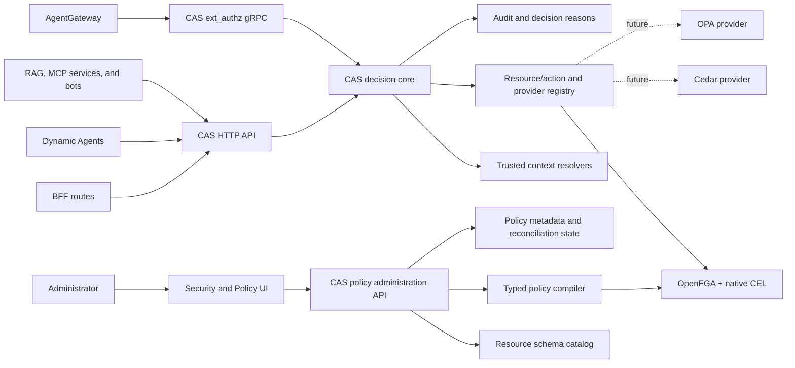
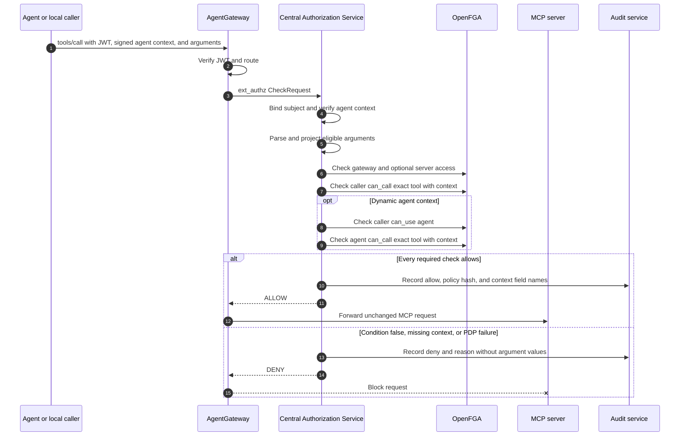

# Central Authorization Service and Expression Policies

- **Status:** Draft for review
- **Date:** 2026-08-17
- **Scope:** One authorization service for CAIPE application and gateway
  enforcement, with exact MCP tool expressions as the first delivery slice.
- **Decision:** Extract CAS from the BFF into a standalone microservice. Expose
  HTTP, batch HTTP, and Envoy `ext_authz` gRPC transports over one decision
  core. Use OpenFGA-native CEL in v1 and retain provider interfaces for future
  Cedar and OPA adapters.

## Executive Decision

CAIPE will use one logical Central Authorization Service (CAS) for every
authorization enforcement point. `ext_authz` is a gateway transport into CAS;
it is not a separate authorization service.

| Layer | Choice |
|---|---|
| Universal entry point | One standalone CAS |
| Application transport | HTTP and batch HTTP |
| Gateway transport | Envoy `ext_authz` gRPC |
| Relationship authorization | OpenFGA |
| Conditional expressions | OpenFGA-native CEL |
| Context construction | CAS |
| Policy authoring | Typed, versioned templates |
| Cedar | Future optional provider, not v1 |
| OPA | Future optional provider, not v1 |

The first expression policy supports cases such as:

> Members of `team:primary` may call `issue_tracker/create_item` only when
> `arguments.project_key` is one of `PRIMARY` or `SECONDARY`.

Administrators will build the expression from typed fields, operators, and
values. They will not submit executable CEL text.

At runtime:

1. An application calls CAS over HTTP, or AgentGateway calls the same CAS over
   Envoy `ext_authz` gRPC.
2. The transport adapter produces the same canonical decision request.
3. CAS binds the verified subject and constructs trusted identity, request, and
   resource context.
4. The `openfga-cel` provider asks OpenFGA to evaluate relationships and native
   CEL conditions in one Check request.
5. CAS returns one normalized decision and audit record.
6. Missing, invalid, stale, or unavailable required input denies the request.

The design does **not** add `$expression` to the OpenFGA model, add a
`/condition-schema` endpoint to OpenFGA, or evaluate arbitrary policy text in
CAS. Those would create a second policy language or require maintaining an
OpenFGA fork.

## Goals

- Authorize an exact MCP tool using selected request arguments.
- Use one CAS decision core for BFF, Dynamic Agents, RAG, bots, and
  AgentGateway.
- Remove policy decisions and direct OpenFGA access from the BFF and gateway
  bridge after migration.
- Keep transport-specific parsing outside provider evaluation.
- Preserve user, service-account, team, channel, and agent relationships.
- Keep OpenFGA as the Policy Decision Point (PDP).
- Define a provider contract that can add Cedar or OPA without changing CAS
  clients.
- Validate policy fields and values against the MCP tool input schema.
- Support a safe UI without exposing raw CEL authoring.
- Fail closed on missing context, schema drift, invalid types, and PDP errors.
- Audit policy changes and call-time decisions without logging tool secrets.
- Roll out without changing existing grants until an administrator explicitly
  replaces them with conditional grants.

## Non-Goals

- General-purpose scripting in authorization policies.
- Deny rules or negative relationship tuples.
- Argument mutation or output filtering.
- Business validation that belongs inside an MCP server.
- Replacing provider-side permissions, such as project-scoped credentials.
- Conditional wildcard policies in the first release.
- Conditional authorization for the separate RAG custom-tool `mcp_tool` type.
- Implementing Cedar, OPA, or a standalone CEL evaluator in v1.
- Allowing clients to choose a policy provider per request.
- Combining provider results with permissive `OR` semantics.

## Current State and Gap

The current bridge checks four possible gates:

- `user:<subject> can_call mcp_gateway:list`
- `user:<subject> can_use agent:<agent_id>`
- `agent:<agent_id> can_call tool:<server>/<tool>`
- Optionally, `user:<subject> can_call tool:<server>/<tool>`

The bridge parses the MCP body to obtain `params.name`, but it does not pass
`params.arguments` to OpenFGA. Check requests contain only `tuple_key`.
Per-tool checks are also currently gated by the agent-context HMAC configuration,
and the direct caller-to-tool check is controlled by a default-off rollout flag.

The deployed model has no conditions. The runtime resource is
`tool:<server>/<tool>`. The `mcp_tool` type has a different lifecycle and is
used for RAG custom-tool management.

Expression policies close this gap by adding request context to the exact tool
checks. They do not replace the coarse gateway, agent-use, or server gates.

## Policy Semantics

### Allow-only and monotonic

OpenFGA is allow-only. A conditional tuple adds an allow path when its condition
is true. It does not override another allow path.

For a tool call, the effective decision is:

```text
gateway_allow
AND optional_server_allow
AND agent_use_allow
AND agent_tool_allow(request_context)
AND caller_tool_allow(request_context)
```

The agent terms are omitted for a verified local context. Caller tool checking
is mandatory once expression enforcement is enabled.

### Broader grants still win

An unconditional exact grant, wildcard grant, or computed grant can make a
conditional policy ineffective. For example:

```text
team:primary#member caller tool:issue_tracker/*
```

already permits every issue-tracker tool. Adding a conditional exact grant for
`tool:issue_tracker/create_item` does not restrict the wildcard.

The policy API must therefore:

- Show every broader allow path that shadows a proposed expression.
- Reject `enforcement_mode: exclusive` while a conflicting direct wildcard or
  unconditional exact grant exists.
- Require the administrator to remove the broader grant before claiming that
  the expression is an exclusive restriction.
- Label a policy `ADDITIVE` when other valid allow paths remain.

OpenFGA graph evaluation can reveal transitive paths that a direct tuple read
cannot enumerate cheaply. The UI must call the effective-access simulator for
representative subjects and clearly state that group membership changes can
introduce new allow paths later.

### Management is not invocation

The target `tool` model separates operational control from runtime invocation:

```fga
type tool
  relations
    define caller: [user, service_account, team#member, team#admin, external_group#member, slack_channel, webex_space, agent]
    define conditional_caller: [
      user with string_argument_in_v1,
      service_account with string_argument_in_v1,
      team#member with string_argument_in_v1,
      team#admin with string_argument_in_v1,
      external_group#member with string_argument_in_v1,
      agent with string_argument_in_v1
    ]
    define manager: [user, service_account, team#admin]
    define can_call: caller or conditional_caller
    define can_manage: manager
```

Removing `can_manage` from `can_call` is deliberate. A principal may administer
a tool without being allowed to invoke it. Before this model change, existing
manager-derived invocation must be measured and replaced with explicit
`caller` tuples where compatibility is required.

## Expression Model

### Public representation

The UI and API use a versioned, declarative expression document:

```json
{
  "version": "1",
  "template": "string_argument_in",
  "field": "/project_key",
  "values": ["PRIMARY", "SECONDARY"]
}
```

Properties:

- `field` is an RFC 6901 JSON Pointer relative to `params.arguments`.
- `template` selects a reviewed policy shape.
- Literal values are data, never source code.
- The server canonicalizes ordering, Unicode, numbers, and JSON Pointers.
- A SHA-256 digest of the canonical expression identifies the policy revision.

### Initial template registry

| Template | Schema types | Meaning |
|---|---|---|
| `string_argument_equals` | `string` | Argument equals one configured value. |
| `string_argument_in` | `string` | Argument is in a configured allowlist. |
| `integer_argument_between` | `integer` | Argument is inside an inclusive range. |
| `boolean_argument_equals` | `boolean` | Argument equals the configured value. |
| `all_string_arguments_equal` | object with string properties | Every configured field equals its configured value. |
| `request_time_window` | server-derived timestamp | Current server time falls inside an absolute window. |

Each template owns:

- Its OpenFGA condition name and CEL expression.
- Accepted MCP JSON Schema types.
- Maximum field count and value count.
- Context projection rules.
- UI editor metadata.
- Test vectors for allow, deny, missing, and wrong-type inputs.

New operators require a reviewed source change and authorization-model release.
They are not created dynamically from UI input.

### Illustrative OpenFGA condition

```fga
condition string_argument_in_v1(
  field: string,
  allowed_values: list<string>,
  expected_schema_hash: string,
  schema_hash: string,
  string_arguments: map<string>
) {
  schema_hash == expected_schema_hash &&
  field in string_arguments &&
  string_arguments[field] in allowed_values
}
```

The exact CEL must be validated with the pinned OpenFGA version and committed
as both DSL and generated JSON. OpenFGA supports typed conditions and merges
tuple-persisted context with request-time context. Tuple-persisted values take
precedence, so the caller cannot replace `field` or `allowed_values`.

### Conditional tuple

```json
{
  "user": "team:primary#member",
  "relation": "conditional_caller",
  "object": "tool:issue_tracker/create_item",
  "condition": {
    "name": "string_argument_in_v1",
    "context": {
      "field": "/project_key",
      "allowed_values": ["PRIMARY", "SECONDARY"],
      "expected_schema_hash": "sha256:example"
    }
  }
}
```

The tuple contains administrator-controlled constants. The Check request
contains request-derived values:

```json
{
  "tuple_key": {
    "user": "user:example-user",
    "relation": "can_call",
    "object": "tool:issue_tracker/create_item"
  },
  "context": {
    "schema_hash": "sha256:example",
    "string_arguments": {
      "/project_key": "PRIMARY"
    }
  }
}
```

## Architecture



### Component ownership

| Component | Owns | Does not own |
|---|---|---|
| Security and Policy UI | Typed policy authoring, preview, effective-access warnings | CEL execution or authorization decisions |
| CAS transports | HTTP, batch HTTP, and `ext_authz` protocol adaptation | Provider-specific policy semantics |
| CAS decision core | Subject binding, canonical requests, context construction, provider selection, composition, reasons, audit | Business validation or provider credentials |
| CAS policy administration API | Authorization, schema validation, canonicalization, compilation, and reconciliation | Accepting arbitrary policy source |
| Resource Schema Catalog | Sanitized schemas, schema hashes, resource attributes, last-seen state | Access decisions |
| Typed Policy Compiler | Expression-to-template mapping and tuple construction | Arbitrary code execution |
| `openfga-cel` provider | OpenFGA relationship checks, conditional tuples, native CEL context | Standalone CEL execution |
| Cedar/OPA providers | Future policy evaluation behind the CAS provider contract | v1 production decisions |
| MCP server | Business validation and provider call | Trusting the gateway as its only security layer |

## Standalone CAS Microservice

### Extraction boundary

The current BFF CAS implementation becomes a client of the standalone service.
The new service owns the reusable decision behavior currently split between the
BFF authorization library and the direct OpenFGA gateway bridge:

- Canonical subject, action, resource, and context contracts.
- Subject binding and trusted-context construction.
- Action-to-relation and resource-to-object mapping.
- Active OpenFGA store and authorization-model descriptors.
- Check and BatchCheck execution.
- Policy-provider routing and restrictive composition.
- Stable reason codes, audit, metrics, timeouts, and bounded caches.

After migration, BFF routes do not import an in-process OpenFGA decision engine.
They call CAS HTTP or batch HTTP. The existing bridge is refactored into the CAS
`ext_authz` transport adapter and no longer contains an independent decision
implementation.

CAS may run one binary with separate HTTP and gRPC listeners. Production can
scale the listeners in separate pools while deploying the same artifact and
decision core. This preserves one logical service without forcing application
and gateway traffic to share the same capacity or latency budget.

### Canonical decision contract

```json
{
  "subject": { "type": "user", "id": "example-user" },
  "action": "invoke",
  "resource": { "type": "tool", "id": "issue_tracker/create_item" },
  "context": {
    "request": {},
    "identity": {},
    "resource": {}
  }
}
```

CAS clients provide identifiers and advisory inputs. Only CAS transport adapters
and trusted resolvers may populate authoritative context:

- `identity`: verified token claims and signed workload or agent identity.
- `request`: method, route metadata, bounded MCP arguments, network, and server
  time derived from the request seen by the enforcement point.
- `resource`: schema hash, classification, tenant, ownership, and other values
  loaded from trusted catalogs.

Client-supplied advisory context may narrow a decision but must never create a
new allow. CAS validates the canonical request against a registry keyed by
`(resource_type, action)` before invoking a provider.

### Transport adapters

| Transport | Callers | Contract |
|---|---|---|
| HTTP | BFF, Dynamic Agents, RAG, bots, internal services | `POST /v1/decisions` |
| Batch HTTP | List/filter operations and bulk UI checks | `POST /v1/decisions:batch` |
| Envoy gRPC | AgentGateway | `envoy.service.auth.v3.Authorization/Check` |

The gRPC adapter extracts trusted request data from Envoy's `CheckRequest`, then
calls the same internal decision function as HTTP. Transport adapters may map
responses and headers, but cannot change provider semantics.

### Policy provider contract

The internal provider interface is intentionally smaller than the public CAS
API:

```text
evaluate(canonical_request, trusted_context, policy_binding)
  -> ALLOW | DENY | INDETERMINATE
     + reason_code
     + policy/model revisions
     + bounded diagnostics
```

Providers are selected by server-owned policy bindings, never by an untrusted
request field.

| Provider | Status | Responsibility |
|---|---|---|
| `openfga-cel` | Required in v1 | ReBAC through OpenFGA plus native named CEL conditions |
| `cedar` | Future optional | Attribute policies and explicit `forbid` guardrails |
| `opa` | Future optional | Rego policies for approved cross-resource guardrails |

CEL is not a separate CAS provider in v1. CEL source is compiled into reviewed
OpenFGA named conditions and evaluated by OpenFGA. CAS must not embed a second
general-purpose CEL runtime.

### Provider composition

The default pipeline contains only `openfga-cel`. A future binding may add an
approved Cedar or OPA guardrail. Composition is restrictive:

```text
final_allow = openfga_allow
              AND every_configured_guardrail_provider_allows
```

- `DENY` from any required provider denies.
- `INDETERMINATE`, timeout, invalid output, or provider outage denies.
- Providers are never combined with `OR`; an optional provider cannot broaden
  OpenFGA access.
- One versioned policy binding records provider order, revisions, schemas, and
  composition mode.
- CAS emits one result with provider-specific sub-decisions for explanation.

This contract does not commit v1 to operating Cedar or OPA. Adding either
requires a separate implementation proposal, threat model, conformance suite,
and operational readiness review.

## Control Plane

### Tool schema catalog

Extend `mcp_tool_catalog` to retain a bounded, sanitized copy of each tool's
`inputSchema`, not only its hash.

Required fields:

```text
server_id
tool_id
input_schema
input_schema_hash
policy_eligible_fields[]
schema_status = ACTIVE | STALE | INVALID
last_seen_at
```

Only fields with supported scalar types are policy eligible. The catalog must
exclude or mark fields that are:

- Declared secret, credential, token, password, or binary input.
- Free-form bodies where policy comparison would expose sensitive content.
- Unbounded arrays or objects.
- Ambiguous unions without one stable scalar type.

Schema documents and policy values have explicit size limits. Schema discovery
never grants access.

### Policy metadata

MongoDB stores authoring and reconciliation metadata in
`tool_expression_policies`. OpenFGA remains authoritative for effective access.

```text
binding_key        sha256(subject + relation + tool_ref)
subject            canonical OpenFGA subject
tool_ref           exact tool:<server>/<tool>
expression         canonical declarative expression
expression_hash    sha256(canonical expression)
schema_hash        input schema version validated at save time
condition_name     reviewed OpenFGA condition template
condition_context  persisted constants written to the tuple
enforcement_mode   ADDITIVE | EXCLUSIVE
status             DRAFT | RECONCILING | ACTIVE | STALE_SCHEMA |
                   DISABLED | RECONCILE_FAILED
revision           optimistic concurrency value
created_by / updated_by / timestamps
```

There is at most one active policy per `(subject, exact tool)` tuple key.
Multiple alternatives belong inside a supported template, such as a string
allowlist. This matches OpenFGA tuple uniqueness.

### API surface

```http
GET    /api/admin/tool-expression-policies/schema?server_id=<id>&tool_id=<id>
GET    /api/admin/tool-expression-policies?server_id=<id>&tool_id=<id>
PUT    /api/admin/tool-expression-policies
DELETE /api/admin/tool-expression-policies
POST   /api/admin/tool-expression-policies/evaluate
```

`PUT` accepts:

```json
{
  "subject": "team:primary#member",
  "tool_ref": "tool:issue_tracker/create_item",
  "expression": {
    "version": "1",
    "template": "string_argument_in",
    "field": "/project_key",
    "values": ["PRIMARY"]
  },
  "enforcement_mode": "EXCLUSIVE",
  "expected_revision": 3
}
```

Authorization to save requires both:

- `can_manage` on the exact tool or organization-admin authority.
- Authority over the target subject, such as `can_manage` on the target team or
  agent.

The evaluate endpoint performs a Check with synthetic arguments. It never
invokes the MCP tool.

### Reconciliation ordering

Create:

1. Validate and canonicalize the expression.
2. Persist `RECONCILING` metadata with optimistic concurrency.
3. Write the conditional tuple with an explicit authorization model ID.
4. Read back the exact tuple and verify its condition and context.
5. Mark the metadata `ACTIVE` and emit an audit event.

Update:

1. Preserve the previous tuple and metadata for compensation.
2. Delete the old tuple.
3. Write and verify the replacement conditional tuple.
4. Restore the old tuple if replacement fails.
5. Surface `RECONCILE_FAILED` if compensation also fails.

OpenFGA identifies a tuple by `(user, relation, object)`, even when its condition
changes. Updating a condition is therefore a replacement, not an idempotent
write. A brief deny during replacement is acceptable; a temporary broader allow
is not.

Delete:

1. Delete and verify the OpenFGA tuple.
2. Mark metadata `DISABLED` or remove it according to retention policy.
3. Emit an audit event.

If OpenFGA is unavailable, the API returns a retriable failure and does not
claim that the policy is active or deleted.

## Data Plane

### Trusted context projection

The CAS `ext_authz` adapter parses only MCP `tools/call` requests. It converts eligible scalar
arguments into typed maps keyed by normalized JSON Pointer:

```json
{
  "string_arguments": { "/project_key": "PRIMARY" },
  "integer_arguments": { "/priority": 2 },
  "boolean_arguments": { "/dry_run": false },
  "request_time": "2026-08-17T20:00:00Z"
}
```

Rules:

- AgentGateway must provide the complete, non-truncated `tools/call` body to
  ext_authz within the configured size limit; an absent or truncated body denies.
- Identity comes only from a verified JWT or trusted AgentGateway metadata.
- Agent identity comes only from the verified HMAC-signed agent context.
- Time comes from the CAS clock, never the MCP payload.
- Only policy-eligible fields are projected.
- Objects, binaries, secrets, and unrestricted free text are not projected.
- Missing fields remain missing; defaults are not invented by CAS.
- Duplicate JSON keys, invalid JSON, excessive depth, and oversized bodies deny.
- Context values are never copied from headers supplied by the end user.

CAS maintains a bounded cache of policy-eligible field projections and schema
hashes. It refreshes them through an internal trusted resolver. Cache expiry or
an unavailable projection for a condition-dependent tool denies the conditional
path.

CAS always sends every typed context map, using an empty map when no
eligible values were projected. This lets unconditional relationship paths
continue to evaluate while conditional paths return false instead of failing
because a map parameter is absent. It sends an empty `schema_hash` when no
trusted current hash is available; every argument template compares that value
with the tuple's persisted `expected_schema_hash` and therefore fails closed.

### Request sequence



### Exact tools and wildcards

Expression policies initially target exact objects only:

```text
tool:<server>/<tool>
```

CAS must not describe a conditional deny as authoritative when a valid
wildcard allow exists. The control plane detects known wildcard conflicts before
save, and the audit record identifies the allow path as exact or wildcard.

Supporting an expression that restricts a server wildcard requires a separate
design because different tools expose different schemas.

## Schema Drift

Every policy pins the tool schema hash used for validation.

Every argument condition compares that persisted hash with the current trusted
hash sent by CAS. A mismatch makes the condition false immediately,
independent of asynchronous reconciliation.

When a probe discovers a different schema hash:

1. Mark affected policies `STALE_SCHEMA`.
2. Stop publishing the previous hash in request context so the existing
   conditional tuple fails closed.
3. Show the field/type diff to an administrator.
4. Require explicit revalidation before writing a new active tuple.

The reconciler must not silently coerce a field from one type to another.

## Authorization Model Versioning

OpenFGA authorization models are immutable. Condition definitions and relation
type restrictions therefore require coordinated model activation.

- Condition names are versioned, such as `string_argument_in_v1`; their CEL and
  parameter types never change in place.
- A new model retains every condition version referenced by an active tuple.
- Model initialization records an active descriptor containing `store_id`,
  `authorization_model_id`, model SHA-256, and template-registry version.
- The policy API writes tuples using the descriptor's explicit model ID.
- CAS includes the same explicit model ID in Check requests.
- CAS keeps its previous descriptor until it recognizes the new
  template-registry version and can project every required context shape.
- A condition version is removed only after tuple reads prove that no stored
  tuple references it and its rollback retention window has expired.

Activation order is model, CAS compatibility, active descriptor, then policy
tuple. If any step fails, the previous descriptor remains active.

## Security Requirements

| Threat | Required control |
|---|---|
| Expression injection | No raw CEL input; compile only recognized templates. |
| Forged arguments | Parse the body received by AgentGateway; do not trust duplicate headers. |
| Forged identity | Verify JWT, issuer, audience, expiry, and signed agent context. |
| Missing policy input | Deny the conditional relationship. |
| Schema drift | Pin schema hash and fail closed until revalidated. |
| Secret leakage | Project only approved fields; never log argument values. |
| Expensive CEL | Keep templates below the configured OpenFGA evaluation-cost limit. |
| Broad grant shadowing | Detect and display unconditional exact, wildcard, and computed allows. |
| Policy tampering | Require revision checks, management authorization, and immutable audit events. |
| PDP outage | Deny and return a retriable authorization-unavailable reason. |
| Direct MCP access | Retain MCP-side authentication and business/provider authorization. |
| Disabled enforcement configuration | Expression enforcement readiness fails unless caller-tool checking and agent-context signing are enabled. |

Additional limits:

- Maximum 8 expression fields per policy.
- Maximum 100 allowlist values.
- Maximum 8 KiB tuple condition context, below OpenFGA's 32 KiB limit.
- Maximum 16 KiB projected Check context.
- Maximum JSON nesting depth of 8.
- Exact tool references only in the first release.

## Audit and Observability

Policy mutation events include:

- Actor subject.
- Target subject and exact tool reference.
- Template ID, expression hash, schema hash, revision, and enforcement mode.
- Before/after status.
- Reconciliation and compensation outcome.

Call-time decision events include:

- Caller type, hashed subject, agent ID when present, and exact tool reference.
- Checked gate and relation.
- Policy template ID and expression hash when known.
- Context field names and types, never values.
- `ALLOW`, `DENY_EXPRESSION`, `DENY_MISSING_CONTEXT`,
  `DENY_STALE_SCHEMA`, or `AUTHZ_UNAVAILABLE`.
- Traceparent and duration.

Metrics:

```text
caipe_tool_policy_decisions_total{outcome,reason,template}
caipe_tool_policy_context_projection_seconds
caipe_tool_policy_reconcile_total{outcome}
caipe_tool_policy_schema_stale_total
caipe_openfga_condition_check_seconds{template,outcome}
```

Metric labels must not contain user IDs, tool arguments, or unbounded policy IDs.

## Availability and Performance

- Expression evaluation remains part of the existing OpenFGA Check; it does not
  add a second evaluator hop.
- Context projection targets less than 2 ms p95 in CAS.
- HTTP and gRPC adapters have separate concurrency, timeout, and saturation
  metrics even when they share a deployment.
- `ext_authz` uses a bounded hot-path timeout and fails closed.
- The policy-schema cache is bounded and refreshed asynchronously.
- A cache miss for an unconditional tool does not block authorization.
- A cache miss required by a conditional policy fails closed.
- Check and audit timeouts remain separately bounded; audit failure does not
  turn a deny into an allow.
- OpenFGA condition expressions stay under its configured CEL cost limit.

## Rollout

### Phase 0 - CAS contract and conformance harness

- Freeze the canonical decision, batch, explanation, and provider contracts.
- Add transport-neutral conformance tests and stable reason codes.
- Implement the `openfga-cel` provider behind the new interface.
- Preserve existing BFF and bridge decisions as comparison oracles.

No enforcement path changes in this phase.

### Phase 1 - Standalone CAS and BFF extraction

- Create the CAS service with HTTP and batch HTTP listeners.
- Move the BFF decision engine, OpenFGA adapter, trusted-context rules, audit,
  and caches into the service.
- Replace BFF in-process decisions with a CAS HTTP client.
- Shadow-compare old and new decisions before removing the in-process engine.

### Phase 2 - CAS `ext_authz` migration

- Move the existing Python bridge parsing and checks into the CAS gRPC adapter.
- Route AgentGateway `ext_authz` to CAS.
- Parse and project eligible MCP arguments.
- Shadow-compare the existing bridge and CAS results.
- Remove the direct bridge decision path only after parity and latency gates.

### Phase 3 - OpenFGA model and expression contracts

- Add reviewed condition templates to `deploy/openfga/model.fga` and chart JSON.
- Add `conditional_caller` to `tool`.
- Add parity and default-deny tests.
- Add conditional tuple and Check-context support to the CAS OpenFGA provider.

No existing tuple changes or authoritative decision changes in this phase.

### Phase 4 - Policy API and UI

- Extend the MCP tool catalog with sanitized schemas and hashes.
- Add compiler, policy metadata, reconciliation, preview, and drift detection.
- Add the field/operator/value UI and effective-access warnings.

### Phase 5 - Selected-tool enforcement

- Make caller tool checking mandatory and remove its default-off behavior.
- Require the agent-context HMAC secret; report CAS unready for expression
  enforcement when it is absent.
- Run the caller expression check outside any branch that merely decides whether
  a separate agent check is applicable.
- Replace selected unconditional grants with conditional grants.
- Remove conflicting wildcard grants for subjects requiring exclusive policy.
- Enforce exact caller and agent checks with the same request context.
- Start with low-risk, scalar selectors on non-bulk mutation tools.

### Phase 6 - Broader templates and provider experiments

- Add reviewed compound templates based on demonstrated use cases.
- Consider verified request-time, network, and identity attributes.
- Consider custom RAG `mcp_tool` policies as a separate enforcement surface.
- Build non-production Cedar and OPA provider conformance adapters only after a
  separate approved proposal defines their policy lifecycle and operations.

## Rollback

- Disable policy authoring while leaving model conditions in place; unused
  conditions have no effect.
- Delete selected conditional tuples to revoke their grants.
- Restore an unconditional grant only through an explicit, audited action.
- Re-enable the previous authorization model only if all tuples referenced by
  it remain valid.
- Never use the unsafe RBAC bypass as a policy rollback mechanism.

## Implementation Touchpoints

| Area | Expected change |
|---|---|
| `ai_platform_engineering/cas/` | New decision core, HTTP/batch APIs, `ext_authz` gRPC adapter, trusted context, provider registry, and audit. |
| CAS Helm chart and Compose service | Deployment, health, listener, OpenFGA, timeout, and scaling configuration. |
| `deploy/openfga/model.fga` | Add conditions, `conditional_caller`, and invocation/management separation. |
| `charts/ai-platform-engineering/charts/openfga/authorization-model.json` | Generated model parity. |
| `deploy/openfga/bridge/main.py` | Migrated into CAS `ext_authz`; retained temporarily for shadow comparison, then removed. |
| `ui/src/lib/authz/` | Replace in-process engine with CAS HTTP and batch client. |
| `ui/src/app/api/authz/v1/` | Compatibility facade or direct CAS proxy during migration. |
| `ui/src/lib/rbac/openfga.ts` | Move runtime decision behavior to CAS; retain only transitional/admin helpers. |
| `ui/src/lib/rbac/mcp-tool-catalog.ts` | Sanitized schema, eligible fields, and schema drift. |
| `ui/src/lib/rbac/tool-expression-policy.ts` | Canonical expression, compiler, validation, and reconciliation. |
| `ui/src/app/api/admin/tool-expression-policies/` | Policy CRUD, schema, and dry-run evaluation. |
| Admin Security and Policy UI | Typed policy builder and effective-access warnings. |
| CAS, bridge, and RBAC tests | Transport conformance, parity, condition, context, shadowing, drift, and fail-closed coverage. |

## Required Test Matrix

| Case | Expected result |
|---|---|
| Allowed string value | Allow. |
| Different string value | Deny expression. |
| Missing required argument | Deny missing context. |
| Wrong argument type | Deny invalid context. |
| Malformed or duplicate-key JSON | Deny invalid request. |
| Stale schema hash | Deny stale schema. |
| Conditional team userset | Member allows only when expression is true. |
| Agent condition true, caller condition false | Deny. |
| Caller condition true, agent condition false | Deny. |
| Existing unconditional exact grant | Allow, with shadowing warning. |
| Existing wildcard grant | Allow, with shadowing warning. |
| OpenFGA unavailable | Fail closed with retriable reason. |
| Policy update write failure | Restore prior tuple or report reconcile failure. |
| Sensitive argument present | Value is not projected or logged. |
| CEL-like text submitted as a value | Treated as data; never executed. |
| Same canonical request over HTTP and gRPC | Same provider request, result, and reason. |
| Client requests `cedar` or `opa` provider | Rejected; provider selection is server-owned. |
| Configured required provider is unavailable | Deny with bounded `AUTHZ_UNAVAILABLE` reason. |

End-to-end tests must run against the pinned OpenFGA image, not only mocks.

## Acceptance Criteria

- An administrator can create a typed exact-tool expression without writing CEL.
- BFF and AgentGateway use the same CAS decision core through different
  transports.
- A matching request is allowed and a non-matching request is blocked before the
  MCP server receives it.
- The same context constrains both caller and dynamic-agent tool grants.
- Missing fields, wrong types, stale schemas, and PDP failures deny.
- Missing request bodies, caller-tool enforcement, or agent-context signing
  configuration prevents expression enforcement from reporting ready.
- The UI cannot claim an exclusive restriction while a known broader allow path
  remains.
- OpenFGA remains the only runtime expression evaluator.
- Effective tuples and conditions can be inspected and explained operationally.
- Audit records contain policy identity and outcomes but no argument values.
- Cedar and OPA are disabled in v1 and cannot be selected by a caller.

## Alternatives Considered

| Alternative | Decision | Reason |
|---|---|---|
| Native named OpenFGA conditions with typed CAIPE templates | Selected | One PDP, typed inputs, bounded CEL, no arbitrary eval. |
| Standalone CAS with HTTP and `ext_authz` adapters | Selected | One logical decision service without putting BFF on the gateway hot path. |
| Keep CAS inside BFF and route gateway through BFF | Rejected | Couples data-plane availability and latency to the UI/BFF deployment. |
| Keep BFF CAS and direct OpenFGA bridge indefinitely | Rejected target state | Preserves two decision implementations and semantic drift. |
| Cedar or OPA in v1 | Deferred | Requires a second policy lifecycle, conformance semantics, and operational ownership. |
| Raw CEL stored per tuple as `$expression` | Rejected | OpenFGA does not evaluate a stored expression string; unsafe authoring surface. |
| Dynamically generate an OpenFGA model for every expression | Deferred | Global immutable model churn, condition-name growth, and difficult rollback. |
| Evaluate CEL directly in CAS | Rejected | Creates a second PDP and duplicated policy semantics. |
| Fork OpenFGA and add `/condition-schema` | Rejected | Long-term maintenance and compatibility burden. |
| Enforce only inside each MCP server | Rejected as the platform design | Duplicates enforcement; retained as defense in depth for business constraints. |

## References

- [OpenFGA conditions](https://openfga.dev/docs/modeling/conditions)
- [OpenFGA MCP authorization](https://openfga.dev/docs/modeling/agents/mcp-authorization)
- [OpenFGA Check API](https://openfga.dev/docs/getting-started/perform-check)
- [Envoy external authorization](https://www.envoyproxy.io/docs/envoy/latest/configuration/http/http_filters/ext_authz_filter.html)
- [Cedar authorization](https://docs.cedarpolicy.com/auth/authorization.html)
- [OPA policy language](https://www.openpolicyagent.org/docs/policy-language)
- CAIPE RBAC architecture: `docs/docs/security/rbac/architecture.md`
- CAIPE RBAC workflows: `docs/docs/security/rbac/workflows.md`
- CAIPE agent context: `docs/docs/security/agent-context-hmac.md`
