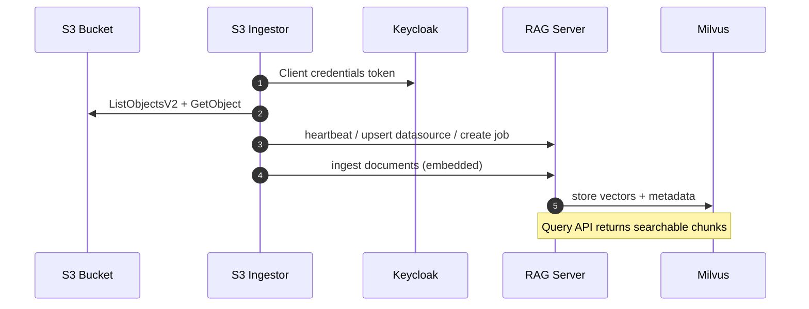

# S3 RAG Ingestor Plan

**Branch**: `prebuild/feat/s3-rag-ingestor` | **Date**: 2026-06-12  
**Worktree**: `/Users/daboucha/ciscocodebase/opensource/caipe-s3-rag-ingestor`

## Summary

Add an S3 document ingestor that lists objects from configured S3 buckets, filters by allowlisted file patterns, and ingests UTF-8 text documents into the RAG server (Milvus + Redis metadata). Production auth uses IRSA on Kubernetes; local development uses IAM user/profile credentials and Podman Compose.

The ingestor follows the same `IngestorBuilder` / `Client` pattern as GitHub, Confluence, and Slack ingestors.

## Goal



## Implementation status

### Done

- [x] Core ingestor: `ingestors/s3/ingestor.py` (`sync_s3_buckets`, `S3DocumentLoader`)
- [x] `S3_BUCKETS` accepts **bucket ARNs** (`arn:aws:s3:::bucket-name`), optional `account:arn` for cross-account
- [x] `S3_ALLOWED_FILES_AND_EXTENSIONS` — glob + regex patterns (replaces extension-only allowlist)
- [x] Unit tests: `ingestors/tests/s3/test_ingestor.py` (**40 tests**, all passing)
- [x] Podman build fix: replace BuildKit bind-mounts with `COPY` in RAG Dockerfiles (`Dockerfile.server`, `Dockerfile.ingestors`, `Dockerfile.agent-ontology`)
- [x] Podman compose overlay: `docker-compose.podman.yaml` (`extra_hosts: !reset` with gateway `10.88.0.1`)
- [x] Local RAG stack validated with Podman Compose (`--profile rag`) + Azure OpenAI embeddings

### Remaining

- [ ] `s3_ingestor` service in `docker-compose.dev.yaml` (or overlay)
- [ ] `S3_ENDPOINT_URL` support in `create_s3_client()` for LocalStack
- [ ] LocalStack + seed container for offline S3 emulation
- [ ] Helm / K8s chart wiring (`rag-ingestors`) with IRSA (not long-lived IAM keys)
- [ ] Ingestor README under `ingestors/src/ingestors/s3/`
- [ ] Optional: dev-only OAuth skip in `common/ingestor.py` when RAG bypass is enabled (not required if Keycloak is used)

## Configuration contract

| Variable | Required | Description |
|----------|----------|-------------|
| `S3_BUCKETS` | Yes | Comma-separated **bucket ARNs**. Optional `account_name:arn:aws:s3:::bucket` for cross-account |
| `S3_ALLOWED_FILES_AND_EXTENSIONS` | No | Globs/regexes; default `*.txt,*.md,*.rst,*.adoc,*.asciidoc` |
| `S3_IGNORE_PREFIXES` | No | Comma-separated key prefixes to skip |
| `S3_IGNORE_REGEX` | No | Regex applied to full object key |
| `S3_MAX_FILES_PER_BUCKET` | No | Default `2000` |
| `SYNC_INTERVAL` | No | Seconds between syncs; default `86400` |
| `AWS_REGION` | No | Default `us-east-2` |
| `AWS_ACCOUNT_LIST` | No | Cross-account: `name:123456789012,...` |
| `CROSS_ACCOUNT_ROLE_NAME` | No | Default `caipe-read-only` |
| `S3_ENDPOINT_URL` | No | **Not implemented yet** — needed for LocalStack |
| `EXIT_AFTER_FIRST_SYNC` | No | `true` for one-shot compose test runs |
| `INIT_DELAY_SECONDS` | No | Delay before first sync (wait for RAG server) |

**Datasource ID format**: `s3-{bucket}` (or `s3-{account}-{bucket}-{prefix}` when qualified).

**Document metadata** includes `s3_uri`, `bucket`, `key`, `etag`, `document_type: s3_object`.

## Auth model (all ingestors)

Every ingestor uses `common.ingestor.Client`, which **requires OAuth2 client credentials** to call the RAG server:

```bash
INGESTOR_OIDC_DISCOVERY_URL=http://keycloak:7080/realms/caipe/.well-known/openid-configuration
INGESTOR_OIDC_CLIENT_ID=caipe-platform
INGESTOR_OIDC_CLIENT_SECRET=caipe-platform-dev-secret
```

`CAIPE_UNSAFE_RBAC_BYPASS=true` on the RAG server does **not** bypass this — the ingestor client refuses to send requests without a token.

S3 credentials (`~/.aws` or IRSA) are **separate** — they only authorize S3 API calls.

---

## Testing plan

### Phase 0 — Unit tests (no external deps)

**Purpose**: Lock configuration and sync logic contracts.

```bash
cd ai_platform_engineering/knowledge_bases/rag/ingestors
uv run pytest tests/s3/test_ingestor.py -v
```

**Covers**: ARN parsing, file patterns, filtering, loader, mocked `sync_s3_buckets`.

**Exit criteria**: 40/40 passing.

---

### Phase 1 — RAG stack locally (Podman)

**Purpose**: Prove RAG server, Milvus, Redis, and embeddings work before adding S3.

**Prerequisites**

- Podman machine running (increase memory to ≥4 GiB recommended for builds)
- `touch .env` at repo root
- Azure OpenAI (or other embedding provider) configured

**`.env` minimum**

```bash
CAIPE_UNSAFE_RBAC_BYPASS=true
# Azure OpenAI example (compose default provider)
AZURE_OPENAI_API_KEY=...
AZURE_OPENAI_ENDPOINT=...
AZURE_OPENAI_API_VERSION=2024-02-15-preview
EMBEDDINGS_PROVIDER=azure-openai
EMBEDDINGS_MODEL=text-embedding-3-large
```

**Start**

```bash
cd /Users/daboucha/ciscocodebase/opensource/caipe-s3-rag-ingestor

podman compose \
  -f docker-compose.dev.yaml \
  -f docker-compose.podman.yaml \
  --profile rag up -d
```

**Podman notes**

- Bind-mount fix: RAG Dockerfiles use `COPY` for `pyproject.toml` / `uv.lock` (bind-mounts fail on Podman with permission denied)
- `docker-compose.podman.yaml` replaces `localhost:host-gateway` with `localhost:10.88.0.1` using `!reset` (empty `extra_hosts: []` does not override — Compose merges lists)
- Gateway IP: `podman run --rm alpine ip route show default` → typically `10.88.0.1`

**Verify**

```bash
curl http://localhost:9446/health
curl http://localhost:9446/healthz | jq .
open http://localhost:9446/docs
```

**Exit criteria**: `/healthz` healthy; Milvus + Redis initialized.

---

### Phase 2 — End-to-end with real S3 (recommended integration)

**Purpose**: Full ingestor → RAG → Milvus path without LocalStack code changes.

#### Step 1 — Seed S3

Create a dev bucket and upload test files:

```text
docs/readme.md          # include a unique searchable phrase
docs/runbook.txt
ignore/secret.bin       # should be skipped by default patterns
```

IAM needs: `s3:ListBucket`, `s3:GetObject` on the bucket/prefix.

#### Step 2 — Start Keycloak (token issuance only)

```bash
podman compose \
  -f docker-compose.dev.yaml \
  -f docker-compose.podman.yaml \
  --profile rbac up -d keycloak-postgres keycloak
```

Wait for Keycloak healthy (~2 min first boot).

#### Step 3 — Extend `.env`

```bash
# Ingestor → RAG OAuth
INGESTOR_OIDC_DISCOVERY_URL=http://keycloak:7080/realms/caipe/.well-known/openid-configuration
INGESTOR_OIDC_CLIENT_ID=caipe-platform
INGESTOR_OIDC_CLIENT_SECRET=caipe-platform-dev-secret

# S3 ingestor
S3_BUCKETS=arn:aws:s3:::my-rag-test-bucket
AWS_REGION=us-east-2
SYNC_INTERVAL=86400
EXIT_AFTER_FIRST_SYNC=true
INIT_DELAY_SECONDS=5
LOG_LEVEL=INFO
```

AWS creds via mounted `~/.aws` (same pattern as `aws_ingestor`).

#### Step 4 — Add and run `s3_ingestor` compose service

Add service (not yet in tree) mirroring `github_ingestor`:

- `INGESTOR_TYPE=s3`
- Build: `Dockerfile.ingestors`
- Volumes: ingestor source, common source, `${HOME}/.aws:/home/app/.aws:ro`
- Profile: `s3-ingestor`
- `depends_on: rag-server`
- `restart: "no"` when using `EXIT_AFTER_FIRST_SYNC=true`

```bash
podman compose \
  -f docker-compose.dev.yaml \
  -f docker-compose.podman.yaml \
  --profile rag \
  --profile rbac \
  --profile s3-ingestor \
  up --build s3_ingestor
```

**Ingestor log signals (success)**

```text
OAuth2 access token acquired
Ingestor initialized with ID: s3:s3-ingestor
Loaded N S3 documents from my-rag-test-bucket
Successfully ingested N S3 documents
job_status=COMPLETED
```

**Exit criteria**: Job `COMPLETED`, N matches uploaded `.md`/`.txt` count.

---

### Phase 3 — Verify ingestion and search

**Purpose**: Confirm documents are embedded and queryable — not just that the job completed.

With `CAIPE_UNSAFE_RBAC_BYPASS=true`, API calls need no Bearer token.

#### 3a — Ingestor registered

```bash
curl -s http://localhost:9446/v1/ingestors | jq .
```

Expect `ingestor_type: "s3"`, recent `last_seen`.

#### 3b — Datasource exists

```bash
curl -s http://localhost:9446/v1/datasources | jq .
```

Expect:

- `datasource_id`: `s3-my-rag-test-bucket`
- `source_type`: `s3`
- `metadata.bucket`, `metadata.bucket_arn`

#### 3c — Job succeeded

```bash
curl -s http://localhost:9446/v1/jobs/datasource/s3-my-rag-test-bucket | jq .
```

Latest job: `COMPLETED`, no errors.

#### 3d — Chunks in Milvus

```bash
curl -s "http://localhost:9446/v1/datasource/s3-my-rag-test-bucket/documents?limit=20" | jq .
```

Check chunks have:

- `title` = filename
- `document_type` = `s3_object`
- metadata: `s3_uri`, `bucket`, `key`
- `fresh_until` in the future

#### 3e — Semantic search (real proof)

```bash
curl -s -X POST http://localhost:9446/v1/query \
  -H 'Content-Type: application/json' \
  -d '{
    "query": "unique phrase from readme.md",
    "limit": 5,
    "filters": {"datasource_id": "s3-my-rag-test-bucket"}
  }' | jq .
```

**Good result**: `score > 0`, `page_content` contains your test phrase, metadata points to correct `s3_uri`.

#### 3f — Negative checks

| Test | Expected |
|------|----------|
| Query text only in ignored file (`ignore/secret.bin`) | No hits |
| Unrelated query | Low score / empty |
| Wrong `datasource_id` filter | No S3 hits |

#### 3g — Re-sync (optional)

1. Edit file in S3 (change unique phrase)
2. Re-run ingestor
3. Search for new phrase — should appear

**Exit criteria**: Search returns ingested content with correct S3 metadata.

---

### Phase 4 — LocalStack (future, offline S3)

**Purpose**: No real AWS account required.

**Requires implementation**

1. `S3_ENDPOINT_URL` in `create_s3_client()` (boto3 `endpoint_url`)
2. LocalStack service + seed script (create bucket, upload test objects)
3. Static credentials (`test`/`test`) or LocalStack defaults

**Not started** — defer until Phase 2 passes with real S3.

---

## Troubleshooting

| Symptom | Likely cause |
|---------|----------------|
| `Permission denied` on `pyproject.toml` during build | Podman + BuildKit bind-mounts — use updated Dockerfiles with `COPY` |
| `host-gateway` / empty internal IP | Use `docker-compose.podman.yaml` with `!reset` and `10.88.0.1` |
| `OAuth2 client credentials are required` | Missing `INGESTOR_OIDC_*` in `.env` |
| Token fetch fails | Keycloak not running; use `keycloak:7080` not `localhost:7080` from containers |
| S3 `AccessDenied` | IAM lacks List/Get; wrong profile |
| 0 documents loaded | Wrong ARN, aggressive filters, empty files |
| Job OK but 0 chunks / empty search | Embeddings failure; check `/healthz` |
| Search empty with filter | Wrong `datasource_id` — confirm via `/v1/datasources` |

---

## Production notes (K8s)

- Use **IRSA** for S3 access (not long-lived IAM user keys in secrets)
- Ingestor OIDC via Keycloak client credentials (same as other ingestors)
- `S3_BUCKETS` as bucket ARNs in Helm values
- Cross-account: `AWS_ACCOUNT_LIST` + `CROSS_ACCOUNT_ROLE_NAME` assume-role profiles

---

## Files

| Path | Role |
|------|------|
| `ingestors/src/ingestors/s3/ingestor.py` | S3 ingestor implementation |
| `ingestors/tests/s3/test_ingestor.py` | Unit tests |
| `ingestors/src/common/ingestor.py` | Shared RAG client + OIDC |
| `docker-compose.dev.yaml` | RAG + ingestor services |
| `docker-compose.podman.yaml` | Podman-specific overrides |
| `build/Dockerfile.ingestors` | Ingestor container image |
| `charts/rag-stack/charts/rag-ingestors/` | K8s deployment (S3 TBD) |

---

## Task checklist

- [x] Implement S3 ingestor core + unit tests
- [x] Bucket ARN config + file pattern allowlist
- [x] Podman-compatible Docker builds
- [x] Podman compose overlay for `extra_hosts`
- [x] Local RAG stack smoke test
- [ ] Add `s3_ingestor` compose service + profile
- [ ] Document S3 ingestor in ingestors README
- [ ] Phase 2 E2E: real bucket + Keycloak + verify search
- [ ] `S3_ENDPOINT_URL` + LocalStack compose stack
- [ ] Helm chart: S3 ingestor deployment + IRSA service account
