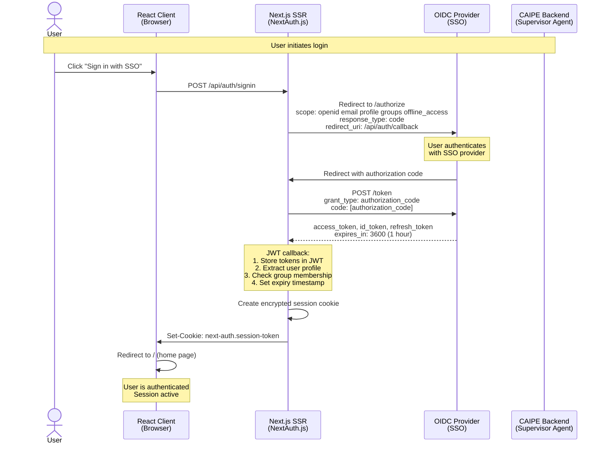
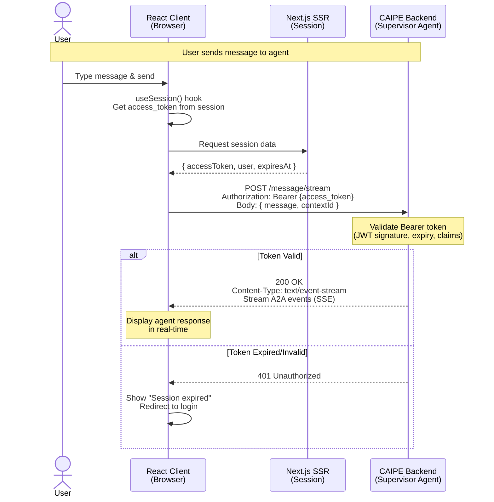
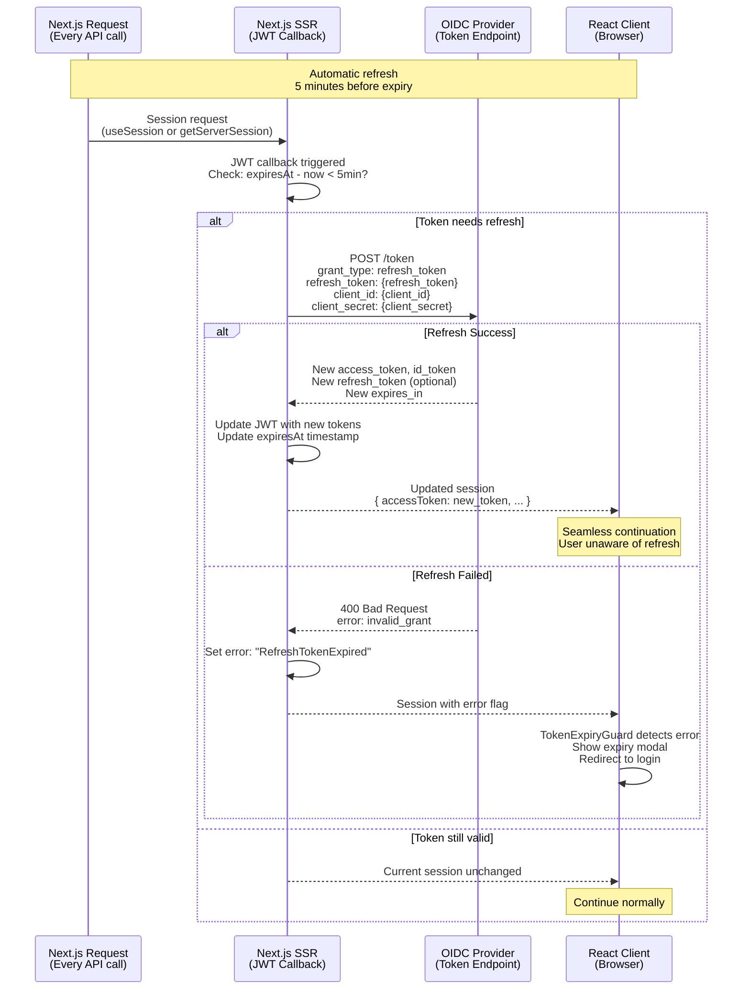
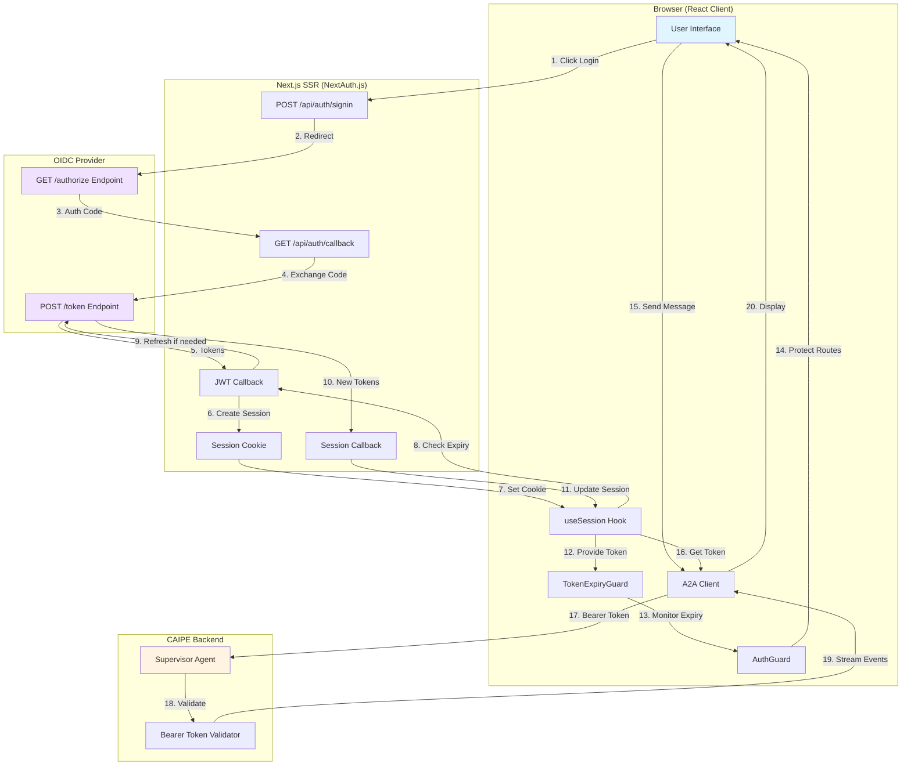

# Authentication Flow

This document describes the complete OIDC authentication flow in the CAIPE UI, including initial login, API calls, token refresh, and session management.

## Overview

The CAIPE UI implements a multi-layered authentication architecture using:
- **OIDC Provider** (SSO) - External identity provider (Okta, Duo, Keycloak, etc.)
- **Next.js SSR** - Server-side session management via NextAuth.js
- **React Client** - Browser-based UI with token-based API calls
- **CAIPE Backend** - Supervisor agent with Bearer token validation

## Initial Authentication Flow



## API Call Flow with Bearer Token



## Token Refresh Flow (Seamless)



## Token Expiry Warning Flow (Fallback)

```mermaid
sequenceDiagram
    participant Timer as TokenExpiryGuard<br/>(Check every 30s)
    participant Session as useSession()<br/>(Client State)
    participant Browser as React Client<br/>(UI)
    actor User

    Note over Timer,User: No refresh token available<br/>or refresh disabled

    loop Every 30 seconds
        Timer->>Session: Get current session
        Session-->>Timer: { expiresAt, accessToken }
        Timer->>Timer: Calculate time until expiry<br/>timeLeft = expiresAt - now

        alt 5 min warning (timeLeft < 300s)
            Timer->>Browser: Show warning toast<br/>"Session expiring in {time}"
            Browser-->>User: 🔔 Warning notification<br/>with "Re-login Now" button

            alt User clicks "Re-login Now"
                User->>Browser: Click button
                Browser->>Browser: Redirect to /login
            else User dismisses
                User->>Browser: Click "Dismiss"
                Browser->>Browser: Hide toast<br/>(will reappear on next check)
            end
        else Token expired (timeLeft <= 0)
            Timer->>Browser: Show critical modal<br/>"Session Expired"
            Browser-->>User: 🚫 Full-screen modal<br/>"Please log in again"
            Timer->>Timer: Wait 5 seconds
            Timer->>Browser: Auto-redirect to /login<br/>?session_expired=true
        else Token valid (timeLeft > 300s)
            Note over Timer: Continue monitoring<br/>No action needed
        end
    end
```



## Complete Authentication Architecture



## Key Components

### 1. NextAuth.js (Next.js SSR)
- **Location**: `ui/src/lib/auth-config.ts`, `ui/src/app/api/auth/[...nextauth]/route.ts`
- **Purpose**: Manages OIDC flow, token exchange, session creation
- **Features**:
  - JWT-based sessions (encrypted cookies)
  - Automatic token refresh (5 min before expiry)
  - Group-based authorization
  - Configurable refresh token support

### 2. AuthGuard Component
- **Location**: `ui/src/components/auth-guard.tsx`
- **Purpose**: Protects routes, validates session on mount
- **Features**:
  - Checks authentication status
  - Validates token expiry
  - Redirects to login if session invalid
  - Handles refresh token errors

### 3. TokenExpiryGuard Component
- **Location**: `ui/src/components/token-expiry-guard.tsx`
- **Purpose**: Real-time token monitoring and user warnings
- **Features**:
  - Checks token every 30 seconds
  - Shows warning toast at 5 min before expiry
  - Shows critical modal when expired
  - Auto-redirects to login after 5 seconds
  - Handles refresh token failures

### 4. A2A Client (Bearer Token Auth)
- **Location**: `ui/src/lib/a2a-sdk-client.ts`, `ui/src/lib/a2a-client.ts`
- **Purpose**: Makes authenticated API calls to CAIPE backend
- **Features**:
  - Adds Bearer token to Authorization header
  - Handles 401 errors gracefully
  - Shows user-friendly error messages
  - Suggests re-login on token expiry

## Configuration

### Environment Variables

```bash
# OIDC Provider Configuration
OIDC_ISSUER=https://your-oidc-provider.com
OIDC_CLIENT_ID=your-client-id
OIDC_CLIENT_SECRET=your-client-secret

# Enable/Disable Refresh Token Support
OIDC_ENABLE_REFRESH_TOKEN=true  # default

# Group-based Authorization (optional)
OIDC_REQUIRED_GROUP=backstage-access
OIDC_GROUP_CLAIM=groups  # auto-detect if not set

# NextAuth Session
NEXTAUTH_SECRET=your-secret-here
NEXTAUTH_URL=http://localhost:3000
```

### Token Refresh Modes

| Mode | Config | Behavior |
|------|--------|----------|
| **Auto-Refresh (Default)** | `OIDC_ENABLE_REFRESH_TOKEN=true` | Seamless token refresh 5 min before expiry |
| **Warning-Only** | `OIDC_ENABLE_REFRESH_TOKEN=false` | Show warnings, no auto-refresh |
| **Fallback** | Provider doesn't support `offline_access` | Gracefully falls back to warnings |

## Security Considerations

### Token Storage
- **Access Token**: Stored in encrypted JWT session cookie (HttpOnly, Secure)
- **Refresh Token**: Stored in encrypted JWT session cookie (server-side only)
- **ID Token**: Stored in encrypted JWT session cookie
- **Never exposed to browser localStorage or sessionStorage**

### Token Validation
- **Backend Validation**: CAIPE backend validates Bearer token signature and expiry
- **Client Validation**: AuthGuard checks session validity before rendering
- **Expiry Monitoring**: TokenExpiryGuard proactively monitors token expiry

### Token Refresh
- **Automatic**: Triggered 5 min before expiry (background, seamless)
- **Secure**: Uses refresh token grant type (OAuth 2.0 standard)
- **Error Handling**: Falls back to warning system if refresh fails

## Troubleshooting

### No Refresh Token Received
**Symptom**: Warning system active, but no auto-refresh
**Cause**: OIDC provider not issuing refresh token
**Solution**:
1. Check if provider supports `offline_access` scope
2. Verify client configuration allows refresh tokens
3. Check logs: `[Auth] ⚠️ Refresh token not provided by OIDC provider`

### Token Refresh Failing
**Symptom**: User logged out after token expiry despite refresh enabled
**Cause**: Refresh token expired or invalid
**Solution**:
1. Check refresh token expiry in OIDC provider settings
2. Verify client credentials are correct
3. Check logs: `[Auth] Token refresh failed`

### 401 Errors from Backend
**Symptom**: API calls fail with "Session expired" error
**Cause**: Access token expired, not refreshed in time
**Solution**:
1. Ensure `OIDC_ENABLE_REFRESH_TOKEN=true`
2. Check if refresh token is available in session
3. Verify backend is accepting Bearer tokens

## Related Documentation

- [OIDC Configuration](./configuration.md#oidc-sso-configuration)
- [Development Guide](./development.md)
- [API Reference](./api-reference.md)
- [Troubleshooting](./troubleshooting.md)

## Standards & References

- [OAuth 2.0 Authorization Framework (RFC 6749)](https://datatracker.ietf.org/doc/html/rfc6749)
- [OpenID Connect Core 1.0](https://openid.net/specs/openid-connect-core-1_0.html)
- [OAuth 2.0 Token Refresh (RFC 6749 Section 6)](https://datatracker.ietf.org/doc/html/rfc6749#section-6)
- [NextAuth.js Documentation](https://next-auth.js.org/)
