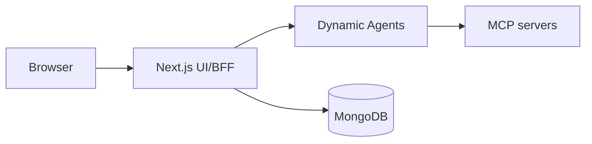

# CAIPE UI

The CAIPE UI is a Next.js web application and BFF for Dynamic Agents.

## What It Provides

- Chat with dynamic agents
- Conversation persistence in MongoDB
- Agent Builder and Skills Gallery
- Admin settings, health, metrics, audit logs, and RBAC surfaces
- BFF proxy routes for Dynamic Agents, RAG, bots, and admin APIs

## Quick Start

```bash
COMPOSE_PROFILES=caipe-ui,dynamic-agents,caipe-mongodb docker compose -f docker-compose.dev.yaml up
```

Open:

```text
http://localhost:3000
```

## Runtime Path



The BFF calls Dynamic Agents through `DYNAMIC_AGENTS_URL` and exposes browser
streaming routes under `/api/v1/chat/stream/*`.
