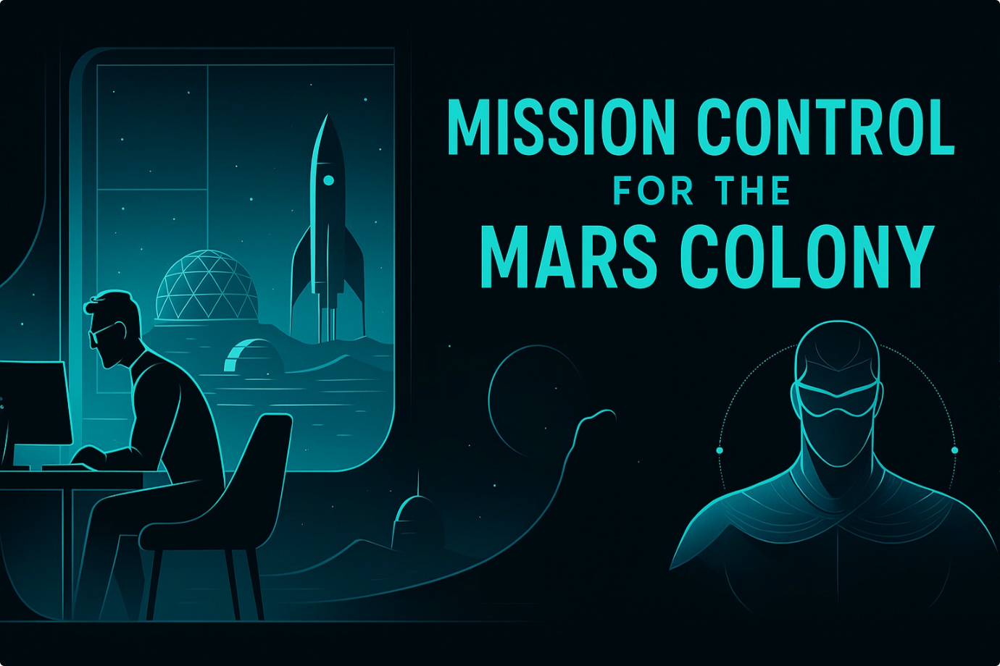

# 📡 Welcome: Mission Director's Briefing

After months of preparation, your crew has finally landed on Mars 🟠. Now it’s time to establish Mission Control operations with Agentic AI 📡🤖🚀 to keep the colony running smoothly.

## 🎯 Your mission:

Set up 🛰️ communication and 🌦️ weather monitoring systems to support life in the new habitat, while staying connected to Earth 🌍 with regular updates on your progress.

And most importantly, bring up the full CAIPE system — your command center for running Mission Control — so every operation is coordinated, automated, and mission-ready.

Along the way, you’ll complete a series of Mission Checks to ensure your systems — and your crew — are ready for anything.

With CAIPE — your superhero “cape” for platform engineering 🦸 — you’ll deploy agents to handle communications, weather tracking, and mission-critical operations.

Now, let’s start with a **quick intro to CAIPE** before the full mission checklist briefing.

## What is CAIPE (Community AI Platform Engineering)

- [**Community AI Platform Engineering (CAIPE)**](https://caipe.io/) (pronounced as `cape`) is an open-source, Multi-Agentic AI System (MAS) supported by the [CNOE (Cloud Native Operational Excellence)](https://cnoe.io) forum.
- CAIPE provides a secure, scalable, persona-driven reference implementation with built-in knowledge base retrieval that streamlines platform operations, accelerates workflows, and fosters innovation for modern engineering teams.
- It integrates seamlessly with Internal Developer Portals like Backstage and developer environments such as VS Code, enabling frictionless adoption and extensibility.

_CAIPE is empowered by a set of specialized sub-agents that integrate seamlessly with essential engineering tools. Below are some common platform agents leveraged by the MAS agent:_

* ☁️ AWS Agent for cloud ops
* 🚀 ArgoCD Agent for continuous deployment
* 🚨 PagerDuty Agent for incident management
* 🐙 GitHub Agent for version control
* 🗂️ Jira/Confluence Agent for project management
* ☸ Kubernetes Agent for K8s ops
* 💬 Slack/Webex Agents for team communication
* 📊 Splunk Agent for observability

...and many more platform agents are available for additional tools and use cases.

**_Tip:💡 CAIPE (Community AI Platform Engineering), pronounced like cape (as in a superhero cape 🦸‍♂️🦸‍♀️). Just as a 🦸‍♂️ cape empowers a superhero, CAIPE empowers platform engineers with 🤖 Agentic AI automation! 🚀_**

## [CAIPE Badges](https://github.com/cnoe-io/ai-platform-engineering/discussions/245)

## Mission Checks

- **Mission Check 1 — Start Ignition: Download Mission and Learn the Controls** 🚀📝
    - Clone the repo, set up prerequisites, and bring Mission Control online. 🛰️
    - Learn the basics of Agentic AI and AGNTCY. 🤖

- **Mission Check 2 — Create Life** 🧬✨
    - Run the **Petstore Agent** 🐾 and confirm your first AI agent is alive. ⚡

- **Mission Check 3 — Cosmic Forecast** 🌌🌫️
    - Introduce the **Weather Agent** to monitor weather on Earth and Mars
    - Run the **CAIPE** multi-agent system with Petstore and Weather agents. ☁️

- **Mission Check 4 — Reconnaissance & Reporting: Knowledge Base RAG and Reporting** 📚🧠
    - Integrate the Retrieval Augmented Generation Agent.
    - Launch the **Knowledge Base RAG system** 🗂️, ingest docs, and query them. 🔍
    - Use the **RAG + GitHub Agent** 🐙📋 to write a report and commit to Git repository. 📨

- **Mission Check 5 — Assemble Full CAIPE with idpbuilder** 🛠️📦
    - Package the full CAIPE stack into reproducible, deployable bundles. 🎁
    - **Bonus:** Run CAIPE with AGNTCY SLIM. 🦾

- **Mission Check 6 — Tracing and Evaluation** 🕵️‍♂️📊
    - Customize prompts, enable tracing, and evaluate agent workflows. 🧪

- **Mission Debrief** 🛰️🤝
    - Conclusion and Next Steps. 🌟

- **Bonus — AGNTCY**
    - Learn and try out AGNTCY components.

## Workshop Logistics and Support

- **🔍 Demo Lab Navigation**
  - Easily switch between the **Lab Guide**, **Terminal**, and **IDE** using the toggles in the **top right corner** of your screen.
  - Familiarize yourself with the interface before starting your missions for a smoother experience.

- **💻 Workspace Directory**
  - Your main workspace is located at: `/home/ubuntu/work`
  - Use the **IDE** toggle (top right) to access your files and code editor.
  - For terminal navigation, try using [`mc` - Midnight Commander](https://linuxcommand.org/lc3_adv_mc.php) (a visual file manager). Launch it in the terminal for a split-pane view.

- **🆘 Need Help?**
  - Raise your hand and chat with a workshop team member during the session so a team member can start a breakout session.

- **🤝 Breakout Sessions**
  - The instructor will guide the lab at a steady pace, but each Mission Check is timed to ensure we cover all the key objectives.
  - For help during any Mission Check, a **dedicated Webex breakout session is available**. You can join the breakout room to get assistance, then return to the main session once your question is answered.
  - Feel free to move between the main session and the breakout as needed—this way, everyone can get support without missing the overall mission flow.

- **⏳ Lab Availability**
  - Your lab environment will remain active for **36 hours** after the workshop, until **EOD Thursday (Pacific Time)**.
  - Please save your work and download any important files before your instance is terminated (as hosting VMs incurs costs).

---

## 🛰️ **Optional: Local Setup Preflight**

**We got you covered with lab environment. No need to bring any extra setup**

* **Integrated Lab Access**
  We’ve set up a ready-to-go lab environment. You’ll also have **temporary LLM access** during the workshop **and for 36 hours afterward** — so you can keep tinkering after we land.

* **Optional Local Launch Pad**
  Want to try running the stack on your own setup? Here are the **recommended specs** for smooth orbit:

  * **8 CPUs**
  * **16 GB RAM**
  * **80 GB Disk Space**
  * Docker installed and ready

---

## 🌠 **Final Call**

Suit up, power up your consoles, and get ready to take control of the **next frontier of AI-driven operations**. The future of our Mars colony — and the safety of your crew — depends on your engineering skills.

**Countdown to launch starts now…**
**T-minus 3… 2… 1… 🚀**

