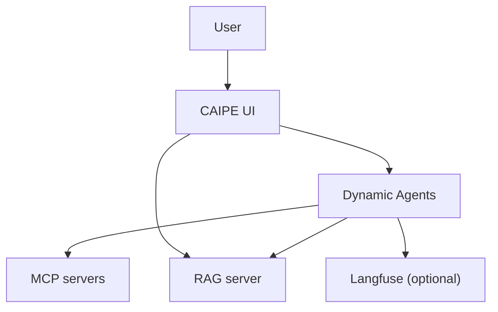

# Introduction to CAIPE

Community AI Platform Engineering (CAIPE) is a reference platform for building, running, and governing AI agents for platform engineering workflows.

The current local workshop stack is built around:

- **CAIPE UI**: chat, administration, dynamic agent creation, MCP server configuration, and knowledge-base UI.
- **Dynamic Agents**: the runtime that executes configured agents, streams responses, calls tools, and stores checkpoint state.
- **MCP servers**: tool integrations under `ai_platform_engineering/mcp`, built with the shared `build/agents/Dockerfile.mcp` image pattern.
- **RAG services**: knowledge-base ingestion and retrieval under `ai_platform_engineering/knowledge_bases/rag`.
- **Observability**: optional Langfuse services for tracing LLM and tool calls.

## What You Will Learn

- Build a simple ReAct agent.
- Expose tools through MCP.
- Run the current CAIPE Docker Compose workshop flows.
- Configure Dynamic Agents with MCP tools.
- Add RAG-backed knowledge retrieval.
- Trace Dynamic Agent and MCP activity with Langfuse.

## Lab Structure

1. **Introduction to AI Agents**: Build a simple ReAct agent and MCP server.
2. **Multi-Agent Systems**: Run CAIPE UI, Dynamic Agents, and an MCP tool server.
3. **RAG and Git**: Add the RAG server, vector-store dependencies, and a GitHub MCP server.
4. **Tracing**: Add Langfuse to observe Dynamic Agent execution.

## Current Architecture



Key points:

- Agents are configured dynamically through the UI and MongoDB.
- Tool integrations are MCP servers, not standalone agent containers.
- RAG is a first-class service and can also expose MCP tools.
- Legacy supervisor and standalone A2A workshop containers are no longer part of the local workshop flow.

## Compose Entry Points

From the repository root:

```bash
docker compose -f workshop/docker-compose.mission2.yaml config --quiet
docker compose -f workshop/docker-compose.mission3.yaml config --quiet
docker compose -f workshop/docker-compose.mission4.yaml config --quiet
docker compose -f workshop/docker-compose.mission7.yaml config --quiet
```

Use the mission files as current, self-contained examples:

- `mission2`: one MCP server.
- `mission3`: CAIPE UI, Dynamic Agents, MongoDB, and MCP.
- `mission4`: mission3 plus RAG and GitHub MCP.
- `mission7`: mission3 plus Langfuse tracing.

## Next

Start with [AI Agents and ReAct Pattern](/docs/workshop/agent).
