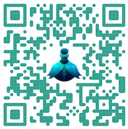

# Introduction to CAIPE (Community AI Platform Engineering)

**Community AI Platform Engineering (CAIPE)**—pronounced "cape"—is an open-source, production-ready Multi-Agentic AI System (MAS) from the CNOE forum. It enables secure, enterprise-grade multi-agent orchestration with seamless integration of specialized sub-agents and platform tools, streamlining operations and accelerating workflows for modern engineering teams.

Here are some of the features that CAIPE offers out of the box:

* 🌐 **NetUtils Agent** - Network diagnostics, connectivity tests, and IP utilities for troubleshooting and automated remediation
* ☁️ **AWS Agent** - Cloud operations and resource management
* 🚀 **ArgoCD Agent** - Continuous deployment and GitOps workflows
* 🚨 **PagerDuty Agent** - Incident management and alerting
* 🐙 **GitHub Agent** - Version control and repository operations
* 🗂️ **Jira/Confluence Agent** - Project management and documentation
* 💬 **Slack/Webex Agents** - Team communication and notifications
* 📊 **Splunk Agent** - Observability and log analysis

Many more platform agents are available for additional tools and use cases. You can also bring your own enterprise agent—if it is A2A-compatible—and connect it with CAIPE for multi-agent interaction and agentic problem-solving.

## What You’ll Learn in This Lab

In this hands-on lab, you’ll explore how to build AI agents and multi-agent systems using CAIPE. Through progressive modules, you will learn how to:

- Build AI agents using the ReAct pattern
- Integrate tools via the Model Context Protocol (MCP)
- Deploy and interact with multi-agent systems
- Implement Retrieval-Augmented Generation (RAG) for knowledge retrieval
- Coordinate specialized agents for complex workflows
- Work with Agent-to-Agent (A2A) communication protocols
- Observe and trace agent interactions in real time

## Lab Structure

This lab is divided into progressive modules:

1. **Introduction to CAIPE**: Understanding the ecosystem
2. **AI Agents and ReAct Pattern**: Build your first agent with tools
3. **Multi-Agent Systems**: Deploy CAIPE and coordinate multiple agents
4. **RAG and Git Agents**: Knowledge retrieval and version control automation
5. **Tracing and Observability**: Observe and trace agent interactions with Langfuse

Each module builds on the previous one, so we recommend completing them in order.

---

## Key Components Used in This Lab

### 1. AI Agents and the ReAct Pattern

**What it does:** AI agents use Large Language Models (LLMs) as their "brains" to make decisions and control application flow. The ReAct (Reasoning + Acting) pattern enables agents to iteratively reason about problems and take actions using tools iteratively.

**Why it matters:** Unlike traditional chatbots, which simply respond to individual queries, agents are proactive systems. They can plan multi-step tasks, execute actions with external tools, adapt their strategies based on results, and persist through failures.

**In this lab:** You’ll build an agent using LangChain and the ReAct pattern, learning how agents think and act to solve problems.

### 2. Model Context Protocol (MCP)

**What it does:** MCP is a standardized protocol that allows agents to connect to external tools and data sources through a uniform interface, avoiding the need for custom code for each integration.

**Why it matters:** Agents often need access to real-world data and services. MCP provides a standard way to extend agent capabilities—such as web search, code execution, database queries, and API calls.

**In this lab:** You’ll integrate MCP servers with your agents, enabling access to weather data, payment systems, and other external services.

### 3. Multi-Agent Systems (MAS)

**What it does:** MAS distributes work across multiple specialized agents, each with specific expertise. Agents communicate and coordinate to solve complex, cross-domain problems that single agents cannot manage efficiently.

**Why it matters:** Like a company with many specialists (sales, engineering, support), MAS enables scalable, maintainable systems. You can add new agents without redesigning the entire architecture.

**Common MAS patterns:**

- **Supervisor:** A coordinator agent delegates tasks to specialized worker agents
- **Network/Swarm:** Agents communicate in a network using pub-sub or broadcast
- **Hierarchical Supervisor:** Multi-level coordination for complex workflows

**In this lab:** You’ll deploy CAIPE’s multi-agent system based on supervisor MAS pattern and observe how specialized agents coordinate platform engineering tasks.

### 4. Agent-to-Agent (A2A) Protocol

**What it does:** A2A is a standardized communication protocol that enables agents to discover, authenticate, and interact with each other securely. It defines how agents exchange messages, negotiate capabilities, and coordinate actions.

**Why it matters:** For agents to work together, they need a common language and communication framework. A2A ensures interoperability across agents from different vendors and frameworks.

**In this lab:** You’ll see the A2A protocol in action as CAIPE agents collaborate to solve multi-step workflows.

### 5. Retrieval-Augmented Generation (RAG)

**What it does:** RAG enhances LLM responses by retrieving relevant information from external knowledge sources before generating an answer. It uses vector databases and semantic search to find contextually relevant documents.

**Why it matters:** Instead of relying solely on the model’s training data, RAG dynamically fetches up-to-date, domain-specific or company-specific information. This reduces hallucinations, provides transparency through source citations, and avoids expensive model retraining or fine-tuning of LLMs.

**In this lab:** You’ll build a RAG-powered agent that can answer questions by retrieving relevant knowledge base articles that are not in LLM's knowledgebase.

### 6. Observability and Tracing

**What it does:** Provides telemetry collection, tracing, and monitoring for multi-agent applications. It visualizes agent interactions, message flows, and decision-making processes.

**Why it matters:** When multiple agents interact, you need visibility into what’s happening. Observability helps with debugging, optimizing performance, and understanding agent behavior.

**In this lab:** You’ll use observability tools to trace agent interactions and see how CAIPE coordinates complex workflows.

---

## The CAIPE Architecture

Here’s how all these components work together in CAIPE:

CAIPE uses a supervisor pattern, where a coordinator agent delegates tasks to specialized platform agents. Each agent has access to MCP tools in their domain, and all agents communicate using the A2A protocol.

## Additional Resources

- [CAIPE Documentation](https://cnoe-io.github.io/ai-platform-engineering/)
- [CAIPE GitHub Repository](https://github.com/cnoe-io/ai-platform-engineering)

Visit the CAIPE repository.

 

 

_Link:_ [https://github.com/cnoe-io/ai-platform-engineering](https://github.com/cnoe-io/ai-platform-engineering)

---

## Ready to Start?

**Next:** Proceed to the "AI Agents and ReAct Pattern" module to build your first agent and learn the foundational concepts of agentic AI.

