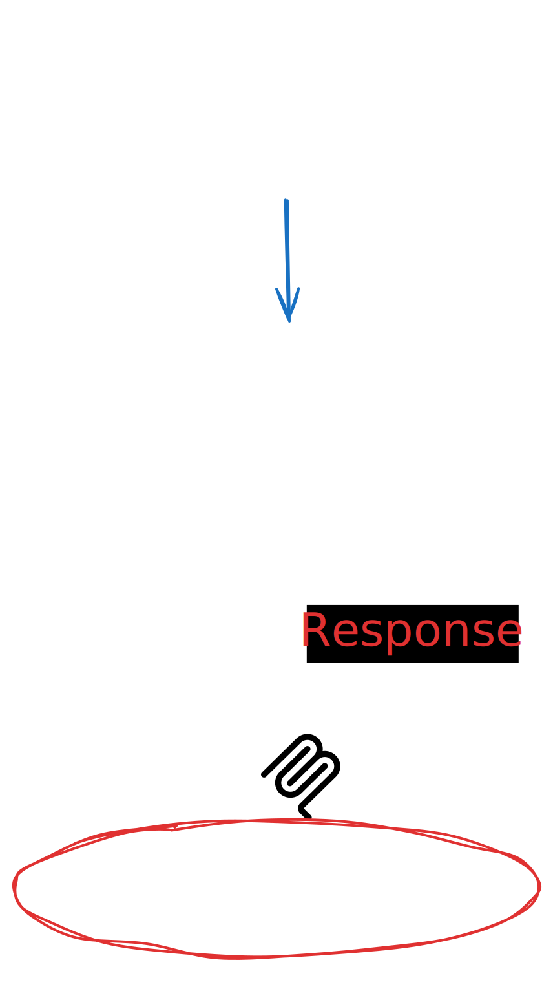

# Introduction to AI Agents and ReAct Pattern

## 1. Overview

This is the first part of a multi-part lab series on building AI agents. In this part, you'll learn the foundational concepts of agentic AI and build your first working agents using the ReAct pattern.

**What you'll learn in this part:**

- Core concepts of agentic AI and the ReAct pattern
- How to build a simple agent with LangChain
- How to integrate tools using the Model Context Protocol (MCP)
- The difference between AI agents and MCP servers

**Prerequisites:**

- Basic Python knowledge
- Access to Azure OpenAI (credentials provided in lab environment)

---

## 2. Understanding AI Agents

### 2.1 What is an Agent?

An **AI Agent** is an intelligent system that uses a **Large Language Model (LLM)** as its "brain" to make decisions and control application flow. Unlike traditional chatbots that simply respond to queries, agents are proactive systems that can:

- **Plan** multi-step approaches to solve complex problems
- **Execute** actions using external tools and APIs
- **Adapt** their strategy based on results and feedback
- **Persist** through failures and iterate toward solutions

> [!NOTE]
> An agent doesn't just answer questions — it actively takes actions to achieve goals..

### 2.2 Core Components of an Agent

Every AI agent consists of three essential components:

**System Prompts**
System prompts define the agent's role, behavior, and constraints. They act as the agent's "personality" and "instructions."

*Example:* "You are Mission Control for a Mars colony. Use your tools to help astronauts stay safe."

**Tools**
Tools extend the LLM's capabilities beyond text generation. They allow agents to interact with the real world.

*Examples:*

- Searching the web
- Running code
- Querying a database
- Checking sensor readings
- Sending notifications

**Memory**

Memory allows agents to maintain context across interactions:

- **Short-term memory:** Tracks the current task and reasoning steps
- **Long-term memory:** Stores persistent knowledge like user preferences or past experiences

---

### 2.3 The Agent Lifecycle

An agent operates as a continuous feedback loop, similar to how humans approach complex problems:

1. **Perception**: Understanding the current situation and available information
2. **Decision**: Choosing the best action based on reasoning and goals
3. **Action**: Executing the chosen action and observing results



This continuous cycle enables the agent to:

- **Adapt** to changing conditions
- **Learn** from successes and failures
- **Persist** through obstacles
- **Operate autonomously** until the goal is achieved

> [!NOTE]
> Agents don't execute pre-programmed sequences—they dynamically adjust their approach based on real-time feedback.

---

### 2.4 The ReAct Pattern: Reason + Act

**ReAct** stands for **Reason + Act**, a foundational pattern that transforms LLMs from passive responders into active problem-solvers. This approach enables agents to think through problems step-by-step while taking concrete actions.

#### Why ReAct Matters

Traditional LLMs can only generate text responses. ReAct enables them to:

- **Break down complex problems** into manageable steps
- **Gather information** dynamically as needed
- **Verify assumptions** through real-world actions
- **Course-correct** when initial approaches fail

#### The ReAct Loop

| Step | Description | Example |
|------|-------------|----------|
| **Reason (Think)** | The LLM analyzes the situation, considers available options, and plans the next action | "I need to check the oxygen level first, then the rover status" |
| **Act (Do)** | The agent executes the chosen action using available tools | Calls `check_oxygen_level()` function |
| **Observe (Reflect)** | The LLM evaluates the result and decides whether to continue, adjust, or conclude | "Oxygen is good at 20.7%. Now I need to check Rover Spirit's battery" |

This cycle continues until the task is complete, an error occurs, or a maximum iteration limit is reached.

#### Example: Mars Habitat Status Check

```
User Query: "What's the status of our Mars habitat?"
    ↓
Reason: "I should check oxygen levels and rover status"
    ↓
Act: Call check_oxygen_level() → "Oxygen at 20.7%"
    ↓
Observe: "Good oxygen level. Now check rover."
    ↓
Act: Call rover_battery_status("Spirit") → "Battery at 76%"
    ↓
Observe: "All systems normal. Ready to respond."
    ↓
Final Answer: "Habitat status: Oxygen optimal at 20.7%, Rover Spirit at 76% battery"
```

<center></center>

---

## 3. Build Your First ReAct Agent

In this section, you'll build a Mars colony management agent that uses the ReAct pattern to check habitat conditions and rover status.

### Task 1: Verify Your Environment

The lab environment already has Azure OpenAI credentials configured. Let's verify they're available.

```bash
echo "Checking Azure OpenAI configuration..."
env | grep AZURE_OPENAI
```

**Expected output:**
You should see environment variables like:

- `AZURE_OPENAI_DEPLOYMENT`
- `AZURE_OPENAI_API_VERSION`
- `AZURE_OPENAI_ENDPOINT`
- `AZURE_OPENAI_API_KEY`

> [!NOTE]
> If you want to run this lab in your own environment, you'll need to set these variables with your Azure OpenAI credentials.

---

### Task 2: Install Required Dependencies

We'll use LangChain, a popular framework for building LLM applications.

```bash
pip install -U langchain "langchain[openai]" langgraph langchain-openai dotenv
```

**What each package does:**

- `langchain`: Core framework for building agent workflows
- `langgraph`: Advanced agent orchestration and state management
- `langchain-openai`: Integration with Azure OpenAI
- `dotenv`: Loads environment variables from files

---

### Task 3: Examine the Agent Code

Let's look at the Mars colony management agent code to understand how it works.

```bash
bat $HOME/work/simple-agent/simple_react_agent.py
```

**Expected output:**
```python
from langchain.agents import create_agent
from langchain_openai import AzureChatOpenAI
import os
import random

# Tool 1: Simulate checking oxygen level in the Mars habitat
def check_oxygen_level() -> str:
    """Returns the current oxygen level in the Mars habitat."""
    print("[TOOL] check_oxygen_level was called")
    oxygen_level = round(random.uniform(18.0, 23.0), 1)
    return f"Oxygen level is optimal at {oxygen_level}%."

# Tool 2: Simulate checking a rover's battery status
def rover_battery_status(rover_name: str) -> str:
    """Returns the battery status for a given Mars rover."""
    print(f"[TOOL] rover_battery_status was called for rover: {rover_name}")
    battery_percent = random.randint(50, 99)
    return f"Rover {rover_name} battery at {battery_percent}% and functioning normally."

# Initialize the Azure OpenAI LLM using environment variables for deployment and API version
llm = AzureChatOpenAI(
    azure_deployment=os.getenv("AZURE_OPENAI_DEPLOYMENT"),      # e.g., "gpt-4o"
    openai_api_version=os.getenv("AZURE_OPENAI_API_VERSION")    # e.g., "2025-03-01-preview"
)

# Create a ReAct agent with the LLM and the two tools above
agent = create_agent(
    model=llm,
    tools=[check_oxygen_level, rover_battery_status],
    system_prompt="You are Mission Control for a Mars colony. Use your tools to help astronauts stay safe and keep the rovers running!"
)

# Run the agent with a user message asking about oxygen and a rover's battery
response = agent.invoke({"messages": [{"role": "user", "content": "Mission Control, what's the oxygen level and the battery status of Rover Spirit?"}]})

# Print the final AI response(s) to the user
print("Final Response:")
for message in response['messages']:
    # Each message is an object with a 'content' attribute (if present)
    if hasattr(message, 'content') and message.content:
        print(f"AI: {message.content}")
```

#### Code Breakdown

Let's understand what each part does:

**Tool Definitions (Lines 10-21)**
```python
def check_oxygen_level() -> str:
    """Returns the current oxygen level in the Mars habitat."""
    print("[TOOL] check_oxygen_level was called")
    oxygen_level = round(random.uniform(18.0, 23.0), 1)
    return f"Oxygen level is optimal at {oxygen_level}%."
```
- This function simulates a sensor reading
- The docstring is crucial—the agent reads it to understand what the tool does
- Returns a string that the agent can interpret

**LLM Initialization (Lines 23-27)**
```python
llm = AzureChatOpenAI(
    azure_deployment=os.getenv("AZURE_OPENAI_DEPLOYMENT"),
    openai_api_version=os.getenv("AZURE_OPENAI_API_VERSION")
)
```
- Creates a connection to Azure OpenAI
- Uses environment variables for configuration
- This is the "brain" of the agent

**Agent Creation (Lines 30-34)**
```python
agent = create_agent(
    model=llm,
    tools=[check_oxygen_level, rover_battery_status],
    system_prompt="You are Mission Control for a Mars colony..."
)
```
- Combines the LLM with available tools
- The system prompt defines the agent's role and behavior
- The agent can now reason about when to use each tool

**Agent Invocation (Lines 37-38)**
```python
response = agent.invoke({
    "messages": [{"role": "user", "content": "Mission Control, what's the oxygen level..."}]
})
```
- Sends a user query to the agent
- The agent will use the ReAct pattern to:
  1. Reason about what information is needed
  2. Call the appropriate tools
  3. Synthesize a final answer

---

### Task 4: Run the Agent

Now let's see the agent in action!

```bash
python3 $HOME/work/simple-agent/simple_react_agent.py
```

**Expected output:**
```text
[TOOL] check_oxygen_level was called
[TOOL] rover_battery_status was called for rover: Spirit
Final Response:
AI: Mission Control, what's the oxygen level and the battery status of Rover Spirit?
AI: Oxygen level is optimal at 20.7%.
AI: Rover Spirit battery at 56% and functioning normally.
AI: The oxygen level in the Mars habitat is optimal at 20.7%.
Rover Spirit's battery is currently at 56% and it's functioning normally.
```

**What just happened?**

1. **Reason:** The agent analyzed the user's question and determined it needed two pieces of information
2. **Act:** It called `check_oxygen_level()` first
3. **Observe:** It received the oxygen reading
4. **Act:** It then called `rover_battery_status("Spirit")`
5. **Observe:** It received the battery status
6. **Respond:** It synthesized both results into a coherent answer

Notice the `[TOOL]` messages showing when each tool was called. This demonstrates the ReAct loop in action!

---

## 4. Understanding Model Context Protocol (MCP)

### 4.1 What is MCP?

**Model Context Protocol (MCP)** is an emerging standard that addresses a critical challenge: how to consistently and securely connect LLMs with external tools, data sources, and services.

### 4.2 The Problem MCP Solves

Before MCP, every AI application had to:

- Build custom integrations for each tool or service
- Handle authentication and security differently
- Maintain separate codebases for similar functionality
- Deal with inconsistent APIs and data formats

### 4.3 MCP's Solution

MCP provides a **standardized interface** that enables:

- **Consistent tool integration** across different LLM applications
- **Secure communication** between agents and external services
- **Reusable components** that work with any MCP-compatible system
- **Simplified development** through common protocols

<center></center>

**Think of MCP as "USB for AI agents"** - just as USB standardized how devices connect to computers, MCP standardizes how agents connect to tools and services.

---

## 5. Build an Agent with MCP

Now you'll build the same Mars colony agent, but using MCP to expose the tools. This demonstrates how MCP separates tool definitions from agent logic.

### Task 5: Install MCP Dependencies

```bash
pip install -U langchain-mcp-adapters
```

**What this does:**
- Adds MCP support to LangChain
- Allows agents to discover and use tools from MCP servers

---

### Task 6: Examine the MCP Server

An MCP server exposes tools that agents can use. Let's look at our Mars colony MCP server.

```bash
bat $HOME/work/simple-agent/simple_mcp_server.py
```

**Expected output:**
```python
from mcp.server.fastmcp import FastMCP
import random

mcp = FastMCP("Mars Colony")

@mcp.tool()
def check_oxygen_level() -> str:
    """Returns the current oxygen level in the Mars habitat."""
    print("Tool called: check_oxygen_level")
    oxygen_level = round(random.uniform(18.0, 23.0), 1)
    return f"Oxygen level is optimal at {oxygen_level}%."

@mcp.tool()
def rover_battery_status(rover_name: str) -> str:
    """Returns the battery status for a given Mars rover."""
    print(f"Tool called: rover_battery_status (rover_name={rover_name})")
    battery_percent = random.randint(50, 99)
    return f"Rover {rover_name} battery at {battery_percent}% and functioning normally."

if __name__ == "__main__":
    mcp.run(transport="stdio")
```

#### Code Breakdown

**MCP Server Creation (Lines 1-4)**
```python
from mcp.server.fastmcp import FastMCP
mcp = FastMCP("Mars Colony")
```
- Creates an MCP server named "Mars Colony"
- This server will expose tools to any MCP-compatible agent

**Tool Registration (Lines 6-11)**
```python
@mcp.tool()
def check_oxygen_level() -> str:
    """Returns the current oxygen level in the Mars habitat."""
```
- The `@mcp.tool()` decorator registers the function as an MCP tool
- The docstring becomes the tool's description for agents
- The function signature defines the tool's parameters

**Server Startup (Lines 19-20)**
```python
if __name__ == "__main__":
    mcp.run(transport="stdio")
```
- Starts the MCP server using standard input/output for communication
- The agent will communicate with this server to call tools

**Key difference from previous code:** The tools are now in a separate server process, not directly in the agent code. This allows multiple agents to share the same tools!

---

### Task 7: Examine the MCP-Enabled Agent

Now let's look at how an agent connects to an MCP server.

```bash
bat $HOME/work/simple-agent/simple_react_agent_with_mcp.py
```

**Expected output:**
```python
import asyncio
from mcp import ClientSession, StdioServerParameters
from mcp.client.stdio import stdio_client
from langchain_mcp_adapters.tools import load_mcp_tools
from langchain.agents import create_agent
from langchain_openai import AzureChatOpenAI
import os
from dotenv import load_dotenv

load_dotenv("/home/ubuntu/.env_vars")

mcp_server_file_path = os.path.join(os.environ["HOME"], "work", "simple-agent", "simple_mcp_server.py")

async def main():
    # Create server parameters for stdio connection
    server_params = StdioServerParameters(
        command="python3",
        args=[mcp_server_file_path],
    )

    async with stdio_client(server_params) as (read, write):
        async with ClientSession(read, write) as session:
            # Initialize the connection
            await session.initialize()

            # Get tools from the MCP server
            tools = await load_mcp_tools(session)

            # Initialize the Azure OpenAI LLM using environment variables
            llm = AzureChatOpenAI(
                azure_deployment=os.getenv("AZURE_OPENAI_DEPLOYMENT"),
                openai_api_version=os.getenv("AZURE_OPENAI_API_VERSION"),
                azure_endpoint=os.getenv("AZURE_OPENAI_ENDPOINT"),
                api_key=os.getenv("AZURE_OPENAI_API_KEY")
            )

            # Create a ReAct agent with the LLM and the MCP tools
            agent = create_agent(llm, tools)

            # Run the agent with a user message
            response = await agent.ainvoke({
                "messages": [{"role": "user", "content": "Mission Control, what's the oxygen level and the battery status of Rover Spirit?"}]
            })

            # Print the final AI response(s) to the user
            print("Final Response:")
            for message in response['messages']:
                if hasattr(message, 'content') and message.content:
                    print(f"AI: {message.content}")

if __name__ == "__main__":
    asyncio.run(main())
```

#### Code Breakdown

**MCP Server Connection (Lines 16-19)**
```python
server_params = StdioServerParameters(
    command="python3",
    args=[mcp_server_file_path],
)
```
- Defines how to start the MCP server
- The agent will launch the server as a subprocess
- Communication happens via standard input/output

**Session Management (Lines 21-24)**
```python
async with stdio_client(server_params) as (read, write):
    async with ClientSession(read, write) as session:
        await session.initialize()
```
- Establishes a connection to the MCP server
- Initializes the communication protocol
- Uses async/await for efficient I/O

**Tool Discovery (Line 27)**
```python
tools = await load_mcp_tools(session)
```
- **This is the magic of MCP!**
- The agent automatically discovers all available tools from the server
- No need to manually list tools—the server provides them dynamically

**Agent Creation (Line 38)**
```python
agent = create_agent(llm, tools)
```
- Creates the agent with tools from the MCP server
- The agent doesn't know or care that tools come from MCP
- This separation allows for flexible tool management

---

### Task 8: Run the MCP-Enabled Agent

Let's see the MCP version in action!

```bash
python3 $HOME/work/simple-agent/simple_react_agent_with_mcp.py
```

**Expected output:**
```text
Processing request of type ListToolsRequest
Processing request of type CallToolRequest
Processing request of type CallToolRequest
Final Response:
AI: Mission Control, what's the oxygen level and the battery status of Rover Spirit?
AI: Oxygen level is optimal at 18.6%.
AI: Rover Spirit battery at 99% and functioning normally.
AI: The oxygen level in the Mars habitat is optimal at 18.6%. Meanwhile, Rover Spirit's battery is at 99% and functioning normally. All systems are looking good!
```

**What's different?**

Notice the MCP protocol messages:

- `ListToolsRequest`: The agent asks the MCP server what tools are available
- `CallToolRequest`: The agent calls a tool through the MCP protocol

The agent behavior is the same as before, but the architecture is more modular and scalable!

---

## 5. AI Agents vs MCP Servers

Now that you've built both versions, let's understand the key differences and when to use each approach.

### 5.1 AI Agents: The "Brain"

**AI Agents** are intelligent systems that:

- **Reason** through complex problems using LLMs
- **Plan** multi-step approaches to achieve goals
- **Adapt** strategies based on results and feedback
- **Maintain context** and memory across interactions
- **Orchestrate** multiple tools and services

> [!TIP]
> **Think of agents as:** Digital employees that can think, plan, and execute complex tasks

### 5.2 MCP Servers: The "Toolbox"

**MCP Servers** are standardized interfaces that:

- **Expose tools** and capabilities to agents
- **Handle authentication** and security
- **Provide consistent APIs** across different services
- **Enable tool reuse** across multiple agents
- **Simplify integration** with external systems

> [!TIP]
> **Think of MCP servers as:** Standardized tool libraries that any agent can use

### 5.3 The Relationship

```
AI Agent (Brain) ←→ MCP Protocol ←→ MCP Server (Toolbox)
     ↓                                      ↓
- Reasoning                          - Tool definitions
- Planning                           - Authentication
- Memory                             - Data access
- Orchestration                      - External APIs
```

### 5.4 When to Use Each Approach

**Direct Tool Integration:**

- ✅ Simple, single-agent applications
- ✅ Rapid prototyping
- ✅ Tools specific to one agent
- ❌ Harder to share tools across agents
- ❌ Tight coupling between agent and tools

**MCP Integration:**

- ✅ Multiple agents sharing tools
- ✅ Production systems requiring modularity
- ✅ Tools that need independent updates
- ✅ Enterprise environments with security requirements
- ❌ Slightly more complex setup

### 5.5 Benefits of Separation

1. **Modularity**: Tools can be developed independently of agents
2. **Reusability**: One MCP server can serve multiple agents
3. **Security**: Centralized authentication and access control
4. **Scalability**: Agents and tools can scale independently
5. **Maintainability**: Updates to tools don't require agent changes

---

## 6. Summary

Congratulations! You've completed Part 1 of the AI Agents lab series. Here's what you accomplished:

✅ Understood the core concepts of agentic AI and the ReAct pattern
✅ Built a working ReAct agent with direct tool integration
✅ Created an MCP server to expose tools
✅ Built an agent that uses MCP for tool discovery
✅ Learned the differences between agents and MCP servers

### Key Takeaways from Part 1

1. **Agents use the ReAct pattern** to reason, act, and observe in a continuous loop
2. **Tools extend agent capabilities** beyond text generation
3. **MCP standardizes tool integration** for better modularity and reusability
4. **Agents are the "brain"** that reasons and plans
5. **MCP servers are the "toolbox"** that provides capabilities

### What's Next?

In the upcoming parts of this lab series, you'll explore:

- **Part 2**: [Multi-Agent Systems and CAIPE](/workshop/mas) — Deploy CAIPE and coordinate multiple agents
- **Part 3**: [RAG and Git Agents](/workshop/rag) — Knowledge retrieval and version control automation
- **Part 4**: [Tracing and Observability](/workshop/tracing) — Observe agent interactions with Langfuse

### Additional Resources

For those interested in diving deeper:

- **[Agent Memory](https://blog.langchain.com/memory-for-agents/)**: Long-term and short-term memory systems
- **[Context Engineering](https://blog.langchain.com/context-engineering-for-agents/)**: Optimizing prompts and context for better performance
- **[Multi-Agent Orchestration](https://cisco.com/blog/architecting-jarvis-technical-deep-dive-into-its-multi-agent-system-design?search=jarvis)**: Coordinating multiple specialized agents
- **[Tool Pruning via RAG](https://github.com/langchain-ai/langgraph-bigtool)**: Intelligently selecting relevant tools from large toolsets
- **[AI Agent vs MCP Server - Detailed Comparison](https://cnoe-io.github.io/ai-platform-engineering/blog/ai-agent-vs-mcp-server)**
- **[LangChain Documentation](https://python.langchain.com/docs/)**
- **[Model Context Protocol Specification](https://modelcontextprotocol.io/)**

---

