# Introduction to AI Agents

## Agentic AI Concepts

This tutorial introduces the foundations of **Agentic AI**, a paradigm shift where large language models (LLMs) evolve from passive text generators into active, autonomous systems capable of reasoning, planning, and interacting with tools and environments to accomplish complex tasks.

---

### What is an Agent?

An **AI Agent** is an intelligent system that uses a **Large Language Model (LLM)** as its "brain" to make decisions and control the flow of an application. Unlike traditional chatbots that simply respond to queries, agents are proactive systems that can:

- **Plan** multi-step approaches to solve complex problems
- **Execute** actions using external tools and APIs
- **Adapt** their strategy based on results and feedback
- **Persist** through failures and iterate toward solutions

Think of an agent as a digital assistant that doesn't just answer questions, but actually *does things* to help you achieve your goals.

### Core Components

**1. System Prompts**
System prompts define the agent’s role, behavior, and constraints.
They determine *how* the agent should think and act within a given task.

**2. Tools**
Tools (or functions, APIs, and skills) extend the LLM’s capabilities beyond language.
Examples include:

- Searching the web

- Running code

- Querying a database

- Sending an email

- Summarizing a document

**3. Memory**

Memory allows the agent to retain context and knowledge over time.
- *Short-term memory* keeps track of the current reasoning process or conversation.
- *Long-term memory* stores persistent knowledge, such as user preferences or past experiences.

---

### Anatomy of an Agent

An agent operates as a continuous feedback loop, similar to how humans approach complex problems. This cycle consists of three key phases:

1. **Perception**: Understanding the current situation and available information
2. **Decision**: Choosing the best action based on reasoning and goals
3. **Action**: Executing the chosen action and observing results



This continuous cycle enables the agent to:

- **Adapt** to changing conditions

- **Learn** from successes and failures

- **Persist** through obstacles

- **Operate autonomously** until the goal is achieved

The key insight is that agents don't just execute pre-programmed sequences—they dynamically adjust their approach based on real-time feedback.

### ReAct Loop: The Heart of Agent Intelligence

**ReAct** stands for **Reason + Act**, a foundational pattern that transforms LLMs from passive responders into active problem-solvers. This approach enables agents to think through problems step-by-step while taking concrete actions.

#### Why ReAct Matters

Traditional LLMs can only generate text responses. ReAct enables them to:

- **Break down complex problems** into manageable steps

- **Gather information** dynamically as needed

- **Verify assumptions** through real-world actions

- **Course-correct** when initial approaches fail

#### Step-by-Step Flow

| Step | Description | Example |
|------|-------------|----------|
| **Reason (Think)** | The LLM analyzes the situation, considers available options, and plans the next action | "I need to check the oxygen level first, then the rover status" |
| **Act (Do)** | The agent executes the chosen action using available tools | Calls `check_oxygen_level()` function |
| **Observe (Reflect)** | The LLM evaluates the result and decides whether to continue, adjust, or conclude | "Oxygen is good at 20.7%. Now I need to check Rover Spirit's battery" |

This cycle continues until the task is complete, an error occurs, or a maximum iteration limit is reached.

#### Example Conceptual Flow

```
User Query: "What's the status of our Mars habitat?"
    ↓
Reason: "I should check oxygen levels and rover status"
    ↓
Act: Call check_oxygen_level() → "Oxygen at 20.7%"
    ↓
Observe: "Good oxygen level. Now check rover."
    ↓
Act: Call rover_battery_status("Spirit") → "Battery at 76%"
    ↓
Observe: "All systems normal. Ready to respond."
    ↓
Final Answer: "Habitat status: Oxygen optimal at 20.7%, Rover Spirit at 76% battery"
```


## Hands-On: Create a Simple ReAct Agent

Now let's build a practical ReAct agent that manages a Mars colony. This example demonstrates how agents use tools to gather information and make decisions.

### Step 1: Configure LLM Connection

The LLM connection details are already provided in the lab environment so there is no need to provide them.

However if you would like to try on another envoironmend you would need to provide the necessary parameters to connect to a LLM.
For this lab we use Azure OpenAi.

**Required variables:**

- `AZURE_OPENAI_DEPLOYMENT`: Your model deployment name (e.g., "gpt-4o")

- `AZURE_OPENAI_API_VERSION`: API version (e.g., "2025-03-01-preview")

- `AZURE_OPENAI_ENDPOINT`: Your Azure OpenAI endpoint URL

- `AZURE_OPENAI_API_KEY`: Your API key

### Step 2: Install Dependencies

We'll use LangChain, a popular framework for building LLM applications:

```bash
pip install -U langchain "langchain[openai]" langgraph langchain-openai dotenv
```

**What each package does:**

- `langchain`: Core framework for LLM applications

- `langgraph`: Advanced agent orchestration and workflow management

- `langchain-openai`: Azure OpenAI integration

### Step 3: Examine the Agent Code

Let's look at our Mars colony management agent:

```bash
cat $HOME/work/simple-agent/simple_react_agent.py
```

The output should look like:
```python
from langchain.agents import create_agent
from langchain_openai import AzureChatOpenAI
import os
import random

# Tool 1: Simulate checking oxygen level in the Mars habitat
def check_oxygen_level() -> str:
    """Returns the current oxygen level in the Mars habitat."""
    print("[TOOL] check_oxygen_level was called")
    oxygen_level = round(random.uniform(18.0, 23.0), 1)
    return f"Oxygen level is optimal at {oxygen_level}%."

# Tool 2: Simulate checking a rover's battery status
def rover_battery_status(rover_name: str) -> str:
    """Returns the battery status for a given Mars rover."""
    print(f"[TOOL] rover_battery_status was called for rover: {rover_name}")
    battery_percent = random.randint(50, 99)
    return f"Rover {rover_name} battery at {battery_percent}% and functioning normally."

# Initialize the Azure OpenAI LLM using environment variables for deployment and API version
llm = AzureChatOpenAI(
    azure_deployment=os.getenv("AZURE_OPENAI_DEPLOYMENT"),      # e.g., "gpt-4o"
    openai_api_version=os.getenv("AZURE_OPENAI_API_VERSION")    # e.g., "2025-03-01-preview"
)

# Create a ReAct agent with the LLM and the two tools above
agent = create_agent(
    model=llm,
    tools=[check_oxygen_level, rover_battery_status],
    system_prompt="You are Mission Control for a Mars colony. Use your tools to help astronauts stay safe and keep the rovers running!"
)

# Run the agent with a user message asking about oxygen and a rover's battery
response = agent.invoke({"messages": [{"role": "user", "content": "Mission Control, what's the oxygen level and the battery status of Rover Spirit?"}]})

# Print the final AI response(s) to the user
print("Final Response:")
for message in response['messages']:
    # Each message is an object with a 'content' attribute (if present)
    if hasattr(message, 'content') and message.content:
        print(f"AI: {message.content}")
```

Let's execute the script

```bash
python3 $HOME/work/simple-agent/simple_react_agent.py
```

Expected output
```text
[TOOL] check_oxygen_level was called
[TOOL] rover_battery_status was called for rover: Spirit
Final Response:
AI: Mission Control, what's the oxygen level and the battery status of Rover Spirit?
AI: Oxygen level is optimal at 20.7%.
AI: Rover Spirit battery at 56% and functioning normally.
AI: The oxygen level in the Mars habitat is optimal at 20.7%.
Rover Spirit's battery is currently at 56% and it's functioning normally.
```

## MCP (Model Context Protocol): Standardizing Agent Capabilities

**Model Context Protocol (MCP)** is an emerging standard that addresses a critical challenge in the AI agent ecosystem: how to consistently and securely connect LLMs with external tools, data sources, and services.

### The Problem MCP Solves

Before MCP, every AI application had to:

- Build custom integrations for each tool or service

- Handle authentication and security differently

- Maintain separate codebases for similar functionality

- Deal with inconsistent APIs and data formats

### MCP's Solution

MCP provides a **standardized interface** that enables:

- **Consistent tool integration** across different LLM applications

- **Secure communication** between agents and external services

- **Reusable components** that work with any MCP-compatible system

- **Simplified development** through common protocols


**Think of MCP as "USB for AI agents"** - just as USB standardized how devices connect to computers, MCP standardizes how agents connect to tools and services.

### Create a Simple ReAct Agent with MCP Server

We'll use LangChain, a popular framework for building LLM applications:

```bash
pip install -U langchain "langchain[openai]" langgraph langchain-openai langchain-mcp-adapters
```

Lets first take a look at the provided MCP server which exposes two tools:

```bash
cat $HOME/work/simple-agent/simple_mcp_server.py
```

```python
from mcp.server.fastmcp import FastMCP
import random

mcp = FastMCP("Mars Colony")

@mcp.tool()
def check_oxygen_level() -> str:
    """Returns the current oxygen level in the Mars habitat."""
    print("Tool called: check_oxygen_level")
    oxygen_level = round(random.uniform(18.0, 23.0), 1)
    return f"Oxygen level is optimal at {oxygen_level}%."

@mcp.tool()
def rover_battery_status(rover_name: str) -> str:
    """Returns the battery status for a given Mars rover."""
    print(f"Tool called: rover_battery_status (rover_name={rover_name})")
    battery_percent = random.randint(50, 99)
    return f"Rover {rover_name} battery at {battery_percent}% and functioning normally."

if __name__ == "__main__":
    mcp.run(transport="stdio")
```

The agent will use the existing MCP tool for any related requests

```bash
cat $HOME/work/simple-agent/simple_react_agent_with_mcp.py
```

```python
import asyncio
from mcp import ClientSession, StdioServerParameters
from mcp.client.stdio import stdio_client
from langchain_mcp_adapters.tools import load_mcp_tools
from langchain.agents import create_agent
from langchain_openai import AzureChatOpenAI
import os
from dotenv import load_dotenv

load_dotenv("/home/ubuntu/.env_vars")

mcp_server_file_path = os.path.join(os.environ["HOME"], "work", "simple-agent", "simple_mcp_server.py")

async def main():
    # Create server parameters for stdio connection
    server_params = StdioServerParameters(
        command="python3",
        args=[mcp_server_file_path],
    )

    async with stdio_client(server_params) as (read, write):
        async with ClientSession(read, write) as session:
            # Initialize the connection
            await session.initialize()

            # Get tools from the MCP server
            tools = await load_mcp_tools(session)

            # Initialize the Azure OpenAI LLM using environment variables
            llm = AzureChatOpenAI(
                azure_deployment=os.getenv("AZURE_OPENAI_DEPLOYMENT"),
                openai_api_version=os.getenv("AZURE_OPENAI_API_VERSION"),
                azure_endpoint=os.getenv("AZURE_OPENAI_ENDPOINT"),
                api_key=os.getenv("AZURE_OPENAI_API_KEY")
            )

            # Create a ReAct agent with the LLM and the MCP tools
            agent = create_agent(llm, tools)

            # Run the agent with a user message
            response = await agent.ainvoke({
                "messages": [{"role": "user", "content": "Mission Control, what's the oxygen level and the battery status of Rover Spirit?"}]
            })

            # Print the final AI response(s) to the user
            print("Final Response:")
            for message in response['messages']:
                if hasattr(message, 'content') and message.content:
                    print(f"AI: {message.content}")

if __name__ == "__main__":
    asyncio.run(main())
```

Now start the agent

```bash
python3 $HOME/work/simple-agent/simple_react_agent_with_mcp.py
```

Expected output
```text
Processing request of type ListToolsRequest
Processing request of type CallToolRequest
Processing request of type CallToolRequest
Final Response:
AI: Mission Control, what's the oxygen level and the battery status of Rover Spirit?
AI: Oxygen level is optimal at 18.6%.
AI: Rover Spirit battery at 99% and functioning normally.
AI: The oxygen level in the Mars habitat is optimal at 18.6%. Meanwhile, Rover Spirit's battery is at 99% and functioning normally. All systems are looking good!
```

## AI Agents vs MCP Servers: Understanding the Distinction

As the agentic AI landscape evolves rapidly, it's crucial to understand the complementary roles of AI Agents and MCP Servers in building scalable, maintainable systems.

### AI Agents: The "Brain"

**AI Agents** are intelligent systems that:

- **Reason** through complex problems using LLMs

- **Plan** multi-step approaches to achieve goals

- **Adapt** strategies based on results and feedback

- **Maintain context** and memory across interactions

- **Orchestrate** multiple tools and services

**Think of agents as:** Digital employees that can think, plan, and execute complex tasks

### MCP Servers: The "Toolbox"

**MCP Servers** are standardized interfaces that:

- **Expose tools** and capabilities to agents

- **Handle authentication** and security

- **Provide consistent APIs** across different services

- **Enable tool reuse** across multiple agents

- **Simplify integration** with external systems

**Think of MCP servers as:** Standardized tool libraries that any agent can use

### The Relationship

```
AI Agent (Brain) ←→ MCP Protocol ←→ MCP Server (Toolbox)
     ↓                                      ↓
- Reasoning                          - Tool definitions
- Planning                           - Authentication
- Memory                             - Data access
- Orchestration                      - External APIs
```

### Why This Separation Matters

1. **Modularity**: Tools can be developed independently of agents

2. **Reusability**: One MCP server can serve multiple agents

3. **Security**: Centralized authentication and access control

4. **Scalability**: Agents and tools can scale independently

5. **Maintainability**: Updates to tools don't require agent changes

### Advanced Agent Capabilities

As agents become more sophisticated, they incorporate:

- **[Agent Memory](https://blog.langchain.com/memory-for-agents/)**: Long-term and short-term memory systems
- **[Context Engineering](https://blog.langchain.com/context-engineering-for-agents/)**: Optimizing prompts and context for better performance
- **[Multi-Agent Orchestration](https://outshift.cisco.com/blog/architecting-jarvis-technical-deep-dive-into-its-multi-agent-system-design?search=jarvis)**: Coordinating multiple specialized agents
- **[Tool Pruning via RAG](https://github.com/langchain-ai/langgraph-bigtool)**: Intelligently selecting relevant tools from large toolsets

### Further Reading

- **[AI Agent vs MCP Server - Detailed Comparison](https://cnoe-io.github.io/ai-platform-engineering/blog/ai-agent-vs-mcp-server)**

