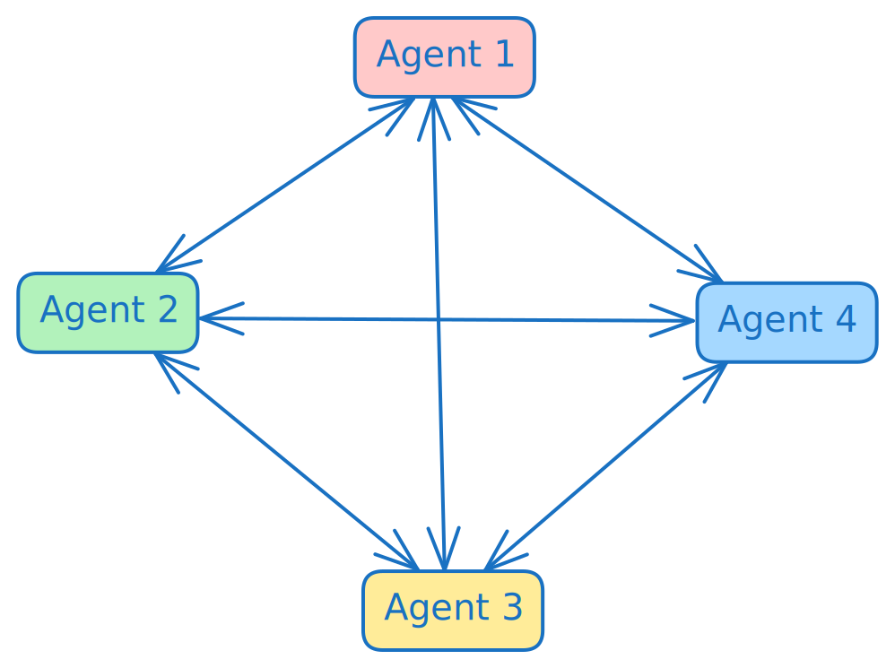
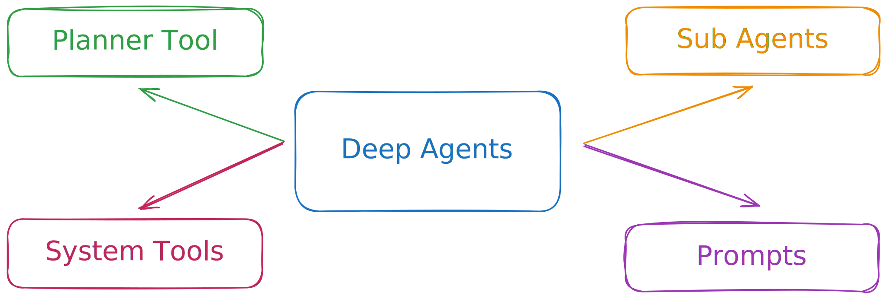
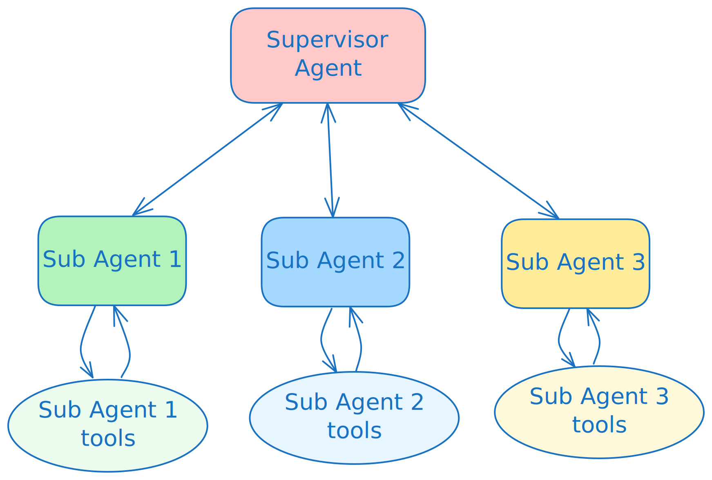
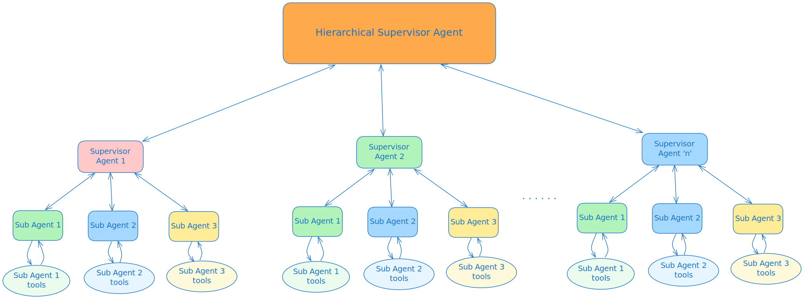
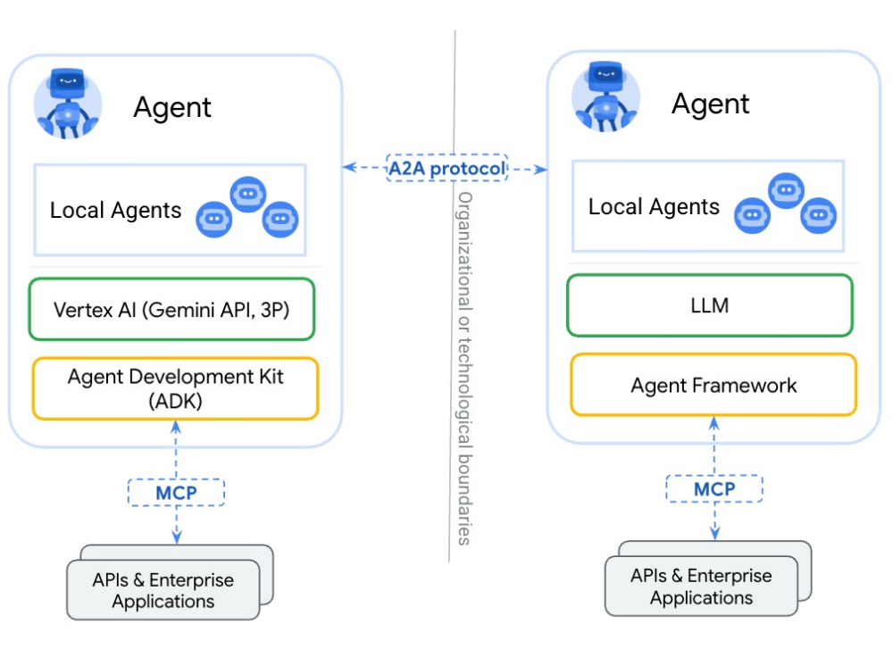
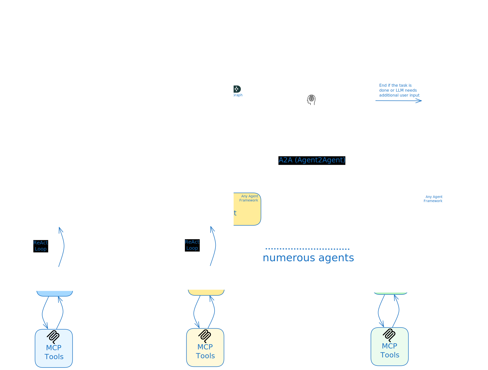
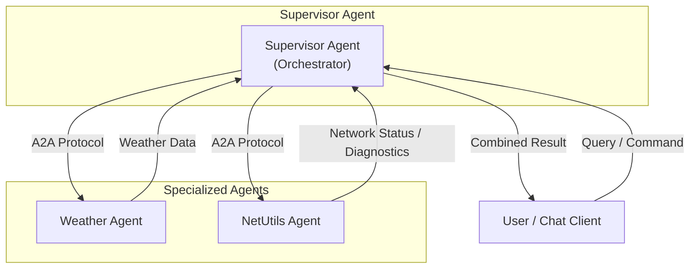
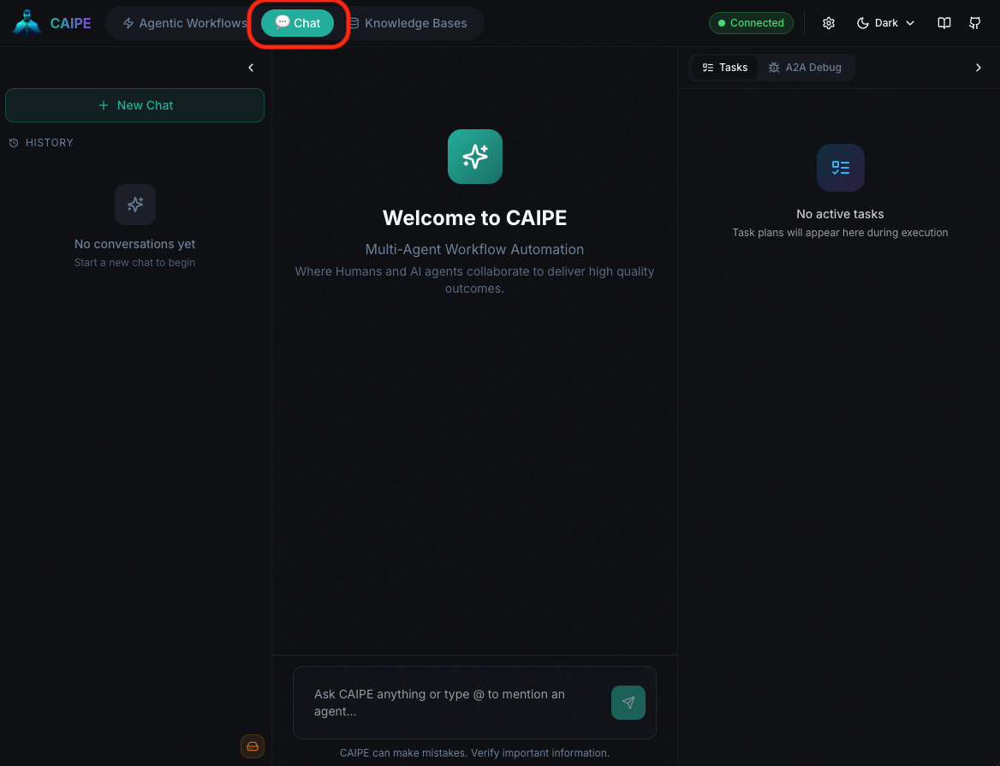

# Multi-Agent Systems and CAIPE

## 1. Overview

This is the second part of the AI agents lab series. In this part, you'll learn about Multi-Agent Systems (MAS) and build a cloud-native, production-ready MAS using CAIPE (Community AI Platform Engineering)—this time deploying to Kubernetes with Helm and Kind, featuring the weather agent and NetUtils agent.

**What you'll learn in this part:**

- Core concepts of Multi-Agent Systems (MAS)
- Common MAS architecture patterns
- The Agent-to-Agent (A2A) protocol
- How to deploy and interact with a multi-agent system
- How agents coordinate to solve complex, cross-domain problems
- Kubernetes-native deployment with Helm

**Prerequisites:**

- Completion of Part 1 (Introduction to AI Agents and ReAct Pattern)
- Basic understanding of AI agents and MCP
- A running CAIPE environment on Kubernetes (see below)
- [Kind](https://kind.sigs.k8s.io/) and [kubectl](https://kubernetes.io/docs/tasks/tools/) installed locally
- [Helm](https://helm.sh/) installed

**Get your environment ready:** Before starting this lab, you need CAIPE deployed on a Kubernetes cluster (e.g. Kind). The easiest way is to use the one-command setup script from the [ai-platform-engineering](https://github.com/cnoe-io/ai-platform-engineering) repo root:

```bash
git clone https://github.com/cnoe-io/ai-platform-engineering.git
cd ai-platform-engineering
./setup-caipe.sh
```

The script will create a Kind cluster (if needed), deploy CAIPE (supervisor, agents, UI), and prompt you for LLM credentials. When it finishes, you can open the CAIPE UI and run the exercises in this lab. For full options (non-interactive mode, RAG, tracing), see [Run CAIPE with KinD](/getting-started/kind/setup).

---

## 2. Understanding Multi-Agent Systems

### 2.1 What is a Multi-Agent System?

A **Multi-Agent System (MAS)** is an agentic AI system composed of multiple independent agents that interact and coordinate to achieve a common goal. Unlike single agents that handle all tasks themselves, MAS distributes work across specialized agents, each with specific expertise.

> [!TIP]
> Think of MAS like a company: instead of one person doing everything, you have specialists (sales, engineering, support) working together to achieve business goals.

**Key characteristics of MAS:**

- **Specialization**: Each agent focuses on a specific domain or capability
- **Autonomy**: Agents operate independently with their own decision-making
- **Coordination**: Agents communicate and collaborate to solve complex problems
- **Scalability**: New agents can be added without redesigning the entire system

---

### 2.2 Common MAS Architecture Patterns

There are several proven patterns for organizing multi-agent systems. Let's explore the most common ones:

#### Network/Swarm Architecture

In this pattern, agents communicate in a network using pub-sub, multicast, or broadcast groups. Each agent is aware of and can hand off tasks to any other agent in the group.

<center></center>

**Use cases:**

- Distributed problem-solving where any agent can contribute
- Systems requiring high redundancy and fault tolerance
- Scenarios where agent roles are fluid and interchangeable

---

#### Planner/Deep Agent Architecture

Simple ReAct agents can be "shallow"—they struggle with longer-running tasks and complex multi-turn conversations. Deep Research agents implement a planner-based architecture to plan tasks and invoke sub-agents, system tools, and human-in-the-loop interactions.

<center></center>

**Examples:** Claude Code, AWS Kiro CLI, research assistants

**Use cases:**

- Complex research tasks requiring multiple information sources
- Long-running workflows with checkpoints and human approval
- Tasks requiring strategic planning before execution

---

#### Supervisor Architecture

A supervisor agent orchestrates tasks among sub-agents, either within the same system or over a network. The supervisor routes requests, aggregates responses, and maintains overall task coordination.

<center></center>

**Use cases:**
- Systems with clear task delegation patterns
- Scenarios requiring centralized coordination
- Applications where sub-agents have distinct, non-overlapping capabilities

---

#### Hierarchical Supervisor Architecture

This pattern extends the supervisor model with multiple levels—supervisors managing other supervisors. This enables large-scale systems with complex organizational structures.

<center></center>

**Use cases:**

- Enterprise-scale systems with many specialized agents
- Organizations with complex reporting structures
- Systems requiring multiple levels of abstraction and delegation

---

### 2.3 Benefits of Multi-Agent Systems

**Specialization and Expertise**

- Each agent can be optimized for specific tasks
- Domain-specific knowledge and tools per agent
- Better performance than generalist agents

**Scalability**

- Add new capabilities by adding new agents
- Scale individual agents based on demand
- No need to retrain or reconfigure existing agents

**Maintainability**

- Changes to one agent don't affect others
- Easier to debug and test individual components
- Clear separation of concerns

**Resilience**

- System continues functioning if one agent fails
- Agents can be updated independently
- Graceful degradation of capabilities

---

## 3. The Agent-to-Agent (A2A) Protocol

### 3.1 What is A2A?

The **Agent-to-Agent (A2A) Protocol** is an open standard that enables AI agents to communicate over the network in a consistent, interoperable way. Instead of every system inventing custom APIs, A2A defines how agents announce their identity, capabilities, and how they exchange requests, responses, and streaming updates.

<center></center>

> [!TIP]
> Think of A2A as "HTTP for AI agents"—just as HTTP standardized web communication, A2A standardizes agent communication.

---

### 3.2 Agent Cards

Each agent exposes a **manifest** (typically at `.well-known/agent.json`) that other agents can discover and use to connect. This manifest is called an **agent card**.

**An agent card contains:**

- **Identity**: Agent name and description
- **Capabilities**: What the agent can do (its "cards")
- **Input/Output schemas**: Expected data formats
- **UI hints**: Optional display information

**Example structure:**
```json
{
  "name": "Weather Agent",
  "description": "Provides weather forecasts and current conditions",
  "capabilities": [
    {
      "name": "get_current_weather",
      "description": "Get current weather for a location",
      "input_schema": { "location": "string" },
      "output_schema": { "temperature": "number", "conditions": "string" }
    }
  ]
}
```

Other agents don't need to know implementation details — they just see "this agent offers these capabilities" and can safely call them over A2A.

---

### 3.3 How A2A Enables MAS

A2A makes multi-agent systems practical by providing:

1. **Discovery**: Agents can find and learn about other agents dynamically
2. **Interoperability**: Agents from different vendors can work together
3. **Loose coupling**: Agents don't need to know each other's internals
4. **Standardization**: Common protocol reduces integration complexity

This makes it easy to build systems where a planner agent delegates tasks to specialized agents (search, tools, UI, code execution, etc.) using a shared, well-defined protocol.

---

## 4. Introduction to CAIPE

### 4.1 What is CAIPE?

**CAIPE (Community AI Platform Engineering)** is a Multi-Agent System that provides a secure, scalable, persona-driven reference implementation with built-in knowledge base retrieval. It streamlines platform operations, accelerates workflows, and fosters innovation for modern engineering teams.

<center></center>

**Key features:**

- Production-ready multi-agent architecture
- Built-in A2A protocol support
- Modular agent design for easy extension
- Integration with MCP servers for tool access
- Web UI and CLI for agent interaction

---

### 4.2 CAIPE Demo System Architecture

In this lab, you'll deploy a multi-agent system that coordinates information across multiple domains. The system includes:

- **🌤️ Weather Agent**: Provides weather forecasts and current conditions
- **🔌 NetUtils Agent**: Offers network diagnostics and connectivity checks
- **🧠 Supervisor Agent**: Central coordinator that orchestrates complex operations requiring data from multiple specialized systems


```mermaid
graph TD
  subgraph supervisorBlock ["Supervisor Agent"]
    S["Supervisor Agent<br/>(Orchestrator)"]
  end

  subgraph agentBlock ["Specialized Agents"]
    W["Weather Agent"]
    NU["NetUtils Agent"]
  end

  U["User / Chat Client"]

  U -- "Query / Command" --> S
  S -- "A2A Protocol" --> W
  S -- "A2A Protocol" --> NU
  W -- "Weather Data" --> S
  NU -- "Network Status / Diagnostics" --> S
  S -- "Combined Result" --> U
```
<center>(Architecture diagram: Supervisor coordinating Weather and NetUtils Agents via A2A protocol.)</center>

**How it works:**

1. The weather and NetUtils agents connect to their respective MCP backends

2. The supervisor agent communicates with sub-agents using the A2A protocol

3. The supervisor exposes its own A2A interface for chat clients (CLI and UI)

This demonstrates **agent-to-agent communication** where the supervisor intelligently routes requests to specialized agents and combines their responses.

---

## 5. Deploy the Multi-Agent System on Kubernetes

Now let's deploy and run the CAIPE multi-agent system using Kubernetes, Helm, and Kind!

### Task 1: Verify Helm and OCI Access

The CAIPE Helm chart is published as an OCI artifact on the GitHub Container Registry. Verify you can access it:

```bash
helm show chart oci://ghcr.io/cnoe-io/charts/ai-platform-engineering --version 0.2.31
```

**What this does:**

- Confirms Helm can pull the CAIPE chart from the OCI registry
- No need to clone the repository or manage local chart files

---

### Task 2: Create a Local Kubernetes Cluster with Kind

If not already running, create a local Kind cluster:

```bash
kind create cluster --name caipe
```
> [!TIP]
> **If your Kind cluster named `caipe` already exists, you do NOT need to recreate it.**
>
> - To check if the cluster is running, use:
>
>   ```bash
>   kind get clusters
>   ```
>
>   If you see `caipe` in the output, your cluster is ready.
>
> - To delete and recreate the cluster (if you want a fresh start):
>
>   ```bash
>   kind delete cluster --name caipe
>   kind create cluster --name caipe
>   ```
>
Before you proceed with deploying CAIPE on Kubernetes, **make sure your kubectl context is set to your Kind cluster (`caipe`)**.
This ensures all subsequent Kubernetes commands are applied to the correct cluster.

Check your current context:
```bash
kubectl config current-context
```

If the output is not `kind-caipe`, switch to the Kind cluster context:
```bash
kubectl config use-context kind-caipe
```

You should see:
```
Switched to context "kind-caipe".
```

Now you're ready to continue deploying the multi-agent system to the correct Kubernetes environment!


Check your cluster with:

```bash
kubectl cluster-info --context kind-caipe
```

Create a dedicated namespace for the CAIPE deployment:

```bash
kubectl create namespace caipe
```

---

### Task 3: Configure Environment Variables

Configure your LLM credentials as a Kubernetes secret. The Helm chart expects a secret named `llm-secret` in the `caipe` namespace:

```bash
kubectl create secret generic llm-secret -n caipe \
  --from-literal=LLM_PROVIDER='openai' \
  --from-literal=OPENAI_API_KEY='sk-xxxxxxx' \
  --from-literal=OPENAI_ENDPOINT='https://api.openai.com/v1' \
  --from-literal=OPENAI_MODEL_NAME='gpt-5.2'
```

> [!IMPORTANT]
> Replace the values above with your actual LLM provider credentials from the lab environment.

---

### Task 4: Deploy with Helm from the OCI Registry

For this lab, we install the CAIPE Helm chart directly from the OCI registry and pass all configuration via `--set` flags on the command line. This means you **don't have to create or edit a `values.yaml` file**---you can just pass what you need with `--set` for each option in your deploy command.

**Why do it this way?**
- It's quicker for labs and experiments---no files to edit or keep track of.
- You can see exactly which features are turned on/off in your command.

For the lab, we enable: the UI, supervisor, weather, and NetUtils agents.

Deploy the chart:

```bash
helm upgrade --install caipe oci://ghcr.io/cnoe-io/charts/ai-platform-engineering \
  --namespace caipe \
  --version 0.2.31 \
  --set global.caipeUi.enabled=true \
  --set tags.agent-weather=true \
  --set tags.agent-netutils=true \
  --set caipe-ui.config.SSO_ENABLED=false \
  --set caipe-ui.env.A2A_BASE_URL=http://localhost:8000 \
  --wait
```

> [!TIP]
> **Corporate VPN / TLS Inspection (macOS):** If you are behind a corporate VPN or proxy that performs TLS inspection (e.g., Cisco AnyConnect), the agent pods will fail to connect to external endpoints like `api.openai.com` with SSL errors such as `CERTIFICATE_VERIFY_FAILED: unable to get local issuer certificate`. This affects the **supervisor, weather, and NetUtils agents** since they all make outbound HTTPS calls to the LLM provider.
>
> First, export the **full** macOS certificate trust store (both the system root CAs and any corporate/local certificates) and create a ConfigMap. You must include `SystemRootCertificates.keychain` to retain the standard root CAs (DigiCert, GlobalSign, etc.) needed to verify public endpoints:
>
> ```bash
> security find-certificate -a -p \
>   /System/Library/Keychains/SystemRootCertificates.keychain \
>   /Library/Keychains/System.keychain > /tmp/corp-ca-certs.pem
> kubectl create configmap corp-ca-certs -n caipe \
>   --from-file=ca-certificates.crt=/tmp/corp-ca-certs.pem
> ```
>
> Then re-run the Helm install with CA cert flags for **all three agents** (supervisor, weather, and NetUtils):
>
> ```bash
> helm upgrade --install caipe oci://ghcr.io/cnoe-io/charts/ai-platform-engineering \
>   --namespace caipe \
>   --version 0.2.31 \
>   --set global.caipeUi.enabled=true \
>   --set tags.agent-weather=true \
>   --set tags.agent-netutils=true \
>   --set caipe-ui.config.SSO_ENABLED=false \
>   --set caipe-ui.env.A2A_BASE_URL=http://localhost:8000 \
>   --set supervisor-agent.volumes[0].name=corp-ca-certs \
>   --set supervisor-agent.volumes[0].configMap.name=corp-ca-certs \
>   --set supervisor-agent.volumeMounts[0].name=corp-ca-certs \
>   --set supervisor-agent.volumeMounts[0].mountPath=/etc/ssl/certs/ca-certificates.crt \
>   --set supervisor-agent.volumeMounts[0].subPath=ca-certificates.crt \
>   --set supervisor-agent.volumeMounts[0].readOnly=true \
>   --set supervisor-agent.env.SSL_CERT_FILE=/etc/ssl/certs/ca-certificates.crt \
>   --set agent-weather.volumes[0].name=corp-ca-certs \
>   --set agent-weather.volumes[0].configMap.name=corp-ca-certs \
>   --set agent-weather.volumeMounts[0].name=corp-ca-certs \
>   --set agent-weather.volumeMounts[0].mountPath=/etc/ssl/certs/ca-certificates.crt \
>   --set agent-weather.volumeMounts[0].subPath=ca-certificates.crt \
>   --set agent-weather.volumeMounts[0].readOnly=true \
>   --set agent-weather.env.SSL_CERT_FILE=/etc/ssl/certs/ca-certificates.crt \
>   --set agent-netutils.volumes[0].name=corp-ca-certs \
>   --set agent-netutils.volumes[0].configMap.name=corp-ca-certs \
>   --set agent-netutils.volumeMounts[0].name=corp-ca-certs \
>   --set agent-netutils.volumeMounts[0].mountPath=/etc/ssl/certs/ca-certificates.crt \
>   --set agent-netutils.volumeMounts[0].subPath=ca-certificates.crt \
>   --set agent-netutils.volumeMounts[0].readOnly=true \
>   --set agent-netutils.env.SSL_CERT_FILE=/etc/ssl/certs/ca-certificates.crt \
>   --wait
> ```
>
> You only need to do this once per Kind cluster. If you already deployed without the CA certs, you can re-run the above command and Helm will upgrade the existing release in place.

> You can adjust or add other overrides via additional `--set` flags as needed. Check the [chart values](https://github.com/cnoe-io/ai-platform-engineering/blob/main/charts/ai-platform-engineering/values.yaml) for more configurable options.

This single command pulls the chart from the OCI registry and deploys the full MAS system to your local Kind cluster.

**What this does:**

- Installs the CAIPE Helm chart version 0.2.31 from the GitHub Container Registry
- Enables the supervisor agent (always included), weather, and NetUtils sub-agents via tags
- Enables the CAIPE web UI
- Schedules each agent as a Kubernetes Deployment and Service
- Sets up service discovery and A2A connectivity between agents

> [!IMPORTANT]
> The deployment may take 1-2 minutes as pods start and agents initialize connections.

To monitor rollout:

```bash
kubectl get pods -n caipe
```

```bash
kubectl logs deployment/caipe-supervisor-agent -n caipe
```

---

## 6. Verify Agent Deployment

### Task 6: Monitor Agent Logs

Let's verify each agent started successfully by checking their logs via `kubectl`:

#### Weather Agent

```bash
kubectl logs deployment/caipe-agent-weather -n caipe
```

**Expected output:**
```
===================================
       WEATHER AGENT CONFIG
===================================
AGENT_URL: http://0.0.0.0:8000
===================================
Running A2A server in p2p mode.
INFO:     Waiting for application startup.
INFO:     Application startup complete.
INFO:     Uvicorn running on http://0.0.0.0:8000 (Press CTRL+C to quit)
```

**What to look for:**

- ✅ Agent configuration displayed
- ✅ A2A server running
- ✅ Successful startup and agent card requests

---

#### NetUtils Agent

```bash
kubectl logs deployment/caipe-agent-netutils -n caipe
```

**Expected output:**
```
===================================
    NETUTILS AGENT CONFIG
===================================
AGENT_URL: http://0.0.0.0:8000
===================================
Running A2A server in p2p mode.
INFO:     Waiting for application startup.
INFO:     Application startup complete.
INFO:     Uvicorn running on http://0.0.0.0:8000 (Press CTRL+C to quit)
```

---

#### Supervisor Agent

```bash
kubectl logs deployment/caipe-supervisor-agent -n caipe
```

**Expected output:**
```
[INFO] [_serve:83] Started server process [1]
[INFO] [startup:48] Waiting for application startup.
[INFO] [startup:62] Application startup complete.
[INFO] [_log_started_message:215] Uvicorn running on http://0.0.0.0:8000 (Press CTRL+C to quit)
```

**What to look for:**

- ✅ Server process started
- ✅ Application startup complete
- ✅ Uvicorn running
- ✅ Log messages showing successful agent registration/discovery

The supervisor performs dynamic monitoring and removes unavailable agents from the toolset until they return.

---

## 7. Explore Agent Capabilities

### Task 7: Inspect Agent Cards

Fetch each agent's capabilities via a port-forwarded service. First, port-forward a service:

```bash
kubectl port-forward service/caipe-agent-weather 8002:8000 -n caipe
kubectl port-forward service/caipe-agent-netutils 8014:8000 -n caipe
kubectl port-forward service/caipe-supervisor-agent 8000:8000 -n caipe
```

#### Weather Agent Card

```bash
curl http://localhost:8002/.well-known/agent.json | jq
```

**What you'll see:**

- Agent name and description
- Available weather-related capabilities
- Input/output schemas for each capability
- Endpoint information

---

#### NetUtils Agent Card

```bash
curl http://localhost:8014/.well-known/agent.json | jq
```

**What you'll see:**

- Agent name and description
- Network diagnostic capabilities (e.g., ping, DNS check)
- Input/output schemas for each capability
- Endpoint information

---

#### Supervisor Agent Card

```bash
curl http://localhost:8000/.well-known/agent.json | jq
```

**What you'll see:**

- Combined capabilities from all sub-agents
- Routing and orchestration capabilities
- Aggregated schemas from weather and NetUtils agents

> [!NOTE]
> The supervisor's agent card dynamically reflects the capabilities of all connected sub-agents. This is the power of A2A—automatic capability discovery and aggregation!

---

## 8. Interact with the Multi-Agent System

### Task 8: Open Caipe UI

Access the web interface for a visual chat experience. Port-forward the UI service:

```bash
kubectl port-forward service/caipe-caipe-ui 3000:3000 -n caipe
```

Then open your browser to [http://localhost:3000](http://localhost:3000).

**Features:**

- Visual chat interface
- Real-time agent responses
- Capability discovery
- Multi-turn conversations

<center></center>

---

### Task 9: Test Agent Discovery

Try these prompts to explore the multi-agent system:

**Discover available agents:**
```text
What agents are available?
```

**Explore capabilities:**
```text
What can you help me with?
```

**Expected behavior:**

The supervisor will report capabilities from both the weather and NetUtils agents, demonstrating dynamic capability aggregation.

---

### Task 10: Test Weather Agent

Try weather-specific queries:

**Current conditions:**
```text
What's the current weather in San Francisco?
```

**Forecast:**
```text
Give me a 5-day forecast for London
```

**What's happening behind the scenes:**

1. Your query goes to the supervisor agent
2. The supervisor identifies this as a weather-related request
3. The supervisor routes the request to the weather agent via A2A
4. The weather agent calls its MCP server to get real data
5. The response flows back through the supervisor to you

You can check logs in another terminal tab:

```bash
kubectl logs -f deployment/caipe-supervisor-agent -n caipe
```

---

### Task 11: Test NetUtils Agent

Try network diagnostic queries:

**Ping a host:**
```text
Check if google.com is reachable.
```

**DNS resolve:**
```text
Can you resolve the DNS for api.github.com?
```

**What's happening:**

1. The supervisor receives your network-related query
2. It routes the request to the NetUtils agent
3. The NetUtils agent performs diagnostics using its tools/MCP backend
4. Results are returned through the supervisor

---

### Task 12: Test Cross-Agent Scenarios

Try queries that require both agents to work together:

**Multi-domain query:**
```text
Get me today's weather for New York, and also test if api.github.com is reachable. Summarize both results.
```

**Complex reasoning:**
```text
Based on current weather in Berlin, do a network check to the local weather data API endpoint and summarize both the weather and the network results.
```

**What's happening:**

1. The supervisor analyzes the query and identifies which agents are needed
2. It calls the weather agent to get weather data
3. It calls the NetUtils agent to do the requested checks
4. It uses the LLM to reason about and synthesize an answer

Observe how the UI displays agent tool calls, information flow, and the synthesized response.

---

## 9. Alternative: CLI Chat Client

### Task 13: Connect via CLI

You can also interact with the multi-agent system using a text-based CLI client.

Port-forward the supervisor if not already:

```bash
kubectl port-forward service/caipe-supervisor-agent 8000:8000 -n caipe
```

Then run:

```bash
uvx https://github.com/cnoe-io/agent-chat-cli.git a2a
```

> [!NOTE]
> When prompted to `💬 Enter token (optional): `, just press enter ⏎.
> In production, your system will use a JWT or Bearer token for authentication here.

**Try a test query:**
```text
What's the current weather in San Francisco?
```

**When finished, exit the chat CLI with Ctrl+C.**

---

## 10. Clean Up

### Task 14: Stop the System

When you're done exploring, delete the CAIPE deployment and Kind cluster:

```bash
helm uninstall caipe -n caipe
kind delete cluster --name caipe
```

**What this does:**

- Gracefully deletes all Kubernetes resources
- Tears down the Kind cluster and underlying containers

---

## 11. Summary

Congratulations! You've completed Part 2 of the AI Agents lab series. Here's what you accomplished:

✅ Understood Multi-Agent System (MAS) concepts and architecture patterns
✅ Learned about the Agent-to-Agent (A2A) protocol
✅ Deployed a cloud-native, production MAS with CAIPE using Helm and Kind
✅ Explored agent cards and capability discovery
✅ Tested single-agent and cross-agent interactions using weather and network tools
✅ Used both CLI and web UI to interact with agents

### Key Takeaways from Part 2

1. **Multi-Agent Systems enable specialization** - Each agent focuses on what it does best
2. **A2A protocol standardizes agent communication** - Like HTTP for AI agents
3. **Agent cards enable dynamic discovery** - Agents can find and use each other's capabilities
4. **Supervisor patterns coordinate complex tasks** - Central orchestration with specialized sub-agents
5. **MAS provides resilience and scalability** - Systems continue functioning even if individual agents fail

### Architecture Patterns Learned

- **Network/Swarm**: Peer-to-peer agent communication
- **Planner/Deep Agent**: Strategic planning with sub-agent execution
- **Supervisor**: Centralized coordination of specialized agents
- **Hierarchical**: Multi-level supervision for enterprise scale

### What's Next?

Continue exploring advanced topics:

- Building custom agents for your domain
- Implementing advanced coordination patterns
- Adding authentication and security
- Scaling multi-agent systems in production

### Additional Resources

For deeper exploration:

- **[Cisco Blog - Deep Dive into MAS](https://cisco.com/blog/architecting-jarvis-technical-deep-dive-into-its-multi-agent-system-design)**: Detailed MAS architecture patterns
- **[LangChain - Multi-Agent Systems](https://langchain-ai.github.io/langgraph/concepts/multi_agent/)**: Framework-specific guidance
- **[LangChain - Benchmarking Multi-Agent Architectures](https://blog.langchain.com/benchmarking-multi-agent-architectures/)**: Performance comparisons
- **[CAIPE GitHub Repository](https://github.com/cnoe-io/ai-platform-engineering)**: Source code and documentation
- **[A2A Protocol Specification](https://a2a.dev/)**: Protocol details and standards

---

**Part 2 Complete!** You now understand how to build and deploy Kubernetes-native multi-agent systems that coordinate specialized agents, such as weather and network utilities, to solve complex, cross-domain problems.
