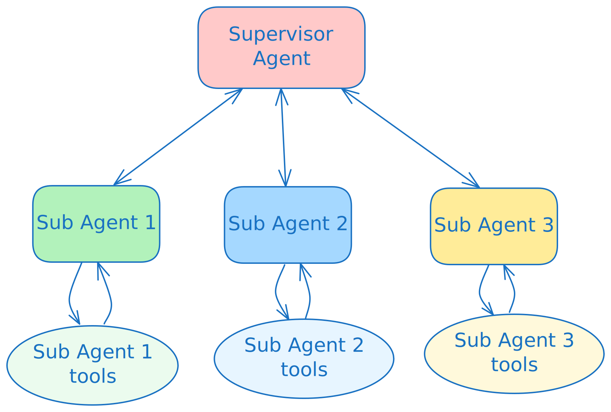

# What is a Multi-Agent Systems (MAS)

A Multi-Agent System (MAS) is an agentic AI system composed of multiple, independent and interacting agents to achieve a common goal

Here are some example MAS architecture patterns:

### MAS Network/Swarm Architecture

MAS architecture where agents communitcate in a network like pub-sub, multi-cast or broadcast groups. Each agent is aware of and can hand-off to any other agent(s) in the group


### MAS Planner/Deep Agent Architecture

Simple ReAct agents can yield agents that are “shallow”. They are particularly not very good at longer running tasks, more complex tasks with mutli-turn conversations.

A class MAS systems called “Deep Research” agents implement a planner based architecture, to plan a set of tasks and invoke the sub-agents, system tools in combination with Human-in-the-loop. Examples: Claude Code, AWS Q Cli etc.


### - MAS Supervisor Architecture

A supervisor agent orchestrates tasks with a bunch of sub-agents with the same system or over network




### MAS Hierarchical Supervisor Architecture

Supervisor of Supervisor agents


**References:**

* [Outshift blog - Deep dive into MAS](https://outshift.cisco.com/blog/architecting-jarvis-technical-deep-dive-into-its-multi-agent-system-design)
* [LangChain - Multi-agent systems](https://langchain-ai.github.io/langgraph/concepts/multi_agent/)
* [LangChain - Benchmarking Multi-Agent Architectures](https://blog.langchain.com/benchmarking-multi-agent-architectures/)

## CAIPE MAS Architecture

CAIPE is a Multi-Agentic AI System (MAS) that provides a secure, scalable, persona-driven reference implementation with built-in knowledge base retrieval that streamlines platform operations, accelerates workflows, and fosters innovation for modern engineering teams.


### Multi-Agent Weather + Petstore System

Let's first deploy and run a **multi-agent system** that coordinates information across multiple domains. CAIPE includes 2 agents that can be used for testing/demo purposes along with the Supervisor agent responsible for coordinating the subagents:

- **🐾 Petstore Agent**: manages a store with pets available for adoption
- **🌤️ Weather Agent**: provides information about weather forecast
- **🧠 Supervisor Agent**: Acts as the central coordinator, orchestrating complex operations that require data from multiple specialized systems

### Architecture Overview


This demonstrates **agent-to-agent communication** where the supervisor can intelligently route requests to specialized agents and combine their responses.

The petstore and weather agents connect with their respective remote MCP servers that are hosted by Outshift at:

 * https://petstore.outshift.io/mcp: mcp server containing data for the available pet companions

 * https://weather.outshift.io/mcp: mcp server that can retrieve real weather data using the Open-Meteo API

The supervisor agent communicates with the 2 subagents using the A2A protocol. Also it hats on its own an A2A interface which we will consume from the Chat clients (CLI and UI)

### A2A Protocol

The Agent2Agent (A2A) Protocol is an open standard that lets AI agents talk to each other over the network in a consistent, interoperable way. Instead of every system inventing its own custom API, A2A defines how agents announce who they are, what they can do (their capabilities), and how they exchange requests, responses, and streaming updates.


Each agent exposes a small manifest (like .well-known/agent.json) that other agents can discover and use to connect, the agent card. A card is a structured, declarative description of something an agent can do (a capability), including its input/output schema, description, and optional UI hints. Other agents don’t need to know the implementation details—they just see “this agent offers these cards” and can safely call them over A2A. This makes it easy to build multi-agent systems where a planner agent can delegate tasks to specialized agents (search, tools, UI, code execution, etc.) using a shared, well-defined protocol.

We will show the A2A cards of the different agents in the following sections.

### Clone the CAIPE (Community AI Platform Engineering) repository

```bash
cd $HOME/work
git clone https://github.com/cnoe-io/ai-platform-engineering
```

Copy the environment file provided

```bash
cd $HOME/work/ai-platform-engineering
cp .env.example .env
```

### Customize the deployment

As explained before, the LLM connectivity details are already provided in the environment.

We just need to populate the needed variables in the ai-platform engineering .env file

We also add the reqiuired key for the MCP petstore server(details will follow).

```bash
sed -i "s|^AZURE_OPENAI_API_KEY=.*|AZURE_OPENAI_API_KEY='${AZURE_OPENAI_API_KEY}'|" $HOME/work/ai-platform-engineering/.env
sed -i "s|^AZURE_OPENAI_API_VERSION=.*|AZURE_OPENAI_API_VERSION='${AZURE_OPENAI_API_VERSION}'|" $HOME/work/ai-platform-engineering/.env
sed -i "s|^AZURE_OPENAI_DEPLOYMENT=.*|AZURE_OPENAI_DEPLOYMENT='${AZURE_OPENAI_DEPLOYMENT}'|" $HOME/work/ai-platform-engineering/.env
sed -i "s|^AZURE_OPENAI_ENDPOINT=.*|AZURE_OPENAI_ENDPOINT='${AZURE_OPENAI_ENDPOINT}'|" $HOME/work/ai-platform-engineering/.env
sed -i "s|^LLM_PROVIDER=.*|LLM_PROVIDER='${LLM_PROVIDER}'|" $HOME/work/ai-platform-engineering/.env
sed -i "s|^PETSTORE_API_KEY=.*|PETSTORE_API_KEY='${PETSTORE_API_KEY}'|" $HOME/work/ai-platform-engineering/.env
```

Adjust the url of the supervisor agent for the chat UI to match the LAB environment.
AgentForge is an UI that caipe.io is providing which is a Backstage plugin. In this exercise we will use it as a separated UI, without deploying Backstage.
```bash
sed -i "s|^AGENT_FORGE_BASE_URL=.*|AGENT_FORGE_BASE_URL=https://%%LABURL%%:6006|" $HOME/work/ai-platform-engineering/.env
```

#### Enable the needed agents to be deployed.

For now we enable the petstore and the weather agents.

```text
ENABLE_WEATHER=true
ENABLE_PETSTORE=true
ENABLE_AGENTFORGE=true
```

```bash
sed -i "s|^ENABLE_WEATHER=.*|ENABLE_WEATHER=true|" $HOME/work/ai-platform-engineering/.env
sed -i "s|^ENABLE_PETSTORE=.*|ENABLE_PETSTORE=true|" $HOME/work/ai-platform-engineering/.env
sed -i "s|^ENABLE_AGENTFORGE=.*|ENABLE_AGENTFORGE=true|" $HOME/work/ai-platform-engineering/.env
```

## Start the caipe stack

Start the deployment.

```bash
cd $HOME/work/ai-platform-engineering
./deploy.sh
```

## Monitor the container logs

Look out for the following logs for each agent (if nothing is displayed please re-run the command until the container is started and you see some output):

### Petstore agent logs

```bash
docker logs agent-petstore
```

```
...
===================================
       PETSTORE AGENT CONFIG
===================================
AGENT_URL: http://0.0.0.0:8000
===================================
Running A2A server in p2p mode.
INFO:     Started server process [1]
INFO:     Waiting for application startup.
INFO:     Application startup complete.
INFO:     Uvicorn running on http://0.0.0.0:8000 (Press CTRL+C to quit)
INFO:     172.18.0.5:34574 - "GET /.well-known/agent-card.json HTTP/1.1" 200 OK
```

### Weather agent logs

```bash
docker logs agent-weather
```

```
...
===================================
       WEATHER AGENT CONFIG
===================================
AGENT_URL: http://0.0.0.0:8000
===================================
Running A2A server in p2p mode.
INFO:     172.18.0.5:52742 - "GET /.well-known/agent-card.json HTTP/1.1" 200 OK
```

### Supervisor agent logs

The supervisor agent logs can be quite verbose as it checks for multiple possible agents. Here's how to filter for the key success indicators:

```bash
docker logs caipe-supervisor 2>&1 | grep -F -B8 'Uvicorn running on http://0.0.0.0:8000'
```

This will show the logs from the start of the supervisor agent until the Uvicorn server is running like below:

```
...
[INFO] [_serve:83] Started server process [1]
[INFO] [startup:48] Waiting for application startup.
[INFO] [startup:62] Application startup complete.
[INFO] [_log_started_message:215] Uvicorn running on http://0.0.0.0:8000 (Press CTRL+C to quit)
```

> success 🎯 Success indicator
> Wait until you see all three agents running and the supervisor reports successful connectivity checks as shown in the logs above.

Dynamic monitoring is performed in the background and will check if the petstore and weather agents are running every 5 minutes. If any of the agents is unavailable, the supervisor agent will remove it from available tools until it is back online.

## Show the agents A2A cards

We can now check each agent card to see what capabilities are available.

### Weather agent card

```bash
curl http://localhost:8002/.well-known/agent.json | jq
```

### Petstore agent card

```bash
curl http://localhost:8013/.well-known/agent.json | jq
```

### Supervisor agent card

This is the supervisor agent card. It will show the combined capabilities of the petstore and weather agents.

```bash
curl http://localhost:8000/.well-known/agent.json | jq
```

## Connect Multi-Agent Chat CLI Client

Once all agents are running, start the chat client:

```bash
uvx https://github.com/cnoe-io/agent-chat-cli.git a2a
```

> Tip
> When asked to `💬 Enter token (optional): `, just press enter ⏎.
>
> In production, your system will use a JWT or Bearer token for authentication here.


The client will connect to the supervisor agent and show available capabilities from both petstore and weather agents.

## Test Multi-Agent Interactions

---

### Discovery Commands

Try these to explore the multi-agent capabilities:

```bash
What agents are available?
```

```bash
What can you help me with?
```

### Weather-Specific Commands

---

For weather data, you can use the following commands:

```bash
What's the current weather in San Francisco?
```

```bash
Give me a 5-day forecast for London
```

### Petstore Commands

```bash
Get me all the available pets
```

```bash
Show me pets with 'Hot Climate Lover' tags
```

You can start a new terminal if needed and follow the logs to see the chain of interactions in order to retrieve the response to your questions.

When finished be sure to exit the chat CLI client using Ctrl + c.

## Open AgentForge UI

We also provide a web UI for interacting with the CAIPE agent.

**[Open Agent Forge (using localhost)](http://localhost:13000)**


### Cross-Agent Scenarios

Click on the CAIPE icon and use the UI to test scenarios that require both agents:

```text
Is it going to rain in Tokyo tomorrow and also a summary of pets by status.
```

```text
Considering the weather in Paris right now, what is the best pet available that I can adapt? First, get all the available pets and then based on the weather, provide the best pet recommendation.
```

## Stop the containers

Go back to terminal and stop all containers to continue to the next section

```bash
cd $HOME/work/ai-platform-engineering
./deploy.sh stop
```
