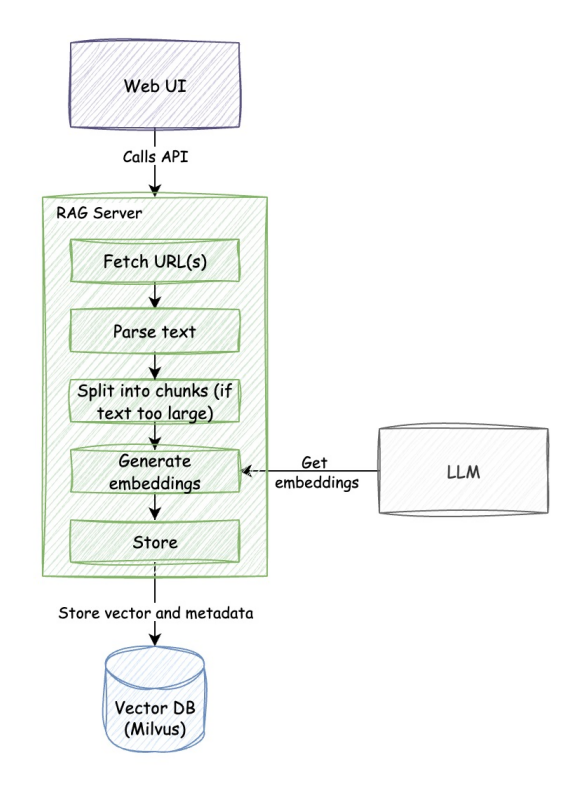
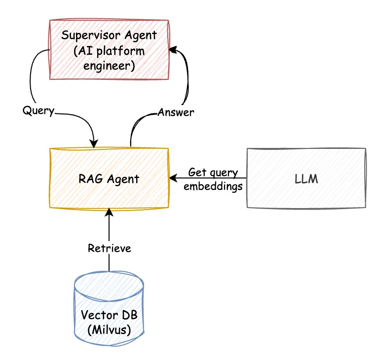
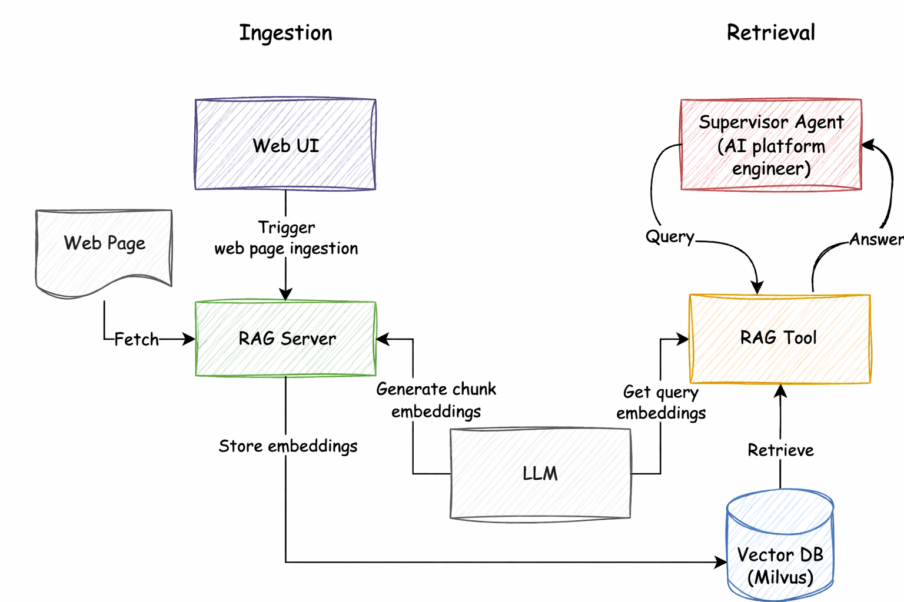
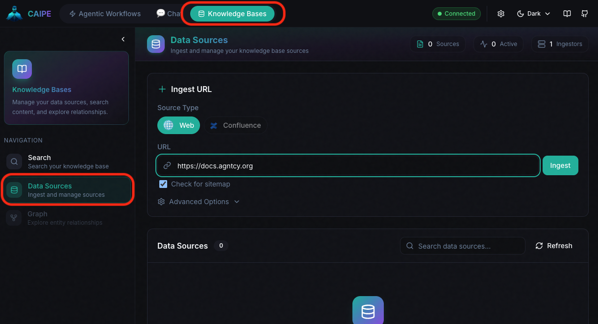
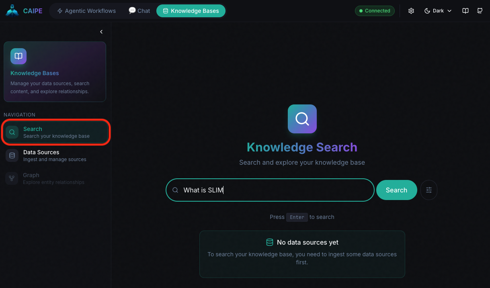

# RAG and Git Agents

## 1. Overview

This is the third part of the AI agents lab series. In this part, you'll learn about Retrieval-Augmented Generation (RAG) and build a multi-agent system that combines knowledge retrieval with version control automation.

**What you'll learn in this part:**

- Core concepts of Retrieval-Augmented Generation (RAG)
- How RAG enhances LLM responses with external knowledge
- Vector databases and semantic search
- Building a RAG-powered agent for documentation queries
- Integrating Git automation with AI agents
- Coordinating multiple specialized agents for complex workflows

**Prerequisites:**

- Completion of Part 1 and Part 2
- Understanding of multi-agent systems and A2A protocol
- Access to Azure OpenAI (credentials provided in lab environment)
- GitHub personal access token (provided in lab environment)

---

## 2. Understanding Retrieval-Augmented Generation (RAG)

### 2.1 What is RAG?

**Retrieval-Augmented Generation (RAG)** is a technique that enhances LLM responses by retrieving relevant information from external knowledge sources before generating an answer. Instead of relying solely on the model's training data, RAG dynamically fetches up-to-date, domain-specific information.

> [!NOTE]
> Think of RAG like an open-book exam: instead of memorizing everything, the LLM can look up relevant information when needed, leading to more accurate and current responses.

**Key benefits of RAG:**

- **Up-to-date information**: Access current data beyond the model's training cutoff
- **Domain expertise**: Incorporate specialized knowledge not in the base model
- **Reduced hallucinations**: Ground responses in actual retrieved documents
- **Transparency**: Cite sources and provide evidence for answers
- **Cost-effective**: Avoid expensive model retraining for new information

---

### 2.2 How RAG Works

RAG operates in two main phases: **ingestion** and **retrieval**.

#### Ingestion Phase

This is the process of preparing your knowledge base:

1. **Document Collection**: Gather documents (web pages, PDFs, markdown files, etc.)
2. **Content Extraction**: Parse and extract text from various formats
3. **Chunking**: Split documents into smaller, manageable pieces
4. **Embedding**: Convert text chunks into vector representations
5. **Storage**: Store embeddings in a vector database with metadata

<center></center>

**Why chunking matters:**
- LLMs have token limits for context windows
- Smaller chunks enable more precise retrieval
- Better matching between queries and relevant content

**Common chunking strategies:**
- **Recursive Text Splitter**: Splits on paragraphs, then sentences, then words
- **Fixed-size chunks**: Equal-sized segments with optional overlap
- **Semantic chunking**: Split based on topic or meaning boundaries

---

#### Retrieval Phase

This is how the system answers queries:

1. **Query Embedding**: Convert the user's question into a vector
2. **Similarity Search**: Find the most similar document chunks in the vector database
3. **Context Assembly**: Gather the top-k most relevant chunks
4. **Augmented Generation**: Pass the query + retrieved context to the LLM
5. **Response**: LLM generates an answer grounded in the retrieved information

<center></center>

**Key insight:** The same embedding model must be used for both ingestion and retrieval to ensure vectors are in the same semantic space.

---

### 2.3 Vector Databases

**Vector databases** are specialized storage systems optimized for similarity search on high-dimensional vectors (embeddings).

**Popular vector databases:**
- **Milvus**: Open-source, highly scalable
- **Pinecone**: Managed service, easy to use
- **Weaviate**: GraphQL API, hybrid search
- **Chroma**: Lightweight, developer-friendly

**How similarity search works:**

Vector databases use algorithms like:
- **Cosine similarity**: Measures angle between vectors
- **Euclidean distance**: Measures straight-line distance
- **Dot product**: Measures alignment of vectors

These enable finding semantically similar content even when exact words don't match.

---

### 2.4 RAG System Architecture

In this lab, you'll deploy a complete RAG system with these components:

<center></center>

**Components:**

- **RAG Server**: Handles ingestion and retrieval operations
- **RAG Agent**: Interfaces with the supervisor using A2A protocol
- **Milvus**: Vector database for storing embeddings
- **RAG Web UI**: Interface for managing knowledge base
- **Embedding Model**: Azure OpenAI for generating embeddings

---

## 3. Introduction to Git Agent

### 3.1 What is the Git Agent?

The **Git Agent** is a specialized agent that automates version control operations. It can perform git commands like commits, pushes, and repository management through natural language instructions.

**Capabilities:**

- Create and commit files to repositories
- Push changes to remote branches
- Manage repository operations
- Handle authentication securely

**Use cases:**

- Automated documentation updates
- Report generation and archival
- Code snippet management
- Collaborative workflows with AI assistance

---

### 3.2 Multi-Agent Workflow

In this lab, you'll see how the RAG and Git agents work together:

1. **Research**: RAG agent retrieves information from documentation
2. **Synthesis**: Supervisor coordinates report generation
3. **Persistence**: Git agent commits the report to a repository

This demonstrates how specialized agents collaborate to complete complex, multi-step workflows.

---

## 4. Deploy the RAG and Git System

Now let's deploy the multi-agent system with RAG and Git capabilities!

Clomne the repository in case it was not cloned already:
```bash
if [ ! -d "$HOME/work/ai-platform-engineering" ]; then
    cd $HOME/work
    git clone https://github.com/cnoe-io/ai-platform-engineering
fi
```

Copy the example environment file:

```bash
cd $HOME/work/ai-platform-engineering
cp -f .env.example .env
```


### Task 1: Configure Environment Variables

Populate Azure OpenAI and GitHub credentials:

```bash
sed -i "s|^LLM_PROVIDER=.*|LLM_PROVIDER='${LLM_PROVIDER}'|" $HOME/work/ai-platform-engineering/.env
sed -i "s|^AZURE_OPENAI_API_KEY=.*|AZURE_OPENAI_API_KEY='${AZURE_OPENAI_API_KEY}'|" $HOME/work/ai-platform-engineering/.env
sed -i "s|^AZURE_OPENAI_API_VERSION=.*|AZURE_OPENAI_API_VERSION='${AZURE_OPENAI_API_VERSION}'|" $HOME/work/ai-platform-engineering/.env
sed -i "s|^AZURE_OPENAI_DEPLOYMENT=.*|AZURE_OPENAI_DEPLOYMENT='${AZURE_OPENAI_DEPLOYMENT}'|" $HOME/work/ai-platform-engineering/.env
sed -i "s|^AZURE_OPENAI_ENDPOINT=.*|AZURE_OPENAI_ENDPOINT='${AZURE_OPENAI_ENDPOINT}'|" $HOME/work/ai-platform-engineering/.env
sed -i "s|^GITHUB_PERSONAL_ACCESS_TOKEN=.*|GITHUB_PERSONAL_ACCESS_TOKEN=${GITHUB_PERSONAL_ACCESS_TOKEN}|" $HOME/work/ai-platform-engineering/.env
echo "EMBEDDINGS_PROVIDER=${LLM_PROVIDER}" >> $HOME/work/ai-platform-engineering/.env
```

**What this does:**
- Configures Azure OpenAI for LLM and embedding operations
- Sets up GitHub authentication for repository access
- Prepares the environment for RAG system and Git agent

Adjust backend URLs accessed from the UI to match the lab

```bash
sed -i "s|^NEXT_PUBLIC_A2A_BASE_URL=.*|NEXT_PUBLIC_A2A_BASE_URL=https://%%LABURL%%:3000|" $HOME/work/ai-platform-engineering/.env
sed -i "s|^NEXT_PUBLIC_RAG_URL=.*|NEXT_PUBLIC_RAG_URL=https://%%LABURL%%:19446|" $HOME/work/ai-platform-engineering/.env
```

---

### Task 2: Enable RAG and Git Agents

Enable the required agents and disable the previous ones:

```bash
sed -i "s|^ENABLE_RAG=.*|ENABLE_RAG=true|" $HOME/work/ai-platform-engineering/.env
sed -i "s|^NEXT_PUBLIC_RAG_ENABLED=.*|NEXT_PUBLIC_RAG_ENABLED=true|" $HOME/work/ai-platform-engineering/.env
sed -i "s|^ENABLE_GITHUB=.*|ENABLE_GITHUB=true|" $HOME/work/ai-platform-engineering/.env
sed -i "s|^ENABLE_CAIPE_UI=.*|ENABLE_CAIPE_UI=true|" $HOME/work/ai-platform-engineering/.env
sed -i "s|^ENABLE_WEATHER=.*|ENABLE_WEATHER=false|" $HOME/work/ai-platform-engineering/.env
sed -i "s|^ENABLE_NETUTILS=.*|ENABLE_NETUTILS=false|" $HOME/work/ai-platform-engineering/.env
```

**What this does:**

- Enables the RAG system for knowledge retrieval
- Enables the Git agent for version control operations
- Enables the CAIPE UI
- Disables the weather and NetUtils agents from Part 2

---

### Task 3: Deploy the System

Start all services:

```bash
cd $HOME/work/ai-platform-engineering
./deploy.sh
```

**What this deploys:**

The Docker Compose stack starts these services:

- `caipe-supervisor`: Platform engineer supervisor agent
- `agent-github`: Git automation agent
- `rag_server`: RAG backend server
- `web-ingestor`: Web content ingestion service
- `caipe-ui`: Web interface for agent management
- `milvus-standalone`: Vector database
- `milvus-etcd`: Milvus metadata storage
- `milvus-minio`: Milvus object storage
- `rag-redis`: Redis cache for RAG operations

> [!NOTE]
> The deployment may take 2-3 minutes as it starts the vector database and all agents and  services.

> [!IMPORTANT]
> Wait until this process is completed before proceeding.

---

### Task 4: Verify Supervisor Agent

Check that the supervisor agent is healthy:

```bash
curl http://localhost:8000/.well-known/agent.json | jq
```

**Expected output:**
A JSON object containing the A2A agent card with capabilities from RAG and Git agents.

> [!NOTE]
> The response should be a JSON object (the A2A agent card). If you get an error, wait 1-2 minutes and try again — the agents are still starting up.

**What to look for:**

- ✅ RAG-related capabilities (search, retrieval)
- ✅ Git-related capabilities (commit, push)
- ✅ Valid JSON structure


The supervisor agent detects automatically what agents and tools are started and builds its capabilities around that. 
This is a continuous process - it re-tries to identify if there are any changes in the environment every 5 minutes. 
We will check if the RAG tool was identified at startup - if the RAG MCP was not started before the first identification we will restrart the caipe-supervisor container in order to force a new detection instead of waiting 5 minutes

```bash
docker logs caipe-supervisor 2>&1 | grep "RAG tools" 
```
The output should look similar to:

```
$ docker logs caipe-supervisor 2>&1 | grep "RAG tools"
2026-02-07 00:02:46 [ai_platform_engineering.multi_agents.platform_engineer.deep_agent] [INFO] [_load_rag_tools:165] Loading RAG tools from MCP server...
2026-02-07 00:02:46 [ai_platform_engineering.multi_agents.platform_engineer.deep_agent] [INFO] [_load_rag_tools:167] ✅ Loaded 3 RAG tools: ['search', 'fetch_document', 'fetch_datasources_and_entity_types']
2026-02-07 00:02:46 [ai_platform_engineering.multi_agents.platform_engineer.deep_agent] [INFO] [_build_graph:220] ✅📚 Loaded 3 RAG tools at startup
2026-02-07 00:02:46 [ai_platform_engineering.multi_agents.platform_engineer.deep_agent] [INFO] [_build_graph:289] ✅📚 Added 3 RAG tools to supervisor
```

If it is not the case, please restart the supervisor agent and re-check the previous conditions:
```bash
cd $HOME/work/ai-platform-engineering
docker-compose up -d --force-recreate --no-deps caipe-supervisor
```

---

## 5. Populate the RAG Knowledge Base

### Task 5: Open the Caipe UI

Access the RAG management interface:

<a href="#"  onclick="showLabPanel(3,0); return false;" style="font-size:1.25em; background:#007cba; color:#fff; padding:10px 20px; border-radius:6px; text-decoration:none;">
  Open RAG UI
</a>


---

### Task 6: Ingest AGNTCY Documentation

<center></center>

Once the Caipe UI is open, please select the Knowledge bases section and follow these steps:

**1. Copy the documentation URL:**
```
https://docs.agntcy.org
```

**2. Paste it in the `Ingest URL` field**

**3. Click the `Ingest` button**

> [!NOTE]
> - The server should start ingesting the docs. You can click on the datasource to see the progress.
> - Some URLs may take longer, but feel free to move forward while ingestion continues.

---

### Task 7: Understand the Ingestion Process

**What's happening behind the scenes:**

1. **Crawling**: The RAG server crawls the webpage (supports sitemaps) and fetches all pages
2. **Parsing**: HTML is parsed and content is extracted
3. **Chunking**: Pages are split into chunks using [Recursive Text Splitter](https://python.langchain.com/docs/how_to/recursive_text_splitter/)
4. **Embedding**: Each chunk is sent to the embedding model to generate vector embeddings
5. **Storage**: Embeddings are stored in Milvus along with metadata (source, title, description, etc.)

<center></center>

**Why this matters:**

- The chunking strategy affects retrieval quality
- Metadata enables filtering and source attribution
- Vector embeddings capture semantic meaning
- The vector database enables fast similarity search

---

## 6. Test the RAG System

### Task 8: Verify RAG Retrieval

Let's test the RAG system directly through the UI.


<center></center>

**1. Navigate to the Search option of the Knowledge Bases tab**

**2. Type this query in the search box:**
```
What is SLIM
```

**3. Click the Search button**

> [!NOTE]
> The response should return relevant document chunks. The chunks may not be formatted in a way that is easy to read. As long as some document chunks are returned, the RAG system is working.

**What you're seeing:**
- Raw document chunks retrieved from the vector database
- Similarity scores indicating relevance
- Source metadata (URL, title, etc.)

This is the raw retrieval output before the LLM synthesizes it into a coherent answer.

---

## 7. Interact with the RAG Agent

### Task 9: Switch to the Chat tab of the Caipe UI

<center></center>


---

### Task 10: Query the RAG Agent

Ask the agent about AGNTCY:

```
Tell me more about SLIM in AGNTCY
```

> [!NOTE]
> The agent should respond with information about the SLIM protocol, synthesized from the retrieved documentation.

**What's happening behind the scenes:**

1. **Query Embedding**: Your question is converted to a vector using the same embedding model
2. **Similarity Search**: The vector database finds the most similar document chunks
3. **Context Retrieval**: Top-k relevant chunks are retrieved
4. **Augmented Generation**: The LLM receives your question + retrieved context
5. **Response Synthesis**: The LLM generates a coherent answer grounded in the documentation

<center></center>

**Key difference from raw search:**
- The LLM synthesizes information from multiple chunks
- The response is coherent and conversational
- Sources can be cited for transparency

---

## 8. Multi-Agent Workflow: RAG + Git

### Task 11: Execute a Complex Multi-Agent Task

Now let's test a workflow that requires both the RAG and Git agents to collaborate.

In the chat, ask:

```
Research and write a report on AGNTCY in markdown format, wait for this to be completed then commit this report under a file named '%%LABNAME%%-report.md' with commit message "agntcy-report" to repo %%REPO_URL%% on the main branch.
```

> [!NOTE]
> The agent should have:
> - Created a report with name: **`%%LABNAME%%-report.md`**
> - Committed it to the workshop git repository with commit message "agntcy-report".

---

### Task 12: Understand the Multi-Agent Coordination

**What happened in this workflow:**

1. **Task Analysis**: The supervisor agent parsed the complex request and identified two sub-tasks
2. **Research Phase**: 
   - Supervisor delegates to RAG agent
   - RAG agent searches the knowledge base for AGNTCY information
   - RAG agent synthesizes findings into a markdown report
3. **Persistence Phase**:
   - Supervisor waits for research completion
   - Supervisor delegates to Git agent
   - Git agent creates the file and commits it to the repository
4. **Confirmation**: Supervisor reports success back to the user

**Key coordination patterns:**

- **Sequential execution**: Git task waits for RAG task completion
- **Data passing**: Report content flows from RAG agent to Git agent
- **Error handling**: Agents report failures back to supervisor
- **State management**: Supervisor tracks overall workflow progress

This demonstrates the power of multi-agent systems: complex workflows are broken down and distributed to specialized agents, each doing what it does best.

---

## 9. Verify the Git Commit

### Task 13: Check the Repository

Visit the workshop repository to verify your report was committed:

**Repository URL:**
```
%%REPO_URL%%
```

**What to look for:**
- ✅ A file named `%%LABNAME%%-report.md` in the repository
- ✅ Commit message: "agntcy-report"
- ✅ Content about AGNTCY from the RAG knowledge base
- ✅ Proper markdown formatting

**What this proves:**
- The RAG agent successfully retrieved and synthesized information
- The Git agent successfully authenticated and pushed changes
- The supervisor correctly coordinated the multi-step workflow
- Agents can interact with external systems (GitHub) autonomously

---

## 10. Clean Up

### Task 14: Stop the System

When you're done exploring, stop all containers:

```bash
cd $HOME/work/ai-platform-engineering
./deploy.sh stop
```

**What this does:**
- Gracefully shuts down all agent containers
- Stops the RAG server and vector database
- Stops the Agent Forge UI
- Cleans up network connections

> [!NOTE]
> The vector database data persists in Docker volumes. If you restart the system, your ingested documents will still be available.

---

## 11. Summary

Congratulations! You've completed Part 3 of the AI Agents lab series. Here's what you accomplished:

✅ Understood Retrieval-Augmented Generation (RAG) concepts  
✅ Learned how vector databases enable semantic search  
✅ Deployed a complete RAG system with Milvus  
✅ Ingested documentation into a knowledge base  
✅ Tested RAG retrieval and generation  
✅ Used the Git agent for version control automation  
✅ Orchestrated a complex multi-agent workflow  

### Key Takeaways from Part 3

1. **RAG grounds LLM responses in external knowledge** - Reduces hallucinations and provides up-to-date information
2. **Vector databases enable semantic search** - Find relevant content based on meaning, not just keywords
3. **Chunking strategy affects retrieval quality** - Proper document splitting is crucial for good results
4. **Embeddings capture semantic meaning** - Same model must be used for ingestion and retrieval
5. **Multi-agent workflows enable complex automation** - Specialized agents collaborate on multi-step tasks

### RAG System Components

- **Ingestion Pipeline**: Crawling → Parsing → Chunking → Embedding → Storage
- **Retrieval Pipeline**: Query Embedding → Similarity Search → Context Assembly → Generation
- **Vector Database**: Milvus for high-performance similarity search
- **Agents**: RAG agent for knowledge retrieval, Git agent for version control

### Multi-Agent Coordination Patterns

- **Sequential execution**: Tasks with dependencies run in order
- **Data passing**: Information flows between agents
- **Error handling**: Failures propagate to supervisor
- **State management**: Supervisor tracks workflow progress

### What's Next?

Continue exploring advanced topics:

- Fine-tuning embedding models for your domain
- Implementing hybrid search (vector + keyword)
- Building custom agents for your workflows
- Scaling RAG systems for production
- Advanced chunking and retrieval strategies

### Additional Resources

For deeper exploration:

- **[LangChain RAG Tutorial](https://python.langchain.com/docs/tutorials/rag/)**: Comprehensive RAG implementation guide
- **[Recursive Text Splitter](https://python.langchain.com/docs/how_to/recursive_text_splitter/)**: Chunking strategies
- **[Milvus Documentation](https://milvus.io/docs)**: Vector database operations
- **[RAG Best Practices](https://www.pinecone.io/learn/retrieval-augmented-generation/)**: Optimization techniques
- **[CAIPE GitHub Repository](https://github.com/cnoe-io/ai-platform-engineering)**: Source code and examples

---

**Part 3 Complete!** You now understand how to build RAG-powered agents and orchestrate complex multi-agent workflows that combine knowledge retrieval with external system automation.
