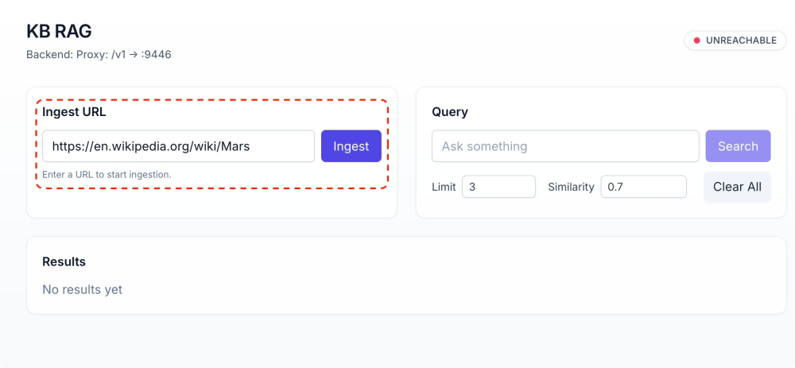
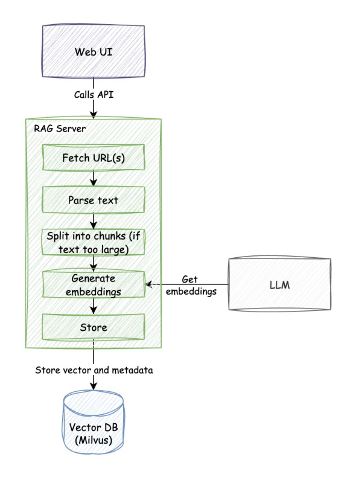
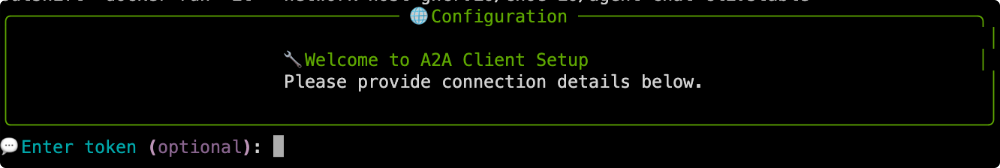
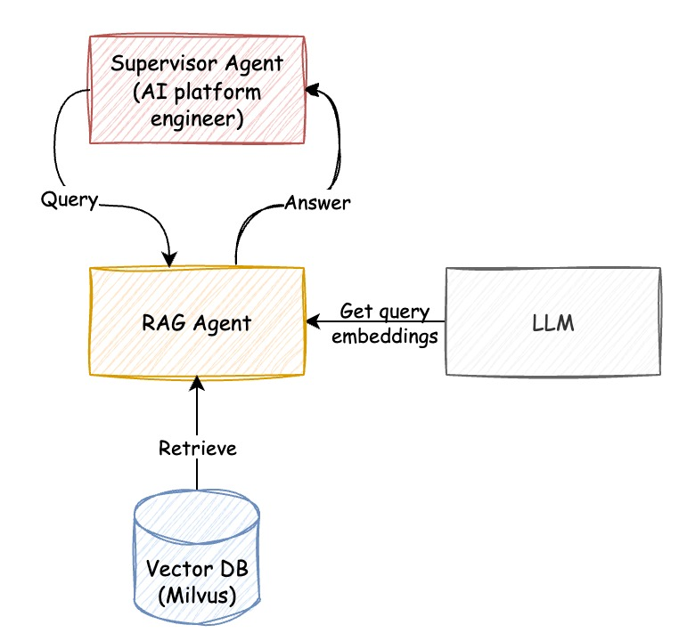

# RAG + Git agent

Let's try a different scenario and also detail the Retreival Augmented Generation (RAG).

We will deploy and interact with specialized agents for **knowledge retrieval** and **version control**:

- **📚 RAG Agent**: Use Retrieval-Augmented Generation (RAG) to answer questions about the AGNTCY.
- **🔧 Git Agent**: Automate git operations like commits, pushes, and repository management

The following diagram shows the architecture of the RAG system:


## Customize the deployment

The LLM connectivity details are already provided in the environment.
Also a personal access token is already provided for connectivity with Github.

### Populate the needed variables in the ai-platform engineering .env file

We will fill the values of variables already in the environment

```bash
sed -i "s|^AZURE_OPENAI_API_KEY=.*|AZURE_OPENAI_API_KEY='${AZURE_OPENAI_API_KEY}'|" $HOME/work/ai-platform-engineering/.env
sed -i "s|^AZURE_OPENAI_API_VERSION=.*|AZURE_OPENAI_API_VERSION='${AZURE_OPENAI_API_VERSION}'|" $HOME/work/ai-platform-engineering/.env
sed -i "s|^AZURE_OPENAI_DEPLOYMENT=.*|AZURE_OPENAI_DEPLOYMENT='${AZURE_OPENAI_DEPLOYMENT}'|" $HOME/work/ai-platform-engineering/.env
sed -i "s|^AZURE_OPENAI_ENDPOINT=.*|AZURE_OPENAI_ENDPOINT='${AZURE_OPENAI_ENDPOINT}'|" $HOME/work/ai-platform-engineering/.env
sed -i "s|^LLM_PROVIDER=.*|LLM_PROVIDER='${LLM_PROVIDER}'|" $HOME/work/ai-platform-engineering/.env
sed -i "s|^GITHUB_PERSONAL_ACCESS_TOKEN=.*|GITHUB_PERSONAL_ACCESS_TOKEN=${GITHUB_PERSONAL_ACCESS_TOKEN}|" $HOME/work/ai-platform-engineering/.env
```

### Select the applications to deploy

Enable the Github and the RAG agents. Ensure the other agents are disabled as we used in the previous section.

```bash
sed -i "s|^ENABLE_RAG=.*|ENABLE_RAG=true|" $HOME/work/ai-platform-engineering/.env
sed -i "s|^ENABLE_GITHUB=.*|ENABLE_GITHUB=true|" $HOME/work/ai-platform-engineering/.env
sed -i "s|^ENABLE_AGENTFORGE=.*|ENABLE_AGENTFORGE=true|" $HOME/work/ai-platform-engineering/.env
sed -i "s|^ENABLE_WEATHER=.*|ENABLE_WEATHER=false|" $HOME/work/ai-platform-engineering/.env
sed -i "s|^ENABLE_PETSTORE=.*|ENABLE_PETSTORE=false|" $HOME/work/ai-platform-engineering/.env
```

## Start the caipe stack

Start the deployment.

```bash
cd $HOME/work/ai-platform-engineering
./deploy.sh
```

The docker-compose stack should start the following services:

- `caipe-supervisor` : The platform engineer supervisor agent
- `agent-github` : The git agent
- `agent_rag` : The RAG agent
- `rag_server` : The RAG server
- `rag-webui`: The RAG web UI
- `milvus-standalone`: The Milvus vector database
- `milvus-etcd`: Needed for Milvus
- `milvus-minio`: Needed for Milvus

> warning 🫸 Wait
> Wait until this process is completed.

You can verify the supervisor agent is healthy by checking its A2A card.

```bash
curl http://localhost:8000/.well-known/agent.json | jq
```

> info Observe
> The response should be a JSON object (the A2A agent card). If you get an error, wait for a few seconds and try again. The agent might still be starting up.

## Populate RAG database

Now, we will populate the RAG with documentation. The docker-compose stack should have started the `kb-rag-web` service, which is the web ui
for the RAG server.

**[Open RAG UI (using localhost)](http://localhost:9447)**

Once the RAG Web UI is open:

1. Copy the URL for AGNTCY docs

```
https://docs.agntcy.org/
```
and paste it in `Ingest URL` field

2. Click `Ingest` button

> info Observe
>
>    - The server should start ingesting the docs. You can click on the dataousrce to see the progres. Some URLs may take longer, but feel free to move forward.



### Explanation:

Here's what happens:

 - The RAG server crawls the webpage (it supports sitemap), and fetches all the pages.
 - The HTML is parsed and content is extracted.
 - The page is split into chunks, using [Recursive Text Splitter](https://python.langchain.com/docs/how_to/recursive_text_splitter/).
 - Each chunk is sent to embedding model (LLM in this case) to generate embeddings.
 - The embeddings are stored in a vector store (Milvus), along with metadata (source, title, description etc).



## Verify RAG System is working

We will now use the UI to query the RAG system and verify it is working.

Head over to **🔍︎ Explore** tab.

**Type:**

```
What is SLIM
```

in the search box, then click **Search** button

> Info: Observe
>
> The response should return relevant document chunks. The chunks may not be formatted in a way that is easy to read. As long as some document chunks are returned, the RAG system is working.

## Using the RAG Agent

Go back to terminal and start the CLI chat

```bash
uvx https://github.com/cnoe-io/agent-chat-cli.git a2a
```

> Tip
> When asked to `💬 Enter token (optional): `, just press enter ⏎.
>
> In production, your system will use a JWT or Bearer token for authentication here.



**Ask the agent:**

```bash
Tell me more about SLIM in AGNTCY
```

> info Observe
>
> The agent should respond with information on SLIM protocol.

### Explanation:

Here's what happens:

 - The RAG agent embeds the question using the same embedding model used to embed the documents.
 - The agent then uses the vector store to find the most similar documents.
 - The agent uses the retrieved document chunks to answer the question.



## Step 5: Multi-agent interaction

Now, we will test the multi-agent interaction by asking the supervisor agent to:

 - search for information about AGNTCY

 - commit the steps to git repository

In the CLI chat client, ask the agent:

```bash
Research and write a report on AGNTCY in markdown format, then commit/upload it as a markdown file named '%%LABNAME%%-report.md' with commit message "agntcy-report" to repo https://github.com/outshiftcaipe/caipe-workshop on the main branch.
```

> info Observe
>
>  The agent should have:
>
>  - Created a report with name: **`%%LABNAME%%-report.md`**
>  - Committed it to [the workshop git repository](https://github.com/outshiftcaipe/caipe-workshop) with commit message "agntcy-report".


### Explanation:

Here's what happens:

 - The supervisor agent determines what needs to be done, and delegates the tasks to the sub agents.
 - It first asks the RAG agent to search for information about SLIM protocol.
 - The RAG agent uses the vector store to find relavant information, and write a report.
 - The supervisor agent then asks the git agent to commit the report as a text file to the repository.

## Stop the containers

Go back to terminal and stop all containers to continue to the next section

```bash
cd $HOME/work/ai-platform-engineering
./deploy.sh stop
```
