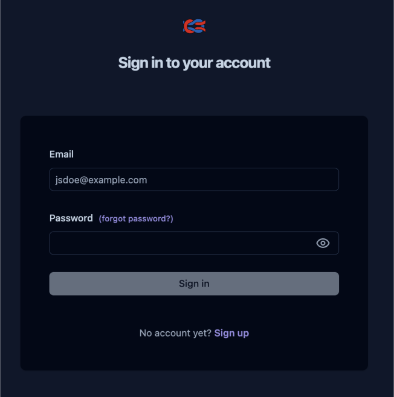
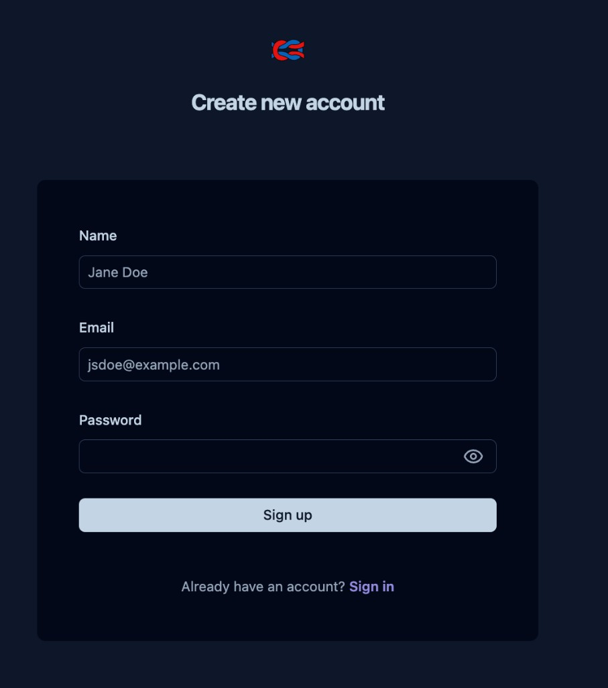
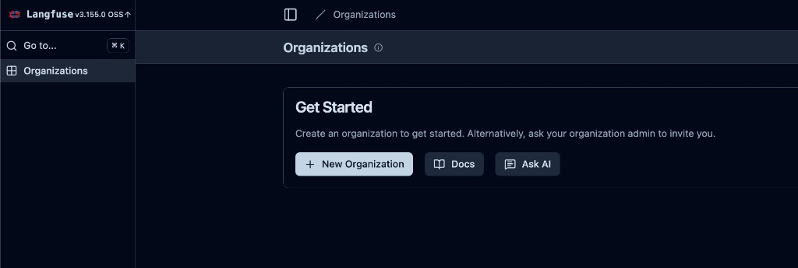
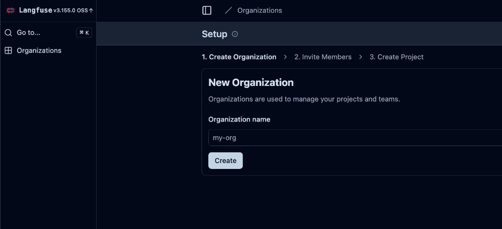
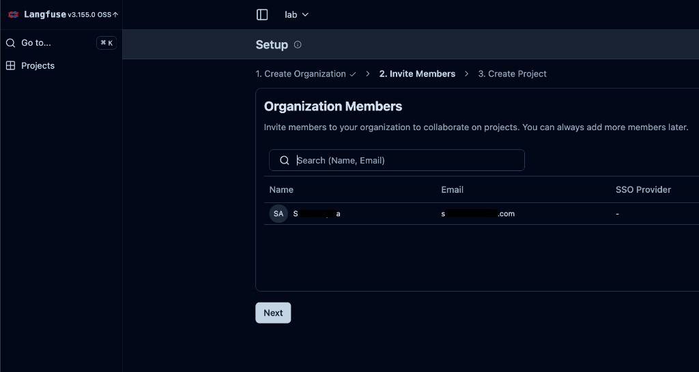
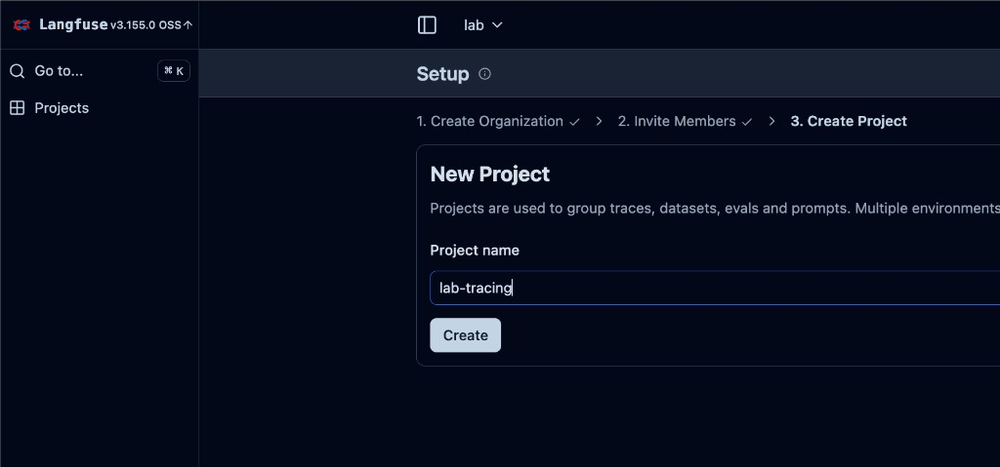
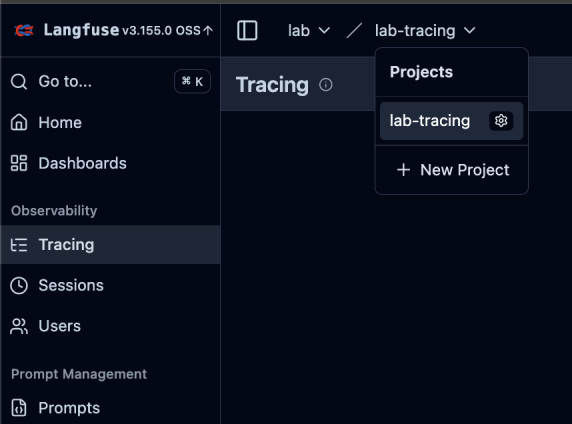
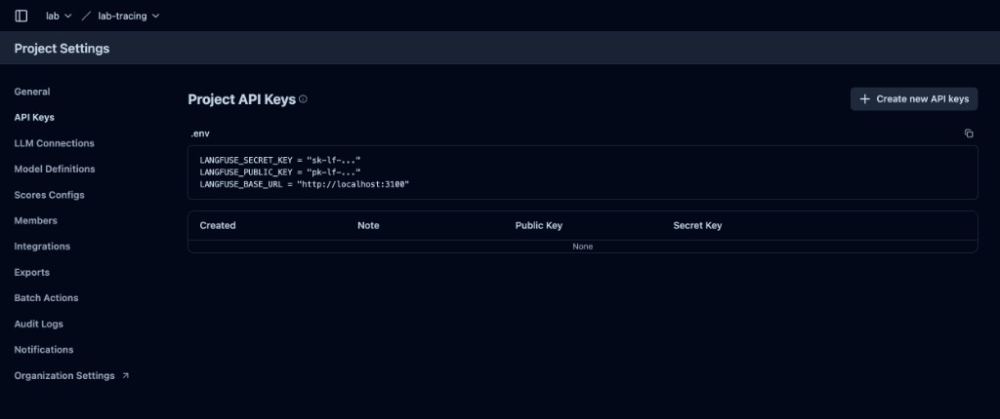
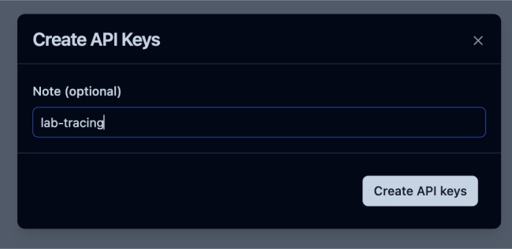
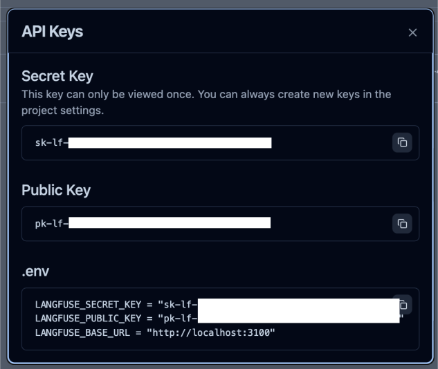

# Agent Tracing and Evaluation with Langfuse

## 1. Overview

In this part, you'll add observability to your multi-agent system by deploying Langfuse on Kubernetes and enabling end-to-end tracing of agent interactions.

**What you'll learn in this part:**

- Why observability matters for multi-agent systems
- How to deploy Langfuse on Kubernetes using Helm
- How to configure CAIPE agents to emit traces
- How to inspect traces, spans, inputs/outputs, and timing in the Langfuse dashboard

**Prerequisites:**

- Completion of Part 2 (Multi-Agent Systems) and Part 3 (RAG and Git Agents) — or at least Part 2
- A running Kind cluster (we'll reuse or create the `caipe` cluster)
- [Helm](https://helm.sh/) installed
- Access to OpenAI (credentials provided in lab environment)

> [!TIP]
> **Automated setup:** An interactive script is available that performs all lab setup automatically:
>
> ```bash
> ./setup-caipe.sh
> ```
>
> It will prompt you for your cluster, OpenAI key, and which features to enable (RAG, tracing).
> For non-interactive use: `./setup-caipe.sh --non-interactive --tracing` (see `--help` for all options).

---

## 2. Why Observability for Multi-Agent Systems?

When multiple agents interact — routing requests, calling tools, synthesizing responses — you need visibility into what is happening at each step. Observability helps you:

- **Debug failures**: Identify which agent or tool call produced an error
- **Understand latency**: See where time is spent across agent hops and LLM calls
- **Audit behavior**: Review the exact inputs and outputs at every stage
- **Optimize prompts**: Compare prompt variations and their impact on quality and cost

**Langfuse** is an open-source LLM observability platform that captures traces, spans, and generations from your agents, giving you a complete picture of every request.

---

## 3. Deploy Langfuse on Kubernetes

### Task 1: Create the Kind Cluster (if not already running)

If you still have the `caipe` Kind cluster from Part 2, skip this step. Otherwise, create one:

```bash
kind create cluster --name caipe
```

> [!TIP]
> Check if your cluster already exists:
>
> ```bash
> kind get clusters
> ```
>
> If you see `caipe` in the output, your cluster is ready.

Verify your kubectl context is set correctly:

```bash
kubectl config use-context kind-caipe
```

---

### Task 2: Install Langfuse via Helm

Add the Langfuse Helm repository and install it into a dedicated namespace:

```bash
helm repo add langfuse https://langfuse.github.io/langfuse-k8s
helm repo update
```

```bash
kubectl create namespace langfuse
```

Generate the required secrets:

```bash
export LANGFUSE_SALT=$(openssl rand -base64 32)
export LANGFUSE_ENCRYPTION_KEY=$(openssl rand -hex 32)
export LANGFUSE_NEXTAUTH_SECRET=$(openssl rand -base64 32)
export PG_PASSWORD=$(openssl rand -base64 16)
export CH_PASSWORD=$(openssl rand -base64 16)
export REDIS_PASSWORD=$(openssl rand -base64 16)
export MINIO_ROOT_PASSWORD=$(openssl rand -base64 16)
```

Install the chart with these values:

```bash
helm upgrade --install langfuse langfuse/langfuse -n langfuse \
  --set langfuse.salt.value="$LANGFUSE_SALT" \
  --set langfuse.encryptionKey.value="$LANGFUSE_ENCRYPTION_KEY" \
  --set langfuse.nextauth.secret.value="$LANGFUSE_NEXTAUTH_SECRET" \
  --set postgresql.auth.password="$PG_PASSWORD" \
  --set clickhouse.auth.password="$CH_PASSWORD" \
  --set redis.auth.password="$REDIS_PASSWORD" \
  --set s3.accessKeyId.value=minio \
  --set s3.secretAccessKey.value="$MINIO_ROOT_PASSWORD"
```

> [!NOTE]
> You may see `SessionAffinity is ignored for headless services` warnings during install. These are harmless and come from the bundled Bitnami sub-charts — they do not affect functionality.

> [!IMPORTANT]
> The deployment may take up to 5 minutes. The `langfuse-web` and `langfuse-worker` pods will restart a few times while the bundled PostgreSQL, ClickHouse, and Redis instances are provisioned. This is normal.

Monitor the rollout until all pods are running:

```bash
kubectl get pods -n langfuse -w
```

**Expected state:** All pods show `Running` with `1/1` ready.

---

### Task 3: Access the Langfuse UI

Port-forward the Langfuse web service:

```bash
kubectl port-forward svc/langfuse-web -n langfuse 3100:3000
```

Open your browser to [http://localhost:3100](http://localhost:3100).

**First-time setup:**

1. You'll see the Langfuse sign-in page. Click **Sign up** to create a new account.

<center></center>

2. Enter a **Name**, **Email**, and **Password**, then click **Sign up** (this is your local instance — any values work).

<center></center>

3. After sign-up, you'll be prompted to create a new **Organization**. Click **+ New Organization**, enter a name (e.g., `lab`), and click **Create**.

<center></center>

<center></center>

4. Skip the **Invite Members** step by clicking **Next**.

<center></center>

5. Create a new **Project** (e.g., `lab-tracing`) and click **Create**.

<center></center>

6. You'll land on the **Tracing** page for your new project.

<center></center>

---

### Task 4: Create Langfuse API Keys

You need API keys so the CAIPE agents can send traces to Langfuse.

1. In the Langfuse UI, go to your project **Settings** > **API Keys** and click **+ Create new API key**.

<center></center>

2. Enter a note (e.g., `lab-tracing`) and click **Create API keys**.

<center></center>

3. Copy both the **Secret Key** and **Public Key** — you will need them in the next step. The secret key can only be viewed once.

<center></center>

> [!IMPORTANT]
> Keep these keys handy. You will configure them as Kubernetes secrets in the next section.

---

## 4. Deploy CAIPE with Tracing Enabled

### Task 5: Ensure the CAIPE Namespace Exists

```bash
kubectl create namespace caipe --dry-run=client -o yaml | kubectl apply -f -
```

---

### Task 6: Create the LLM Secret

If you already created the `llm-secret` in Part 2, you can skip this step. Otherwise:

```bash
kubectl create secret generic llm-secret -n caipe \
  --from-literal=LLM_PROVIDER='openai' \
  --from-literal=OPENAI_API_KEY='sk-xxxxxxx' \
  --from-literal=OPENAI_ENDPOINT='https://api.openai.com/v1' \
  --from-literal=OPENAI_MODEL_NAME='gpt-5.2'
```

> [!IMPORTANT]
> Replace the values above with your actual LLM provider credentials from the lab environment.

---

### Task 7: Create the Langfuse Tracing Secret

Store your Langfuse API keys as a Kubernetes secret:

```bash
kubectl create secret generic langfuse-secret -n caipe \
  --from-literal=LANGFUSE_SECRET_KEY='sk-lf-xxxxxxxx' \
  --from-literal=LANGFUSE_PUBLIC_KEY='pk-lf-xxxxxxxx'
```

> [!IMPORTANT]
> Replace the placeholder values with the Secret Key and Public Key you copied from the Langfuse UI in Task 4.

---

### Task 8: Deploy CAIPE with Tracing Configuration

Deploy the CAIPE Helm chart with tracing enabled:

```bash
helm upgrade --install caipe oci://ghcr.io/cnoe-io/charts/ai-platform-engineering \
  --namespace caipe \
  --version 0.2.31 \
  --set tags.caipe-ui=true \
  --set tags.agent-weather=true \
  --set tags.agent-netutils=true \
  --set caipe-ui.config.SSO_ENABLED=false \
  --set caipe-ui.env.A2A_BASE_URL=http://localhost:8000 \
  --set supervisor-agent.env.ENABLE_TRACING=true \
  --set supervisor-agent.env.LANGFUSE_TRACING_ENABLED=true \
  --set supervisor-agent.env.LANGFUSE_HOST=http://langfuse-web.langfuse.svc.cluster.local:3000 \
  --set supervisor-agent.env.OTEL_EXPORTER_OTLP_ENDPOINT=http://langfuse-web.langfuse.svc.cluster.local:3000/api/public/otel \
  --wait
```

After the chart deploys, patch the supervisor agent to mount the Langfuse secret:

```bash
kubectl patch deployment caipe-supervisor-agent -n caipe --type='json' \
  -p='[{"op":"add","path":"/spec/template/spec/containers/0/envFrom/-","value":{"secretRef":{"name":"langfuse-secret"}}}]'
```

> [!NOTE]
> The CAIPE Helm chart hardcodes its `envFrom` entries, so a post-deploy patch is needed to inject the `langfuse-secret`. This keeps the API keys in a proper Kubernetes Secret rather than a ConfigMap.

> [!NOTE]
> The key additions compared to Part 2 are:
> - `ENABLE_TRACING=true` and `LANGFUSE_TRACING_ENABLED=true` to activate tracing
> - `LANGFUSE_HOST` pointing to the in-cluster Langfuse service
> - `OTEL_EXPORTER_OTLP_ENDPOINT` for the OpenTelemetry trace export endpoint
> - The `langfuse-secret` patch injects the API keys from a Kubernetes Secret

Monitor the rollout:

```bash
kubectl get pods -n caipe -w
```

---

## 5. Verify Agent Deployment

### Task 9: Check Agent Logs

Verify the supervisor agent started with tracing enabled:

```bash
kubectl logs deployment/caipe-supervisor-agent -n caipe
```

**What to look for:**

- Application startup complete
- Uvicorn running
- No errors related to Langfuse connectivity

Check the sub-agents as well:

```bash
kubectl logs deployment/caipe-agent-weather -n caipe
```

```bash
kubectl logs deployment/caipe-agent-netutils -n caipe
```

---

## 6. Interact with the Multi-Agent System

### Task 10: Port-Forward Services

Set up port-forwarding for the supervisor and the UI:

```bash
kubectl port-forward service/caipe-supervisor-agent 8000:8000 -n caipe
```

```bash
kubectl port-forward service/caipe-caipe-ui 3000:3000 -n caipe
```

---

### Task 11: Send Queries to Generate Traces

Open the CAIPE UI at [http://localhost:3000](http://localhost:3000), or use the CAIPE CLI:

```bash
caipe config set server.url http://localhost:8000
caipe
```

> [!NOTE]
> If OAuth is not configured yet, just press enter when prompted for authentication.

Try these queries to generate traces across multiple agents (same prompts as in [Multi-Agent Systems](/workshop/mas) and the [Conclusion](/workshop/conclusion)):

**Weather query:**
```text
What's the current weather in San Francisco?
```

**Network diagnostic:**
```text
Check if google.com is reachable.
```

**Cross-agent query:**
```text
Get me today's weather for New York, and also test if api.github.com is reachable. Summarize both results.
```

---

## 7. View Traces in Langfuse

Make sure the Langfuse port-forward is still active (from Task 3), then open [http://localhost:3100](http://localhost:3100).

### Task 12: Explore the Trace Dashboard

1. Navigate to **Traces** in the left sidebar
2. Find the traces generated by your queries
3. Click on a trace to expand it

**What you'll see:**

- **Trace timeline**: The full lifecycle of the request from start to finish
- **Spans**: Individual steps — supervisor routing, sub-agent calls, LLM generations
- **Inputs/Outputs**: The exact data passed to and returned from each step
- **Latency**: Time spent at each stage, helping you identify bottlenecks
- **Token usage**: LLM token counts and estimated cost per generation

> [!TIP]
> For the cross-agent query, you should see the supervisor calling both the weather and NetUtils agents in the trace, followed by a synthesis step where the LLM combines the results.

---

## 8. Clean Up

### Task 13: Tear Down

When you're done exploring, remove both deployments and optionally the Kind cluster:

```bash
helm uninstall caipe -n caipe
helm uninstall langfuse -n langfuse
```

To also remove Langfuse's persistent data:

```bash
kubectl delete pvc -l app.kubernetes.io/instance=langfuse -n langfuse
```

To delete the Kind cluster entirely:

```bash
kind delete cluster --name caipe
```

---

## 9. Summary

Congratulations! You've completed Part 4 of the AI Agents lab series. Here's what you accomplished:

- Deployed Langfuse on Kubernetes using Helm
- Configured CAIPE agents to emit traces to Langfuse
- Sent multi-agent queries and observed end-to-end traces
- Explored spans, inputs/outputs, latency, and token usage in the Langfuse dashboard

### Key Takeaways

1. **Observability is essential for multi-agent systems** — Without tracing, debugging agent interactions is guesswork
2. **Langfuse provides LLM-native observability** — Purpose-built for tracing agent chains, tool calls, and LLM generations
3. **Kubernetes-native deployment** — Both Langfuse and CAIPE run as Helm releases in your cluster
4. **Tracing reveals the full picture** — See exactly how the supervisor routes, which sub-agents are called, and how responses are synthesized

### Additional Resources

- **[Langfuse Documentation](https://langfuse.com/docs)**: Full platform documentation
- **[Langfuse Self-Hosting Guide](https://langfuse.com/self-hosting)**: Configuration options and architecture
- **[CAIPE GitHub Repository](https://github.com/cnoe-io/ai-platform-engineering)**: Source code and Helm chart values
- **[Langfuse Helm Chart](https://github.com/langfuse/langfuse-k8s)**: Chart source and README

---

**Part 4 Complete!** You now know how to add production-grade observability to your multi-agent system, giving you full visibility into every agent interaction, tool call, and LLM generation. Continue to the [CAIPE Labs Conclusion](/workshop/conclusion) to wrap up the series.
