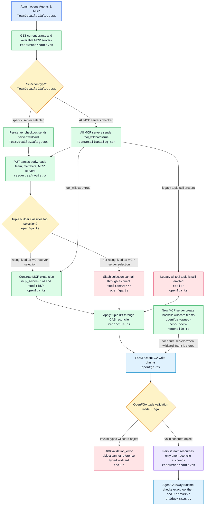

# Issue #1884 MCP Identity Group Tool Access Diagram

## Scope

This note covers the admin flow behind
[issue #1884](https://github.com/cnoe-io/ai-platform-engineering/issues/1884):
an admin opens an identity group or team, selects the Agents & MCP tab, enables
All MCP servers, and save fails with an OpenFGA validation error for
`tool:*#caller@team:<slug>#member`.

The survey is limited to the team resources UI, the Next.js API route that
persists those resources, OpenFGA tuple diff construction and reconciliation,
and the AgentGateway runtime checks that consume the resulting tool grants.

## Color Key

- Blue: user/API entrypoint
- Green: normal processing
- Amber: decision or branch
- Purple: persistence
- Cyan: external service/runtime
- Rose: error or suspected bug path
- Gray: helper or utility

## Flow Chart



## ASCII Code Tree

```text
ui/src/components/admin/teams/
|-- TeamDetailsDialog.tsx
|   Loads team resources, renders Agents & MCP, sends selected tools and tool_wildcard.

ui/src/app/api/admin/teams/[id]/
|-- resources/route.ts
|   Serves the resource catalog, resolves members, builds tuple diffs, persists team.resources.

ui/src/lib/authz/
|-- reconcile.ts
|   Applies tuple diffs through the CAS reconciliation path and emits audit/cache updates.

ui/src/lib/rbac/
|-- openfga.ts
|   Builds team resource tuple writes/deletes and writes them to OpenFGA.
|-- openfga-owned-resources-reconcile.ts
|   Backfills wildcard-enabled teams when new MCP servers are reconciled.
|-- mcp-tool-catalog.ts
|   Caches discovered MCP tools; adjacent catalog, not the failing save path.
|-- migrations/team-tool-wildcard-slash.ts
|   Migrates old server underscore wildcards to slash wildcard grants.

deploy/openfga/
|-- model.fga
|   Defines writable tool caller relations and derived can_call.
|-- bridge/main.py
|   AgentGateway ext_authz bridge checks exact tool grants and tool:server/*.
|-- README.md
|   Documents that Team Resources expands all MCP servers into per-server tuples.
```

## Code Anchors

| Step | File | Anchor | What the code proves |
| --- | --- | --- | --- |
| Load resources tab | `ui/src/components/admin/teams/TeamDetailsDialog.tsx` | `:526` | Opening Agents & MCP fetches `/api/admin/teams/{id}/resources`. |
| Submit resources | `ui/src/components/admin/teams/TeamDetailsDialog.tsx` | `:958` | Save sends `agents`, `agent_admins`, `tools`, and `tool_wildcard`. |
| Wildcard UI | `ui/src/components/admin/teams/TeamDetailsDialog.tsx` | `:2153` | The checkbox is labeled All MCP servers and toggles `tool_wildcard`. |
| Catalog MCP servers | `ui/src/app/api/admin/teams/[id]/resources/route.ts` | `:150` | GET reads enabled `mcp_servers` for the picker. |
| Slash picker values | `ui/src/app/api/admin/teams/[id]/resources/route.ts` | `:178` | The route comments that `<server>/*` is the runtime wildcard form. |
| Parse save body | `ui/src/app/api/admin/teams/[id]/resources/route.ts` | `:292` | PUT parses arrays and the `tool_wildcard` boolean. |
| Build tuple diff | `ui/src/app/api/admin/teams/[id]/resources/route.ts` | `:402` | The route calls `buildTeamResourceTupleDiff` before persistence. |
| Reconcile before Mongo | `ui/src/app/api/admin/teams/[id]/resources/route.ts` | `:403` | OpenFGA reconciliation runs before the team document update. |
| Persist resources | `ui/src/app/api/admin/teams/[id]/resources/route.ts` | `:411` | `team.resources` is updated only after reconciliation returns. |
| Legacy selection parser | `ui/src/lib/rbac/openfga.ts` | `:141` | MCP server selections are recognized using the old `_*` suffix shape. |
| Concrete server expansion | `ui/src/lib/rbac/openfga.ts` | `:149` | MCP selections create `mcp_server:<id>` access tuples. |
| Gateway wildcard expansion | `ui/src/lib/rbac/openfga.ts` | `:172` | MCP selections create `tool:<server>/*` caller tuples. |
| All-server expansion | `ui/src/lib/rbac/openfga.ts` | `:317` | `toolWildcard.added` expands all known MCP server IDs. |
| Suspect invalid write | `ui/src/lib/rbac/openfga.ts` | `:327` | `toolWildcard.added` still appends `tool:*`, matching the issue error. |
| Suspect invalid delete | `ui/src/lib/rbac/openfga.ts` | `:363` | `toolWildcard.removed` still tries to delete `tool:*`. |
| New-server backfill | `ui/src/lib/rbac/openfga-owned-resources-reconcile.ts` | `:77` | Teams with `resources.tool_wildcard` get concrete grants for newly-created MCP servers. |
| Agent runtime check | `deploy/openfga/bridge/main.py` | `:718` | Runtime checks exact `tool:server/tool` then `tool:server/*`. |
| Caller runtime check | `deploy/openfga/bridge/main.py` | `:770` | Caller-keyed auth also checks exact grant then `tool:server/*`. |
| Tool relation model | `deploy/openfga/model.fga` | `:213` | `tool` permits caller subjects such as users, teams, service accounts, and agents. |

## Current-State Notes

- The product model appears to be "store all-server intent, materialize concrete
  per-server tuples." This is supported by the route's use of all enabled MCP
  server IDs and by the new-server wildcard backfill path.
- AgentGateway does not check `tool:*` at runtime. It checks `tool:<server>/<tool>`
  first and then `tool:<server>/*`.
- OpenFGA rejects `tool:*` as an object. Typed wildcards are valid in subject
  positions in some model contexts, but this failure is an object field.
- The immediate failing tuple is produced by `buildTeamResourceTupleDiff` when
  `toolWildcard.added` is true.
- A related mismatch exists between the current GET picker values (`<server>/*`)
  and the tuple builder's MCP server selection recognizer (`<server>_*`). If the
  PUT body contains slash-form values, the builder can classify them as direct
  tool IDs instead of MCP server selections.

## Working Theory

The save failure is caused by a stale compatibility tuple in the wildcard path.
The builder already writes valid concrete tuples for every enabled MCP server:

- `team:<slug>#member reader/user/invoker mcp_server:<server>`
- `team:<slug>#admin manager mcp_server:<server>`
- `team:<slug>#member caller tool:<server>/*`
- `agent:<id> caller tool:<server>/*`

After doing that, it still appends `team:<slug>#member caller tool:*`. OpenFGA
rejects that invalid object before Mongo persistence, which surfaces as the UI
save error in issue #1884.

The likely fix is to stop writing `tool:*` for team wildcard grants, keep any
legacy `tool:*` cleanup as best-effort delete-only behavior where safe, and
normalize tool selection IDs so both `<server>/*` and legacy `<server>_*` produce
the same concrete tuple expansion.

## Test Gaps To Close

- Add a tuple-builder regression test for `toolWildcard.added=true` asserting no
  write has `object: "tool:*"`.
- Add a route-level regression test for `tool_wildcard: true` proving the
  reconciler receives only concrete `tool:<server>/*` and `mcp_server:<server>`
  tuples.
- Add a per-server slash-form test showing `tools: ["mcp-jira/*"]` still expands
  into `mcp_server:mcp-jira` access tuples.
- Update any existing tests that still expect wildcard team writes to include
  `tool:*`.

## Open Questions

- Should stored `team.resources.tools` be canonicalized to slash form
  (`<server>/*`) everywhere, or should the API accept slash while persisting the
  legacy internal `_*` shape until a migration completes?
- Should removing `tool_wildcard` attempt to delete legacy `tool:*` tuples, or
  should legacy cleanup live only in an explicit migration to avoid sending any
  typed-wildcard object to OpenFGA?
- The issue asks for an admin defaults panel. The code already stores
  `resources.tool_wildcard` as team-level default intent and backfills new MCP
  servers, but there is not yet a dedicated defaults/reconciliation panel for
  identity-group tool access.
