# 🔍 Phoenix Tracing Implementation - Deep Dive Documentation

## 🎯 **What Was Changed? (High-Level Overview)**

This implementation adds **distributed tracing** to an AI multi-agent platform using **Phoenix observability**. Think of it like adding a "GPS tracker" to see how requests flow through multiple AI agents.

### 🏗️ **System Architecture Before vs After**

```mermaid
graph TB
    subgraph "BEFORE: No Visibility"
        User1[👤 User Request] --> PE1[🤖 Platform Engineer]
        PE1 --> GA1[🐙 GitHub Agent]
        PE1 --> SA1[💬 Slack Agent]
        PE1 --> AA1[🎯 ArgoCD Agent]
        Note1[❓ No visibility into:<br/>• Performance bottlenecks<br/>• Error propagation<br/>• Agent interactions]
    end
    
    subgraph "AFTER: Full Observability"
        User2[👤 User Request] --> PE2[🤖 Platform Engineer]
        PE2 --> GA2[🐙 GitHub Agent]
        PE2 --> SA2[💬 Slack Agent]
        PE2 --> AA2[🎯 ArgoCD Agent]
        PE2 --> Phoenix[🔍 Phoenix Dashboard]
        Phoenix --> Traces[📊 Distributed Traces]
        Phoenix --> Metrics[📈 Performance Metrics]
        Phoenix --> Errors[🚨 Error Tracking]
    end
```



---

## 🧩 **What Are the Core Components?**

### 1. **Phoenix Tracing Infrastructure** (`ai_platform_engineering/utils/tracing.py`)

```python
# Think of this as the "GPS tracker" installation
class PhoenixTracing:
    def initialize(self):
        # Sets up the tracking system
        # Connects to Phoenix dashboard
        # Filters out noise (internal operations)
```

**What it does:**
- **Sets up OpenTelemetry** (industry standard for tracing)
- **Connects to Phoenix** (the observability dashboard)
- **Filters noisy spans** (removes internal A2A protocol noise)
- **Provides utilities** for creating and managing traces

### 2. **Agent Executor Tracing** (`agent_executor.py`)

```python
# Before: Just execute the request
async def execute(self, context):
    async for event in self.agent.stream(query, context_id):
        # Handle event
        
# After: Wrap execution with comprehensive tracing
async def execute(self, context):
    with tracer.start_as_current_span("user_request") as root_span:
        # Add rich attributes (user query, timing, etc.)
        async for event in self.agent.stream(query, context_id):
            # Track progress events
            # Record completion status
            # Capture errors with full context
```

**What it does:**
- **Creates root span** for each user request
- **Tracks streaming progress** as events happen
- **Records timing and performance** metrics
- **Captures errors** with full context for debugging

### 3. **A2A Remote Agent Tracing** (`a2a_remote_agent_connect.py`)

```python
# Before: Connect and send message
async def _connect(self):
    # Fetch agent card
    # Create A2A client
    
async def _arun(self, input):
    # Send message to remote agent
    # Return response

# After: Trace every step of the communication
async def _connect(self):
    with tracer.start_as_current_span("a2a_agent_connection"):
        # Track connection timing
        # Record agent capabilities
        
async def _arun(self, input):
    with tracer.start_as_current_span(f"{agent_name}_execution"):
        # Track message preparation
        # Monitor A2A message sending
        # Trace response processing
```

**What it does:**
- **Traces agent connections** (how long they take)
- **Monitors message sending** (network performance)
- **Tracks response processing** (parsing and handling)
- **Records agent metadata** (capabilities, versions, etc.)

---

## 🐳 **Docker Infrastructure Changes**

### **Profile-Based Architecture**

```yaml
# Standard Mode (Fast, No Tracing)
ai-platform-engineer:
  image: ghcr.io/cnoe-io/ai-platform-engineering:stable  # Pre-built
  profiles: ["default"]
  # No Phoenix dependencies, starts quickly

# Tracing Mode (Custom Build with Phoenix)
ai-platform-engineer-tracing:
  build:
    dockerfile: Dockerfile.tracing  # Custom build with Phoenix
  profiles: ["tracing"]
  environment:
    - PHOENIX_COLLECTOR_ENDPOINT=http://phoenix:6006
  depends_on:
    - phoenix  # Only starts when tracing is needed

phoenix:
  image: arizephoenix/phoenix:latest
  profiles: ["tracing"]  # Only runs in tracing mode
```

**Why This Design?**
- **Development Speed**: `make up` starts instantly with pre-built images
- **Debugging Power**: `make up-trace` provides full observability
- **Production Flexibility**: Enable tracing only when needed

---

## 📊 **What Kind of Traces Do You Get?**

### **Example: Multi-Agent Request Flow**

```
🔍 user_request: "merge PR #42 and notify team in slack" (15.2s)
├── 🧠 agent_selection_logic (0.1s)
│   ├── analyze_request_intent
│   └── route_to_appropriate_agents
├── 🐙 GitHub_Tools_Agent_execution (8.0s)
│   ├── a2a_agent_connection (0.2s)
│   │   ├── agent_card_fetch (0.1s)
│   │   └── client_initialization
│   ├── message_preparation (0.01s)
│   ├── a2a_message_send (7.5s) ← HTTP to agent-github:8000
│   │   ├── github_api_auth
│   │   ├── pull_request_merge (6.8s)
│   │   └── response_validation
│   └── response_processing (0.3s)
├── 💬 Slack_Agent_execution (6.8s)
│   ├── a2a_agent_connection (0.1s)
│   ├── a2a_message_send (6.5s) ← HTTP to agent-slack:8000
│   │   ├── slack_workspace_auth
│   │   ├── channel_message_send (5.9s)
│   │   └── delivery_confirmation
│   └── response_processing (0.2s)
└── 🔄 response_aggregation (0.3s)
    ├── combine_agent_responses
    └── format_final_response
```

### **Rich Span Attributes You Get**

```json
{
  "user_request": {
    "user.query": "merge PR #42 and notify team in slack",
    "request.id": "req_abc123",
    "completion.status": "success",
    "duration_ms": 15200,
    "events.total": 47,
    "events.working": 35,
    "agent.type": "platform_engineer"
  },
  "GitHub_Tools_Agent_execution": {
    "agent.name": "GitHub Tools Agent",
    "agent.url": "http://agent-github:8000",
    "execution.status": "success",
    "input.prompt": "merge pull request #42 in the backend repository",
    "execution.duration_ms": 8000,
    "send.duration_ms": 7500,
    "connection.duration_ms": 200
  }
}
```

---

## 🛠️ **Makefile Enhancements**

### **New Commands Added**

```bash
# Docker & Tracing Operations
make up            # Start system without tracing (fast)
make up-trace      # Start system with Phoenix tracing (builds custom image)
make down          # Stop all services
make down-trace    # Stop all services including tracing
make test-trace    # Run tracing test scripts
make phoenix       # Open Phoenix dashboard
make logs          # Show platform engineer logs
make logs-trace    # Show platform engineer logs (tracing mode)
make rebuild       # Force rebuild tracing image
make clean-docker  # Clean up containers and images
make status        # Check service status
make health        # Run health checks
```

### **Enhanced Help System**

```bash
# Before: Basic help
make help  # Shows only development commands

# After: Organized help with emoji categories
make help  # Shows:
# 📦 Docker & Tracing commands
# 🛠️ Development commands  
# Clear descriptions and usage patterns
```

---

## 🚀 **Application Startup Integration**

### **Main Application Changes** (`__main__.py`)

```python
# Before: Start the platform engineer directly
def platform_engineer(ctx):
    click.echo("Starting AI Platform Engineer system...")
    # Start agent protocol

# After: Initialize tracing, then start
def platform_engineer(ctx):
    click.echo("Starting AI Platform Engineer system...")
    
    # Initialize Phoenix tracing
    try:
        setup_phoenix_tracing("ai-platform-engineering")
        logging.info("Phoenix tracing initialized successfully")
    except Exception as e:
        logging.warning(f"Failed to initialize Phoenix tracing: {e}")
        # Continue without tracing (graceful degradation)
    
    # Start agent protocol as before
```

**Key Features:**
- **Graceful degradation**: System works even if tracing fails
- **Automatic initialization**: No manual setup required
- **Environment-aware**: Only activates when Phoenix is available

---

## 🧪 **Testing Infrastructure**

### **Testing the Tracing System**

There are two ways to test the tracing implementation and generate traces in Phoenix:

#### **Option 1: CLI Chat Interface**
```bash
# Start the tracing-enabled system
make up-trace

# Use the CLI chat client to interact with the platform engineer
# This provides an interactive way to send requests
docker run -it --network=host ghcr.io/cnoe-io/agent-chat-cli:stable
```

#### **Option 2: Direct API Calls with curl**

Use the provided example request JSON file:

```bash
# Test with the example request
curl -X POST http://localhost:8000/agent/tasks \
  -H "Content-Type: application/json" \
  -d @eval/trace_request_example.json
```

**Test scenarios to try:**
- **GitHub operations**: "list all repositories in my GitHub organization"
- **Slack messaging**: "send a message to the devops slack channel saying hello"  
- **ArgoCD status**: "show me the status of argocd applications"
- **Multi-agent workflows**: "merge pull request #42 and notify the team in slack"

Each request will create comprehensive traces viewable in the Phoenix dashboard at `http://localhost:6006`.

---

## 🔍 **Deep Dive: How Tracing Works**

### **Span Hierarchy Architecture**

```
📊 OpenTelemetry Concepts:
├── Trace: Complete request journey (like a story)
├── Span: Individual operation (like a chapter)
├── Context: Information passed between spans
└── Attributes: Metadata about each operation

🏗️ Our Implementation:
├── Root Span: "user_request" (entire user interaction)
├── Service Spans: Each agent execution
├── Network Spans: A2A protocol communications
├── Processing Spans: Message preparation and response handling
└── Error Spans: Exception capture and context
```

### **Trace Context Propagation**

```python
# When Platform Engineer calls GitHub Agent:
1. Create root span with trace_id=abc123
2. Add trace context to A2A message metadata
3. GitHub Agent receives message with trace context
4. Future: GitHub Agent can continue the same trace
5. All operations linked under trace_id=abc123
```

### **Smart Filtering System**

```python
# Filter out noisy internal operations
filtered_patterns = [
    "a2a.server.events.event_queue",     # Internal queue operations
    "JSONRPCHandler.on_message_send",     # Protocol layer noise
    ".task_done", ".close", ".dequeue_event"  # Utility operations
]

# Keep important user-facing operations
important_spans = [
    "user_request",                       # User interactions
    "*_agent_execution",                  # Agent operations
    "a2a_message_send",                   # Network calls
    "response_processing"                 # Business logic
]
```
TODO: there are other pattern exist as well

---

## 🎯 **What Problems Does This Solve?**

**Before**: No visibility into multi-agent workflows - requests take 30 seconds but you don't know which agent is slow or why workflows fail.

**After**: Complete observability - see exactly which agent operations take time, how errors propagate between agents, and optimization opportunities.

---

## 🚀 **How to Use This System**

### **Enable Tracing Mode**
```bash
# Start the system with Phoenix tracing enabled
make up-trace        # Builds custom image with Phoenix, starts in ~2 minutes
```

---