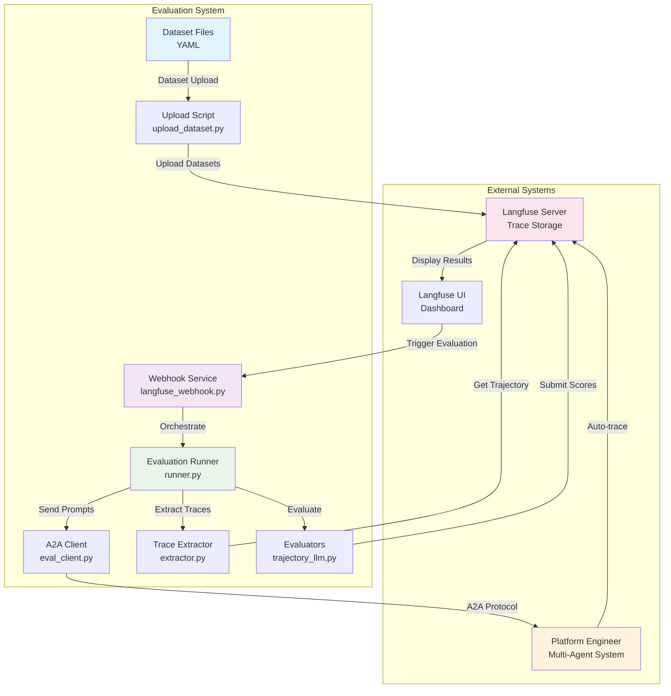

# Platform Engineer Evaluation System

A comprehensive evaluation framework for testing and validating Platform Engineer multi-agent workflows using Langfuse's dataset evaluation capabilities.

## 🏗️ **Architecture Overview**

The evaluation system provides an end-to-end pipeline for testing Platform Engineer agent behaviors, leveraging Langfuse for trace collection and evaluation orchestration:



### Key Components

1. **Dataset Management**: YAML-based datasets with expected behaviors and agents
2. **Webhook Service**: FastAPI service handling Langfuse evaluation triggers  
3. **Evaluation Runner**: Core orchestration engine managing the evaluation lifecycle
4. **A2A Integration**: Communication layer with Platform Engineer using A2A protocol
5. **Trace Analysis**: Extraction of tool calls and agent interactions from Langfuse traces
6. **Multi-Modal Evaluation**: Simple agent matching + optional LLM-based behavior analysis

## 📁 **Code Structure**

```
evals/
├── 📄 README.md                    # This documentation
├── 📄 pyproject.toml               # Project dependencies and configuration
├── 📄 Dockerfile                   # Container image definition
├── 📄 runner.py                    # Main evaluation orchestration engine
├── 📄 upload_dataset.py            # Dataset upload utility
│
├── 📁 webhook/                     # Webhook service
│   └── langfuse_webhook.py         # FastAPI webhook server
│
├── 📁 clients/                     # Communication clients
│   └── eval_client.py              # A2A protocol client for Platform Engineer
│
├── 📁 models/                      # Data models
│   ├── dataset.py                  # Dataset and evaluation request models
│   └── trajectory.py               # Tool call and trajectory models
│
├── 📁 trace_analysis/              # Trace processing
│   └── extractor.py                # Extract tool calls from Langfuse traces
│
├── 📁 evaluators/                  # Evaluation logic
│   ├── base.py                     # Base evaluator interface
│   ├── trajectory_evaluator.py     # Simple agent matching evaluator
│   ├── llm_evaluator.py           # LLM-based behavior evaluator
│   └── trajectory_llm.py          # Combined simple + LLM evaluator
│
├── 📁 datasets/                    # Evaluation datasets
│   ├── single_agent.yaml          # Single agent test cases
│   └── multi_agent.yaml           # Multi-agent workflow tests
│
└── 📁 prompts/                     # Evaluation prompts and templates
    ├── eval_prompts.yaml           # LLM evaluation prompt templates
    ├── create_operations.yaml      # Create operation test prompts
    ├── read_operations.yaml        # Read operation test prompts
    └── update_operations.yaml      # Update operation test prompts
```

## 🔧 **Core Components**

### **Webhook Service** (`webhook/langfuse_webhook.py`)

FastAPI service that handles Langfuse remote dataset run triggers:

```python
# Key Features:
- POST /evaluate: Handle webhook triggers from Langfuse UI
- GET /health: Service health and configuration status
- Background task execution for long-running evaluations
- Automatic A2A tracing integration with Platform Engineer
```

**Responsibilities:**
- Receive webhook payloads from Langfuse UI
- Initialize evaluation sessions with unique trace contexts  
- Orchestrate evaluation runner for dataset processing
- Return evaluation status and results

### **Evaluation Runner** (`runner.py`)

Core orchestration engine managing the complete evaluation lifecycle:

```python
class EvaluationRunner:
    """Orchestrates the evaluation of datasets against Platform Engineer."""
    
    async def run_dataset_evaluation(self, dataset, evaluation_info, config):
        # 1. Initialize A2A client connection
        # 2. Process each dataset item sequentially
        # 3. Send prompts to Platform Engineer with trace context
        # 4. Extract tool calls from resulting traces
        # 5. Run configured evaluators on trajectories
        # 6. Submit evaluation scores back to Langfuse
```

**Key Features:**
- Sequential processing of dataset items with trace linking
- Concurrent request limiting to prevent overloading Platform Engineer
- Graceful error handling and retry logic
- Comprehensive logging and progress tracking

### **A2A Client** (`clients/eval_client.py`)

Communication layer implementing A2A protocol for Platform Engineer integration:

```python
class EvalClient:
    """A2A protocol client for sending evaluation requests."""
    
    async def send_request(self, request: EvaluationRequest):
        # 1. Establish A2A connection to Platform Engineer
        # 2. Send prompt with trace_id for context linking
        # 3. Wait for response with timeout handling
        # 4. Return structured response with timing data
```

**Features:**
- A2A card resolution and agent discovery
- Request rate limiting and concurrency control
- Timeout handling for long-running operations
- Automatic trace context propagation

### **Trace Extractor** (`trace_analysis/extractor.py`)

Extracts structured tool call data from Langfuse traces:

```python
class TraceExtractor:
    """Extracts tool calls and agent interactions from traces."""
    
    async def extract_trajectory(self, trace_id: str) -> Trajectory:
        # 1. Fetch trace and observations from Langfuse
        # 2. Parse tool calls and agent interactions
        # 3. Build structured trajectory with timing data
        # 4. Extract agent usage patterns
```

**Capabilities:**
- Deep trace parsing for tool call extraction
- Agent interaction mapping and timing analysis  
- Error detection and success tracking
- Structured trajectory building for evaluation

### **Evaluators** (`evaluators/`)

Multi-modal evaluation system supporting different analysis approaches:

#### **TrajectoryLLMEvaluator** (`trajectory_llm.py`)
Combined evaluator providing both simple and LLM-based analysis:

```python
class TrajectoryLLMEvaluator(BaseEvaluator):
    """Always provides agent matching with optional LLM enhancement."""
    
    async def evaluate(self, trajectory, prompt, expected_agents, expected_behavior):
        # 1. Simple agent matching (fast, reliable baseline)
        # 2. Optional LLM behavior analysis (when LLM configured)
        # 3. Combined scoring with detailed feedback
        # 4. Graceful degradation if LLM fails
```

**Features:**
- **Agent Matching**: Fast comparison of expected vs actual agents used
- **LLM Analysis**: Deep behavior evaluation using OpenAI/Anthropic models
- **Graceful Degradation**: Returns agent matching if LLM evaluation fails
- **Detailed Scoring**: Provides numeric scores with explanatory comments

### **Data Models** (`models/`)

Pydantic models defining the evaluation data structures:

#### **Dataset Models** (`models/dataset.py`)
```python
class DatasetItem(BaseModel):
    id: str                          # Unique test case identifier
    messages: List[Message]          # Input prompt messages
    expected_agents: List[str]       # Agents that should be used
    expected_behavior: str           # Expected behavior description
    expected_output: Optional[str]   # Optional expected output
    metadata: Dict[str, Any]         # Additional test metadata
```

#### **Trajectory Models** (`models/trajectory.py`)
```python
class ToolCall(BaseModel):
    agent_name: str                  # Name of agent making the call
    tool_name: Optional[str]         # Tool being invoked
    parameters: Dict[str, Any]       # Tool parameters
    input_data: Optional[Any]        # Input to the tool
    output_data: Optional[Any]       # Output from the tool
    timestamp: Optional[datetime]    # When call was made
    duration_ms: Optional[float]     # Execution time
    success: bool                    # Success status
```

## 🚀 **Getting Started**

### **Prerequisites**

- Python 3.13+
- UV package manager
- Docker (for containerized deployment)
- Langfuse server (local or cloud)
- Platform Engineer running with A2A support

### **Installation**

1. **Install dependencies using UV:**
```bash
# Navigate to evals directory
cd evals

# Install dependencies
uv sync --no-dev
```

2. **Set up environment variables:**
```bash
# Copy environment template
cp .env.example .env

# Configure required variables:
export LANGFUSE_PUBLIC_KEY="your_public_key"
export LANGFUSE_SECRET_KEY="your_secret_key" 
export LANGFUSE_HOST="http://localhost:3000"  # For local Langfuse
export PLATFORM_ENGINEER_URL="http://localhost:8000"

# Optional LLM evaluation:
export OPENAI_API_KEY="your_openai_key"       # For OpenAI models
export ANTHROPIC_API_KEY="your_anthropic_key" # For Anthropic models
```

### **Quick Start**

1. **Upload a dataset to Langfuse:**
```bash
uv run upload-dataset datasets/single_agent.yaml
```

2. **Start the webhook service:**
```bash
uv run python webhook/langfuse_webhook.py
```

3. **Trigger evaluation via Langfuse UI:**
   - Go to http://localhost:3000 (Langfuse dashboard)
   - Navigate to **Datasets** section  
   - Select your uploaded dataset
   - Click **"Start Experiment"** → **"Custom Experiment"** (⚡ button)
   - Set webhook URL: `http://evaluation-webhook:8000/evaluate`
   - Click **"Run"** to start the evaluation

4. **Monitor results:**
   - View evaluation progress in Langfuse dashboard
   - Check traces and scores for each dataset item
   - Analyze agent usage patterns and behaviors

## 🐳 **Docker Deployment**

### **Build Container**

```bash
# Build the evaluation webhook image
docker build -t platform-engineer-evals .
```

### **Run with Docker Compose**

```bash
# Start full evaluation stack with tracing support
docker-compose -f ../docker-compose.dev.yaml --profile p2p-tracing up
```

### **Environment Configuration**

```yaml
# docker-compose.dev.yaml
services:
  evaluation-webhook:
    image: platform-engineer-evals
    ports:
      - "8001:8000"
    environment:
      LANGFUSE_PUBLIC_KEY: ${LANGFUSE_PUBLIC_KEY}
      LANGFUSE_SECRET_KEY: ${LANGFUSE_SECRET_KEY}
      LANGFUSE_HOST: http://langfuse-web:3000
      PLATFORM_ENGINEER_URL: http://platform-engineering:8000
      OPENAI_API_KEY: ${OPENAI_API_KEY}
    depends_on:
      - platform-engineering
      - langfuse-web
```

## 📊 **Dataset Format**

Evaluation datasets are defined in YAML format with this structure:

```yaml
name: single_agent_tests
description: Single agent evaluation tests covering individual agent capabilities
prompts:
  - id: "github_repo_description"
    messages:
      - role: "user"
        content: "show all repo description for ai-platform-engineering in cnoe-io org"
    expected_agents: ["github"]
    expected_behavior: "Should use GitHub agent to fetch repository description"
    expected_output: "The ai-platform-engineering repository is a platform engineering toolkit..."
    
  - id: "argocd_applications"
    messages:
      - role: "user"
        content: "list all ArgoCD applications in the cluster"
    expected_agents: ["argocd"]
    expected_behavior: "Should use ArgoCD agent to list applications"
    metadata:
      difficulty: "easy"
      category: "read_operations"
```

### **Required Fields**

- `name`: Dataset identifier
- `description`: Purpose and scope description
- `prompts`: List of test cases with:
  - `id`: Unique test case identifier
  - `messages`: Input prompt messages
  - `expected_agents`: List of agents that should be used
  - `expected_behavior`: Expected behavior description

### **Optional Fields**

- `expected_output`: Expected response text
- `metadata`: Additional test metadata (difficulty, category, etc.)

## 🔌 **API Reference**

### **Webhook Endpoints**

The evaluation webhook service exposes these endpoints on **port 8000**:

#### **Core Evaluation**

| Method | Endpoint | Description |
|--------|----------|-------------|
| `POST` | `/evaluate` | Handle webhook triggers from Langfuse UI |
| `GET` | `/health` | Health check and configuration status |
| `GET` | `/evaluations` | List all evaluation runs |
| `GET` | `/evaluations/{id}` | Get specific evaluation status |

#### **Dataset Management**

| Method | Endpoint | Description |
|--------|----------|-------------|
| `POST` | `/upload-dataset` | Upload dataset to Langfuse |
| `GET` | `/datasets` | List available datasets |

### **Request/Response Examples**

#### **Trigger Evaluation**
```bash
curl -X POST http://evaluation-webhook:8000/evaluate \
  -H "Content-Type: application/json" \
  -d '{
    "datasetId": "dataset-uuid-here",
    "datasetName": "single_agent_tests",
    "config": {
      "timeout": 300,
      "retry_attempts": 1
    }
  }'
```

#### **Health Check**
```bash
curl http://evaluation-webhook:8000/health
```

**Response:**
```json
{
  "status": "healthy",
  "langfuse": "configured",
  "llm": "configured", 
  "evaluator": "available: ['simple', 'llm']",
  "platform_engineer": "connected"
}
```

## 🛠️ **Development Guide**

### **Adding New Evaluators**

1. **Create evaluator class extending `BaseEvaluator`:**

```python
# evaluators/custom_evaluator.py
from evaluators.base import BaseEvaluator
from models.trajectory import Trajectory, EvaluationResult

class CustomEvaluator(BaseEvaluator):
    async def evaluate(self, trajectory: Trajectory, **kwargs) -> EvaluationResult:
        # Implement custom evaluation logic
        score = self._calculate_score(trajectory)
        return EvaluationResult(
            score=score,
            max_score=100.0,
            passed=score >= 70.0,
            comments=f"Custom evaluation: {score}/100"
        )
```

2. **Register evaluator in runner:**

```python
# runner.py or webhook service
evaluators = {
    "simple": TrajectoryEvaluator(),
    "llm": TrajectoryLLMEvaluator(llm=llm),
    "custom": CustomEvaluator()  # Add your evaluator
}
```

### **Extending Dataset Schema**

1. **Modify dataset models:**

```python
# models/dataset.py
class DatasetItem(BaseModel):
    # ... existing fields ...
    custom_field: Optional[str] = None  # Add new field
    validation_rules: List[str] = Field(default_factory=list)
```

2. **Update YAML datasets:**

```yaml
prompts:
  - id: "test_case"
    # ... existing fields ...
    custom_field: "custom_value"
    validation_rules: ["check_response_time", "validate_output_format"]
```

### **Testing**

```bash
# Run unit tests
uv run pytest

# Test specific module
uv run pytest trace_analysis/

# Test with coverage
uv run pytest --cov=. --cov-report=html
```

### **Debugging**

1. **Enable debug logging:**
```python
import logging
logging.basicConfig(level=logging.DEBUG)
```

2. **Test components individually:**
```bash
# Test dataset upload
uv run upload-dataset --dry-run datasets/single_agent.yaml

# Test A2A connection
uv run python -c "from clients.eval_client import EvalClient; print('A2A OK')"

# Test trace extraction
uv run python -c "from trace_analysis import TraceExtractor; print('Extractor OK')"
```

3. **Monitor webhook service:**
```bash
# View logs
docker logs -f evaluation-webhook

# Check service health
curl http://evaluation-webhook:8000/health
```

## 📈 **Monitoring and Observability**

### **Langfuse Dashboard**

- **Traces**: Individual evaluation executions with tool calls
- **Scores**: Evaluation results with detailed breakdowns  
- **Datasets**: Dataset runs with comparative analysis
- **Performance**: Execution times and success rates

### **Health Monitoring**

```bash
# Service status
curl http://evaluation-webhook:8000/health

# Active evaluations
curl http://evaluation-webhook:8000/evaluations

# Dataset availability  
curl http://evaluation-webhook:8000/datasets
```

### **Logging**

The system provides structured logging across all components:

- **INFO**: Normal operation events
- **WARN**: Recoverable issues and fallbacks
- **ERROR**: Failed operations requiring attention
- **DEBUG**: Detailed execution traces for troubleshooting

## 🔍 **Troubleshooting**

### **Common Issues**

| Issue | Cause | Solution |
|-------|-------|----------|
| "Langfuse not configured" | Missing API keys | Set `LANGFUSE_PUBLIC_KEY` and `LANGFUSE_SECRET_KEY` |
| "Platform Engineer connection failed" | Service not running | Verify Platform Engineer is running on specified URL |
| "Dataset not found" | Upload failed | Re-upload dataset using `upload-dataset` command |
| "LLM evaluator disabled" | No LLM API key | Set `OPENAI_API_KEY` or `ANTHROPIC_API_KEY` |
| "Evaluation timeout" | Slow Platform Engineer response | Increase timeout in evaluation config |

### **Debug Steps**

1. **Check service health:**
```bash
curl http://evaluation-webhook:8000/health
```

2. **Verify Platform Engineer connectivity:**
```bash
curl http://localhost:8000/health
```

3. **Test Langfuse connection:**
```bash
# Upload test dataset
uv run upload-dataset datasets/single_agent.yaml
```

4. **Review logs:**
```bash
# Webhook service logs
docker logs evaluation-webhook

# Platform Engineer logs  
docker logs platform-engineering
```

5. **Validate environment:**
```bash
# Check required environment variables
env | grep -E "(LANGFUSE|OPENAI|ANTHROPIC|PLATFORM)"
```

## 🤝 **Contributing**

1. **Fork the repository and create feature branch**
2. **Add tests for new functionality**
3. **Ensure code follows project standards:**
   ```bash
   uv run ruff check .    # Linting
   uv run black .         # Formatting
   uv run mypy .          # Type checking
   ```
4. **Update documentation as needed**
5. **Submit pull request with detailed description**

---

This evaluation system is part of the CAIPE (Community AI Platform Engineering) multi-agent platform for automated infrastructure operations and incident response.