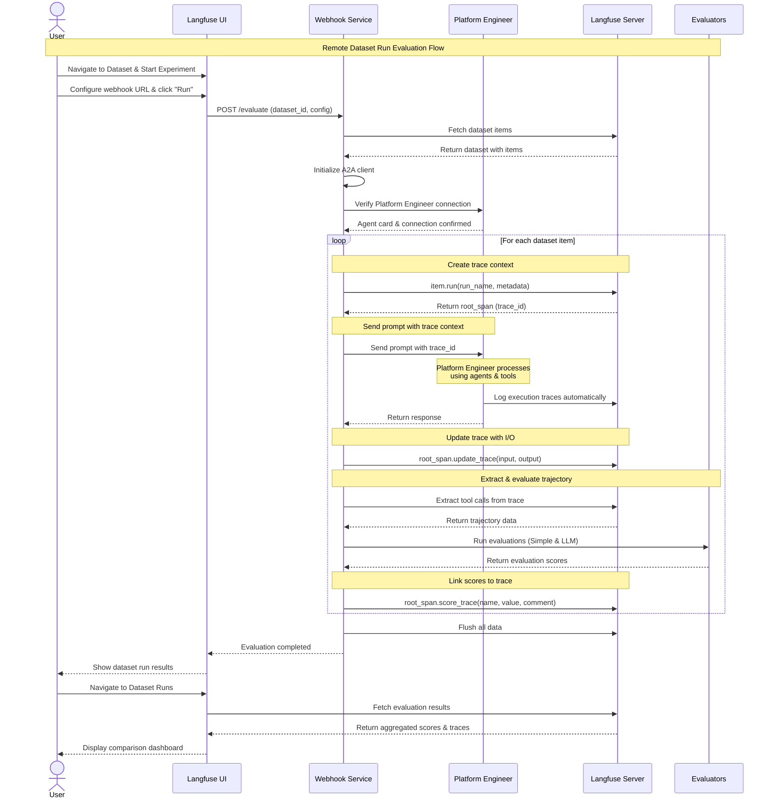

# Platform Engineer Evaluation Webhook Guide

This guide explains how to upload datasets and trigger remote dataset runs using Langfuse's evaluation system.

## Remote Dataset Runs

Remote Dataset Runs are used to programmatically loop your applications through a dataset and apply evaluation methods to the results. They're called "Remote" because they use external logic and code.

### Why use Remote Dataset Runs?
- Full flexibility to use your own application logic  
- Use custom scoring functions to evaluate outputs
- Run multiple experiments on the same dataset in parallel
- Easy integration with existing evaluation infrastructure

Your webhook receives the request, fetches the dataset from Langfuse, runs your application against the dataset items, evaluates the results, and ingests the scores back into Langfuse as a new Dataset Run.


## 🔄 **Architecture Overview**

The webhook service orchestrates evaluations between Langfuse and Platform Engineer, creating a seamless evaluation pipeline:



### Key Relationships:

1. **Trace Linking**: Each dataset item creates a unique trace context that links Platform Engineer execution to evaluation scores
2. **Automatic Instrumentation**: Platform Engineer automatically logs all tool calls and agent interactions to Langfuse
3. **Score Attribution**: Evaluation scores are directly linked to specific traces, enabling detailed analysis
4. **Dataset Run Context**: All traces from a single evaluation run are grouped together for comparison

## 🚀 **Webhook Endpoints**

The evaluation webhook service exposes the following endpoints on **port 8001**:

### **Core Endpoints:**

| Method | Endpoint | Description |
|--------|----------|-------------|
| `GET` | `/health` | Health check - verify service status |
| `POST` | `/evaluate` | Handle webhook triggers from Langfuse UI |
| `GET` | `/evaluations` | List all evaluation runs |
| `GET` | `/evaluations/{id}` | Get status of specific evaluation |

### **Dataset Management:**

| Method | Endpoint | Description |
|--------|----------|-------------|
| `POST` | `/upload-dataset` | Upload dataset to Langfuse |
| `GET` | `/datasets` | List all available datasets |

## 📊 **Dataset Upload Process**

### **1. Upload Dataset via CLI**

Upload your YAML datasets directly to Langfuse using the built-in upload command:

```bash
# Upload single dataset
uv run upload-dataset datasets/single_agent.yaml

# Upload multiple datasets
uv run upload-dataset datasets/*.yaml

# Upload with force flag (creates new dataset even if exists)
uv run upload-dataset --force datasets/single_agent.yaml
```

**Example Dataset Structure** (same as your YAML files):
```json
{
  "name": "single_agent_tests",
  "description": "Single agent evaluation tests",
  "prompts": [
    {
      "id": "github_repo_description", 
      "messages": [
        {
          "role": "user",
          "content": "show all repo description for ai-platform-engineering in cnoe-io org"
        }
      ],
      "expected_agents": ["github"],
      "expected_behavior": "Should use GitHub agent to fetch repository description"
    }
  ]
}
```

### **2. List Available Datasets**

Check what datasets are available in Langfuse:

```bash
curl http://localhost:8001/datasets
```

## 🔄 **Trigger Remote Dataset Run**

### **Via Langfuse UI (Recommended)** 

The primary way to trigger evaluations is through the Langfuse UI:

1. **Go to Langfuse dashboard**: http://localhost:3000
2. **Navigate to Datasets** section
3. **Select your dataset**
4. **Click "Start Experiment"**
5. **Choose "Custom Experiment"** (⚡ button)
6. **Configure webhook URL**: `http://evaluation-webhook:8000/evaluate`
7. **Add custom config** (optional):
   ```json
   {
     "model": "platform-engineer",
     "timeout": 300,
     "retry_attempts": 1
   }
   ```
8. **Click "Run"** to trigger the remote dataset run

### **Via Direct API Call** (Testing)

For testing purposes, you can trigger evaluation directly:

```bash
curl -X POST http://localhost:8001/evaluate \
  -H "Content-Type: application/json" \
  -d '{
    "datasetId": "dataset-uuid",
    "datasetName": "single_agent_tests", 
    "config": {}
  }'
```

## 📈 **Monitor Evaluations**

### **Check Health Status**

```bash
curl http://localhost:8001/health
```

**Response:**
```json
{
  "status": "healthy",
  "langfuse": "configured", 
  "llm": "configured",
  "evaluator": "available: ['simple', 'llm']"
}
```

### **List All Evaluations**

```bash
curl http://localhost:8001/evaluations
```

### **Get Specific Evaluation Status**

```bash
curl http://localhost:8001/evaluations/{evaluation_id}
```

## 🐳 **Docker Setup**

### **Start the Service**

```bash
# Start evaluation webhook service
docker-compose -f docker-compose.dev.yaml up evaluation-webhook

# Or start full stack
docker-compose -f docker-compose.dev.yaml up \
  platform-engineering \
  langfuse-server \
  langfuse-web \
  postgres \
  evaluation-webhook
```

### **Environment Variables**

Set these in your `docker-compose.dev.yaml` or environment:

```yaml
environment:
  # Required
  LANGFUSE_PUBLIC_KEY: your_public_key
  LANGFUSE_SECRET_KEY: your_secret_key
  LANGFUSE_HOST: http://langfuse-web:3000
  
  # Optional
  PLATFORM_ENGINEER_URL: http://platform-engineering:8000
  OPENAI_API_KEY: your_openai_key
  ANTHROPIC_API_KEY: your_anthropic_key
```

## 🎯 **Complete Workflow Example**

### **1. Upload Dataset**

```bash
# Upload dataset directly
uv run upload-dataset datasets/single_agent.yaml
```

### **2. Trigger Evaluation**

```bash
# Start evaluation
curl -X POST http://localhost:8001/evaluate \
  -H "Content-Type: application/json" \
  -d '{
    "datasetName": "single_agent_tests",
    "config": {}
  }'
```

### **3. Monitor Progress**

```bash
# Check running evaluations
curl http://localhost:8001/evaluations

# Get specific evaluation details
curl http://localhost:8001/evaluations/abc-123-def
```

### **4. View Results**

- **Langfuse Dashboard**: http://localhost:3000
- **Traces**: View individual evaluation traces
- **Scores**: See evaluation scores for each item
- **Datasets**: Browse datasets and results

## 🔍 **Evaluation Process**

When you trigger an evaluation, the webhook service:

1. **Fetches Dataset** from Langfuse
2. **Initializes A2A Client** to communicate with Platform Engineer
3. **Sends Prompts** to Platform Engineer one by one
4. **Captures Traces** in Langfuse with unique trace IDs
5. **Extracts Tool Calls** from the traces
6. **Runs Evaluators**:
   - **Simple Evaluator**: Matches expected vs actual agents
   - **LLM Evaluator**: Deep analysis of behavior matching
7. **Submits Scores** back to Langfuse traces

## 🛠️ **Troubleshooting**

### **Common Issues:**

- **"Langfuse not configured"**: Check LANGFUSE_PUBLIC_KEY and LANGFUSE_SECRET_KEY
- **"Dataset not found"**: Make sure dataset was uploaded successfully 
- **"Platform Engineer connection failed"**: Verify Platform Engineer is running
- **"LLM evaluator disabled"**: Set OPENAI_API_KEY or ANTHROPIC_API_KEY

### **Debug Steps:**

1. Check health endpoint: `curl http://localhost:8001/health`
2. View logs: `docker logs evaluation-webhook`
3. Verify Langfuse connection in dashboard
4. Test Platform Engineer directly: `curl http://localhost:8000/health`

The webhook service provides a complete solution for dataset management and evaluation triggering!