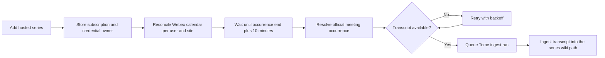

# Tome Webex Meeting-Series Auto-Ingest

Tome can follow recurring Webex meeting series and create an ingest run after
each hosted occurrence has ended and its transcript is available. This flow is
independent of the project's CRON-based auto-ingest schedule.

## User Flow

1. Connect the **Webex (Meetings)** application under `/credentials`.
2. Open `/projects/<slug>/tome/settings?tab=auto-ingest`.
3. Under **Recurring Webex meetings**, select **Add series**.
4. Search for a recurring series and add it.
5. Return to the same settings page to see the next occurrence or latest error.
6. Open `/projects/<slug>/tome/ingest` after a transcript is found to see the
   resulting ingest run.

Only the meeting host can add a series. Webex exposes the recordings and
transcripts required by this workflow only through the host's normal user
connection. Non-host rows remain visible but their **Add** button is disabled.

## Execution Flow



The scheduler loop runs once per minute by default, but this does **not** call
Webex once per minute. Each tick checks MongoDB for due calendar or transcript
work. Calendar discovery is grouped by credential owner and Webex site, so ten
series owned by the same user normally share one discovery sweep.

## Timing

| Event | Behavior |
|---|---|
| Series added | A new owner/site group is normally claimed on the next scheduler tick. |
| Calendar refresh | Once daily by default, shared by all series for one user/site. |
| Upcoming occurrence | The next check is moved earlier to occurrence end plus 10 minutes. |
| First transcript attempt | Occurrence end plus 10 minutes, on the next scheduler tick. |
| Transcript unavailable | Retry after 15 minutes, 30 minutes, 1 hour, then every 2 hours. |
| Transcript deadline | Stop retrying 24 hours after the occurrence ended. |
| Another project ingest is running | Keep the occurrence ready and retry after 5 minutes. |
| Discovery failure | Retry the owner/site calendar after 15 minutes. |

An occurrence that ended before the subscription was created is not
backfilled. Selecting a series while its meeting is in progress is supported.
Cancelled and missed occurrences are skipped.

## Discovery

Tome invokes the configured `webex_meetings` MCP server directly. It combines:

- `webex_list_meetings` with `meetingSeries`
- `webex_list_meetings` with `scheduledMeeting`
- `webex_list_meetings` with `meeting`
- `webex_userhub_calendar`

The discovery window covers the previous 48 hours and next 90 days. User Hub
calendar discovery is required because some active recurring meetings do not
appear reliably through `webex_list_meetings` alone.

Series identity prefers durable Meetings and User Hub series IDs. Meeting
numbers and personal-room links are weak references: multiple unrelated series
can reuse them and must not be collapsed into one result.

## Authentication and MCP Selection

- MCP server ID: `webex_meetings`
- Provider connection: `webex_meetings`
- Forwarded header: `X-CAIPE-Provider-Token`
- Interactive discovery uses the signed-in user's connection.
- Background ingestion uses the connection owned by the user who added the
  subscription.

The server ID and provider name are currently fixed in code. The direct MCP
endpoint can be overridden with `TOME_WEBEX_MEETINGS_MCP_URL`. Using a
differently named MCP server or provider requires a code change.

## Configuration

| Variable | Default | Notes |
|---|---:|---|
| `TOME_AUTO_INGEST_ENABLED` | `false` | Must be `true` to start the scheduler, including meeting-series work. |
| `TOME_AUTO_INGEST_TICK_MS` | `60000` | Local scheduler loop interval. |
| `TOME_WEBEX_SERIES_REFRESH_MS` | `86400000` | Owner/site calendar refresh interval; minimum five minutes. |
| `TOME_WEBEX_TRANSCRIPT_MAX_CHARS` | `400000` | Maximum transcript characters passed to one ingest; minimum 50,000. |
| `TOME_WEBEX_MEETINGS_MCP_URL` | unset | Optional direct endpoint override for the configured MCP server. |

The normal project auto-ingest toggle and CRON do not need to be enabled for a
meeting-series subscription. The global `TOME_AUTO_INGEST_ENABLED` worker flag
does need to be enabled.

## State and Idempotency

MongoDB stores the feature state in three places:

| Location | Purpose |
|---|---|
| `projects.autoIngest.webexMeetingSeries` | Subscriptions, credential owner, next occurrence, and latest status/error. |
| `tome_auto_ingest_cursors` | Replica-safe per-user/site calendar claims and next-check times. |
| `tome_webex_meeting_occurrences` | Per-occurrence status, attempts, retry time, transcript ID, and ingest run ID. |

Occurrence IDs are deterministic hashes of the project, subscription, and
Webex occurrence key. Before creating a run, the worker also searches for an
existing run with the same occurrence ID. These checks prevent duplicate
ingests after replica races or worker restarts.

Possible occurrence states are `pending`, `processing`, `waiting_transcript`,
`ready`, `queued`, `ingested`, `skipped`, and `failed`.

## Observability

The project settings page shows:

- credential owner (`Runs as`)
- next meeting **start** time
- last ingested occurrence
- latest scheduler or transcript error

The ingest page shows the run only after a transcript has been found and the
run has been queued. There is currently no dedicated attempt-history screen.
Inspect `tome_webex_meeting_occurrences` for the exact attempt count,
`next_attempt_at`, status, and last error.

Follow scheduler logs with:

```bash
kubectl -n <namespace> logs -f deploy/<release>-caipe-ui -c caipe-ui \
  | rg --line-buffered 'WebexSeries|AutoIngest'
```

## Current Limitations

- Meeting-series selection is not part of project **Review & Create**.
- The settings page displays the next meeting start, not the calculated first
  transcript-attempt time.
- Attempt history is available only in MongoDB and logs.
- Existing meetings are not backfilled when a series is added.
- Discovery looks ahead 90 days.
- Host eligibility depends on the Webex host email matching the signed-in
  user's email.
- Adding a subscription does not independently force an existing owner/site
  cursor due. A new cursor is claimed on a scheduler tick, while a previously
  scheduled cursor can wait for its next check unless discovery requested a
  refresh.

## Relevant Code

- `../webex-meeting-series.ts`: MCP selection, credentials, discovery, identity,
  host eligibility, occurrence resolution, and transcript download
- `webex-meeting-series-scheduler.ts`: reconciliation, timing, retries, and run
  creation
- `cursor.ts`: replica-safe scheduler claims
- `../../../app/api/tome/projects/[slug]/webex-meeting-series/route.ts`: list,
  discover, add, enable/disable, and remove API
- `../../../components/tome/WebexMeetingSeriesSettings.tsx`: settings and
  selection UI

## Tests

```bash
cd ui
npm test -- --runInBand --runTestsByPath \
  src/lib/tome/__tests__/auto-ingest-cursor.test.ts \
  src/lib/tome/__tests__/webex-meeting-series.test.ts \
  src/lib/tome/__tests__/webex-meeting-series-scheduler.test.ts \
  src/lib/tome/__tests__/auto-ingest-scheduler.test.ts
```
